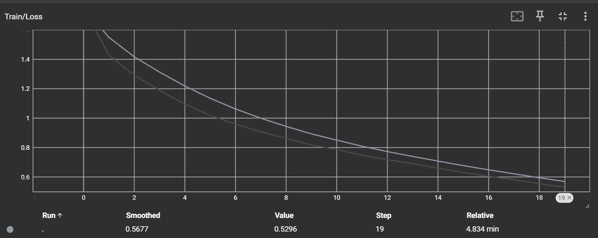
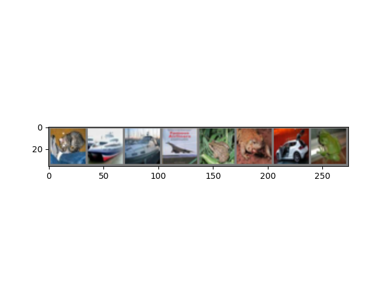
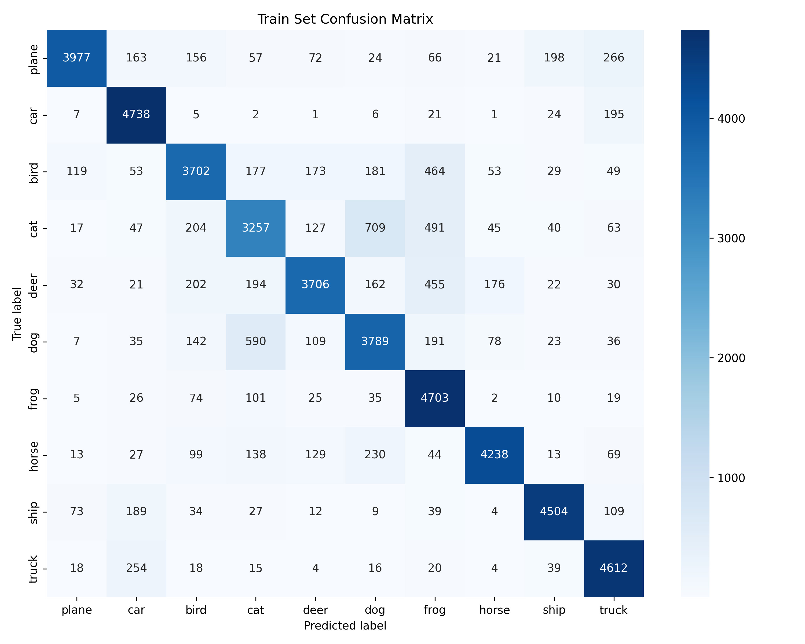
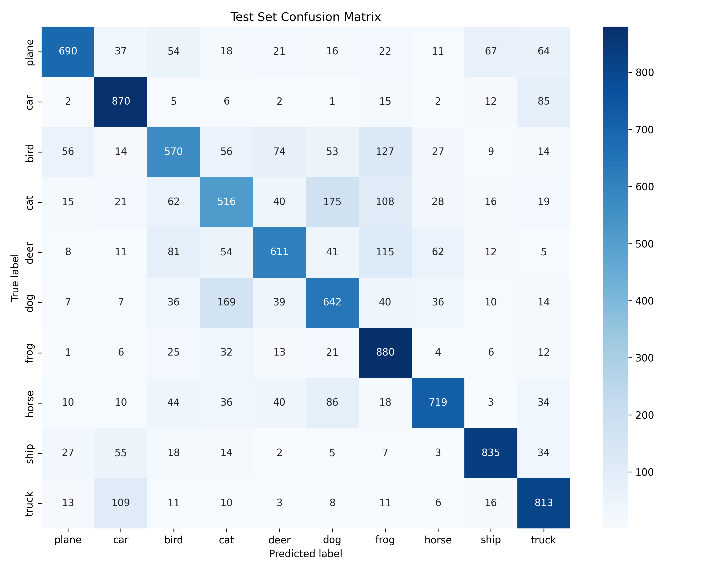

# 多层感知机：分类问题

CIFAR-10数据集是深度学习中常用的数据集，其包含60000张32×32色图像，分为10个类，每类6000张。有50000张训练图片和10000张测试图片。

请基于该数据集搭建包含三个及以上的卷积层的多层感知机网络，以解决10分类问题。

(1)   输出网络结构；(1分)

(2)   使用tensorboard对训练过程中的loss和accuracy进行可视化展示；(2分)

(3)   保存训练模型为模型文件，并使用训练好的模型对测试集中的图片进行预测，输出预测结果与预测概率；(2分)

(4)   画出训练集和验证集的混淆矩阵；(2分)

(5)   分析网络参数（例如网络深度、不同的激活函数、神经元数量等）对预测结果的影响；(2分)

(6)   在损失函数为交叉熵的情况下，对比网络最后一层是否使用softmax的性能差异并分析其产生的原因。(1分)

---

**核心任务**：使用 CIFAR-10 数据集，搭建一个**卷积神经网络 (CNN)** 来解决10分类的图像问题。

**注意**：题目中写的是“多层感知机网络”，但紧接着要求“包含三个及以上的卷积层”。**这是一个典型的卷积神经网络 (CNN) 任务，而不是传统意义上只包含全连接层的多层感知机 (MLP)**。MLP直接处理拉平的图像向量效果会很差，使用CNN是正确的解法

#### **内容要求分解**

1. **(1) 输出网络结构:**
   - **要求**：展示你设计的网络结构
   - **做什么**：使用 PyTorch (torch.nn.Module) 或 TensorFlow (tf.keras.Model) 定义一个CNN模型。这个模型必须至少包含3个卷积层 (nn.Conv2d)。一个经典的结构是 (Conv -> ReLU -> Pool) * N -> Flatten -> Linear -> ReLU -> Linear
   - **实验报告中要写什么**：在代码中 print(your_model)，将打印出的网络结构文本复制到报告中。也可以使用 torchsummary 等库来更详细地展示
2. **(2) TensorBoard 可视化:**
   - **要求**：使用 TensorBoard 展示训练过程中的 loss 和 accuracy
   - **做什么**：
     - 在 PyTorch 中，使用 from torch.utils.tensorboard import SummaryWriter
     - 在训练循环中，记录每个 epoch 或每个 batch 的训练/验证 loss 和 accuracy，并使用 writer.add_scalar() 函数将它们写入日志
     - 训练完成后，在命令行启动 tensorboard --logdir=runs (runs是你的日志文件夹)，然后将生成的图表截图
   - **实验报告中要写什么**：粘贴 TensorBoard 中显示的 loss 曲线和 accuracy 曲线的截图
3. **(3) 模型保存与预测:**
   - **要求**：保存训练好的模型，并用它来预测测试集图片
   - **做什么**：
     - **保存**：训练结束后，使用 torch.save(model.state_dict(), 'cifar10_cnn.pth') 保存模型参数
     - **加载**：创建一个新的模型实例，然后使用 model.load_state_dict(torch.load('cifar10_cnn.pth')) 加载参数
     - **预测**：从测试集中随机挑选几张图片，输入到加载好的模型中。注意要将模型设置为评估模式 model.eval()
     - **输出概率**：模型输出的是 logits，需要经过 torch.nn.functional.softmax 函数转换成概率分布
     - **输出结果**：使用 torch.argmax() 从概率分布中找到概率最高的类别作为预测结果
   - **实验报告中要写什么**：展示几张测试图片，以及模型对它们的预测类别和对应的概率
4. **(4) 混淆矩阵:**
   - **要求**：画出训练集和验证集的混淆矩阵
   - **做什么**
     - 在整个训练集和验证集上运行预测，收集所有的真实标签和预测标签
     - 使用 sklearn.metrics.confusion_matrix 生成混淆矩阵。
     - 使用 seaborn.heatmap 或 sklearn.metrics.ConfusionMatrixDisplay 将混淆矩阵可视化。
   - **实验报告中要写什么**：展示训练集和验证集的混淆矩阵热力图，并可以简要分析一下，比如哪些类别之间容易混淆（例如猫和狗）。
5. **(5) 网络参数影响分析:**
   - **要求**：分析网络参数（深度、激活函数、神经元数量等）对结果的影响。
   - **做什么**：这是一个开放性的分析题。你需要进行**对比实验**。例如：
     - **网络深度**：设计一个3层的CNN和一个5层的CNN，比较它们的性能。
     - **激活函数**：将模型中的 ReLU 替换为 LeakyReLU 或 Sigmoid，比较性能。
     - **神经元数量**：改变全连接层 (nn.Linear) 的隐藏单元数量，或者改变卷积层 (nn.Conv2d) 的输出通道数（滤波器数量），比较性能。
   - **实验报告中要写什么**：用表格或图表对比不同配置下的模型性能（如最终的测试准确率），并分析原因。例如，更深的网络可能性能更好但也更容易过拟合；Sigmoid 容易导致梯度消失等。
6. **(6) Softmax 与交叉熵损失函数:**
   - **要求**：对比网络最后一层是否使用 softmax 的性能差异，并分析原因。
   - **做什么**：
     - **实验对比**：
       - **正确做法**：网络最后一层直接输出 logits (无激活函数)，损失函数使用 torch.nn.CrossEntropyLoss。
       - **错误做法**：网络最后一层接一个 nn.Softmax 层，损失函数依然使用 torch.nn.CrossEntropyLoss。
       - 训练这两个网络，对比它们的性能。
     - **原因分析**：这是**非常重要的一个知识点**。PyTorch 的 CrossEntropyLoss 函数**内部已经包含了 LogSoftmax 和 NLLLoss**。如果你在模型末尾手动添加了 Softmax，那么在计算损失时就相当于进行了两次 Softmax 操作，这会导致梯度计算不正确，使得模型训练非常缓慢或无法收敛。
   - **实验报告中要写什么**：展示两种做法的性能对比（比如 loss 曲线），并清晰地解释 CrossEntropyLoss 的工作原理，阐明为什么在它的前面不应该加 Softmax 层。

---

## 题目分析

使用的CIFAR-10数据集是一个有十个类别的、大小为 3 X 32 X 32。

> It has the classes: ‘airplane’, ‘automobile’, ‘bird’, ‘cat’, ‘deer’, ‘dog’, ‘frog’, ‘horse’, ‘ship’, ‘truck’. The images in CIFAR-10 are of size 3x32x32, i.e. 3-channel color images of 32x32 pixels in size.
>
> 它包含以下类别：‘飞机’、‘汽车’、‘鸟’、‘猫’、‘鹿’、‘狗’、‘青蛙’、‘马’、‘船’、‘卡车’。CIFAR-10 中的图像尺寸为 3x32x32，即 3 通道彩色图像，每个通道包含 32x32 像素。

题目要求"搭建包含三个及以上的卷积层的多层感知机网络"，指明了实际上要搭建的是一个 **三层以上网络的CNN卷积神经网络**。

常用的卷积神经网络有：

- **LeNet-5**: 早期用于手写数字识别的CNN，是现代CNN的鼻祖
- **AlexNet**: 在 ImageNet 竞赛中取得突破，引爆了深度学习革命
- **VGGNet**: 展示了通过堆叠小的卷积核（3x3）可以构建出很深很有效的网络
- **GoogLeNet**: 引入了“Inception模块” ，可以在同一层使用不同尺寸的卷积核
- **ResNet**: **里程碑式的模型**。通过引入残差连接，成功训练了超过100层甚至1000层的超深网络，解决了深度网络的梯度消失和退化问题

对于本题，为方便起见，采用 **VGGNet风格来构建特征提取器，结合经典的LeNet-5全连接层结构**，实现轻量级的CNN。

---

## (1)   输出网络结构

即三个 "cov → Pool" 的 LeNet-5结构，而每一个卷积层的核为 VGGNet的 "3 x 3"样式，全连接层使用的经典的 LeNet-5 的 "120 → 84 → 10"的结构。

```bash
Net(
  (conv1): Conv2d(3, 16, kernel_size=(3, 3), stride=(1, 1), padding=(1, 1))
  (pool1): MaxPool2d(kernel_size=2, stride=2, padding=0, dilation=1, ceil_mode=False)
  (conv2): Conv2d(16, 32, kernel_size=(3, 3), stride=(1, 1), padding=(1, 1))
  (pool2): MaxPool2d(kernel_size=2, stride=2, padding=0, dilation=1, ceil_mode=False)
  (conv3): Conv2d(32, 64, kernel_size=(3, 3), stride=(1, 1), padding=(1, 1))
  (pool3): MaxPool2d(kernel_size=2, stride=2, padding=0, dilation=1, ceil_mode=False)
  (fc1): Linear(in_features=1024, out_features=120, bias=True)
  (fc2): Linear(in_features=120, out_features=84, bias=True)
  (fc3): Linear(in_features=84, out_features=10, bias=True)
)
```

---

## (2)   使用tensorboard对训练过程中的loss和accuracy进行可视化展示

相关代码：

```python
# 使用 tensorboard 可视化训练过程
    from torch.utils.tensorboard import SummaryWriter
    writer = SummaryWriter('./logs')
    trained_model,history = train(
        model=model,
        device=device,
        trainloader=trainloader,
        loss_function=loss_function,
        optimizer=optimizer,
        epoches=20,
        writer=writer
    )

    writer.close()
    print('结束Summary的写入')
```

**结果**：

**准确率**


**损失值**




## (3)   保存训练模型为模型文件，并使用训练好的模型对测试集中的图片进行预测，输出预测结果与预测概率

### 3.1.模型持久化

```python
    # 模型持久化区块
    PATH = './cifar_net.pth'
    save_model(trained_model,PATH)
```

### 3.2. 简单图片预测

```python
# 简单的图像评估区块
    def imshow(img):
        img = img / 2 + 0.5 # 反标准化
        npimg = img.numpy()
        plt.imshow(np.transpose(npimg, (1, 2, 0)))
        plt.show()
    data_iter = iter(testloader)
    images, labels = next(data_iter)
    show_images = 8
    images_to_show = images[:show_images]
    labels_to_show = labels[:show_images]
    print('GroundTruth: ', ' '.join(f'{classes[labels_to_show[j]]:5s}' for j in range(show_images)))
    # 使用已持久化模型进行评估
    model = Net()
    model.load_state_dict(torch.load(PATH, weights_only=True))
    # 预测标签
    with torch.no_grad():
        outputs = model(images_to_show)
        _, predicted = torch.max(outputs, 1)
    print('Predicted: ', ' '.join(f'{classes[predicted[j]]:5s}' for j in range(show_images)))
    imshow(torchvision.utils.make_grid(images_to_show))
```

**结果**：

```bash
GroundTruth:  cat   ship  ship  plane frog  frog  car   frog 
Predicted:  cat   ship  ship  plane frog  frog  car   deer 
```



### 3.3. 测试集整体准确率预测

```python
    model = Net()
    model.load_state_dict(torch.load(PATH, weights_only=True))
    device = torch.device('cuda' if torch.cuda.is_available() else 'cpu')
    test_accuracy = pred_model(
        model=model,
        testloader=testloader,
        device=device
    )
    print(f'测试集准确率：{test_accuracy*100:.2f}%')
```

**结果**：

```bash
测试集准确率：71.46%
```

### 3.4. 各类别的准确率预测

```python
    correct_pred = {classname: 0 for classname in classes}
    total_pred = {classname: 0 for classname in classes}

    with torch.no_grad():
        for data in testloader:
            images, labels = data[0].to(device), data[1].to(device)
            outputs = model(images)
            _, predictions = torch.max(outputs, 1)
            # 累加每个类别的准确率计算变量
            for label, prediction in zip(labels, predictions):
                if label == prediction:
                    correct_pred[classes[label]] += 1
                total_pred[classes[label]] += 1

    # print accuracy for each class
    for classname, correct_count in correct_pred.items():
        accuracy = 100 * float(correct_count) / total_pred[classname]
        print(f'Class: {classname:5s} Accuracy: {accuracy:.1f} %')
```

**结果**：

```bash
Class: plane Accuracy: 69.0 %
Class: car   Accuracy: 87.0 %
Class: bird  Accuracy: 57.0 %
Class: cat   Accuracy: 51.6 %
Class: deer  Accuracy: 61.1 %
Class: dog   Accuracy: 64.2 %
Class: frog  Accuracy: 88.0 %
Class: horse Accuracy: 71.9 %
Class: ship  Accuracy: 83.5 %
Class: truck Accuracy: 81.3 %
```

## (4)   画出训练集和验证集的混淆矩阵

**使用 seaborn绘制混淆矩阵**

```python
def collect_pred_labels(model, dataloader, device):
    """
    遍历 Dataloader，收集模型的所有预测结果和真实标签
    :param model: 模型
    :param dataloader: 数据加载器
    :param device:
    :return:
        labels:numpy, preds:numpy
    """
    labels = torch.tensor([],device=device)
    preds = torch.tensor([],device=device)
    with torch.no_grad():
        for X, y in dataloader:
            X,y = X.to(device), y.to(device)
            output = model(X)
            predicts = output.argmax(dim=1, keepdim=True)

            # 拼接当前批次的预测值和标签到列表里
            labels = torch.cat((labels,y),dim=0)
            preds = torch.cat((preds,predicts),dim=0)
    # 直接返回 numpy并转移到cpu上，方便后续 seaborn绘图
    return labels.cpu().numpy(), preds.cpu().numpy()

def plot_confusion_matrix(cm, class_names,title='Confusion matrix'):
    """
    使用seaborn绘制混淆矩阵
    """
    plt.figure(figsize=(10,8))
    sns.heatmap(cm,annot=True,fmt='d',cmap='Blues',
                xticklabels=class_names,yticklabels=class_names)
    plt.title(title)
    plt.ylabel('True label')
    plt.xlabel('Predicted label')
    plt.tight_layout()
    plt.show()
```

**结果**：

**训练集混淆矩阵**



**测试集混淆矩阵**



## (5)   分析网络参数（网络深度、不同的激活函数、神经元数量）对预测结果的影响

### 5.1.网络深度对预测结果的影响

#### 三层网络


#### 五层网络


#### 5.2. 不同的激活函数对预测结果的影响

### 5.3. 神经元数量对预测结果的影响


## (6)   在损失函数为交叉熵的情况下，对比网络最后一层是否使用softmax的性能差异并分析其产生的原因

