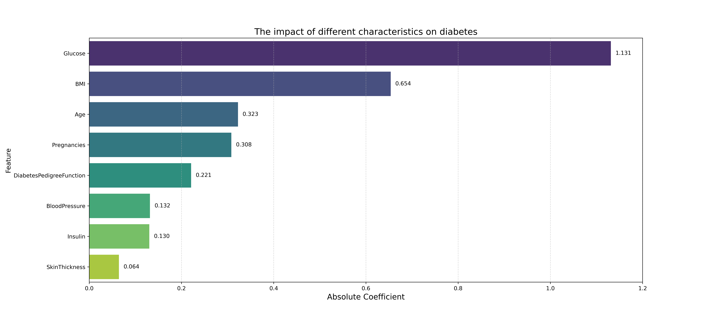

# 机器学习：回归问题

皮马印第安人糖尿病数据集由年龄大于等于21岁的皮马印第安女性的已有诊断信息组成，包含若干医学预测变量和一个目标变量 Outcome，共九个字段。其中预测变量包括患者的怀孕次数、BMI、胰岛素水平、年龄等。

请运用回归模型分析糖尿病数据集中自变量和因变量之间的关系，对某人是否患糖尿病进行预测。

(1)   使用特征工程方法对数据集中的特征变量进行处理并在实验报告中作出说明；(2分)

(2)   使用逻辑回归模型完成实验并绘制逻辑回归散点图；(2分)

(3)   使用train_test_split函数对数据集进行拆分，并在拆分得到的测试集上测试模型准确率。学号为奇数的同学请设置train_size为0.7、0.75、0.8，学号为偶数的同学请设置train_size为0.75、0.8、0.85；(2分)

(4)   试分析多个特征值（自变量）与病情（因变量）的关系(2分)，依据与病情的关联性对自变量进行排序并进行可视化展示(2分)。 (共计4分)

皮马印第安人糖尿病数据集由年龄大于等于21岁的皮马印第安女性的已有诊断信息组成，包含若干医学预测变量和一个目标变量 Outcome，共九个字段。其中预测变量包括患者的怀孕次数、BMI、胰岛素水平、年龄等。

请运用回归模型分析糖尿病数据集中自变量和因变量之间的关系，对某人是否患糖尿病进行预测。

## 第一问：使用特征工程方法对数据集中的特征变量进行处理

### 使用Pandas进行数据加载与探索

#### 1. 使用 .info() 查看简要信息

```bash
RangeIndex: 768 entries, 0 to 767
Data columns (total 9 columns):
 #   Column                    Non-Null Count  Dtype  
---  ------                    --------------  -----  
 0   Pregnancies               768 non-null    int64  
 1   Glucose                   768 non-null    int64  
 2   BloodPressure             768 non-null    int64  
 3   SkinThickness             768 non-null    int64  
 4   Insulin                   768 non-null    int64  
 5   BMI                       768 non-null    float64
 6   DiabetesPedigreeFunction  768 non-null    float64
 7   Age                       768 non-null    int64  
 8   Outcome                   768 non-null    int64  
```

**获得的信息**：

1. **一共有 9 列数据**
2. **看上去似乎没有缺失值**

**上网搜索该数据集每一列所代表的意思**：

该数据集共有 **768** 条数据，包含 **9** 个字段，其中8个是特征，1个是目标变量 

|         字段名称         |      中文描述      | 数据类型 |                           详细说明                           |
| :----------------------: | :----------------: | :------: | :----------------------------------------------------------: |
|       Pregnancies        |      怀孕次数      |   数值   |                        曾经怀孕的次数                        |
|         Glucose          |      血糖浓度      |   数值   |        口服葡萄糖耐量试验中，2小时后的血浆葡萄糖浓度         |
|      BloodPressure       |        血压        |   数值   |                        舒张压 (mm Hg)                        |
|      SkinThickness       |      皮褶厚度      |   数值   |              三头肌皮褶厚度 (mm)，用于估计体脂               |
|         Insulin          |       胰岛素       |   数值   |                  2小时血清胰岛素 (mu U/ml)                   |
|           BMI            |    身体质量指数    |   数值   |                    体重(kg) / (身高(m)²)                     |
| DiabetesPedigreeFunction | 糖尿病家族遗传函数 |   数值   | 一个综合了糖尿病家族史和亲属关系的函数，值越大，遗传风险越高 |
|           Age            |        年龄        |   数值   |                          年龄 (岁)                           |
|    Outcome (目标变量)    |   是否患有糖尿病   |   类别   |            1 代表 患有糖尿病，0 代表 未患有糖尿病            |

#### 2. 使用describe() 获取描述统计

```bash
       Pregnancies     Glucose  BloodPressure  SkinThickness     Insulin 
count   768.000000  768.000000     768.000000     768.000000  768.000000   
mean      3.845052  120.894531      69.105469      20.536458   79.799479   
std       3.369578   31.972618      19.355807      15.952218  115.244002   
min       0.000000    0.000000       0.000000       0.000000    0.000000   
25%       1.000000   99.000000      62.000000       0.000000    0.000000   
50%       3.000000  117.000000      72.000000      23.000000   30.500000   
75%       6.000000  140.250000      80.000000      32.000000  127.250000   
max      17.000000  199.000000     122.000000      99.000000  846.000000
```

```bash
 			BMI  DiabetesPedigreeFunction         Age     Outcome  
count  768.000000                768.000000  768.000000  768.000000  
mean    31.992578                  0.471876   33.240885    0.348958  
std      7.884160                  0.331329   11.760232    0.476951  
min      0.000000                  0.078000   21.000000    0.000000  
25%     27.300000                  0.243750   24.000000    0.000000  
50%     32.000000                  0.372500   29.000000    0.000000  
75%     36.600000                  0.626250   41.000000    1.000000  
max     67.100000                  2.420000   81.000000    1.000000  
```

**获得的信息**：

1. 由 **最小值min** 一栏可以得到数据集是**有缺失值**的：

   1. Glucose               血糖浓度
   2. BloodPressure     血压
   3. SkinThickness     皮肤厚度
   4. Insulin                  胰岛素
   5. BMI                     

   这五个指数不可能为零，那么就得出 **0** 实际上是缺失值。因此需要对这 5 列数据做特征工程

2. **数据特征尺度不一致**

   不同特征的取值范围（尺度）差异巨大

   Pregnancies 特征区间在 $(0,17]$，而 Insulin 数值区间为 $(0,846]$，尺度差异太大，需要对特征进行标准化

### 处理缺失值/异常值

由前文分析，总共有 5 列特征数据缺失，缺失值以 0 代替

| Glucose  | BloodPressure | SkinThickness | Insulin | BMI  |
| :------: | :-----------: | :-----------: | :-----: | :--: |
| 血糖浓度 |     血压      |   皮肤厚度    | 胰岛素  |      |

1. 分析数据，发现每组除了 BMI 列，**其他列的方差都在 10 以上，且极值相差较大**，不适合使用均值填充，因此统一使用 **中位数`median()`** 填充

2. **思路**：提取相关列，先将数值 0 转换为缺失值 NaN，再计算中位数，最后使用中位数进行填充

3. 相关代码

   1. ```python
      df_nan = ['Glucose','BloodPressure','SkinThickness','Insulin','BMI']
      df[df_nan] = df[df_nan].replace(to_replace=0, value=np.nan)
      median_vals = df[df_nan].median()
      ```
   
      ```bash
      要填充的中位数：
      Glucose          117.0
      BloodPressure     72.0
      SkinThickness     29.0
      Insulin          125.0
      BMI               32.3
      ```
   
   2. 查看填充后的数值：

      ```python
      df.fillna(median_vals, inplace=True)
      ```
   
      ```bash
      Glucose          0
      BloodPressure    0
      SkinThickness    0
      Insulin          0
      BMI              0
      Glucose  BloodPressure  SkinThickness     Insulin         BMI
      117.000000      72.000000      29.000000  125.000000   32.300000
      ```

### 数据标准化

#### 问题分析

由于数据集中的八个特征具有不同的单位和数值范围，例如Pregnancies 特征区间在 $(0,17]$，而 Insulin 数值区间为 $(0,846]$，尺度差异太大，因此需要对特征进行标准化

#### 标准化方法

使用 $Z-score$ 标准化方法进行处理：

```python
# 1.从DF中分离出特征矩阵 X和目标向量 y
X = df.drop('Outcome', axis=1)
y = df['Outcome']
# 2.传参切分训练集，测试集
from sklearn.model_selection import train_test_split
X_train, X_test, y_train, y_test = train_test_split(X, y, train_size=0.8, random_state=42)

# 3. 执行标准化并将数据格式从 数组转回 DF
from sklearn.preprocessing import StandardScaler
scaler = StandardScaler()
X_train_scaled = scaler.fit_transform(X_train) # 核心
X_train_scaled_df = pd.DataFrame(X_train_scaled, columns=X_train.columns)
# 在 X_test (DataFrame) 上只进行转换
X_test_scaled = scaler.transform(X_test) # 核心
X_test_scaled_df = pd.DataFrame(X_test_scaled, columns=X_test.columns)
```

#### 结果

`X_train_scaled_df.head()`：

```bash
   Pregnancies   Glucose  ...  DiabetesPedigreeFunction       Age
0    -0.526397 -1.256881  ...                 -0.490735 -1.035940
1     1.588046 -0.326051  ...                  2.415030  1.487101
2    -0.828460  0.571536  ...                  0.549161 -0.948939
3    -1.130523  1.302903  ...                 -0.639291  2.792122
4     0.681856  0.405316  ...                 -0.686829  1.139095
```

---

## 第二问：使用逻辑回归模型完成实验并绘制逻辑回归散点图

### 逻辑回归预测

使用 sklearn中的逻辑回归模型进行进行训练和预测

```python
from sklearn.linear_model import LogisticRegression
from sklearn.metrics import accuracy_score
# 1. 创建逻辑回归模型的实例
# random_state 是为了保证每次运行结果一致，便于调试
model = LogisticRegression(random_state=42)
# 2. 使用标准化的训练数据来训练模型
# 模型将学习 X_train_scaled_df 和 y_train 之间的关系
model.fit(X_train_scaled_df, y_train)
# 3. 在训练集和测试集上检查性能
y_train_pred = model.predict(X_train_scaled_df)
train_accuracy = accuracy_score(y_train, y_train_pred)

y_test_pred = model.predict(X_test_scaled_df)
test_accuracy = accuracy_score(y_test, y_test_pred)
```

**结果**：

```bash
训练集准确率：77.0358%
测试集准确率：75.3247%
```

### 逻辑回归散点图

由于数据有8个特征，无法直接在二维图上完整展示

因此，选择两个最重要的特征作为X轴和Y轴，然后绘制这二维空间中的数据点和决策边界

Glucose 和 BMI是预测糖尿病中十分重要的两个特征，从后续第四问分析特征值权重的任务中也可以得到此结论。

因此选择二者做散点图

**绘制步骤**：

1. 只使用 Glucose和 BMI这两个特征训练一个新模型
2. 绘制决策边界
3. 使用模型在平面上预测得到预测值的坐标
4. 绘制散点图

**代码内容**（可跳过）

```python
# 为了可视化决策边界，只使用两个特征来训练一个新模型
feat_plot = ['Glucose','BMI']
X_train_plt = X_train_scaled_df[feat_plot]
y_train_plt = y_train

model_plot = LogisticRegression(random_state=42)
model_plot.fit(X_train_plt, y_train_plt)
plt.figure(figsize=(10,6))
# 1.绘制决策边界
# 获取两个特征的最小值和最大值，并扩展一点边界
x_min,x_max = X_train_plt.iloc[:,0].min() - 1,X_train_plt.iloc[:,0].max()+1
y_min,y_max = X_train_plt.iloc[:,1].min() - 1,X_train_plt.iloc[:,1].max()+1
# 使用 np.meshgrid 生成网格点坐标矩阵
xx,yy = np.meshgrid(np.arange(x_min,x_max,0.02),
                    np.arange(y_min,y_max,0.02))

# 2.在网格上进行预测
# ravel()将矩阵展平，np.c_[]将它们按列拼接，以便模型一次性预测所有点
Z = model_plot.predict(np.c_[xx.ravel(),yy.ravel()])
Z = Z.reshape(xx.shape) # 将预测结果变回网格的形状
# 3.绘制决策边界和数据点
# 使用 contourf 填充背景颜色，代表模型的预测区域
plt.contourf(xx,yy,Z,alpha=0.4,cmap=plt.cm.coolwarm)
# 4.绘制原始数据点的散点图
# 使用 seaborn 绘制散点图，并根据真实标签 y_train_2d 来着色
# hue='Outcome' 会自动根据 Outcome 的值 (0 或 1) 来分配颜色
plot_df = pd.DataFrame(X_train_plt).copy()
plot_df['Outcome'] = y_train_plt.values

sns.scatterplot(x='Glucose',y='BMI',hue='Outcome',data=plot_df,
                palette={0:'blue',1:'red'},edgecolor='k')
# 添加标题和标签
plt.title('Logistic Regression Scatter Plot and Decision Boundary (Glucose vs BMI)', fontsize=16)
plt.xlabel('Glucose (scaler)', fontsize=12)
plt.ylabel('BMI (scaler)', fontsize=12)
plt.legend(title='is suffered', labels=['0: no', '1: yes'])
plt.grid(True)
plt.show()
```

#### 代码解析

**目的**：

画出一条线（或一个区域），这条线代表了模型的  “决策边界”  。在这条线的一侧，模型会预测所有点为类别 0；在线的另一侧，模型会预测所有点为类别 1

**实现思路**： 计算机没法直接  “画出一条线”  。但可以用一种方式  “描绘”  出这条线：

1. **创建一张“画布”**：  在绘图区域内，想象我们铺了一张非常精细的网格（比如每隔0.02个单位就有一个点）。这张网格覆盖了所有可能的数据点区域
2. **让模型“投票”**：  让已经训练好的模型，对这张网格上的**每一个点**进行一次预测
3. **根据预测结果“着色”**：  根据模型的预测结果（0或1），给网格上的每一个点涂上不同的颜色（比如预测为0的涂蓝色，预测为1的涂红色）
4. **边界显现**：  当所有点都涂上颜色后，不同颜色区域的**交界处**，自然而然就形成了  “决策边界”

**绘图函数**

1. **创建画布**

   ```python
   # 获取两个特征的最小值和最大值，并扩展一点边界
   x_min,x_max = X_train_plt.iloc[:,0].min() - 1,X_train_plt.iloc[:,0].max()+1
   y_min,y_max = X_train_plt.iloc[:,1].min() - 1,X_train_plt.iloc[:,1].max()+1
   # 使用 np.meshgrid 生成网格点坐标矩阵
   xx,yy = np.meshgrid(np.arange(x_min,x_max,0.02),
                       np.arange(y_min,y_max,0.02))
   ```

   **numpy.meshgrid**：

   - 核心目的是：  根据你提供的一维 x 坐标和一维 y 坐标，生成一个**二维坐标网格**，它返回两个二维数组：一个包含了网格中每个点的 x 坐标 (xx)，另一个包含了每个点的 y 坐标 (yy)

   - 参数：

     np.meshgrid 接收两个（或更多）一维数组作为输入

     - np.arange(x_min, x_max, 0.02)：这是一个 NumPy 数组，包含了从 x_min 到 x_max，每隔 0.02 取一个点的一系列 x 坐标
     - 0.02 是步长，决定了我们网格的精细程度，值越小，网格越密，决策边界越平滑，但计算量也越大

   - 示例：.

     ```python
     import numpy as np
     x_coords = np.array([0, 1, 2]) # 3个x坐标
     y_coords = np.array([10, 11])   # 2个y坐标
     # 想得到一个 3x2 的网格上的所有点:
     # (0,10), (1,10), (2,10)
     # (0,11), (1,11), (2,11)
     xx, yy = np.meshgrid(x_coords, y_coords)
     print("xx (所有点的x坐标):")
     print(xx)
     # 输出:
     # [[0 1 2]
     #  [0 1 2]]
     print("\nyy (所有点的y坐标):")
     print(yy)
     # 输出:
     # [[10 10 10]
     #  [11 11 11]]
     ```

     观察输出，xx 和 yy 组合起来，完美地定义了需要的 6 个点的坐标：(0,10), (1,10), (2,10), (0,11)....

2. **在画布上着色**

   ```python
   # ravel()将矩阵展平，np.c_[]将它们按列拼接，以便模型一次性预测所有点
   Z = model_plot.predict(np.c_[xx.ravel(),yy.ravel()])
   Z = Z.reshape(xx.shape) # 将预测结果变回网格的形状
   ```

   1. #### **numpy.ravel()**

      - 作用：

        Scikit-learn 的 `predict` 方法需要一个特定格式的输入：一个二维数组，其中**每一行是一个样本，每一列是一个特征**。而 meshgrid 生成的 xx 和 yy 是两个独立的二维数组，不符合这个格式

        `.ravel()` 的作用就是将一个多维数组  **“展平”或“扁平化”**  ，变成一个一维数组

      - 参数

        它是一个数组的方法，通常没有参数

      - 示例：

        接上例，`xx` 是 `[[0, 1, 2], [0, 1, 2]]`

        ```python
        x_flat = xx.ravel()
        print(x_flat)
        # 输出: [0 1 2 0 1 2]
        ```

   2. #### **numpy.c_**

      - 目的

        .ravel() 之后，可得到两个一维数组（所有点的 x 坐标 和 所有点的 y 坐标）。np.c_ 的作用是**按列将这两个一维数组拼接成一个二维数组**。这正是 model.predict 需要的格式！

      - 参数

        np.c_ 使用中括号 `[]` 语法，接收一个由数组组成的序列

      - 示例

        接上例，`xx.ravel()` 是 `[0, 1, 2, 0, 1, 2]`，`yy.ravel()` 是 `[10, 10, 10, 11, 11, 11]`

        ```python
        grid_points_for_predict = np.c_[xx.ravel(), yy.ravel()]
        print(grid_points_for_predict)
        # 输出:
        # [[ 0 10]  <- 第1个点 (特征1=0, 特征2=10)
        #  [ 1 10]  <- 第2个点
        #  [ 2 10]
        #  [ 0 11]
        #  [ 1 11]
        #  [ 2 11]] <- 第6个点
        ```

        现在它的形状是 (6, 2)，即6个样本，2个特征

   3. #### **numpy.reshape()**

      在 `model_plot.predict(...)`之后，我们得到的 Z 是一个一维数组（NumPy），包含了对网格上每个点的预测结果（例如` [0, 0, 1, 0, 1, 1]）`。但是，为了使用 `plt.contourf` 函数来给背景着色，着色的依据（Z）必须和网格的形状（xx 和 yy 的形状）完全一样。`.reshape() `的作用就是将这个一维的预测结果**重新变回**原来二维网格的形状

3. **填充背景颜色**

   ```python
   # ravel()将矩阵展平，np.c_[]将它们按列拼接，以便模型一次性预测所有点
   Z = model_plot.predict(np.c_[xx.ravel(),yy.ravel()])
   Z = Z.reshape(xx.shape) # 将预测结果变回网格的形状
   # 3.绘制决策边界和数据点
   # 使用 contourf 填充背景颜色，代表模型的预测区域
   plt.contourf(xx,yy,Z,alpha=0.4,cmap=plt.cm.coolwarm)
   ```

   1. **plt.contourf()**

      - `xx,yy` 是传入的网格点坐标`(x,y)`
      - `Z` 是模型的预测值，为每一个坐标 `(x,y)` 给出一个结果 ：$\ 0\ 或\ 1$，并根据结果给该坐标打上此标签
      - 参数
        - `xx,yy`为横纵坐标值
        - `Z` 为判别标签
        - `alpha` 为透明度
        - `cmap` 为背景颜色

      读取 xx, yy和 Z，然后根据答案（0或1）将对应的位置涂上不同的颜色。不同颜色区域的交界线，就是模型的**决策边界**

**注意**：

1. **绘制散点图使用的是seaborn**
2. **绘制决策边界线才需要使用`np.meshgrid()`, `np.ravel()`**, `np.c_`
3. **绘制决策边界的方法有很多，上面那个只是底层的操作，有许多库已经将这些繁琐的操作封装好了，但是，绘制决策边界的操作是必须的**

****

**结果**：


**结果分析**：

1. 数据分组：

   1. 蓝色圆点 (0: no)：  代表未患有糖尿病的患者样本
   2. 红色圆点 (1: yes)： 代表患有糖尿病的患者样本

2. 在图表的中心区域，**蓝色和红色的数据点存在大量的重叠**。这意味着，仅凭血糖浓度和BMI这两个特征，无法很好地将两组患者完全分开

3. 背景颜色：

   1. 浅蓝色背景：模型会将在该区域内的任何新数据点预测为 未患病 (0)
   2. 浅红色背景：模型会将在该区域内的任何新数据点预测为  患病 (1)

4. 分界线：

   这条对角直线是模型根据训练数据学习到的分界线

5. 随着 **Glucose**和 **BMI**的值的升高，即从图的左下角移动到右上角，患糖尿病的概率显著增加。

6. 这种关系是线性的或近似线性的


****

## 第三问：用train_test_split函数对数据集进行拆分

### 题目要求

对每一种 train_size 都完整地执行一遍“拆分 -> 标准化 -> 训练 -> 评估”的流程

### 实现思路

编写一个循环，循环内容：

1. 重新划分数据集
2. 对数据集做标准化
3. 实例化逻辑回归模型
4. 训练模型
5. 测试准确率

### 核心代码

```python
for size in train_split_size:
    print(f'当前训练集比例：{size}')
    X_train,X_test,y_train,y_test = train_test_split(
        X_split,y_split,train_size=size,random_state=42
    )
    print(f'训练集样本数{X_train.shape[0]}，测试集样本数{X_test.shape[0]}')
    scaler = StandardScaler()
    X_train_scaled = scaler.fit_transform(X_train)
    X_test_scaled = scaler.transform(X_test)
    model = LogisticRegression(random_state=42).fit(X_train_scaled,y_train)
    y_test_pred = model.predict(X_test_scaled)
    accuracy = accuracy_score(y_test,y_test_pred)
    print(f'模型在测试集上的准确率：{accuracy:.4f}')
    res[size] = accuracy
```

### 结果

```bash
开始在不同的数据集拆分比例下评估模型
当前训练集比例：0.75
训练集样本数576，测试集样本数192
模型在测试集上的准确率：0.7396
当前训练集比例：0.8
训练集样本数614，测试集样本数154
模型在测试集上的准确率：0.7532
当前训练集比例：0.85
训练集样本数652，测试集样本数116
模型在测试集上的准确率：0.7414

所有比例测试完成
   Train Size  Test Accuracy
0        0.75       0.739583
1        0.80       0.753247
2        0.85       0.741379
```

---

## 第四问：试分析多个特征值（自变量）与病情（因变量）的关系，依据与病情的关联性对自变量进行排序并进行可视化展示

### 题目分析

1. **分析关系**：解释每个特征是如何影响“是否患病”这个预测结果的
2. **排序与可视化**：找出哪些特征是关键角色，哪些是次要角色，并用图表清晰地展示出来

这一切的核心是使用已训练好的逻辑回归模型的一个重要属性：**模型系数 model.coef_**

### 操作步骤

#### 1. 获取模型系数并与特征名称对应

```python
# 获取模型系数
# model.coef_ 的输出是一个二维数组，例如 [[...]]，所以用 [0] 来获取其中的一维数组
coefficients = model.coef_[0]
# 将模型系数与特征名称（列名）绑定
feature_names = X_train.columns
crucial_feature = pd.DataFrame({'Feature': feature_names, 'Coefficient': coefficients})
```

```bash
                    Feature  Coefficient
0               Pregnancies     0.308097
1                   Glucose     1.131177
2             BloodPressure    -0.131620
3             SkinThickness     0.064392
4                   Insulin    -0.130202
5                       BMI     0.653701
6  DiabetesPedigreeFunction     0.220960
7                       Age     0.322511
```

分析逻辑回归模型的系数可以发现：

1. Glucose、 BMI、Age、Pregnancies、DiabetesPedigreeFunction、SkinThickness的系数均为正数，表明这些指标的数值越高，模型预测患糖尿病的风险也越高
2. Insulin、BloodPressure的系数为负数，表明胰岛素、血压与是否患糖尿病的风险呈现**微弱的负相关**，因为系数值 $|-0.131620|，|-0.130202|$均在 0.2以下
3. 正相关特征中，**血糖浓度、BMI指数**的系数远高于其他特征

#### 2. 按关联性进行排序

按照模型系数的**绝对值**，对 8 个特征值与因变量的关联性从高到低排序

```bash
                    Feature  Coefficient
1                   Glucose     1.131177
5                       BMI     0.653701
7                       Age     0.322511
0               Pregnancies     0.308097
6  DiabetesPedigreeFunction     0.220960
2             BloodPressure    -0.131620
4                   Insulin    -0.130202
3             SkinThickness     0.064392
```

#### 3. 对结果可视化



*相对位置：Experience_one/imgs/feature_impact_Diabetes.png*

可以很明显地看到 **Glucose**和 **BMI**对是否患病的影响

#### 4.相关代码

1. **训练模型**

   ```python
   from sklearn.model_selection import train_test_split
   from sklearn.preprocessing import StandardScaler
   from sklearn.linear_model import LogisticRegression
   X = df.drop('Outcome', axis=1)
   y = df['Outcome']
   
   X_train, X_test, y_train, y_test = train_test_split(X, y, train_size=0.85, random_state=42)
   print(f'开始训练模型...')
   scaler = StandardScaler()
   X_train_scaled = scaler.fit_transform(X_train)
   X_test_scaled = scaler.transform(X_test)
   model = LogisticRegression(random_state=42).fit(X_train_scaled,y_train)
   ```

2. **获取模型系数：特征值权重**

   `model.coef_`是一个二维数组，且二维是一个空的数组，甚至说没有数组

   ```bash
   [[ 0.30809715  1.13117692 -0.13161966  0.06439171 -0.13020245  0.65370093
      0.22095989  0.32251126]]
   ```

   所以只获取第一维度的值：

   ```python
   coefficients = model.coef_[0]
   ```

3. **将模型系数绑定特征**

   ```python
   # 将模型系数与特征名称（列名）绑定
   feat_names = X_train.columns
   # 构建新的 DataFrame
   crucial_feat = pd.DataFrame({'Feature': feat_names, 'Coefficient': coefficients})
   # 使用绝对值给特征权重排序
   crucial_feat['Abs Coefficient'] = crucial_feat['Coefficient'].abs()
   crucial_feat.sort_values('Abs Coefficient', ascending=False, inplace=True)
   print(crucial_feat)
   ```

   ```bash
                       Feature  Coefficient  Abs Coefficient
   1                   Glucose     1.131177         1.131177
   5                       BMI     0.653701         0.653701
   7                       Age     0.322511         0.322511
   0               Pregnancies     0.308097         0.308097
   6  DiabetesPedigreeFunction     0.220960         0.220960
   2             BloodPressure    -0.131620         0.131620
   4                   Insulin    -0.130202         0.130202
   3             SkinThickness     0.064392         0.064392
   ```

   

4. **使用seaborn绘制条形图**

   ```python
   plt.figure(1, figsize=(18, 8))
   # y轴是特征名称，x轴是其重要性（系数绝对值）
   ax = sns.barplot(x='Abs Coefficient', y='Feature', data=crucial_feat, palette='viridis')
   ```

   **Seaborn绘图**：

   ​	以**sns.barplot()**介绍 seaborn中的核心参数。

   - **核心思想**：

     Seaborn 是  "数据感知"  的

     你不需要告诉它  “在x=1, y=5的位置画一个条” ，而是告诉它   “**用 DataFrame里的 Feature 列作为 y轴，用 Abs Coefficient 列作为 x轴**”

   - **重要参数**

     - `data`
     
       - **作用**：指定用于绘图的 Pandas DataFrame。
       - **示例**：`data=feature_importance_sorted`
       - **解释**：这是你告诉 Seaborn   “嘿，从这张表里拿数据”的方式。一旦指定了 data，下面的 x, y, hue 参数就只需要传递**列名字符串**即可
     
     - `x, y`
     
       - **作用**：将 DataFrame 中的 **列** 映射到图表的 x 轴和 y 轴。
     
       - **示例**：`x='Absolute Coefficient', y='Feature'`
     
       - **解释**：
     
         这是绘图的核心。对于 barplot，通常一个是类别变量（如 'Feature'），另一个是数值变量（如 'Absolute Coefficient'）
     
         Seaborn 通常能根据你传递的数据类型自动判断是画水平条形图还是垂直条形图。
     
     - `hue`
     
       - **作用**：引入**第三个维度**进行分组。它会根据指定列中的不同类别，将 x 或 y 上的条形图进一步拆分并用**不同颜色**加以区分
     
       - **示例**：假设 DataFrame 中有一列叫 'Feature Type'（例如 '生理指标', '血液指标'），你可以写 hue='Feature Type'
     
       - **解释**：
     
         hue 是 Seaborn 最强大的参数之一
     
         它能让你在同一张图上进行非常直观的比较。例如，在分析泰坦尼克数据时，可以用 x='Pclass' (舱位)，y='Fare' (票价)，hue='Sex' (性别) 来同时展示不同舱位下男女乘客的平均票价
     
     - `palette`
     
       - **作用**：
     
         控制颜色盘。使用 hue 参数时，palette 决定了用来区分不同类别的颜色集合。它也可以为没有 hue 的图指定整体色系
     
       - **示例**：`palette='viridis', palette='rocket', palette='coolwarm', palette='Set2'`
     
       - **解释**：这是让图表变漂亮的关键。Seaborn 提供了大量预设的、经过精心设计的调色板。可以去 Seaborn 官方文档查看所有可用的调色板
     
     - `color`
     
       - **作用**：在**不使用 hue** 的情况下，为图中的所有元素设置一个单一的、统一的颜色
       - **示例**：`color='steelblue'`
       - **解释**：如果只是想画一个简单的单色图，用 color 就很方便。如果同时指定了 hue 和 color，hue 的优先级更高
     
     - `orient`
     
       - **作用**：显式指定图的方向，是垂直 ('v') 还是水平 ('h')
       - **示例**：`orient='h'`
       - **解释**：大部分情况下，Seaborn 能根据 x 和 y 的数据类型（数值 vs. 类别）自动推断方向，所以这个参数不常用。但在某些模糊的情况下，可以用它来强制指定方向。

5. **获取每个条形的位置，进而显示相关数值**

   ```python
   # 遍历这些条形来获取它们的位置和大小信息
   for p in ax.patches:
       # 获取条形的宽度，对于水平条形图，宽度就是其代表的数值
       width = p.get_width()
       # 获取条形的y坐标和高度，用于确定文本的垂直位置
       y = p.get_y()
       height = p.get_height()
       # 在条形的末端右侧添加文本
       ax.text(x=width + 0.01,
               y=y + height / 2,
               s=f'{width:.3f}',
               va='center')
   plt.grid(axis='x', linestyle='--', alpha=0.5)
   ```

   - `p.get_y()`和 `p.get_height()`：获取矩形条的垂直位置信息，`y + height / 2` 这个计算可以精确地找到条形垂直方向的中点
   - `x`坐标：条形的宽度 + 一个小的偏移量（例如0.01），防止文本与条形重叠
   - `y`坐标：条形的y坐标 + 条形高度的一半，使文本垂直居中
   - `s`：要显示的文本，将宽度格式化为保留3位小数的字符串
   - `va='center'`：垂直对齐方式为居中

#### 总结

**综上所述，根据本次逻辑回归模型的分析，血糖（Glucose）、身体质量指数（BMI）和年龄（Age）是预测皮马印第安女性是否患有糖尿病的最重要的三个因素**


## 源码（可忽略）

```python
import numpy as np
import matplotlib.pyplot as plt
import pandas as pd
import seaborn as sns

# 可从https://www.kaggle.com/datasets/uciml/pima-indians-diabetes-database/data下载
df = pd.read_csv('./dataset/pima/diabetes.csv')

# pd.set_option('display.max_columns', None)
# print(df.head())
# print(df.info())
# print(df.describe())
# print(df.shape)
# print(df.columns)

# ======== 填充缺失值 ============
df_nan = ['Glucose','BloodPressure','SkinThickness','Insulin','BMI']
df[df_nan] = df[df_nan].replace(to_replace=0, value=np.nan)

median_vals = df[df_nan].median()
# print(f'要填充的中位数：\n{median_vals}')

df.fillna(median_vals, inplace=True)
# print((df[df_nan] == 0).sum())
# print(df[df_nan].describe())
# ====== 填充完毕 ========
# ====== 数据标准化 =======
# 1.从DF中分离出特征矩阵 X和目标向量 y
X = df.drop('Outcome', axis=1)
y = df['Outcome']
# 2.传参切分训练集，测试集
from sklearn.model_selection import train_test_split
X_train, X_test, y_train, y_test = train_test_split(X, y, train_size=0.8, random_state=42)

# 3. 执行标准化并将数据格式从 数组转回 DF
from sklearn.preprocessing import StandardScaler
scaler = StandardScaler()
X_train_scaled = scaler.fit_transform(X_train)
X_train_scaled_df = pd.DataFrame(X_train_scaled, columns=X_train.columns)
# 在 X_test (DataFrame) 上进行转换
X_test_scaled = scaler.transform(X_test)
X_test_scaled_df = pd.DataFrame(X_test_scaled, columns=X_test.columns)
# ====== 数据标准化完毕 =======
# ======= 逻辑回归训练 =======
from sklearn.linear_model import LogisticRegression
from sklearn.metrics import accuracy_score

# 1. 创建逻辑回归模型的实例
# random_state 是为了保证每次运行结果一致，便于调试
model = LogisticRegression(random_state=42)
# 2. 使用标准化的训练数据来训练模型
# 模型将学习 X_train_scaled_df 和 y_train 之间的关系
model.fit(X_train_scaled_df, y_train)

# 3. 在训练集和测试集上检查性能
y_train_pred = model.predict(X_train_scaled_df)
train_accuracy = accuracy_score(y_train, y_train_pred)

y_test_pred = model.predict(X_test_scaled_df)
test_accuracy = accuracy_score(y_test, y_test_pred)

print(f'训练集准确率：{train_accuracy:.4%}\n测试集准确率：{test_accuracy:.4%}')
# =========== 逻辑回归训练结束 =================
# =========== 绘制逻辑回归散点图 ===============
# 为了可视化决策边界，只使用两个特征来训练一个新模型
feat_plot = ['Glucose','BMI']
X_train_plt = X_train_scaled_df[feat_plot]
y_train_plt = y_train

model_plot = LogisticRegression(random_state=42)
model_plot.fit(X_train_plt, y_train_plt)

plt.figure(figsize=(10,6))
# 1.绘制决策边界
# 获取两个特征的最小值和最大值
x_min,x_max = X_train_plt.iloc[:,0].min() - 1,X_train_plt.iloc[:,0].max()+1
y_min,y_max = X_train_plt.iloc[:,1].min() - 1,X_train_plt.iloc[:,1].max()+1
# 使用 np.meshgrid 生成网格点坐标矩阵
xx,yy = np.meshgrid(np.arange(x_min,x_max,0.02),
                    np.arange(y_min,y_max,0.02))

print(xx)
print(type(xx))
# 2.在网格上进行预测
# ravel()将矩阵展平，np.c_[]将它们按列拼接，以便模型一次性预测所有点
Z = model_plot.predict(np.c_[xx.ravel(),yy.ravel()])
Z = Z.reshape(xx.shape) # 将预测结果变回网格的形状
# 3.绘制决策边界和数据点
# 使用 contourf 填充背景颜色，代表模型的预测区域
plt.contourf(xx,yy,Z,alpha=0.4,cmap=plt.cm.coolwarm)
# 4.绘制原始数据点的散点图
# 使用 seaborn 绘制散点图，并根据真实标签 y_train_2d 来着色
# hue='Outcome' 会自动根据 Outcome 的值 (0 或 1) 来分配颜色
plot_df = pd.DataFrame(X_train_plt).copy()
plot_df['Outcome'] = y_train_plt.values

sns.scatterplot(x='Glucose',y='BMI',hue='Outcome',data=plot_df,
                palette={0:'blue',1:'red'},edgecolor='k')
# 添加标题和标签
plt.title('Logistic Regression Scatter Plot and Decision Boundary (Glucose vs BMI)', fontsize=16)
plt.xlabel('Glucose (scaler)', fontsize=12)
plt.ylabel('BMI (scaler)', fontsize=12)
plt.legend(title='is suffered', labels=['0: no', '1: yes'])
plt.grid(True)
# plt.savefig('./pima.png',dpi=300)
plt.show()

# =========== 绘制逻辑回归散点图结束 ===============
# ====== 第三问：在拆分的数据集上测试模型准确率 ======
from sklearn.model_selection import train_test_split
from sklearn.preprocessing import StandardScaler
from sklearn.linear_model import LogisticRegression
from sklearn.metrics import accuracy_score
X_split = df.drop('Outcome', axis=1)
y_split = df['Outcome']
# 创建一个字典存储不同比例下的准确率
res = {}
train_split_size = [0.75,0.8,0.85]
print("\n开始在不同的数据集拆分比例下评估模型")

for size in train_split_size:
    print(f'当前训练集比例：{size}')

    X_train,X_test,y_train,y_test = train_test_split(
        X_split,y_split,train_size=size,random_state=42
    )
    print(f'训练集样本数{X_train.shape[0]}，测试集样本数{X_test.shape[0]}')

    scaler = StandardScaler()
    X_train_scaled = scaler.fit_transform(X_train)
    X_test_scaled = scaler.transform(X_test)

    model = LogisticRegression(random_state=42).fit(X_train_scaled,y_train)

    y_test_pred = model.predict(X_test_scaled)
    accuracy = accuracy_score(y_test,y_test_pred)
    print(f'模型在测试集上的准确率：{accuracy:.4f}')

    res[size] = accuracy
print(f'\n所有比例测试完成')

res_df=pd.DataFrame(list(res.items()),columns=['Train Size','Test Accuracy'])
print(res_df)
# ====== 第三问结束 ==========

# ======== 第四问开始 =============
from sklearn.model_selection import train_test_split
from sklearn.preprocessing import StandardScaler
from sklearn.linear_model import LogisticRegression
X = df.drop('Outcome', axis=1)
y = df['Outcome']

X_train, X_test, y_train, y_test = train_test_split(X, y, train_size=0.85, random_state=42)
print(f'开始训练模型...')
scaler = StandardScaler()
X_train_scaled = scaler.fit_transform(X_train)
X_test_scaled = scaler.transform(X_test)
model = LogisticRegression(random_state=42).fit(X_train_scaled,y_train)
print(f'模型训练结束')
# 获取模型系数
coefficients = model.coef_[0]
# print(coefficients)
# 将模型系数与特征名称（列名）绑定
feat_names = X_train.columns
# 构建新的 DataFrame
crucial_feat = pd.DataFrame({'Feature': feat_names, 'Coefficient': coefficients})
# 使用绝对值给特征权重排序
crucial_feat['Abs Coefficient'] = crucial_feat['Coefficient'].abs()
crucial_feat.sort_values('Abs Coefficient', ascending=False, inplace=True)
print(crucial_feat)
# 绘制条形图
plt.figure(1, figsize=(18, 8))
# y轴是特征名称，x轴是其重要性（系数绝对值）
ax = sns.barplot(x='Abs Coefficient', y='Feature', data=crucial_feat, palette='viridis')
# ax = crucial_feat.plot(kind='bar',rot=0)
plt.title('The impact of different characteristics on diabetes',fontsize=16)
plt.xlabel('Absolute Coefficient',fontsize=14)
plt.ylabel('Feature',fontsize=12)
plt.xlim(0, 1.2)
# ax.patches 会返回图中所有的条形（patches）
# 遍历这些条形来获取它们的位置和大小信息
for p in ax.patches:
    # 获取条形的宽度，对于水平条形图，宽度就是其代表的数值
    width = p.get_width()

    # 获取条形的y坐标和高度，用于确定文本的垂直位置
    y = p.get_y()
    height = p.get_height()

    # 在条形的末端右侧添加文本

    ax.text(x=width + 0.01,
            y=y + height / 2,
            s=f'{width:.4f}',
            va='center',
            ha='left'
            )
plt.grid(axis='x', linestyle='--', alpha=0.5)

# plt.savefig('./imgs/feature_impact_Diabetes.png',dpi=500)
plt.show()
```
