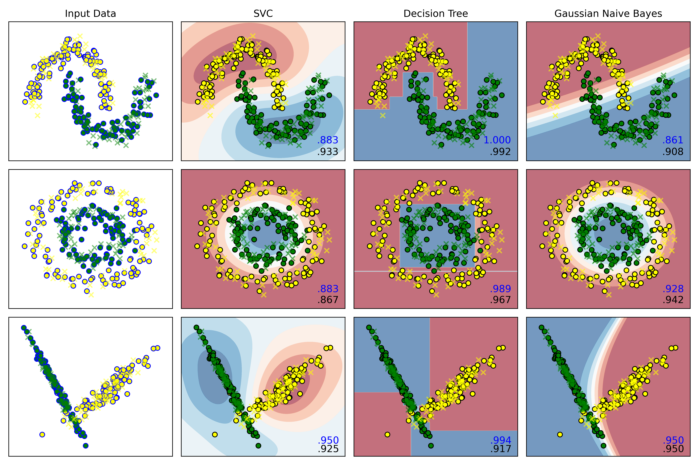
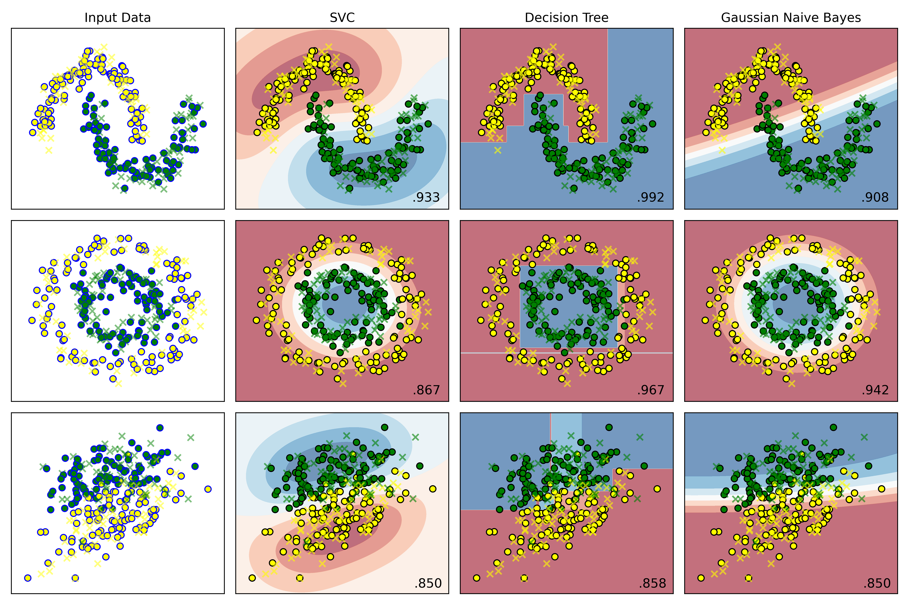
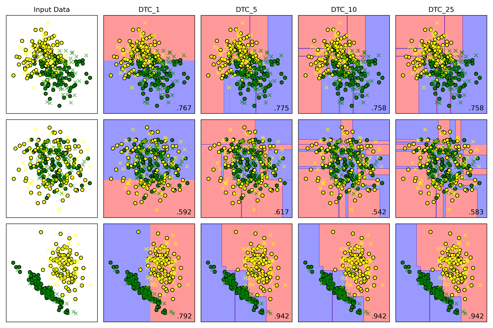

# 实验一

## 要求

复现线性SVM、决策树、朴素贝叶斯分类的示例，并相对代码作出如下作图修改

- 设定支持向量分类器的惩罚为0.05
- 对朴素贝叶斯分类器的先验概率进行设定（可随机设定）
- 在每张结果图上展示图例
- 修改散点颜色为黄和绿
- 测试结果的正确率保留三位小数展示

创新与拓展（选做）：

- 自主选取其他的数据集，采用上述三类分类器进行分类，展示分类结果
- 探究分类器的参数对于分类结果的影响并进行文字分析（选做）

如：

- DecisionTreeClassifier(max_depth=5)中max_depth设置对于结果的影响（如过拟合或者欠拟合）
- 朴素贝叶斯分类器的先验概率修改对于分类的影响
- 支持向量分类器不同核函数对于结果的影响
- 参数不限制于课件中代码所用到的参数，可以探究其他的参数
- 其他分类方法的效果的对比分析（K近邻，随机森林等）

## 1. 数据预览

导入数据：

```python
from sklearn.datasets import make_moons, make_circles, make_classification
```

后，对每一数据集选择采样数 500，`make_moons`和`make_circles`的高斯噪音方差为 0.1：

绘图得到：


发现：

1. Moons数据集的数据形状为两个半月形

2. Circles数据集的数据形状为两个圆环

3. make_classification为自定义的基本线性可分的数据集：

   ```python
   X_cf,y_cf = make_classification(
       n_samples=500,
       n_features=2,
       n_informative=2,
       n_redundant=0,
       n_clusters_per_class=1,
       random_state=32,
       )
   ```

## 2. 准备数据集

将加载好的数据置为一列表方便后续使用

```python
moons = (X_moons, y_moons)
circles = (X_circles, y_circles)
linears = (X_cf,y_cf)
datasets = [moons, circles, linears]
```

## 3. 代码复现

由于采样点数为 500时散点图绘制太过密集，经不断调整，采样时 sample为 300时较为合适。

**复现流程**

1. 切分数据集并进行标准化
2. 生成二维坐标网格，用于后续绘制散点图和决策边界
3. 绘制训练集、测试集的散点图
4. 训练模型
5. 进行模型预测和绘制决策边界
6. 绘制散点图
7. 在图上绘制预测准确率

结果：


**结果说明**：

1. **Input Data**从上到下为：moons、circles、make_classification：
   1. 训练集标记为圆圈，包括黄色、绿色圆圈
   2. 测试集标记为叉号❌
2. **右侧三列**依次为 SVC、DTC、Gauss贝叶斯算法：
   1. 黄色、绿色圆圈为训练集的两类特征的散点图
   2. 叉号为测试集的散点图
   3. 使用`plt.cm.RdBu` 温度等高线绘制决策边界
   4. 右下角为模型预测的准确率

## 4. 代码修改

### 4.1. 设定支持向量分类器的惩罚为0.05

在实例化分类器列表处，将 SVC的惩罚系数改为 $0.05$即可：

```python
# 实例化分类器
classifiers = [
    SVC(kernel='rbf', C=0.05, gamma='auto'), # 此处已修改为 0.05
    DecisionTreeClassifier(max_depth=5,random_state=42),
    GaussianNB()
]
```

**结果**：

**C=1.0时**：


**C=0.05时**：



**结果分析**：

**右下角的小数点，蓝色为模型在训练集上的预测准确率，黑色为测试集上的准确率**。

**观察发现**：

1. C = 1.0时：

   ​	SVC在三个数据集上的误差，即：
   $$
   e = \text{训练集准确率}-\text{测试集准确率}
   $$
   分别为：

   ```bash
   -0.009,-0.022,0.008
   ```

2. C = 0.05时：

   误差分别为：

   ```bash
   -0.05，0.016，0.025
   ```

**结论**：

当惩罚项为 1.0时，**它的泛化能力反而比C=0.05时更好，0.05的惩罚系数有欠拟合的倾向**。

### 4.2. 对朴素贝叶斯分类器的先验概率进行设定（可随机设定）

在实例化算法处，添加一函数，使用`np.random.rand()`生成随机数即可：

```python
# 2.实例化算法
def random_status():
    n = int((np.random.rand(1) * 100) % 100)
    print(n)
    return n
# 设置显示图效果的标题
names=['SVC','Decision Tree','Gaussian Naive Bayes']
# 实例化分类器
classifiers = [
    SVC(kernel='rbf', C=1.0, gamma='auto'),
    DecisionTreeClassifier(max_depth=5,random_state=random_status()),
    GaussianNB()
]
```

输出：

```bash
36
```


### 4.3. 在每张结果图上展示图例

如图。

### 4.4. 修改散点颜色为黄和绿

只需要在外循环里，将控制散点图颜色的变量  `cm_bright` 修改为：

```python
cm_bright = ListedColormap(['yellow','green']) # 散点颜色
```

即可。

### 4.5. 测试结果的正确率保留三位小数展示

只需要在内循环里，将训练好的模型在测试集上进行预测，再打印到每一幅图的右下角即可：

```python
# 内层循环：
    for name, clf in zip(names, classifiers):
       score = clf.score(X_test, y_test)
       # 在图的右下角绘制测试集准确率
        ax.text(xx.max()- .2,yy.min() + .2,(f'{score:.3f}').lstrip('0'),
                size=12,horizontalalignment='right')
```

**此图为SVC惩罚项为 $0.05$时的结果图**：



## 5. 创新与拓展

### 5.1. 选取 Breast Cancer Wisconsin dataset实现三类分类器进行分类，展示分类结果

#### 5.1.1. 数据集选择

选择 sklearn自带的**威斯康星州乳腺癌数据集 (Breast Cancer Wisconsin dataset)**，完成分类任务。

这个数据集的目标是根据从乳腺肿块的数字化图像中计算出的多个特征，来预测这个肿块是恶性的 (Malignant) 还是良性的 (Benign)，因此可知这是一个典型的二分类问题。

#### 5.1.2. 数据预处理

1. 加载数据集，了解数据结构

   ```python
   from sklearn.datasets import load_breast_cancer
   cancer = load_breast_cancer()
   X,y = cancer.data,cancer.target
   
   print(X.shape,y.shape)
   print(f"samples:{X.shape[0]}")
   print(f"features:{X.shape[1]}")
   print(f"target name: {list(cancer.target_names)}")
   # 输出：
   # (569, 30) (569,)
   # samples:569
   # features:30
   # target name: ['malignant', 'benign']
   # 0: malignant (恶性), 1: benign (良性)
   ```

   可得**该数据集维度是30维，因此后续绘制决策边界时需要进行降维**。

2. 切分数据集

   ```python
   X_train, X_test, y_train, y_test = train_test_split(X, y, test_size=0.25,stratify=y,random_state=42)
   ```

3. 数据标准化

   ```python
   scaler = StandardScaler()
   X_train = scaler.fit_transform(X_train)
   X_test = scaler.transform(X_test)
   ```

#### 5.1.3. 模型训练与评估

1. 实例化算法

2. 训练模型

   ```python
   clf.fit(X_train,y_train)
   ```

3. 模型评估

   ```python
   y_pred = clf.predict(X_test)
   ```

4. 计算准确率

   ```python
   accuracy = accuracy_score(y_test,y_pred)
   res[name] = accuracy
   ```

5. 绘制可视化混淆矩阵

   ```python
   cm = confusion_matrix(y_test, y_pred)
   if j == 2:
       j = 0
       i += 1
   sns.heatmap(cm, annot=True, cmap='coolwarm', fmt='d', ax=ax[i, j])
   ax[i, j].set_xlabel('Predicted Label')
   ax[i, j].set_ylabel('Actual Label')
   ax[i, j].set_title(f'{name} - Confusion Matrix')
   j += 1
   ```

#### 5.1.4. 结果分析

**1. 准确率结果**

```bash
SVC's accuracy: 97.90%
Decision Tree's accuracy: 93.71%
Gaussian Naive Bayes's accuracy: 93.71%
```

**2. 混淆矩阵可视化结果**


**3. SVC结果报告**

```bash
测试集准确率：97.90%
分类报告：
              precision    recall  f1-score   support
   malignant       0.96      0.98      0.97        53
      benign       0.99      0.98      0.98        90
    accuracy                           0.98       143
混淆矩阵：
[[52  1]
 [ 2 88]]
```

**4. 决策树结果报告**

```bash
Decision Tree算法结果：
测试集准确率：93.71%
分类报告：
              precision    recall  f1-score   support
   malignant       0.91      0.92      0.92        53
      benign       0.96      0.94      0.95        90
    accuracy                           0.94       143
混淆矩阵：
[[49  4]
 [ 5 85]]
```

**5. 高斯的朴素贝叶斯算法结构报告**

```bash
Gaussian Naive Bayes算法结果：
测试集准确率：93.71%
分类报告：
              precision    recall  f1-score   support
   malignant       0.94      0.89      0.91        53
      benign       0.94      0.97      0.95        90
    accuracy                           0.94       143
混淆矩阵：
[[47  6]
 [ 3 87]]
```

**结论**：

**这是一个医学数据集，关键诊断指标为 precision和 recall。因此 SVC模型是本次评估中的最佳模型**。它不仅在总体准确率上显著优于其他两个模型，在关键的医学诊断指标上表现出色，展示了强大的分类能力和泛化能力。

1. 在准确率上分析：

   - **SVC**：SVC的准确率高达 $97.90$%，几乎是百分之百，说明其能够很好地学习到数据中的复杂模式
   - **朴素贝叶斯和决策树**：这两个模型的准确率均为 $93.71$%，表现尚可，但与SVC有超过4个百分点的显著差距

2. 在混淆矩阵上分析：

   在癌症诊断中，后果最严重的事就是**将恶性肿瘤（malignant）误判为良性（benign）**，即假阴性 (FN)，因为它很可能导致病人延误治疗。

   对每一类模型的混淆矩阵结果进行分析：

   - **SVC**

     ```
     [[52  1]
      [ 2 88]]
     ```

      假阴性 (FN)：只有 **1** 个；在所有实际为恶性的53个案例中，SVC漏掉了1个。

   - **决策树**

     ```
     [[49  4]
      [ 5 85]]
     ```

     假阴性 (FN)：有 **4** 个；漏掉了4个恶性肿瘤，是SVC的**4倍**。

   - **高斯朴素贝叶斯**

     ```
     [[47  6]
      [ 3 87]]
     ```

     假阴性 (FN)：有 **6** 个；在三个模型中表现最差，漏掉了6个恶性肿瘤，是SVC的**6倍**。

   虽然决策树和朴素贝叶斯的准确率相同，但它们的错误类型不同。朴素贝叶斯犯下了更多致命的假阴性错误，因此在医疗应用场景中，它比决策树更差。

   **SVC模型在控制最关键的假阴性错误方面表现最佳**。

**综上，应该选择 SVC作为最终的算法模型**。

#### 5.1.5. 绘制决策边界

**由于该数据集有 30维，因此采样 PCA法进行降维，将其降维到 2维**。

```python
from sklearn.decomposition import PCA
from matplotlib.colors import ListedColormap
pca = PCA(n_components=2)
X_train_pca = pca.fit_transform(X_train)
# 创建网格来绘制决策边界
x_min, x_max = X_train_pca[:,0].min() - 1, X_train_pca[:,0].max() + 1
y_min, y_max = X_train_pca[:, 1].min() - 1, X_train_pca[:, 1].max() + 1
xx, yy = np.meshgrid(np.arange(x_min,x_max,0.02),
                     np.arange(y_min,y_max,0.02))
for ax,name,clf in zip(axes.flatten(),names,classifiers):

    clf.fit(X_train_pca,y_train)

    # 绘制决策边界
    Z = clf.predict(np.c_[xx.ravel(),yy.ravel()])
    Z = Z.reshape(xx.shape)
    ax.contourf(xx,yy,Z,alpha=0.4,cmap=plt.cm.RdBu)

    # 绘制散点图
    scatter = ax.scatter(X_train_pca[:,0], X_train_pca[:, 1], c=y_train,
                         cmap=ListedColormap(['yellow','green']),edgecolor='k', s=40)

    ax.set_title(f'{name}')
    ax.set_xlabel('Principal Component 1')
    ax.set_ylabel('Principal Component 2')
```

**结果**：


**图解**：

- X 坐标是肿瘤样本在 **PCA主成分 1** 此维度上的得分，是肿瘤样本所有30个原始特征的一个**综合性分数**。
- Y 坐标为肿瘤样本在 **PCA主成分 2** 此维度上的得分，是第二重要的合成特征，它捕捉了在排除了 主成分1 的信息后，剩余信息中最大的一部分。
- 黄色点样为标签为 0，即真实标签为 "恶性肿瘤"（Malignant） 的样本点。
- 绿色点样为标签为 1，即真实标签为 "良性肿瘤"（Benign）的样本点。

以一个黄色的点，位于坐标 (X=5.0, Y=2.0) 为例：此为一个来自训练集的肿瘤样本，它的30个原始特征经过PCA降维后，在  主成分1  上的得分是5.0，在  主成分2  上的得分是2.0；并且从数据标签得知，该肿瘤在医学上被确诊为**恶性**。

### 5.2. DTC(max_depth=5)中max_depth设置对于结果的影响

**为控制好变量，将数据集 make_classification的随机状态定为 40，DTC的随机状态定为 42，并且提高另外两个数据集的噪声比例为0.4**：

```python
X_moons, y_moons = make_moons(n_samples=samples, noise=0.4, random_state=42)
X_circles, y_circles = make_circles(n_samples=samples, noise=0.4, factor=0.5, random_state=42)
X_cf,y_cf = make_classification(
    n_samples=samples,
    n_features=2,
    n_informative=2,
    n_redundant=0,
    n_clusters_per_class=1,
    random_state=40)
names = ['DTC_1','DTC_5','DTC_10','DTC_25']
# 实例化分类器
classifiers = [
    DecisionTreeClassifier(max_depth=1,random_state=42),
    DecisionTreeClassifier(max_depth=5,random_state=42),
    DecisionTreeClassifier(max_depth=10, random_state=42),
    DecisionTreeClassifier(max_depth=25, random_state=42),
]
```

**结果**



**决策边界**


**在训练集上的表现**


**在测试集上的表现**


**结论**：

1.  **低 max_depth**：
    *   高偏差：模型过于简单，决策边界非常粗糙
    *   低方差：模型稳定，对训练数据中的微小变化不敏感
    *   结果：**欠拟合**；模型在训练集和测试集上表现都很差

2.  **高 max_depth**：
    *   低偏差：模型复杂，可持续分裂，直到每个叶子节点都只包含一个类别的样本或者达到其他停止条件；能够记住训练数据中几乎所有的细节，**包括噪声**
    *   高方差：模型对训练数据极其敏感。训练数据稍有变动，就可能生成一棵完全不同的树
    *   结果：**过拟合**；模型在训练集上表现完美，但在未见过的测试集上表现很差

---

### 5.3. 支持向量分类器不同核函数对于结果的影响

```python
X_moons, y_moons = make_moons(n_samples=samples, noise=0.2, random_state=42)
X_circles, y_circles = make_circles(n_samples=samples, noise=0.2, factor=0.5, random_state=42)
X_cf,y_cf = make_classification(
    n_samples=samples,
    n_features=2,
    n_informative=2,
    n_redundant=0,
    n_clusters_per_class=1,
    random_state=87)
names = ['rbf','poly','sigmoid','linear']
# 实例化分类器
classifiers = [
    SVC(kernel='rbf', C=1.0, gamma='auto'),
    SVC(kernel='poly', C=1.0, gamma='auto'),
    SVC(kernel='sigmoid', C=1.0, gamma='auto'),
    SVC(kernel='linear', C=1.0, gamma='auto'),
]
```

|   kernel    |    决策边界    |        优点        |             缺点             |          适用场景          |
| :---------: | :------------: | :----------------: | :--------------------------: | :------------------------: |
| **linear**  |  直线/超平面   | 速度快，不易过拟合 |      无法处理非线性问题      |        数据线性可分        |
|   **rbf**   | 灵活的平滑曲线 |  通用性强，效果好  | 对惩罚项`C`和`gamma`调参敏感 | 首选，尤其在数据分布未知时 |
|  **poly**   |   多项式曲线   |  可控的非线性能力  |    参数多，高次项易过拟合    |    决策边界呈多项式形状    |
| **sigmoid** |    S形/分段    |  灵感源于神经网络  |      性能不稳定，不常用      |          特定场景          |

**结果**


**横向比较结果分析**：

1. **Moons Dataset**
   - **rbf**：得分 $0.942$，它表现最佳，成功地学习到了一个与数据分布完美契合的平滑S形曲线，准确区分两个类别。
   - **poly**：得分 $0.908$，它也学习到了一个非线性边界，但这条曲线不如RBF的平滑和贴合。
   - **sigmoid**：得分 $0.742$，它生成的决策边界形状有点奇怪，虽然是非线性，但与数据的真实分布相差较大，导致了大量的错误分类
   - **linear**：得分 $0.875$，它只能生成一条直线。
2. **Circles Dataset**
   - **rbf**：得分 $0.917$，它表现最佳，生成了一个近乎完美的圆形边界将内外两类数据点清晰地分离。
   - **poly**：得分 $0.433$，它的低阶多项式（默认degree=3）很难拟合出一个封闭的圆形，决策边界形状怪异，导致几乎一半的数据被错误分类，得分和随机猜测差不多。
   - **sigmoid**：得分 $0.550$，它无法理解同心圆的结构，生成的边界毫无意义，得分接近随机。
   - **linear**：得分 $0.433$，它只能生成一条直线，一条直线根本无法解决同心圆问题。
3. **Linearly Separable Dataset**
   - **rbf**：得分 $0.992$，它表现优秀，当数据是线性时，依旧能自动学习到一个近似线性的边界。
   - **poly**：得分 $0.992$，表现优秀，多项式核（degree 大于等于 1时）本身就包含线性项，因此处理线性问题毫无压力。
   - **sigmoid**：得分 $0.983$，它表现优秀，在简单数据集上表现良好。
   - **linear**：得分 $0.992$，它表现优秀，本身就是生成一条直线来进行分类。

## 源码

```python
import numpy as np
import matplotlib.pyplot as plt
import seaborn as sns
from matplotlib.colors import ListedColormap
from sklearn.model_selection import train_test_split
from sklearn.preprocessing import StandardScaler
# 使用内置数据集
from sklearn.datasets import make_moons, make_circles, make_classification
# 导入算法
from sklearn.svm import SVC
from sklearn.tree import DecisionTreeClassifier
from sklearn.naive_bayes import GaussianNB

samples = 300

def random_status():
    n = int((np.random.rand(1) * 100) % 100)
    print(n)
    return n

# 1. 观察数据集
# 1.1. make_moons
X_moons, y_moons = make_moons(n_samples=samples, noise=0.2, random_state=42)

# fig,ax = plt.subplots(2,2,figsize=(12,8))

# ax[0,0].scatter(X_moons[:, 0], X_moons[:, 1], c=y_moons,edgecolors='b')
# ax[0,0].set_title('Moons Dataset')

# 1.2. make_circles
X_circles, y_circles = make_circles(n_samples=samples, noise=0.2, factor=0.5, random_state=42)

# ax[0,1].scatter(X_circles[:, 0], X_circles[:, 1], c=y_circles)
# ax[0,1].set_title('Circles Dataset')

# 1.3. make_classification
X_cf,y_cf = make_classification(
    n_samples=samples,
    n_features=2,
    n_informative=2,
    n_redundant=0,
    n_clusters_per_class=1,
    random_state=random_status(),
    )

# rng = np.random.RandomState(2)
# X_cf += 2 * rng.uniform(size=X_cf.shape)
linears = (X_cf, y_cf)

# ax[1,0].scatter(X_cf[:, 0], X_cf[:, 1], c=y_cf)
# ax[1,0].set_title('Make Classification Dataset')
#
# plt.tight_layout()
# plt.savefig('Input_dataset.png',dpi=300)
# plt.show()

# 2.实例化算法
# 设置显示图效果的标题
names=['SVC','Decision Tree','Gaussian Naive Bayes']
# 实例化分类器
classifiers = [
    SVC(kernel='rbf', C=1.0, gamma='auto'),
    # DecisionTreeClassifier(max_depth=10, random_state=42),
    # GaussianNB()
]

# 3.准备数据集
moons = (X_moons, y_moons)
circles = (X_circles, y_circles)
datasets = [moons, circles, linears]

fig = plt.figure(figsize=(12,8))

# 4.模型训练
i = 1
for ds_cnt,ds in enumerate(datasets):
    # 处理数据集
    X,y = ds
    X = StandardScaler().fit_transform(X)
    X_train, X_test, y_train, y_test = train_test_split(X, y, test_size=0.4, random_state=42)
    x_min,x_max = X[:,0].min(axis=0) - .5, X[:,0].max(axis=0) + .5
    y_min, y_max = X[:,1].min(axis=0) - .5, X[:,1].max(axis=0) + .5
    h = 0.02
    xx,yy = np.meshgrid(np.arange(x_min,x_max,h),
                            np.arange(y_min,y_max,h)
                        )
    # 先展示输入数据集
    # cm = ListedColormap(['yellow','green']) # 设置分割面颜色
    cm_bright = ListedColormap(['yellow','green']) # 散点颜色
    ax=plt.subplot(len(datasets),len(classifiers)+1,i) # 划分子面
    if ds_cnt == 0:
        ax.set_title('Input Data')

    # 训练集散点图
    ax.scatter(X_train[:, 0], X_train[:, 1], c=y_train,cmap=cm_bright,edgecolors='k',label='train set',marker='o')
    ax.scatter(X_test[:, 0], X_test[:, 1], c=y_test, alpha=0.5,cmap=cm_bright, edgecolors='k', label='test set',marker='x')
    ax.set_xlim(x_min,x_max)
    ax.set_ylim(y_min,y_max)
    ax.set_xticks(())
    ax.set_yticks(())
    i += 1

    for name, clf in zip(names, classifiers):
        ax = plt.subplot(len(datasets),len(classifiers)+1,i)

        # 训练模型
        clf.fit(X_train, y_train)
        test_score = clf.score(X_test, y_test)

        # 绘制决策边界
        # hasattr检查分类器是否有decision_function方法
        if(hasattr(clf,'decision_function')):
            Z = clf.decision_function(np.c_[xx.ravel(),yy.ravel()])
        else:
            Z = clf.predict_proba(np.c_[xx.ravel(),yy.ravel()])[:,1]

        # 将决策边界绘制成等高线图
        # cm = plt.cm.Set1
        cm = ListedColormap(['red', 'blue'])  # 设置分割面颜色
        Z = Z.reshape(xx.shape)
        ax.contourf(xx,yy,Z,alpha=0.4,cmap=cm)

        # 绘制散点图
        ax.scatter(X_train[:,0],X_train[:,1],c=y_train,cmap=cm_bright,edgecolors='k')
        ax.scatter(X_test[:, 0], X_test[:, 1], c=y_test, alpha=0.6,cmap=cm_bright, edgecolors='k',marker='x')

        ax.set_xlim(xx.min(),xx.max())
        ax.set_ylim(yy.min(),yy.max())
        ax.set_xticks(())
        ax.set_yticks(())

        if(ds_cnt == 0):
            ax.set_title(name)

        # 在图的右下角绘制测试集准确率
        ax.text(xx.max()- .2,yy.min() + .2,(f'{test_score:.3f}').lstrip('0'),
                size=12,horizontalalignment='right')
        i += 1
plt.tight_layout()
plt.savefig('SVC.png',dpi=300)
plt.show()

# Breast Cancer Wisconsin dataset 回归分类问题
# import numpy as np
# import matplotlib.pyplot as plt
# import seaborn as sns
# from sklearn.model_selection import train_test_split
# from sklearn.preprocessing import StandardScaler
# # 加载数据集
# from sklearn.datasets import load_breast_cancer
# # 导入算法
# from sklearn.svm import SVC
# from sklearn.tree import DecisionTreeClassifier
# from sklearn.naive_bayes import GaussianNB
# # 导入评价指标
# from sklearn.metrics import accuracy_score, classification_report, confusion_matrix
#
# # 加载数据集
# cancer = load_breast_cancer()
# X,y = cancer.data,cancer.target
#
# # print(f"samples:{X.shape[0]}")
# # print(f"features:{X.shape[1]}")
# # print(f"target name: {list(cancer.target_names)}")
#
# X_train, X_test, y_train, y_test = train_test_split(X, y, test_size=0.25,stratify=y,random_state=42)
#
# scaler = StandardScaler()
# X_train = scaler.fit_transform(X_train)
# X_test = scaler.transform(X_test)
#
# names=['SVC','Decision Tree','Gaussian Naive Bayes']
# # 实例化分类器
# classifiers = [
#     SVC(kernel='rbf', C=1.0, probability=True, random_state=42),
#     DecisionTreeClassifier(max_depth=5,random_state=42),
#     GaussianNB()
# ]
#
# res = {}
# # fig,ax = plt.subplots(2, 2, figsize=(8, 6))
# # i = 0
# # j = 0
# for name,clf in zip(names,classifiers):
#
#     clf.fit(X_train,y_train)
#
#     y_pred = clf.predict(X_test)
#
#     accuracy = accuracy_score(y_test,y_pred)
#     res[name] = accuracy
#
#     print(f"{name}算法结果：")
#     print(f'测试集准确率：{accuracy*100:.2f}%')
#     print('分类报告：')
#     print(classification_report(y_test,y_pred,target_names=cancer.target_names))
#     print('混淆矩阵：')
#     print(confusion_matrix(y_test,y_pred))
#
#     # 热力图绘制
#     # cm = confusion_matrix(y_test, y_pred)
#     # if j == 2:
#     #     j = 0
#     #     i += 1
#     # sns.heatmap(cm, annot=True, cmap='Blues', fmt='d', ax=ax[i, j])
#     # ax[i, j].set_xlabel('Predicted Label')
#     # ax[i, j].set_ylabel('Actual Label')
#     # ax[i, j].set_title(f'{name} - Confusion Matrix')
#     # j += 1
#
#
# for name,acc in res.items():
#     print(f'{name}\'s accuracy: {acc*100:.2f}%')
#
# # plt.tight_layout()
# # # plt.savefig('heatmap.png',dpi=300)
# # plt.show()
#
# # PCA降维绘制决策边界
# from sklearn.decomposition import PCA
# from matplotlib.colors import ListedColormap
# pca = PCA(n_components=2)
# X_train_pca = pca.fit_transform(X_train)
#
# # 创建网格来绘制决策边界
# x_min, x_max = X_train_pca[:,0].min() - 1, X_train_pca[:,0].max() + 1
# y_min, y_max = X_train_pca[:, 1].min() - 1, X_train_pca[:, 1].max() + 1
# xx, yy = np.meshgrid(np.arange(x_min,x_max,0.02),
#                      np.arange(y_min,y_max,0.02))
#
# fig, axes = plt.subplots(2,2,figsize=(10,8))
#
# for ax,name,clf in zip(axes.flatten(),names,classifiers):
#
#     clf.fit(X_train_pca,y_train)
#
#     # 绘制决策边界
#     Z = clf.predict(np.c_[xx.ravel(),yy.ravel()])
#     Z = Z.reshape(xx.shape)
#     ax.contourf(xx,yy,Z,alpha=0.4,cmap=plt.cm.RdBu)
#
#     # 绘制散点图
#     scatter = ax.scatter(X_train_pca[:,0], X_train_pca[:, 1], c=y_train,
#                          cmap=ListedColormap(['yellow','green']),edgecolor='k', s=40)
#
#     ax.set_title(f'{name}')
#     ax.set_xlabel('Principal Component 1')
#     ax.set_ylabel('Principal Component 2')
#
# # 删除多余的子图
# axes.flatten()[-1].axis('off')
# plt.suptitle('Classifiers Decision Boundaries', fontsize=16)
# plt.tight_layout()
# plt.savefig('Breast_Cancer.png',dpi=300)
# plt.show()
```
