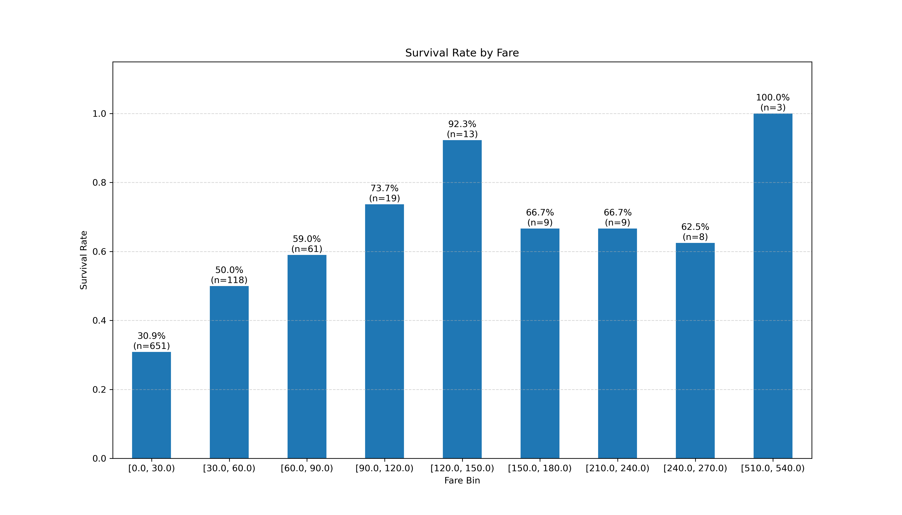

# 泰坦尼克号数据集实践

## 数据获取

### Seaborn库获取

```
conda install seaborn
```

加载数据集：

```python
import seaborn as sns
df = sns.load_dataset('titanic')
```

### Kaggle获取

 [Titanic - Machine Learning from Disaster](https://www.google.com/url?sa=E&q=https%3A%2F%2Fwww.kaggle.com%2Fc%2Ftitanic) ， 在 "Data" 标签页下，下载 train.csv 和 test.csv 文件到本地项目文件夹。

加载数据

```python
import pandas as pd
df = pd.read_csv('train.csv')
```

## 数据预分析

### .head()：初见数据，建立直观印象

主要作用是：

- **理解特征含义**：我们可以看到列名，并猜测它们的含义。例如，survived (是否生还)，pclass (船舱等级)， sex (性别), age (年龄)，sibsp (同行的兄弟姐妹/配偶数)，parch (同行的父母/子女人数)，fare (票价)。
- **观察数据格式**：
  - survived 是 0 和 1，这是典型的**二元数值型**变量，适合做分类任务的目标。
  - sex 是 'male' 和 'female'，是**文本类别型**变量。
  - deck 列在第一行就是 NaN (Not a Number)，这是一个**缺失值**的直接信号。
- **发现潜在的冗余信息**：
  - 我们同时看到了 survived (0/1) 和 alive ('no'/'yes') 这两列。它们表达的是完全相同的信息，只是格式不同。在后续处理中，我们只需要保留一列。
  - 同样，pclass (1,2,3) 和 class ('First', 'Second', 'Third') 也是冗余的。
  - embarked ('S', 'C') 和 embark_town ('Southampton', 'Cherbourg') 也是如此。

```bash
   survived  pclass     sex   age  ...  deck  embark_town  alive  alone
0         0       3    male  22.0  ...   NaN  Southampton     no  False
1         1       1  female  38.0  ...     C    Cherbourg    yes  False
2         1       3  female  26.0  ...   NaN  Southampton    yes   True
3         1       1  female  35.0  ...     C  Southampton    yes  False
4         0       3    male  35.0  ...   NaN  Southampton     no   True
```

**初步结论**：数据集包含数值、文本、布尔等多种数据类型，存在明显的缺失值和信息冗余的列。

### info()：深入了解结构

info() 提供了数据的整体结构信息，是发现**缺失值**和**数据类型**问题的关键。

- **数据集规模**：RangeIndex: 891 entries 告诉我们这个数据集中共有 **891条记录**（代表891名乘客）。这是我们所有分析的基准。
- **数据类型 (Dtype)**：
  - object 类型通常是字符串，如 sex, embarked, who。这些在喂给机器学习模型前需要进行编码（如 **One-Hot Encoding**）。
  - int64, float64 是数值型，可以直接用于计算。
  - category 和 bool 是特殊的类型，通常也需要转换成数值。
- **发现缺失值（核心洞察）**：通过对比每一列的 Non-Null Count 和总数 891，可以精确地定位缺失数据：
  - **age**: 只有 714 non-null，说明有 891 - 714 = 177 个年龄数据是缺失的。这是一个比较严重的问题，需要后续处理（填充或删除）。
  - **embarked** 和 **embark_town**: 只有 889 non-null，说明有 891 - 889 = 2 个登船港口数据缺失。数量很少，容易处理。
  - **deck**: 只有 203 non-null，说明有 891 - 203 = 688 个船舱号数据缺失。**缺失率极高（超过77%）**，这个特征可能无法使用，后续很大概率会直接删除。

```json
RangeIndex: 891 entries, 0 to 890
Data columns (total 15 columns):
 #   Column       Non-Null Count  Dtype
---  ------       --------------  -----
 0   survived     891 non-null    int64
 1   pclass       891 non-null    int64
 2   sex          891 non-null    object
 3   age          714 non-null    float64
 4   sibsp        891 non-null    int64
 5   parch        891 non-null    int64
 6   fare         891 non-null    float64
 7   embarked     889 non-null    object
 8   class        891 non-null    category
 9   who          891 non-null    object
 10  adult_male   891 non-null    bool
 11  deck         203 non-null    category
 12  embark_town  889 non-null    object
 13  alive        891 non-null    object
 14  alone        891 non-null    bool
```

**初步结论**：deck列因缺失太多基本无用，age列有显著的缺失需要重点处理，embarked列有少量缺失可以轻松修复。

### isnull().sum()：量化缺失问题

这个命令是 info() 中关于缺失值信息的提炼和确认，让我们更直观地看到问题。

- **deck: 688**:    再次确认，deck列的缺失问题是最大的。
- **age: 177**:    确认了age是第二大缺失项。
- **embarked:  2** 和 **embark_town:  2**: 确认了这两列有少量缺失。
- **其他列: 0**: 告诉我们其他列的数据是完整的，这非常好。

```json
各列缺失值数量:
survived         0
pclass           0
sex              0
age            177
sibsp            0
parch            0
fare             0
embarked         2
class            0
who              0
adult_male       0
deck           688
embark_town      2
alive            0
alone            0
dtype: int64
```

**初步结论**：我们已经精确锁定了需要进行缺失值处理的3个主要特征：deck, age, embarked。

### describe()：洞察数值特征的分布与规律

describe() 提供了所有**数值型**列的统计摘要，这是挖掘数据规律和发现异常值的金矿。

- **survived (目标变量)**：
  - mean: 0.383838：因为生还为1，遇难为0，所以均值就是**生还率**。我们可以得出一个非常重要的基线结论：**数据集中总体的生还率约为 38.4%**。
- **pclass (船舱等级)**：
  - mean: 2.3：平均等级是2.3，说明大部分乘客（超过一半）都在三等舱（因为中位数50%是3.0）。
- **age (年龄)**：
  - count: 714：再次确认了非空值的数量。
  - mean: 29.7, 50% (median): 28.0：乘客的平均年龄约30岁，中位数和均值很接近，说明年龄分布可能不会太偏斜。
  - min: 0.42, max: 80.0：乘客年龄跨度很大，从婴儿到老人都有。
- **sibsp & parch (家庭成员数)**：
  - 75%: 1.000000 (sibsp) 和 75%: 0.000000 (parch)：这两个值告诉我们，**超过75%的乘客没有同行父母/子女，且大部分乘客的同行兄弟姐妹/配偶数不超过1人**。结合起来看，大多数人是独自或以小家庭形式出行。
- **fare (票价)**：
  - mean: 32.2 vs 50% (median): 14.45：**均值远大于中位数**，这是一个强烈的信号，表明票价分布是严重右偏的。
  - std: 49.7：标准差非常大，甚至超过了均值，说明票价的波动范围极广。
  - max: 512.3：存在极高的票价，这很可能是异常值或极端值，是那些豪华头等舱的票价，它们拉高了整体的平均值。

```json
          survived      pclass         age       sibsp       parch        fare
count  891.000000  891.000000  714.000000  891.000000  891.000000  891.000000
mean     0.383838    2.308642   29.699118    0.523008    0.381594   32.204208
std      0.486592    0.836071   14.526497    1.102743    0.806057   49.693429
min      0.000000    1.000000    0.420000    0.000000    0.000000    0.000000
25%      0.000000    2.000000   20.125000    0.000000    0.000000    7.910400
50%      0.000000    3.000000   28.000000    0.000000    0.000000   14.454200
75%      1.000000    3.000000   38.000000    1.000000    0.000000   31.000000
max      1.000000    3.000000   80.000000    8.000000    6.000000  512.329200
```


### **综合分析与下一步行动计划**

通过这四个命令，我们几乎可以为后续的数据清洗和特征工程制定一个完整的计划：

1. **数据清洗**:
   - **删除冗余列**：从 survived/alive, pclass/class, embarked/embark_town 中各选一列保留。
   - **处理缺失值**：
     - **删除deck列**，因为缺失值太多。
     - **填充age列**，可以使用均值、中位数填充，或者更高级的方法（如根据头衔Mr., Mrs.的平均年龄来填充）。
     - **填充embarked列**，可以使用最常见的登船港口来填充。
2. **特征工程**:
   - 将sex、embarked等文本类别型特征转换为数值（如One-Hot Encoding）。
   - 可以考虑将sibsp和parch合并成一个新的特征，如family_size（家庭总人数）。
   - 由于fare和age的分布和范围差异很大，后续建模时需要进行**特征缩放（标准化或归一化）**。
3. **初步假设建立**:
   - 生还率可能与pclass和fare有关（高等级/高票价的乘客是否生还率更高？）。
   - 生还率可能与sex有关（女性的生还率是否更高？）。
   - 生还率可能与age有关（儿童的生还率是否更高？）。

## 数据清洗

### 数据冗余处理

使用 .info() 查看：

```bash
#   Column       Non-Null Count  Dtype
---  ------       --------------  -----
 0   survived     891 non-null    int64 ------- ‘1’代表活着，'0'代表死亡
 1   pclass       891 non-null    int64 -----船舱等级 1、2、3
 2   sex          891 non-null    object  ---- 'male' or 'female'
 3   age          714 non-null    float64
 4   sibsp        891 non-null    int64 -----父母数
 5   parch        891 non-null    int64  ----子女数
 6   fare         891 non-null    float64 ----费用
 7   embarked     889 non-null    object  ---- 与embark_town重复，舍弃
 8   class        891 non-null    category ------ 船舱等级 first、second、third
 9   who          891 non-null    object   ------ 'man' or 'woman'，舍弃
 10  adult_male   891 non-null    bool   ------- 是否成年 True or False
 11  deck         203 non-null    category ------样本缺失太多，舍弃
 12  embark_town  889 non-null    object
 13  alive        891 non-null    object  ---- 与survived重复，舍弃
 14  alone        891 non-null    bool ---- 是否一个人来的
```

可知需要除去几个冗余数据，优先保留数值类，滤除对象，以减少 后续文本特征转换数值的操作：One-Hot Encoding

**冗余列**：

1. alive
2. who
3. class
4. embarked

```python
df = df.drop(['alive','deck','who','embarked','class'],axis=1) # axis保证删除的是列
```

```python
RangeIndex: 891 entries, 0 to 890
Data columns (total 11 columns):
 #   Column       Non-Null Count  Dtype  
---  ------       --------------  -----  
 0   survived     891 non-null    int64  
 1   pclass       891 non-null    int64  
 2   sex          891 non-null    object 
 3   age          891 non-null    float64
 4   sibsp        891 non-null    int64  
 5   parch        891 non-null    int64  
 6   fare         891 non-null    float64
 7   adult_male   891 non-null    bool   
 8   embark_town  891 non-null    object 
 9   alone        891 non-null    bool   
 10  family       891 non-null    int64  
```

---

**合并数据**

观察发现：`sibsp`和`parch`意思实际上是同一个，可以合并为 `family` 列，代表家庭成员数。而保留alone是因为方便后续做数据分析：生还率是否与单独一人有关?

```python
df['family'] = df['sibsp'] + df['parch'] + 1
df = df.drop(['sibsp','parch'],axis=1)
```

```bash
 #   Column       Non-Null Count  Dtype  
---  ------       --------------  -----  
 0   survived     891 non-null    int64  -- 是否活着：0=dead,1=survived
 1   pclass       891 non-null    int64  -- 船舱等级：1、2、3 
 2   sex          891 non-null    object -- 性别：'male' or 'female'
 3   age          891 non-null    float64 -- 年龄
 4   fare         891 non-null    float64 -- 费用
 5   adult_male   891 non-null    bool   -- 是否成年：'True' or 'False'
 6   embark_town  891 non-null    object -- 登录港口
 7   alone        891 non-null    bool   -- 是否一个人：'True' or 'False'
 8   family       891 non-null    int64  -- 家庭成员数：包括自己
```


### 缺失值处理

使用指令 'df.isnull().sum()' 得到数据集缺失情况

```bash
各列缺失值数量:
survived         0
pclass           0
sex              0
age            177
sibsp            0
parch            0
fare             0
embarked         2
class            0
who              0
adult_male       0
deck           688
embark_town      2
alive            0
alone            0
```

发现：

1. deck 缺失过多，根本无法使用
2. age 缺失 177条
3. embark_town 缺失 2条

#### 1.计算缺失率

1. 获取缺失条数

   ```python
   age_null = df['age'].isnull().sum()
   ```

2. 获取总条数

   获取总共有多少条数据有几种办法

   1. 使用 python 的 len（）直接作用 DataFrame/Series 对象，返回行数

      ```python
      a = len(df['age'])
      # 891
      ```

   2. 使用下标索引方式，.index[-1] 返回最后的下标索引

      ```python
      age_cnt = df['age'].index[-1]
      print(age_cnt)
      # 890
      ```

   3. 使用 .shape[0] 获取行数

      ```python
      age_cnt = df['age'].shape
      # (891,)
      age_cnt = df['age'].shape[0]
      print(age_cnt)
      # 891
      ```

   4. 使用 .tail(1)获得最后一条数据

      ```python
      df['age'].tail(1)
      # 890    32.0
      a = df['age'].tail(1).index[0]
      print(a)
      # 890
      ```

   5. 注意： .iloc[n] 获取的是第n条数据的**值**，不是索引

3. 计算单列数据的缺失率

   ```python
   age_null = df['age'].isnull().sum()
   age_cnt = df['age'].index[-1] + 1
   print(f'缺失比：{(age_null/age_cnt)*100:.3f}%')
   # 缺失比：19.865%
   ```

4. 一次性计算所有列的数据的缺失率

   ```python
   val_null = df.isnull().sum()
   total_cnt = df.shape[0] # [0] 代表行数，[1] 代表列数
   print(f'总数据条数{total_cnt}')
   miss_rate = (val_null/total_cnt)*100
   print(f'各列的缺失率(%):\n {miss_rate[miss_rate>0].sort_values(ascending=False)}')
   # 总数据条数 891
   # 各列的缺失率(%):
   # age            19.865320
   # embark_town     0.224467
   ```

可得：

| deck缺失率 | age缺失率 | embark_town缺失率 |
| :--------: | :-------: | :---------------: |
|  77.217%   |  19.865%  |      0.224%       |

=> deck 数据无法使用，age 和 embark_town 有使用的价值

#### 2.填补缺失值

1.  age 是数值类型，使用均值受到的影响很大，填补后会极大影响原本的数据特征，故采用中位数

   ```python
   age_median = df['age'].median()
   df['age'] = df['age'].fillna(age_median)
   ```

2. embark_town 是分类型特征（地点），使用众数填充更合适

   ```python
   e_t_mode = df['embark_town'].mode()
   # print(e_t_mode)
   # 0    Southampton
   df['embark_town'] = df['embark_town'].fillna(e_t_mode[0]) # 选择序列号0的元素
   print(df.isnull().sum())
   ```

3. 填充完毕：

   ```python
   survived       0
   pclass         0
   sex            0
   age            0
   sibsp          0
   parch          0
   fare           0
   class          0
   adult_male     0
   embark_town    0
   alone          0
   family         0
   ```

   

---

**数据填充的选择**

​	**选择的填充方法，必须最符合该特征的数据类型和其分布特点，以最大程度地减少对原始数据信息的扭曲**

1. **均值**

   例如 age 是数值型数据，并且其分布可能受到异常值（极端值）的影响，中位数对异常值不敏感，是比均值更稳健、更安全的“中心”衡量标准。

   - 优点:     保持了数据集的整体均值不变。
   - 缺点:
     - 降低了数据的方差：因为用一个相同的值替换了许多不同的未知值，这使得数据的波动性（方差）减小了。
     - 对异常值敏感：如果数据中有极端值，均值会被拉高或拉低，用这个被污染的均值去填充可能会引入偏差。
     - 忽略了特征之间的相关性。

2. **中位数**

   - 方法: 

     ```python
     df['age'] = fillna(df['age'].median())
     ```

   - 适用场景:     

     ​	当数据分布是**偏斜的**或存在异常值时，中位数比均值更具代表性，是更稳健的选择。因为它**不受或很少受**数据集两端的极端值影响

3. **众数**

   - 方法: (注意：.mode()返回一个Series，所以要取第一个元素 [0])

     ```python
     df['embarked'] = fillna(df['embarked'].mode()[0]) 
     ```

   - 适用场景: 

     ​	主要用于填充**分类型特征**，例如 embarked（登船港口）。用出现次数最多的港口来填充缺失的两个值是合理的。

### 数据类型转换

观察 .info 的输出，发现有一些列数据类型，模型无法使用：布尔、对象object

```bash
RangeIndex: 891 entries, 0 to 890
Data columns (total 11 columns):
 #   Column       Non-Null Count  Dtype  
---  ------       --------------  -----  
 0   survived     891 non-null    int64  
 1   pclass       891 non-null    int64  
 2   sex          891 non-null    object ---> 1111
 3   age          891 non-null    float64
 4   sibsp        891 non-null    int64  
 5   parch        891 non-null    int64  
 6   fare         891 non-null    float64
 7   adult_male   891 non-null    bool   ---> 2222
 8   embark_town  891 non-null    object ---> 3333
 9   alone        891 non-null    bool   ---> 4444
 10  family       891 non-null    int64  
```

因此需要对其进行类型转换

#### 1.布尔类型转换

pandas库有一个专门的函数做这件事：.astype()

将布尔类型转换为`int64`的类型

```python
df['alone'] = df['alone'].astype(int)
df['adult_male'] = df['adult_male'].astype(int)
print(df.info())
```

如果不记得，手动创造函数使用：

```python
def turn_type(val):
    if val:
        return 1
    elif not val:
        return 0

df['alone'] = df['alone'].apply(turn_type)
df['adult_male'] = df['adult_male'].apply(turn_type)
print(df['alone'].value_counts())
print(df['adult_male'].value_counts())
```

```bash
alone
1    537
0    354
Name: count, dtype: int64
adult_male
1    537
0    354
Name: count, dtype: int64
```

#### 2.One-Hot Encoding

### 文本类别型特征转换为数值

一般采用：One-Hot Encoding 的方法

#### 目的

1. **机器学习模型是数学模型**

   ​	像逻辑回归、线性回归、神经网络等模型，它们内部进行的是数学运算（加、乘、求导等）。它们无法直接处理'male'、'female'或'Southampton'这样的文本字符串。因此，必须将文本转换为数值

2. **避免错误的顺序关系**

   你可能会想，最简单的转换方法不就是直接映射成数字吗？比如：

   - 'male' -> 0
   - 'female' -> 1

   或者对于embarked列：

   - 'Southampton' -> 0
   - 'Cherbourg' -> 1
   - 'Queenstown' -> 2

   这是一个陷阱，这样做会引入一个模型本不应该学习到的**虚构的顺序关系**。模型会错误地认为 2 > 1 > 0，即 'Queenstown' > 'Cherbourg' > 'Southampton'。它可能会学习到  "港口数字越大，生还率越高”  这种毫无意义的规律。

   而  One-Hot Encoding   的强大之处就在于，它将类别转换为数值的同时，**完美地避免了这种虚构的顺序关系**。它告诉模型，这些类别是相互独立、地位平等的。

#### 简介

它的思想非常直观，可以理解为  “**状态位**”或“**虚拟变量**”。

对于一个包含 N 个不同类别的特征，One-Hot Encoding会将其转换为 N 个新的二元（0或1）特征。在任何一行数据中，这 N 个新特征里 只有一个是1（代表“hot”或“激活”），其余都是0。

**举例：embarked 列**
embarked列有三个类别：'S', 'C', 'Q'。它会被转换成三个新列：

​												embarked_S，embarked_C，embarked_Q。

| 原始 embarked | 转换后 embarked_S | 转换后 embarked_C | 转换后 embarked_Q |
| ------------- | ----------------- | ----------------- | ----------------- |
| S             | 1                 | 0                 | 0                 |
| C             | 0                 | 1                 | 0                 |
| S             | 1                 | 0                 | 0                 |
| Q             | 0                 | 0                 | 1                 |

#### pd.get_dumies() 函数

在 pandas中， **One Hot Encoding**已经封装为一个函数：`.get_dumies()`

1. 主要作用

   实现 one hot encoding，将文本类型转化为数值类型，并消除虚构的顺序关系，**使类别特征适合线性模型**

2. **参数解释**

   ```python
   pandas.get_dummies(data, prefix=None, columns=None, drop_first=False, dummy_na=False, ...)
   ```

   1. data

      需要进行转换的数据，可以是一个 Series（单列）或一个 DataFrame（整个数据表）

   2. columns

      一个列表，用来指定**想对哪些列**进行独热编码。

      如果省略这个参数，get_dummies() 会自动尝试转换所有数据类型为 object 或 category 的列。

      例如：columns=['sex', 'embarked']

   3. prefix

      一个字符串或字典，用于为新生成的虚拟变量列添加**前缀**。这能让新列名更具可读性，并避免命名冲突。

      例如：

      ```python
      prefix='sex'
      ```

       会生成 sex_male, sex_female 这样的列。

      如果columns参数被使用，prefix可以是一个包含每个列对应前缀的列表或字典，如

      ```python
      prefix={'sex': 'Sex', 'embarked': 'Port'}
      ```

      即，可以对每一列生成的虚拟变量添加一个前缀

   4. **drop_first**

      - 布尔值，默认为 False。如果设置为 True，则在为 K 个类别创建 K 个虚拟变量后，会**丢弃第一个**类别对应的列。

      - **用法**：drop_first=True

      - **目的**：

        这是为了 **避免“虚拟变量陷阱”（多重共线性）**

        对于线性模型来说，K-1个虚拟变量已经包含了所有信息，保留 K 个会导致列之间完全线性相关，可能会对模型造成问题。**在为线性模型准备数据时，强烈建议设置为 True**。

   5. dummy_na

      1. 布尔值，默认为 False。如果设置为 True，并且数据中包含缺失值 (NaN)，它会为 NaN 也创建一个专门的虚拟变量列。
      2. dummy_na=True
      3. 有时候  “数据缺失”  本身就是一种信息（例如，用户拒绝回答某个问题）。通过为 NaN 创建一列，可以让模型学习到缺失值是否与预测目标有关。

#### 应用

查看类别：

```bash
 0   survived     891 non-null    int64  
 1   pclass       891 non-null    int64  
 2   sex          891 non-null    object 
 3   age          891 non-null    float64
 4   fare         891 non-null    float64
 5   adult_male   891 non-null    int64  
 6   embark_town  891 non-null    object 
 7   alone        891 non-null    int64  
 8   family       891 non-null    int64  
```

发现 sex 和 embark_town 实际上是 str 类型数据，模型无法理解

1. 使用 .get_dumies()  进行转换：

   ```python
   sex_dumies = pd.get_dummies(df['sex'],prefix='sex',drop_first=True)
   embark_dumies = pd.get_dummies(df['embark_town'],prefix='embark',drop_first=True)
   # 转换为 数值类型（当然一般的模型都默认把 bool看为 0 和 1）
   sex_dumies = sex_dumies.astype(int)
   embark_dumies = embark_dumies.astype(int)
   print(sex_dumies.head())
   print(embark_dumies.head())
   ```

   输出：

   ```bash
      sex_male
   0         1
   1         0
   2         0
   3         0
   4         1
      embark_Queenstown  embark_Southampton
   0                  0                   1
   1                  0                   0
   2                  0                   1
   3                  0                   1
   4                  0                   1
   ```

   可得： 

   1. sex_male 为 1时，是男人；为 0时，是女人

   2. 由原始数据 embark_town ：

      ```bash
      0    Southampton
      1      Cherbourg
      2    Southampton
      3    Southampton
      4    Southampton
      5     Queenstown
      ```

      得知原本有 Southampton、Cherbourg、Queenstown三个 town

      那么就有 三种可能，实际上哪一个值为 1，这个人就是哪一个 town上传的，如果 Q 和 S 都为 0，说明是从 C上船的

2. 使用concat函数合并到原DF

   ```python
   df = pd.concat([df,sex_dumies,embark_dumies],axis=1)
   ```

3. 去掉已处理的 sex 和 embark_town

   ```python
   df.drop(['sex','embark_town'],axis=1,inplace=True)
   ```

4. ```bash
    #   Column              Non-Null Count  Dtype  
---  ------              --------------  -----
    0   survived            891 non-null    int64  
    1   pclass              891 non-null    int64  
    2   age                 891 non-null    float64
    3   fare                891 non-null    float64
    4   adult_male          891 non-null    int64  
    5   alone               891 non-null    int64  
    6   family              891 non-null    int64  
    7   sex_male            891 non-null    int64  
    8   embark_Queenstown   891 non-null    int64  
    9   embark_Southampton  891 non-null    int64  
---

**补充：多重共线性**

进行One-Hot Encoding后，你会发现新生成的列是**线性相关**的。

例如，对于sex列，得到sex_male和sex_female。如果sex_male是1，那么sex_female必然是0；反之亦然。我们永远可以从一个推断出另一个 (sex_female = 1 - sex_male)。

这种现象称为**多重共线性**，它可能会对某些机器学习模型（特别是线性模型）造成问题。下面会用一个比喻快速理解它。

1. 原因：

   想象一位侦探（你的机器学习模型）正在试图弄清楚哪个嫌疑人对一桩罪案（预测目标变量 y）的“贡献”最大。

   - 嫌疑人:     这些是你的特征 (x1, x2, x3...)
   - 侦探的目标:     为每个嫌疑人分配一个“责任”或“重要性”等级（也就是每个特征的**系数**或权重）

   侦探带来了两个嫌疑人 x1 和 x2。他们不是同一个人，但他们是最好的朋友，总是形影不离，观点也几乎完全一样。当问到案发时的情况，x1 的证词和 x2 的证词有95%都是重合的。

   侦探知道他们俩提供的“信息”（特征的组合）对破案很重要，但当被问到 “x1 的证词和 x2 的证词，哪个更关键？” 时，侦探就懵了。

   - “我很难区分他们俩各自的独特贡献。”
   - “如果我多相信 x1 一点，就必须少相信 x2 一点，以保持总的证词不变。”
   - “今天我可能觉得 x1 的作用是70%，x2 是30%；但如果证人席上多了一个人（数据稍有变动），我可能就觉得 x1 的作用是20%，x2 是80%了。”

   这就是线性模型遇到的困境。它知道这**一组相关的特征**整体上是有预测能力的，但它失去了稳定判断单个特征贡献大小的能力。

2. **技术问题**

   **系数变得极不稳定且难以解释**

   这是上述比喻的直接后果。模型的首要任务是为方程
   $$
   y = w1*x1 + w2*x2 + ... + b
   $$
   找到最优的系数 w。

   - **不稳定性**: 

     在高度多重共线性的情况下，这些系数会对训练数据的微小变化变得极其敏感。如果你增加或删除几行数据，相关特征的系数可能会发生剧烈摆动。一个系数可能变得巨大且为正，而另一个为了“抵消”它，会变得巨大且为负。

   - **无法解释**: 

     由于这种不稳定性，你不能再信任这些系数来解释特征与目标之间的关系。你无法自信地说：“在其他特征保持不变的情况下，x1 每增加一个单位，y 会增加 w1”，因为 x1 根本无法在 x2 不变的情况下独立变化。

3. 常见例子：

   1. 独热编码
      - 特征:   sex_male, sex_female。
      - 问题:   如果你同时包含这两列，就构成了**完全多重共线性**，因为 sex_male = 1 - sex_female。只要知道一个人不是男性，你就100%确定她是女性。
      - 解决方案:     在独热编码时，总是丢弃N个类别中的一个（例如，在Pandas中设置 drop_first=True）
   2. 使用不同单位的相同测量值
      - 特征: 身高-厘米, 身高-英寸。
      - 问题: 完全多重共线性。一个特征只是另一个的常数倍（$身高-厘米 = 2.54 * 身高-英寸$）。模型无法为它们分配独立的权重。

为了避免这个问题，最佳实践是**在进行One-Hot Encoding时，丢弃掉N个新列中的一个**。剩下的N-1列已经包含了全部的信息。

pandas的.get_dumies()的参数drop_first设置为 True即可

```python
drop_first=True
```

---

### 数据标准化

#### 1.定义

数据标准化，也称为 Z-score 标准化，是一种将数据按比例缩放的方法，**使处理后的数据具有零均值（mean=0）和单位标准差（standard deviation=1）的特性**。

背后的数学公式很简单：
$$
z = \frac{x-\mu}{\sigma}
$$
其中：

- $x$ 是原始数据点
- $\mu$ ：该特征所有数据的平均值
- $\sigma$ ：该特征所有数据的标准差
- $z$ ：标准化之后的新数据点

#### 2.目的

在泰坦尼克数据集中，age 的范围是 0-80，而 fare 的范围是 0-512。

如果直接将这些数据喂给某些机器学习模型（例如逻辑回归、支持向量机SVM、神经网络等），模型可能会**错误**地认为 fare 这个特征比 age 更重要，仅仅因为它本身的数值更大。

标准化的目的就是消除这种数值范围（量纲）带来的影响，让所有特征都站在“同一起跑线”上，从而：

1. **提升模型收敛速度**：    对于使用梯度下降的算法，标准化后的数据可以帮助算法更快地找到最优解。
2. **提高模型精度**：    避免模型被某些数值范围过大的特征所主导，从而更公平地学习所有特征的贡献。
3. **适用于特定模型**：    对于依赖距离计算的模型（如K近邻KNN、SVM）或依赖方差的算法（如主成分分析PCA），标准化是必需的。

#### 3.具体操作

最常用方法是使用 **Scikit-learn** 库中的 StandardScaler

**在此之前**：需要先将数据集划分为 测试集 和 训练集，**只在训练集上进行 fit**（学习均值和标准差），再用这个学习到的规则去 transform（应用公式）训练集和测试集。

这是为了防止**数据泄露**。模型的任何预处理步骤都应该是从训练数据中学习到的，测试集应该被当作是模型从未见过的“未来数据”。如果在整个数据集上进行标准化，那么测试集的信息（它的均值和标准差）就已经“泄露”给了训练过程

1. 选择要标准化的数值列

   ```python
   from sklearn.model_selection import train_test_split
   from sklearn.preprocessing import StandardScaler
   
   numeric_features = ['age', 'fare']
   sub_df = df[numeric_features].copy() # 使用 .copy() 复制该 DF
   ```

2. 处理缺失值

3. 划分测试集和训练集

   ```python
   X = sub_df
   y = df['survived']
   X_train, X_test, y_train, y_test = train_test_split(X, y, test_size=0.2, random_state=42)
   ```

4. 创建 StandardScaler 实例

   ```python
   scaler = StandardScaler()
   ```

5. 在训练集上进行 fit 和 transform

   **fit()**:     计算训练集的均值(μ)和标准差(σ)

   **transform()**:     使用计算出的μ和σ，对训练集应用标准化公式

   ```python
   X_train_scaled = scaler.fit_transform(X_train)
   ```

6. 测试集上只进行 transform

   使用在训练集上学习到的μ和σ来标准化测试集

   ```python
   X_test_scaled = scaler.transform(X_test)
   ```

7. 查看标准化后的结果

   scaler返回的是Numpy数组，将其转回DataFrame以便查看

   ```python
   X_train_scaled_df = pd.DataFrame(X_train_scaled, columns=numeric_features, index=X_train.index)
   ```

#### 另一种方法：归一化

除了标准化，还有一种常用的缩放方法叫**归一化**，它将数据缩放到一个固定的范围，通常是。Scikit-learn 中对应的工具是 MinMaxScaler。

**何时选择？**

- **标准化**：

  ​	是最常用的方法。适用于数据基本符合正态分布，或者想使用那些对特征尺度敏感但对数据分布没有特定要求的算法时。

- **归一化**：

  ​	需要将数据限定在一个明确的范围内（如图像处理中的像素值0-255），或者数据分布非常不规则且含有许多离群值时，它可能不是最佳选择，因为离群值会严重影响最大值和最小值。


## 数据绘图

### 假设一:生还率可能与fare/pclass有关

#### 关系分析

查看数据关系：

```python
sur_with_fare = df[['survived','fare']]
sur_with_pclass = df[['survived','pclass']]
print(sur_with_fare.describe())
print(sur_with_fare.head())
print(sur_with_pclass.describe())
print(sur_with_pclass.head())
```

```bash
         survived        fare
mean     0.383838   32.204208
std      0.486592   49.693429
min      0.000000    0.000000
50%      0.000000   14.454200
max      1.000000  512.329200
   survived     fare
0         0   7.2500
1         1  71.2833
         survived      pclass
mean     0.383838    2.308642
std      0.486592    0.836071
min      0.000000    1.000000
50%      0.000000    3.000000
max      1.000000    3.000000
   survived  pclass
0         0       3
1         1       1
```

由数据分布看到，

1. fare的数据偏差太大，方差高达 49，范围从 0 到 512，选取均值 32 作为小区间取值，则可分为 17组
2. pclass只有三种可能：1、2、3，适合条形图

#### 图形选择

1. fare适合 条形图 和 折线图。折线图是为了方便查看，意义不如条形图明显
2. pclass 适合 条形图

#### 图像绘制

**核心问题**：

​	如何将一个连续变量（fare）或分类变量（pclass）与一个二元结果（survived）进行关联并可视化

使用**分组聚合**。

​	需要按 fare 的区间或 pclass 的类别进行分组，然后计算每个组的平均生还率。因为 survived 列中生还为1，遇难为0，所以均值 (.mean()) 就等于生还率。

​	这样得到的生还率为该区间内 人数的生还率，即
$$
Survived\ rate =\frac{该区间生存人数}{该区间总人数}
$$
**先进行 pclass&生还率的绘制**

1. 生成画布

   ```python
   plt.figure(1, figsize=(8, 6))
   ```

2. 分组聚合：按照 "pclass" 进行分组，计算每组 "survived" 的均值（生还率）

   ```python
   pclass_survive_rate = df.groupby('pclass')['survived'].mean()
   print("按船舱等级分组的生还率:")
   print(pclass_survive_rate)
   ```

   ```bash
   按船舱等级分组的生还率:
   pclass
   1    0.629630
   2    0.472826
   3    0.242363
   ```

   

3. 设置标签

   ```python
   ax1 = pclass_survive_rate.plot(kind='bar',rot=0)
   ax1.set_title('Survival Rate by Passenger Class')
   ax1.set_xlabel('Passenger Class (1=1st, 2=2nd, 3=3rd)')
   ax1.set_ylabel('Survival Rate')
   ax1.set_ylim(0, 1) # 将y轴范围设为0-1，更符合“率”的定义
   # 在条形图上添加百分比标签，更直观
   for index, value in enumerate(pclass_survive_rate):
       ax1.text(index, value + 0.02, f'{value:.2%}', ha='center', va='center')
   ```

4. 绘图

   ```python
   plt.savefig('pclass_survive_rate.png',dpi=300)
   plt.show()
   ```

5. 结果：

   

---

**进行 fare&生还率的绘制**

**核心思想：使用 pd.cut 将 fare 切分成等宽的箱**

1. 创建画布

   ```python
   plt.figure(2, figsize=(14, 8))
   ```

2. 确定分箱的边界：从 0开始，递增 30，到 fare的最大值为止

   ```python
   max_fare = df['fare'].max()
   bin_edges = np.arange(0, max_fare + 30, 30) # 使用 np.arange 创建边界数组
   ```

3. 使用 [.cut语法](./Pandas) 进行分箱

   ```python
   df['fare_bin'] = pd.cut(df['fare'], bins=bin_edges, include_lowest=True, right=False)
   ```

4. 按新分箱分组，计算生还率和每组的人数

   ```python
   fare_analysis = df.groupby('fare_bin')['survived'].agg(['mean', 'count'])
   fare_analysis.rename(columns={'mean': 'survival_rate', 'count': 'passenger_count'}, inplace=True)
   # 可能存在某一区间的人数为 0
   fare_deploy = fare_analysis[fare_analysis['passenger_count'] > 0]
   print("按固定票价区间(30)分箱后的生还率和人数:")
   print(fare_deploy)
   ```

   **注意**：这里得到的是：
   $$
   每个区间内的生还率=\frac{该区间存活人数}{该区间总人数}
   $$
   

   ```bash
   按固定票价区间(30)分箱后的生还率和人数:
                   survival_rate  passenger_count
   fare_bin                                      
   [0.0, 30.0)          0.308756              651
   [30.0, 60.0)         0.500000              118
   [60.0, 90.0)         0.590164               61
   [90.0, 120.0)        0.736842               19
   [120.0, 150.0)       0.923077               13
   [150.0, 180.0)       0.666667                9
   [210.0, 240.0)       0.666667                9
   [240.0, 270.0)       0.625000                8
   [510.0, 540.0)       1.000000                3
   ```

   

5. 绘图

   ```python
   ax2 = fare_deploy['survival_rate'].plot(kind='bar', rot=0)
   ax2.set_title('Survival Rate by Fare')
   ax2.set_xlabel('Fare Bin')
   ax2.set_ylabel('Survival Rate')
   ax2.set_ylim(0, 1.15)
   ax2.grid(axis='y', linestyle='--',alpha=0.5)
   
   for i,row in enumerate(fare_deploy.itertuples()):
       label_text = f"{row.survival_rate:.1%}\n(n={row.passenger_count})"
       ax2.text(
           x=i,
           y=row.survival_rate + 0.03,
           s=label_text,
           ha='center',
           va='center',
           fontsize=10,
       )
   plt.savefig('fare_survive_rate.png',dpi=300)
   plt.show()
   ```

   **注意点**：

   1. 由于我们要画的是 **生存率**，因此不需要画出该区间有多少人，所以需要滤掉 `passenger_count`参数。因此直接选择 `survival_rate`即可：

      ```python
       fare_deploy['survival_rate'].plot(kind='bar', rot=0)
      ```

   2. ```python
      for i,row in enumerate(fare_deploy.itertuples()):
      ```

      的解读：

      **.itertuples()**：

      1. 作用：遍历DataFrame的每一行

      2. 返回值：

         itertuples() 返回的命名元组，其第一个元素是该行的**索引**，后续元素是该行对应**各列的值**。你可以通过**列名**来访问这些值，就像访问对象属性一样，这让代码非常易读。

      3. 与 iterrow的区别

         - .iterrows():     每一行返回一个 Pandas Series 对象。这比较慢，因为每次都要创建一个新的 Series 对象
         - .itertuples():    每一行返回一个**命名元组**。这是一种非常轻量级的数据结构，速度比 .iterrows() 快得多

      4. **举个例子：**
         假设 fare_deploy DataFrame如下：

         | fare_bin     | survival_rate | passenger_count |
         | ------------ | ------------- | --------------- |
         | [0.0, 30.0)  | 0.308         | 651             |
         | [30.0, 60.0) | 0.500         | 118             |

         调用 fare_deploy.itertuples() 时，它会依次生成：

         - 第一次循环：

           ```bash
           Pandas(Index='[0.0, 30.0)', survival_rate=0.308, passenger_count=651)
           ```

         - 第二次循环：

           ```bash
           Pandas(Index='[30.0, 60.0)', survival_rate=0.500, passenger_count=118)
           ```

           row[0] 是索引(fare_bin),  row[1] 是 survival_rate,  row[2] 是 passenger_count
         
         - index=True (默认):     是否将 DataFrame 的索引作为元组的第一个元素。
         
         - name='Pandas' (默认):     返回的命名元组的类型名。通常不需要修改。

6. 结果：

   

---

### 假设二:生还率可能与sex有关

#### 关系分析

这是个二元分类问题：是男的就不可能是女的

#### 图像绘制

1. 提取相关列的的内容：

   ```python
   df_sex = df['sex_male'].value_counts()
   ```

   ```bash
   # sex_male
   # 1    577
   # 0    314
   ```

2. 分组聚合：将性别与是否存活 "survived"关联起来，并聚合 均值（生存率）和该分类的总人数

   ```python
   male_sur = df.groupby('sex_male')['survived'].agg(['mean','count'])
   male_sur.rename(index={0:"female",1:"male"},columns={'mean':'survived_rate','count':'passenger_count'},inplace=True)
   ```

   ```bash
   #           survived_rate  passenger_count
   # sex_male
   # female         0.742038              314  <= 女性
   # male           0.188908              577  <= 男性
   ```
   意思是该船上

   1. 有577名男性，其中男性存活率为 0.188...
   2. 314名女性的存活率为 0.742...

3. 进行图像的绘制

   ```python
   ax3 = male_sur['survived_rate'].plot(kind='bar',rot=0, color=['lightcoral', 'skyblue'])
   ax3.set_title('Survival Rate by sex')
   ax3.set_ylabel('Survival Rate')
   ax3.set_xlabel('Gender') 
   ax3.set_ylim(0,1.15)
   for i,row in enumerate(male_sur.itertuples()):
       label_text = f"{row.survived_rate:.2%}\n(n={row.passenger_count})"
       ax3.text(
           x=i,
           y=row.survived_rate,
           s=label_text,
           va='bottom',
           ha='center',
           fontsize=10,
       )
   plt.savefig('gender_survived_rate.png',dpi=500)
   plt.show()
   ```
4. 结果
   
   

### 假设三:生还率可能与age有关
#### 数据分析
由目前数据的类别来看，与年龄有关的有 adult_male（是否成年）、age（具体年龄）有关
1. adult_male
   查看adult_male的数据类型，发现为int64，而且数据只有 0、1两种可能
   
2. age
   年龄范围为 [0,80]，中位数 28，方差较大。=> 应采用 条形图绘图，区间范围为：
   $$
   inner = \frac{891}{80 - 0} = 11
   $$
   ```
   count    891.000000
   mean      29.361582
   std       13.019697
   min        0.420000
   25%       22.000000
   50%       28.000000
   75%       35.000000
   max       80.000000
   ```

#### 图像绘制

**生还率可能与是否成年有关**

1. 数据聚合

   ```python
   adult_sur = df.groupby(['adult_male'])['survived'].agg(['mean','count'])
   adult_sur.rename(index={0:'child',1:'adult'},columns={'mean':'survived_rate','count':'passenger_cnt'},inplace=True)
   ```

   ```bash
               survived_rate  passenger_cnt
   adult_male
   child            0.717514            354
   adult            0.163873            537
   ```

2. 绘图

   ```python
   ax4 = adult_sur['survived_rate'].plot(kind='bar',rot=0,color=['skyblue','pink'])
   ax4.set_title('Survival Rate by adult')
   ax4.set_xlabel('Is adult')
   ax4.set_ylabel('Survival Rate')
   ax4.set_ylim([0,1.15])
   for i,row in enumerate(adult_sur.itertuples()):
       label = f'{row.survived_rate:.2%}\n(n={row.passenger_cnt})'
       ax4.text(
           x=i,
           y=row.survived_rate,
           s=label,
           ha='center',
           va='bottom',
       )
   plt.savefig('adult_survived_rate.png',dpi=300)
   plt.show()
   ```

3. 结果：
   

**可以看到小孩存活率极高**，且进一步进行聚合可发现：
1. 女性全为未成年
2. 男性未成年仅有40位
----

**生还率可能与年龄有关**
1. 计算边界条件
   ```python
   max_age = df['age'].max()
   ```
2. 计算区间长度
   ```python
   bin_edge = np.arange(0,max_age+11,11)
   df['age_bin'] = pd.cut(df['age'],bins=bin_edge,include_lowest=True,right=False)
   ```
3. 聚合数据
   ```python
   age_sur = df.groupby('age_bin')['survived'].agg(['mean','count'])
   age_sur.rename(columns={'mean':'survived_rate','count':'passenger_count'}, inplace=True)
   ```
4. 绘图
   ```python
   plt.figure(figsize=(10,6))
   ax5 = age_sur['survived_rate'].plot(kind='bar',rot=0)
   ax5.set_title('Survival Rate By age')
   ax5.set_xlabel('Age Range')
   ax5.set_ylabel('Survival Rate')
   ax5.grid(axis='y', linestyle='--', linewidth=0.5)
   for i,row in enumerate(age_sur.itertuples()):
      label=f'{row.survived_rate:.2%}\n{row.passenger_count}'
      ax5.text(
         x=i,
         y=row.survived_rate,
         s=label,
         ha='center',
         va='bottom',
      )
   plt.show()
   ```
5. 结果
   


### 假设四:生还率可能与family/alone有关
#### 数据分析

```python
family
1     537
2     161
3     102
4      29
6      22
5      15
7      12
11      7
8       6
alone
1    537
0    354
```

可以看到 alone = 1 $<=>$ family = 1

**生还率可能与单独一人有关**
1. 聚合数据
   ```python
   alone_sur = df.groupby(['alone'])['survived'].agg(['mean','count'])
   alone_sur.rename(index={0:'not alone',1:'alone'},columns={'mean':'survived_rate','count':'passenger_count'},inplace=True)
   ```

   ```bash
              survived_rate  passenger_count
   alone
   not alone       0.505650              354
   alone           0.303538              537
   ```
2. 绘图
   ```python
   plt.figure(1,figsize=(10,6))
   ax6 = alone_sur['survived_rate'].plot(kind='bar',rot=0,color=['skyblue','red'])
   ax6.set_title('Survival Rate By alone')
   ax6.set_xlabel('Is alone')
   ax6.set_ylabel('Survival Rate')
   ax6.set_ylim([0,1])
   ax6.grid(axis='y', linestyle='--', linewidth=0.5)
   for i,row in enumerate(alone_sur.itertuples()):
       label=f'{row.survived_rate:.2%}\n(n={row.passenger_count})'
       ax6.text(
           x=i,
           y=row.survived_rate,
           s=label,
           ha='center',
           va='bottom',
       )
   plt.savefig('alone_survived_rate.png',dpi=300)
   ```
3. 结果
   
----
**生还率可能与家庭成员数有关**
1. 聚合数据
   ```python
   fa_sur = df.groupby(['family'])['survived'].agg(['mean','count'])
   fa_sur.rename(columns={'mean':'survived_rate','count':'passenger_count'},inplace=True)
   ```
2. 绘图
   ```python   
   plt.figure(2,figsize=(10,6))
   ax7 = fa_sur['survived_rate'].plot(kind='bar',rot=0)
   ax7.set_title('Survival Rate By family')
   ax7.set_xlabel('Family numbers')
   ax7.set_ylabel('Survival Rate')
   ax7.set_ylim([0,1.15])
   ax7.grid(axis='y', linestyle='--', linewidth=0.5)
   for i,row in enumerate(fa_sur.itertuples()):
       label=f'{row.survived_rate:.2%}\n(n={row.passenger_count})'
       ax7.text(
           x=i,
           y=row.survived_rate,
           s=label,
           ha='center',
           va='bottom',
       )
   plt.savefig('family_survival_rate.png',dpi=300)
   plt.show()
   ```
3. 结果：
   
----

