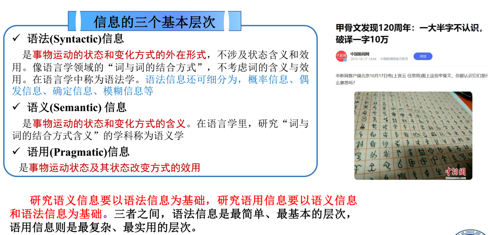
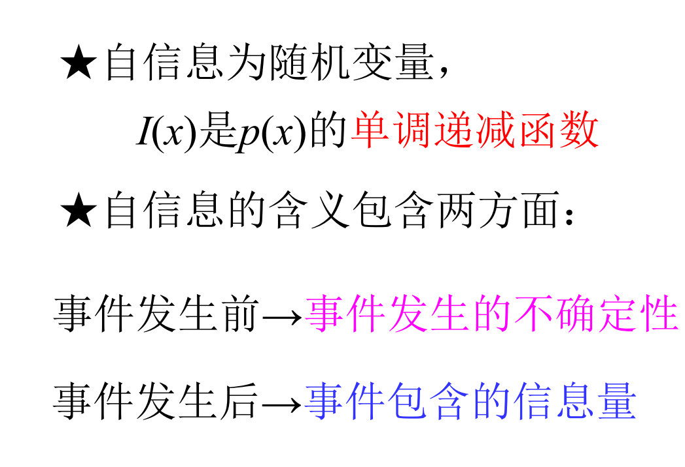
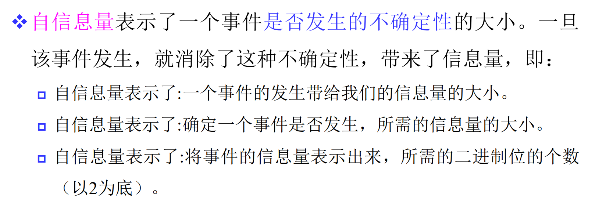
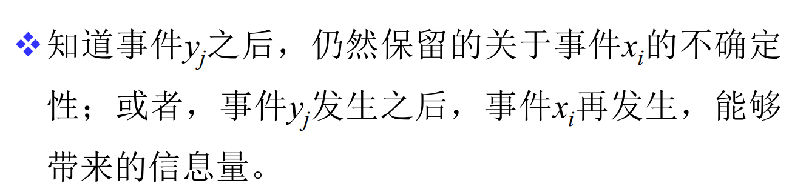

# 离散信息的度量

## 信息量的定义

对包括信源在内的通信系统中所有过程的输出所包含的信息的度量称为**信息的度量**。

**自信息量、信息熵都是对信息的一种度量方式。**

---

## 2.1.自信息与互信息

### 2.1.1. 定义

1. **自信息是信息量的度量**：
   1. 某一事件**发生后该事件包含的信息量**
   2. 事件**发生前该事件发生的不确定性**
2. **互信息反映两个随机事件 x,y 之间的关联程度，类似统计学的互相关系数**

### 2.1.2. 自信息

**自信息的对数的底，常用有三种取值**：

1. **比特**：$log_2x$
2. **奈特**：$log_ex$
3. **迪特/哈特**：$log_{10}x$

### 2.1.3.联合自信息

**定义**

### 2.1.4. 条件自信息

**条件自信息类比于条件概率，即给定事件 $y=b_j$，求在 $y=b_j$ 发生的前提下，事件 $x=a_i$ 的自信息量**

### 2.1.5. 自信息量小结

### 2.1.6. 互信息

**互信息描述的是两个事件集合 X, Y 之间的关联程度，类似与通信原理的互相关函数、概率论的互协方差**

例如事件 X：小明今天带了伞；事件 Y：今天会下雨。互信息描述的就是X，Y直接的关系紧密度。

**x 与 y 之间的互信息等于 x 的自信息 减去 在 y 条件下 x 的自信息**。

$I(x)$表示 x 的不确定性， $I(x | y)$表示在事件 y **发生**的条件下 x 的不确定性，因此 $I(x;y)$**表示的就是 y 发生后 x 不确定性的变化量**。

以集合来看比较好理解， **$I(x)$是全集，而$I(x|y)$只是全集的一部分，那么 $I(x;y)$就是差集，表示的就是总不确定性减去已知 y 条件下的 x 的不确定性**。

### 2.1.7. 互信息的性质

1. **互易性**
   $$
   I(x;y) = I(y;x)
   $$
   
2. **当事件 x、y 统计独立时，互信息量为0**

3. **互信息可正可负**

4. ✅️**任何两事件的互信息量不可能大于其中任一事件的自信息**。类比于通信原理中，互相关函数的积分也不会大于任一相关函数的积分

### 2.1.8. 条件互信息

### 2.1.9. 平均互信息（涉及熵）

**平均互信息** $I(X;Y)$ 度量的是：当我们知道信源 $X$ 发出的信号后，对信宿 $Y$ 的不确定性平均减少了多少（或者说我们获得了多少关于 $Y$ 的信息）
$$
I(X;Y) = \sum_x P(x) I(x;Y) = \sum_{x,y} P(x)P(y|x) \log \frac{P(y|x)}{P(y)}
$$
这是信息论中最常用的指标。它不再只看某一个 $x$，而是看**整个系统**。它表示：**传输一次符号，平均能传递多少信息量**

1. 概率项 $P(x)P(y|x)$

   1. 这一项等于 联合概率 $P(x,y)$

2. 对数项 $\log \frac{P(y|x)}{P(y)}$
   代表了不确定性的减少程度。
   
   直观理解就是：本来我觉得 $y$ 发生的概率是 $P(y)$，现在你告诉我 $x$ 发生了，我觉得 $y$ 发生的概率变成了 $P(y|x)$。这个对数项度量了“收到 $x$ 后将 $y$ 的猜测修正了多少”

3. 整体含义 $I(X;Y)$

   表达式本质上是计算：**后验概率与先验概率之比的对数的统计平均值**

在通信系统中，它的含义可以总结为以下两种等价的说法（非常重要）：

1. **不确定性的减少量**：
   $$
   I(X;Y) = H(Y) - H(Y|X)
   $$

   *   $H(Y)$：收信者在没收到信号前，对信宿的不确定性
   *   $H(Y|X)$：收信者在收到信号 $X$ 后，对信宿仍存留的平均不确定性（即信道噪声带来的干扰）
   *   **含义**：平均互信息 = 原有的不确定性 - 剩下的不确定性 = **获得的信息量**

2. **信道容量的基础**：

   $I(X;Y)$ 衡量了信道输入 $X$ 和输出 $Y$ 之间的相关性

   如果信道是完美的（无噪），$X$ 完全决定 $Y$，互信息最大（等于熵）；如果信道断了（完全噪声），$X$ 和 $Y$ 独立，互信息为 0

平均互信息就是“后验概率”相对于“先验概率”变化的期望值。

例如：

*   **$I(X;Y) > 0$**：说明只要 $X$ 和 $Y$ 不是完全独立的，知道 $X$ 总能帮我们更准确地预测 $Y$
*   **$I(X;Y) = 0$**：说明 $X$ 和 $Y$ 完全独立（比如你扔骰子，$X$ 是点数，$Y$ 是今天下不下雨），知道 $X$ 对猜测 $Y$ 没有任何帮助

---

## 2.2. 信息熵✅️

### 2.2.1.定义

**信息熵就是自信息的均值**

**设离散随机变量 X 所有可能的取值为一个集合 set X，每一个值 $x_i$ 的取值概率为 $p(x_i)$，X 的信息熵描述的就是这个集合的平均值，即平均自信息量**。

### 2.2.2. 联合熵

$$
H(\frac{1}{3},\frac{1}{3},\frac{2}{9},\frac{1}{9}) = \frac{1}{3}log_2(\frac{1}{3})+...
$$

### 2.2.3. 条件熵

$H(\frac{1}{2})$ 是简写，其表示当 $x=0$时，随机变量 Y 的熵：
$$
\begin{align*}
H(Y|x=0) &= -\sum_{y \in {0,1}} p(y|x=0) \log_2 p(y|x=0) \\
&= -\left( p(y=0|x=0)\log_2 p(y=0|x=0) + p(y=1|x=0)\log_2 p(y=1|x=0) \right) \\
&= -\left( \frac{1}{2}\log_2\frac{1}{2} + \frac{1}{2}\log_2\frac{1}{2} \right)
\end{align*}
$$
由于全都是2，所以直接简写。

H(1/3)表示一个二元随机变量在两种结果的概率分别为 $\frac{1}{3}$ 和 $1-\frac{1}{3}=\frac{2}{3}$ 时的熵，一种简写记号。实际上应该写为：$H(2/3,1/3)$
$$
\begin{align*}
    H(\frac{1}{3}) &= -\frac{1}{3}\log_2(\frac{1}{3}) - \frac{2}{3}\log_2(\frac{2}{3}) \\
    &= -\frac{1}{3}(\log_2 1 - \log_2 3) - \frac{2}{3}(\log_2 2 - \log_2 3) \\
    &= -\frac{1}{3}(0 - \log_2 3) - \frac{2}{3}(1 - \log_2 3) \\
    &= \frac{1}{3}\log_2 3 - \frac{2}{3} + \frac{2}{3}\log_2 3 \\
    &= \log_2 3 - \frac{2}{3}
    \end{align*}
$$
结果：
$$
\begin{align*}
H(Y|X) &= p(x=0)H(Y|X=0) + p(x=1)H(Y|X=1) \\
&= \frac{2}{3} H(\frac{1}{2}) + \frac{1}{3} H(\frac{1}{3}) \\
&= \frac{2}{3} \cdot (1) + \frac{1}{3} \cdot (\log_2 3 - \frac{2}{3}) \\
&= \frac{2}{3} + \frac{1}{3}\log_2 3 - \frac{2}{9} \\
&= \frac{6}{9} - \frac{2}{9} + \frac{1}{3}\log_2 3 \\
&= \frac{4}{9} + \frac{1}{3}\log_2 3 \\
&\approx 0.444 + \frac{1}{3}(1.585) \approx 0.444 + 0.528 = 0.972 \ \text{比特/符号}
\end{align*}
$$

### 2.2.4. 相对熵（信息散度）

相对熵也称为 **KL散度**（Kullback-Leibler Divergence, KLD），是信息论中一个核心概念。它衡量的是 **两个概率分布之间的差异**。

简单来说，如果你有一个“真实”的概率分布 P，和一个“近似”的概率分布 Q，相对熵就能告诉你，用 Q 来描述 P 会有多大的信息损失。

对于离散型随机变量，P相对于Q的相对熵定义为：
$$
D(P\|Q) = \sum_{x \in \mathcal{X}} P(x) \log \frac{P(x)}{Q(x)}
$$
这个公式的含义可以理解为：在真实分布 $P$ 下，随机变量 $X$ 的值为 $x$ 时，两个分布的概率比值的对数的期望。
*   如果对数的底为2，单位是比特 (bits)。
*   如果对数的底为 $e$，单位是奈特 (nats)。

对于连续型随机变量，其定义类似，只是将求和替换为积分：
$$
D(p\|q) = \int_{-\infty}^{\infty} p(x) \log \frac{p(x)}{q(x)} dx
$$
其中 $p(x)$ 和 $q(x)$ 分别是两个分布的概率密度函数。

相对熵虽然常被称为  KL距离，但它**并不是一个真正的距离度量**，因为它不满足距离的两个基本性质：

1.  **非对称性**
    一般情况下，$D(P\|Q) \neq D(Q\|P)$。
    
    * $D(P\|Q)$ 衡量用 $Q$ 近似 $P$ 的信息损失。
    
    * $D(Q\|P)$ 衡量用 $P$ 近似 $Q$ 的信息损失。
    
      这两者通常是不同的。举个例子，如果某个事件在 $P$ 中概率不为0，但在 $Q$ 中概率为0，那么 $D(P\|Q)$ 会是无穷大（表示用 $Q$ 来描述 $P$ 是完全错误的）；反之则不一定。
    
2.  **不满足三角不等式**

尽管如此，相对熵确实具有距离的一个重要性质：

**非负性**
$$
D(P\|Q) \ge 0
$$
当且仅当两个分布完全相同时，即 $P(x) = Q(x)$ 对所有 $x$ 成立，相对熵 $D(P\|Q)$ 才为0。这个性质也称为**吉布斯不等式**。

**核心定理：吉布斯不等式**

### 2.2.5 交叉熵

### 2.2.6. 熵不增原理

### 2.2.7.熵的性质

**核心**：

1. **可加性**
2. **离散最大熵定理**
3. **一一对应变换下的不变性**

**扩展性指明：虽然小概率事件的自信息很大，但计算熵时比重很小，可以忽略**。**即可以做截断近似处理**。

**熵的可加性**：
$$
H(XY) = H(X) + H(Y|X) = H(Y) + H(X|Y)
$$
两个随机变量 $(X,Y)$ 的总不确定性，等于第一个随机变量 $X$ 的不确定性，加上在**知道了 $X$ 的取值后**，$Y$ 剩下的不确定性。

> X，Y 都是随机变量， n 维向量

在推导之前，回顾三个关键的熵的定义：

*   **熵**：衡量单个随机变量 $X$ 的不确定性。
    $$
    H(X) = -\sum_{x \in \mathcal{X}} p(x) \log_2 p(x)
    $$

*   **联合熵**：衡量一对随机变量 $(X,Y)$ 的总不确定性。
    $$
    H(X,Y) = -\sum_{x \in \mathcal{X}} \sum_{y \in \mathcal{Y}} p(x,y) \log_2 p(x,y)
    $$

*   **条件熵**：衡量在已知随机变量 $X$ 的情况下，随机变量 $Y$ 的平均不确定性。
    $$
    H(Y|X) = -\sum_{x \in \mathcal{X}} \sum_{y \in \mathcal{Y}} p(x,y) \log_2 p(y|x)
    $$

推导的核心依赖于概率论中的链式法则，即联合概率、边缘概率和条件概率之间的关系：
$$
p(x,y) = p(x) \cdot p(y|x)
$$

由此可引出一个重要法则：**熵的链式法则**
$$
H(X_1X_2X_3...X_N) = H(X_1) + H(X_2|X_1) + ... + H(X_N|X_1X_2...X_{N-1})
$$

**7. 一一对应映射时熵不变**:

这里的“熵”，指的是**随机变量本身的信源熵（即通常所说的信息熵或无条件熵）**，分别对应于映射前的随机变量 $X$ 的熵 $H(X)$ 和映射后的随机变量 $Y$ 的熵 $H(Y)$。

这句话“仅当一一对应映射时熵不变”，表达的数学含义是：**$H(Y) = H(X)$**

**1. 直观理解**

PPT 的语境是讨论“符号映射”过程中的信息损失问题
*   **$H(X)$**：代表原始信号（信源）所包含的平均信息量。
*   **$H(Y)$**：代表经过处理（映射 $Y=f(X)$）后，输出信号所包含的平均信息量

这句话的核心意思是：当把 $X$ 变成 $Y$ 时，**新产生的变量 $Y$ 携带的信息量（$H(Y)$）是否等于原来的 $X$ 携带的信息量（$H(X)$）？**

*   如果是多对一映射（例如把“苹果”和“梨”都标记为“水果”），你就无法反推原来的具体水果了，信息丢失了，所以 $H(Y) < H(X)$
*   如果是**一一对应**映射（例如把“苹果”标记为“A”，“梨”标记为“B”），这只是改了个名字，信息完全保留，所以 $H(Y) = H(X)$

**2. 数学推导**

可以利用熵的公式来严格证明这一点。

已知 $Y$ 是 $X$ 的函数（$Y = f(X)$），根据信息论的基本公式：

$$
H(X, Y) = H(Y) + H(X|Y) = H(X) + H(Y|X)
$$

*   因为 $Y$ 是由 $X$ 确定的（确定性映射），给定 $X$ 后 $Y$ 没有不确定性，所以 **$H(Y|X) = 0$**
*   代入公式得到：**$H(X, Y) = H(X)$**

现在我们要比较 $H(Y)$ 和 $H(X)$，看上面的等式：
$$
H(Y) + H(X|Y) = H(X)
$$
或者写成：
$$
H(Y) = H(X) - H(X|Y)
$$
这里的 **$H(X|Y)$** 代表  “归义噪声”或“模糊度”，即：知道了映射后的结果 $Y$，我们对原始结果 $X$ 还有多少不确定性？

*   **一一对应映射时**：给定 $Y$ 就能唯一反推出 $X$，没有不确定性，所以 **$H(X|Y) = 0$**
    
    结论：**$H(Y) = H(X)$**（熵不变）
*   **非一一对应（多对一）时**：给定 $Y$，对应的 $X$ 有多种可能，不确定性存在，所以 **$H(X|Y) > 0$**
    
    结论：**$H(Y) < H(X)$**（熵减小）
