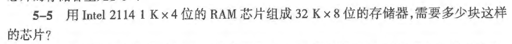
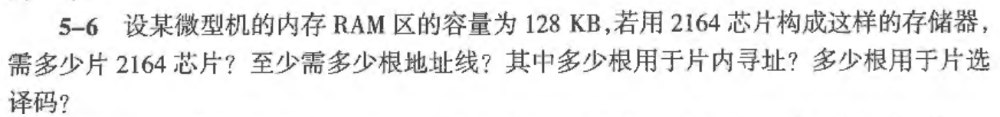

# 第五章 存储器和存储体系

## 5.1 存储器的分类、主要性能指标和结构

### 5.1.1 存储器分类

#### 两大类

1、按制造工艺分类： 

- ​	双极性： 由TTL电路构成，常用作高速存储缓冲器(cache)。器件特点是工作速度快，和CPU工作速度同一级。
- ​         金属氧化物半导体型：也就是用MOS管制作的器件，常用来构造内存(内存条、硬盘)。特点是集成度高、功耗低、价格便宜。

2、**按存取方式分类：**(常用分类，上面那个忽略)

- 随机存取存储器(random access memory,RAM)	
- 只读存储器(read only memory,ROM)

#### RAM分类及介绍

1. RAM 用途： RAM是CPU在运行过程中能随时进行数据的读写的存储器。它存放的数据是暂时性的，例如中间运算结果、用户程序和外设存储交换信息的堆栈，当电源关闭后会全部丢失。人们常说的微机内存容量就是RAM的容量。

2. 分类：----以存储信息的电路原理来分(忽略)

   - 静态RAM(Static RAM，**SRAM**)：
     - 存储结构：MOS晶体管触发器，每个触发器存放一位二进制的0或1。只要不断电就不会丢失存储的信息
     - **常用用途**：制作MCU的高速存储缓冲器（cache）

   - 动态RAM(dynamic RAM，DRAM)：
     - 存储结构：用MOS管栅极和衬底间构成的电容存储二进制信息。由于电容会漏电，因此容易丢失信息，故需要定时刷新DRAM存储的信息
     - 常用用途：由于其集成度高、成本低、功耗少，需要外加刷新电路且运行速度慢，常用于制作MCU的内存储器

#### 只读存储器ROM

1. ROM定义及用途：

   - 定义：写入信息后，在程序运行中**只能读出而不能写入信息的固定存储器**。断电后存储的信息不会丢失和改变。
   - 用途：用于存放固定的程序和数据。例如监控程序、操作系统的BIOS、BASIC解释程序。

2. 分类：

   - **闪存 flash：**主要有两种：NOR flash 和 NAND flash。常用于嵌入式系统中存储数据和程序，类似PC的硬盘。在嵌入式中应用十分广泛

   - 掩膜ROM：由厂家根据用户要求进行编程和使用掩膜工艺制作，一旦制作完成就不能更改！因此只适用存储成熟的程序和应用。

   - PROM(programmable ROM)：可编程ROM。出厂时是空白存储器，可由用户自行编程，但是也只能写入一次，写入后不可更改

   - EPROM

   - EEPROM

     以上除了闪存flash以外对嵌入式而言都不算太重要。

### 5.1.2 主要性能指标

#### 存储容量

- 定义：存储器可以容纳的二进制信息量，以存储器中存储地址寄存器 **MAR** 的编址数与存储字位数的乘积表示
- 计算： 存储容量 = 存储单元数量 X 每个存储单元的位数
- 例子： 

#### 存储速度

- 表示法：用两个时间参数表示
  - 存取时间(access time, **TA**)：从启动一次存储器操作(例如读或者写操作)，到完成该操作所经历的时间
  - 存储周期(memory cycle time, **TMC**)：启动两次独立的存储器操作之间所需的最小时间间隔
  - 通常 TMC 略大于 TA

#### 可靠性

- 衡量方式：平均故障间隔时间(mean time between failures, **MTBF**)。MTBF越长，可靠性越高

#### 性价比

​					**以上指标 存储容量 最重要，要会计算。**

### 5.1.3 存储器结构

#### 总览：

​	存储器由 **地址寄存器、译码驱动电路、存储体、读写驱动电路、数据寄存器、控制逻辑** 组成。不论是 RAM还是ROM。

了解即可，知道是什么东西

#### 存储体

​	基本存储电路是存储器的**基础和核心**，就是用于存储二进制信息的"0"和"1"。多个记忆单元(又称基本存储电路)组成一个存储单元，**一个存储单元一般存一个字节（8 bit）的二进制信息**，存储体是存储单元的集合体。

​	存储体是存储单元的集成，存储单元是记忆单元的集成。（记忆单元就是一个电容，电荷储存到一定值(阈值)后被视为"1"，不然就是"0"，题外话）

​	存储体也称存储矩阵(Memory Array)、存储阵列。记忆单元（Memory cell）只能存 1 bit。

#### 译码驱动电路

- 为了区分存储体中的具体存储单元，需要对单元编号，这个编号就是单元的地址

- 为了对这个单元进行操作，需要完成**寻址**操作，故需要实现**地址译码**，包含译码器 和 驱动器

- 译码器功能：对某一输入的地址码，输出线上有唯一一个高/低电平与之对应

- 以读操作的具体实现为例，说明译码驱动电路怎么工作：

  

#### 地址寄存器 **MAR**

​	MAR 存放 CPU 访问的存储单元的地址，经译码驱动电路后指向地址对应的存储单元。

#### 读写驱动电路

#### 数据寄存器 **MDR**

​	用于暂时存放从存储单元读出的数据，或者CPU、I/O口要写入存储器的数据。

​	暂存目的是协调 CPU 和存储器在读、写速度上的差异，又称MDR为数据存储缓冲器

#### 控制逻辑

​	

### 5.1.4 读写时序

记住三个信号名字：

### 5.1.5 小结

CPU和存储器的交互过程：

**只需熟悉这几幅图即可，重要的是：**

1. **RAM和ROM的定义**
2. **存储器的组成部分 || 存储器的结构 || RAM、ROM有哪几个部分组成**
3. **SRAM、flash是什么**
4. **存储容量的计算**
5. **特别要清楚地址线、数据线、控制线各需要多少根，怎么计算！**

#### 例题：

1. 一、

   

2. 二、

   

3. 三、

   

4. 四、

   

#### 解答

1. RAM和ROM。存储器、地址译码器（译码驱动电路）、控制逻辑、读写驱动电路、数据寄存器（数据缓冲器）

2. 后面

3. 

4. 

   

------

## 5.2 典型存储器芯片及其接口特性

### 要求：

1.   知道常见芯片对应的是什么芯片，它的存储单元是多少(后续可能要使用它去设计存储结构)
2. 了解这些芯片是怎么工作的，为后续存储结构设计的三大方法铺垫。

### 5.2.1 SRAM

#### 典型芯片

​	

​	以6116为例，2K x 8 位意味着 它的存储容量是 2 X 1024 X 8 （bit），要转换成字节 Byte ，则为 2048 Bytes，即 2KB。

### 5.2.2 DRAM

#### DRAM存储体的结构特点  只有一位数据位

#### 典型芯片

​	因特尔 2164A 芯片

​	只要知道它的存储容量是  64K X 1 位 即可

#### DRAM 芯片命名一般规则

通常芯片型号中的数字可以提供其容量信息。

"2164" 这种命名方式，常见于早期的 DRAM 芯片，通常表示：

- 64 表示 64K 个存储单元。
- 1 通常表示每个存储单元的位数是 1 位。
  所以，一片 2164 芯片的容量是 **64K x 1 位**。

​									不一定哦~

### 5.2.3 ROM

#### 典型 ROM芯片

### 5.2.4 flash

#### NOR flash

#### NAND flash

### 5.2.5 双端口存储器

------

## 5.3 主存储器的设计

前言：微机系统所支持的最大内容存量取决于CPU地址总线的位数。例如 8086 CPU地址总线为20位，因此其最大内存容量是 2^20 X 8位，即 1024K X 1024K B = 1 MB

### 5.3.1 存储器结构的确定

​	MCU的主存储器往往分为片**内存储器和片外存储器**

### 5.3.2 片外存储器系统设计 ----重点

#### 设计思路

​	进行片外设计时，首先应该确定整机要扩充的存储器容量，再根据需要选定存储芯片的类型和数量，之后划分RAM、ROM区，画出地址分配图，并根据地址分配图确定译码方法，最后选用合适器件，画出译码电路图。其中存储器空间的划分和地址编码靠地址线实现。

​	----如何设计不管，**重点考信号线怎么连接。**

#### 片外存储器和CPU连接要考虑的问题

1. 信号线的连接

   数据总线、地址总线、控制总线的连接

2. CPU总线的负载能力

3. CPU时序与存储器芯片存取速度的配合问题

   要考虑二者速度是否匹配，不匹配要用数据缓冲器去优化一下。

#### 四类线(data | control | address)的数量确定方法 ----重中之重

假设某个芯片的存储容量为 1024 X 8 位

1. 数据线

   数据线的数量等于每个存储单元的位数，因为每一次读写操作都是针对一个完整的存储单元进行的

   题中所给的每个存储单元的位数是 8 位，

   因此需要 8 条地址线

2. 地址线

   地址线用于选择这 1024 个存储单元中的某一个单元

   如果地址线数量是 n，则可以寻址 2^n 个单元

   因此该芯片需要 10 条地址线。（2^10 = 1024）

3. 控制线

   RAM芯片至少需要3条控制线

   1. 片选线(Chip Select，CS)或片使能线(OE)：1 条，用于使能或禁止整个芯片工作
   2. 读控制线（Output Enable，OE）：1 条，控制 读 使能
   3. 写控制线（Read Enable，RE）：1条，控制 写 使能

4. 电源和地线

   即一条 VCC 和 一条 GND

因此该芯片至少需要 8 + 10 + 3 + 2 = 23条外部引脚（除去电源和地线 21条）。

​	