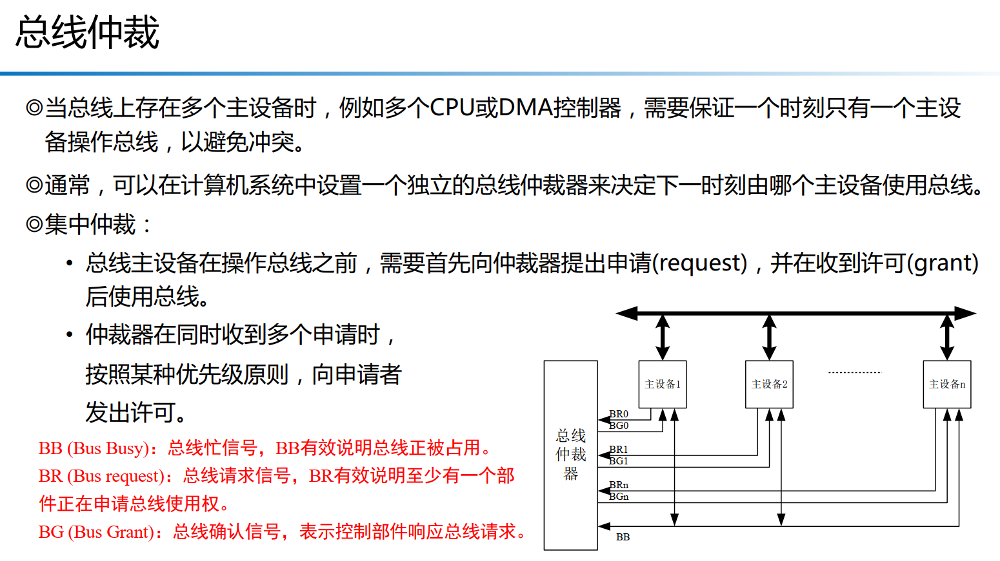

## 第6章 总线技术

### 6.1 总线概述 (Bus Overview)

#### 6.1.1 总线的概念和操作 (Basic Concepts and Operations)

- **什么是总线 (Bus)：**
  总线是计算机系统中用于连接各个功能部件（如 CPU、内存、I/O 设备）并进行信息传输的**一组公共的导线**。它扮演着信息传输“高速公路”的角色。所有连接到总线上的设备都可以通过总线进行数据交换。

- **总线的组成：**
  通常，总线由以下几类线组成：

  1. **数据总线 (Data Bus)：** 用于传输数据信息。其位宽（如 8 位、16 位、32 位、64 位）决定了总线一次能并行传输的数据量。数据总线是双向的。
  2. **地址总线 (Address Bus)：** 用于传输地址信息，指定数据要发送到哪个设备或内存单元，或从哪个设备/内存单元读取。其位宽决定了 CPU 的最大寻址能力。地址总线是单向的（从主设备到从设备）。
  3. **控制总线 (Control Bus)：** 用于传输各种控制信号和状态信号，协调各个设备的工作。例如，读/写信号、中断请求、总线请求/授权、复位信号等。控制总线通常是双向的。

  

- **总线的操作：**
  总线上的信息传输通常涉及**主设备 (Master)** 和**从设备 (Slave)**。

  - **主设备：** 发起总线事务（如读取或写入）的设备。例如 CPU、DMA 控制器。
  - **从设备：** 响应总线事务的设备，被动接收或提供数据。例如内存、I/O 接口。
  - **基本操作：**
    1. **读操作：** 主设备在地址总线上放上要读取的地址，在控制总线上发出读命令，从设备根据地址识别到自己，并将数据通过数据总线发送给主设备。
    2. **写操作：** 主设备在地址总线上放上要写入的地址，在数据总线上放上要写入的数据，在控制总线上发出写命令，从设备根据地址识别到自己，并将数据写入其内部指定位置。

#### 6.1.3 总线的性能指标 (Performance Metrics)

衡量总线性能的关键指标包括：

1. **总线数据宽度 (Bus Width)：** 指**数据总线的位数**。位宽越大，一次传输的数据量越多。

2. **总线时钟频率 (Bus Clock Frequency)：** 也叫时钟周期，是指总线工作的时钟速度。频率越高，单位时间内传输的位越多。

3. **总线带宽 (Bus Bandwidth) / 数据传输率 (Data Transfer Rate)：** 指总线单位时间内能够传输的数据总量，通常以 MB/s (兆字节/秒) 或 GB/s (吉字节/秒) 表示。

   - 计算公式：带宽 = (数据总线宽度 / 8) * 时钟频率 (对于非 DDR 类型的总线，且假设每个周期传输一次数据)。
   - 例如，一个 32 位、100MHz 的总线，理论带宽是 (32/8) * 100MHz = 400 MB/s。

4. **潜伏期 (Latency)：** 指从主设备发起请求到从设备开始响应之间的时间。潜伏期越短越好。

5. **吞吐量 (Throughput)：** 总线在单位时间内的最大的数据传送能力。若总线数据宽度为 w Byte，时钟周期为 T s，则吞吐量最大的可能值为 w/T 字节/秒

   

#### 6.1.4 总线的分类 (Classification)

总线可以根据不同的标准进行分类：

1. **按功能分：**
   - **内部总线 (Internal Bus)：** 连接 CPU 内部寄存器、ALU、控制器等组件。
   - **系统总线 (System Bus)：** 连接 CPU、内存、I/O 接口等主要部件，是计算机的核心总线。
   - **外部总线 (External Bus) / 扩展总线：** 连接计算机与外部设备（如打印机、硬盘、USB 设备）。
2. **按数据传输方式分：**
   - **并行总线 (Parallel Bus)：** 数据位同时在多条并行线上进行传输。优点是速度快（在相同频率下），缺点是引脚多、信号同步困难（尤其在高速长距离传输时）、容易受干扰。
   - **串行总线 (Serial Bus)：** 数据位依次在单条或少数几条线上进行传输。优点是引脚少、抗干扰能力强、适合长距离高速传输（通过高频率弥补并行度的损失），缺点是需要串并转换。

#### 6.1.5 总线的层次结构

### 6.2 总线时序和仲裁 (Bus Timing and Arbitration)

- **总线时序 (Bus Timing)：** 定义了总线上各个信号在时间上的先后关系，以确保数据传输的正确性。主要有时钟同步时序和异步时序。
- **总线仲裁 (Bus Arbitration)：** 当系统中存在多个主设备（如 CPU 和 DMA 控制器）同时请求使用总线时，总线仲裁机制决定哪个主设备获得总线使用权。仲裁方式有集中式和分布式。

#### 6.2.4 PCI 总线 (Peripheral Component Interconnect Bus)

- **概念：** PCI 是一种并行、高性能的局部总线，设计用于连接处理器和高速外设。它于 1992 年推出，在很长一段时间内是 PC 和服务器领域的主流扩展总线。
- **特点：**
  - **并行传输：** 通常有 32 位或 64 位数据宽度。
  - **高带宽：** 支持 33 MHz 或 66 MHz 时钟频率，最高可达 533 MB/s (64位/66MHz)。
  - **即插即用 (Plug and Play)：** 支持设备的自动配置，简化了安装。
  - **总线主控 (Bus Mastering)：** 设备可以直接在总线上传输数据到内存或其他设备，无需 CPU 介入，提高了效率。
  - **桥接 (Bridging)：** 支持通过桥接器连接其他总线（如 ISA）。
- **应用：**
  - 早期 PC 主板上的扩展槽，用于连接显卡、网卡、声卡、SCSI 控制器等。
- **例子：** 台式电脑主板上的白色或米黄色 PCI 插槽。
- **缺点：** 共享总线带宽（所有设备共享带宽），物理尺寸较大，并行信号在高频下同步困难，逐渐被 PCIe 取代。

### 6.3 串行总线 (Serial Bus)

#### 6.3.1 串行总线的概念 (Concept of Serial Bus)

- **概念：** 串行总线通过单条或少数几条信号线，以串行位流的方式传输数据。数据位的传输是连续的、按时间顺序进行的。
- **与并行总线对比：**
  - **优点：**
    - **引脚少：** 大大减少了连接所需的物理引脚数量和线缆数量，降低了成本和复杂性。
    - **抗干扰能力强：** 由于线少，线间串扰少，且通常采用差分信号传输，抗噪声能力强。
    - **频率更高，速度更快：** 尽管是串行，但可以通过非常高的时钟频率和复杂的编码技术实现比并行总线更高的有效数据传输速率。并行总线在高频下，时钟偏差和信号完整性问题难以解决。
    - **适合长距离传输。**
  - **缺点：**
    - 需要进行串行到并行、并行到串行的转换，增加了硬件逻辑的复杂性。
    - 通常有更复杂的协议和时序。
- **应用：** 现代计算机和嵌入式系统中的高速通信基本都转向串行总线，如 USB, PCIe, SATA, DisplayPort 等。

#### 6.3.2 PCIe 总线 (PCI Express Bus)

- **概念：** PCIe 是一种高速串行点对点（point-to-point）的扩展总线，是 PCI 总线的继任者。它基于串行传输，但保留了 PCI 的软件兼容性模型。
- **特点：**
  - **串行差分传输：** 每对差分信号线构成一个“通道 (Lane)”，一个通道支持双向通信。
  - **点对点连接：** 每个设备通过专用通道直接连接到根复合体 (Root Complex) 或其他 PCIe 交换机，不再共享总线带宽。
  - **包交换 (Packet-based)：** 数据以数据包的形式进行传输，每个数据包包含地址、数据、控制信息和错误校验码。
  - **可扩展性：** 可以通过汇聚多个通道 (x1, x2, x4, x8, x16) 来增加带宽，每个通道的带宽随着 PCIe 版本的升级而翻倍。
  - **全双工：** 每个通道都是双向的，可以同时发送和接收数据。
  - **热插拔 (Hot-plugging)：** 某些 PCIe 设备支持在系统运行时插入或移除。
- **版本和带宽（每通道，单向）：**
  - PCIe 1.0 (2.5 GT/s)：250 MB/s
  - PCIe 2.0 (5 GT/s)：500 MB/s
  - PCIe 3.0 (8 GT/s)：1 GB/s
  - PCIe 4.0 (16 GT/s)：2 GB/s
  - PCIe 5.0 (32 GT/s)：4 GB/s
  - PCIe 6.0 (64 GT/s)：8 GB/s (PAM4编码)
- **应用：**
  - 现代 PC 主板上的显卡插槽 (PCIe x16)。
  - 高速固态硬盘 (NVMe SSD) 接口 (PCIe x4)。
  - 高速网卡、专业声卡、采集卡等扩展卡。
  - 服务器和数据中心内部的高速互联。
- **例子：** 电脑主板上长条形的 PCIe 插槽。

### 6.5 常用扩展总线 (Common Expansion Buses)

#### 6.5.2 SPI/I²C 总线 (SPI/I2C Bus)

- **SPI (Serial Peripheral Interface，串行外设接口)**
  - **概念：** 一种高速、全双工、同步的串行通信总线协议，通常用于短距离、芯片与芯片之间的通信。
  - **特点：**
    - **全双工：** 可以同时发送和接收数据。
    - **同步：** 通过时钟信号进行同步。
    - **主从架构：** 只有一个主设备，可以连接一个或多个从设备。
    - **四线制 (常用)：**
      - **SCLK (Serial Clock)：** 主设备提供给从设备的串行时钟。
      - **MOSI (Master Output, Slave Input)：** 主设备输出数据，从设备输入数据。
      - **MISO (Master Input, Slave Output)：** 主设备输入数据，从设备输出数据。
      - **CS/SS (Chip Select/Slave Select)：** 主设备用来选择从设备，低电平有效。
    - **速度快：** 相对 I2C 速度快，协议简单。
  - **应用：**
    - 连接 Flash 存储器 (如 SPI Flash)。
    - 连接 LCD 显示屏或 OLED 屏幕控制器。
    - 连接各种传感器（如温度传感器、加速度计、陀螺仪）。
    - 与 ADC/DAC 进行数据传输。
  - **例子：** 将一个外部 SPI Flash 芯片连接到微控制器（如 STM32）进行数据存储。
- **I²C (Inter-Integrated Circuit，集成电路间总线)**
  - **概念：** 一种低速、半双工、同步的串行通信总线协议，最初由 Philips (现在 NXP) 开发，用于板级内部的芯片间通信。
  - **特点：**
    - **半双工：** 同一时间只能发送或接收数据。
    - **同步：** 通过时钟信号进行同步。
    - **多主多从：** 允许多个主设备和多个从设备连接在同一总线上，通过唯一的 7 位或 10 位地址进行寻址。
    - **两线制：**
      - **SCL (Serial Clock Line)：** 串行时钟线。
      - **SDA (Serial Data Line)：** 串行数据线。
    - **开漏输出：** 两条线都必须通过外部上拉电阻连接到 VDD，以实现线与逻辑。
    - **速度相对慢：** 常用模式有标准模式 (100 kbit/s)、快速模式 (400 kbit/s)、高速模式 (3.4 Mbit/s)。
  - **应用：**
    - 连接 EEPROM 存储器。
    - 连接实时时钟 (RTC)。
    - 连接各种传感器（如温湿度传感器、气压传感器）。
    - 连接 OLED 显示屏、IO 扩展器。
    - 电源管理芯片 (PMIC) 的控制。
  - **例子：** 微控制器通过 I2C 读取一个 BME280 温湿度气压传感器的值。

#### 6.5.3 USB (Universal Serial Bus，通用串行总线)

- **概念：** 一种外部串行总线标准，设计用于替代多种慢速和中速的并行端口和串行端口，以简化计算机与外部设备的连接。
- **特点：**
  - **串行传输：** 仅使用两根数据线（D+和 D-）进行差分信号传输。
  - **主从架构：** 始终有一个主机 (Host)，设备 (Device) 连接到主机或 USB Hub。
  - **热插拔 (Hot-plugging)：** 允许在系统运行时连接或断开设备。
  - **电源供电：** USB 总线除了传输数据，还可以为低功耗设备提供电源。
  - **多种传输速率：** 支持低速 (1.5 Mbps)、全速 (12 Mbps)、高速 (480 Mbps)、超高速 (5 Gbps, 10 Gbps, 20 Gbps)、超高速+ (40 Gbps)。
  - **即插即用，自动识别设备类型。**
- **版本和速度：**
  - USB 1.x：Full Speed (12 Mbps) / Low Speed (1.5 Mbps)
  - USB 2.0 (High Speed)：480 Mbps
  - USB 3.0 (SuperSpeed)：5 Gbps
  - USB 3.1 (SuperSpeed+)：10 Gbps
  - USB 3.2 (SuperSpeed+ double lane)：20 Gbps
  - USB4：40 Gbps (基于 Thunderbolt 3)
- **应用：**
  - 连接键盘、鼠标、U 盘、外部硬盘。
  - 连接打印机、扫描仪、摄像头。
  - 手机与电脑连接进行数据传输和充电。
  - 各种嵌入式设备、开发板的调试和通信接口。
  - 音频设备、视频会议设备。
- **例子：** 电脑上的 USB 端口，用于连接 U 盘。

### 6.6 ARM 总线 (ARM Bus)

ARM 公司本身不制造芯片，而是设计处理器内核和一套片上总线架构，并将其授权给半导体公司。这套总线架构被称为 **AMBA (Advanced Microcontroller Bus Architecture)**。

#### 6.6.1 SoC 总线 (System on a Chip Bus)

- **概念：** SoC (System on a Chip) 是一种将整个电子系统功能集成到单个集成电路芯片上的技术。**SoC 总线**就是指在这个单一芯片内部，用于连接处理器核心、各种片上外设（如存储器控制器、DMA、GPIO、UART、SPI、I2C 等）以及其他功能模块（如图形处理器、网络接口）的互联总线系统。
- **特点：**
  - **高度集成：** 所有关键功能模块都在同一芯片上。
  - **层次化结构：** 通常由多级总线组成，以满足不同模块对带宽、延迟和功耗的不同需求。
  - **优化性能：** 针对片上通信进行优化，减少外部引脚，提高系统整体性能。
  - **专用性：** SoC 的总线系统是为特定应用场景而设计和优化的。
- **应用：** 智能手机、平板电脑、智能电视、物联网设备、汽车电子等所有需要高度集成和复杂功能的领域。
- **例子：** STM32F407 芯片内部的互联结构就是一种 SoC 总线系统，连接 Cortex-M4 核、Flash、SRAM、GPIO、USART、SPI、ADC 等所有模块。

#### 6.6.2 AMBA (Advanced Microcontroller Bus Architecture)

- **概念：** AMBA 是 ARM 公司制定的一套开放的片上总线标准，用于规范和连接 SoC 内部的各种功能模块。它提供了一套通用的接口协议，使得不同厂商开发的 IP 核（Intellectual Property Core）可以方便地集成到同一个 SoC 中。
- **目的：** 促进 IP 核的重用、加速 SoC 开发、确保不同模块间的兼容性。
- **主要协议 (从旧到新，从简单到复杂)：**
  - **APB (Advanced Peripheral Bus)：** 用于连接低带宽、低速的外设。
  - **AHB (Advanced High-performance Bus)：** 用于连接高性能、高带宽的模块。
  - **AXI (Advanced eXtensible Interface)：** 用于连接高性能、复杂的系统。
  - **ACE (AMBA 4 ACE)：** 在 AXI 基础上增加了缓存一致性扩展，用于多核处理器系统。
  - **CHI (Coherent Hub Interface)：** AMBA 5，为下一代高性能、可扩展的片上系统提供缓存一致性互联。

#### 6.6.3 AHB (ASB)/APB (Advanced High-performance Bus / Advanced Peripheral Bus)

- **AHB (Advanced High-performance Bus)**
  - **概念：** AMBA 规范中用于连接高性能模块的总线协议。
  - **特点：**
    - **高性能：** 支持流水线操作、分段事务（地址和数据可以分离）、突发传输。
    - **多主设备：** 允许多个主设备（如 CPU、DMA 控制器）共享总线，并通过仲裁机制访问。
    - **支持宽数据路径：** 32 位、64 位或 128 位数据宽度。
    - **用于高速模块：** 连接 CPU、DMA 控制器、高速存储器（如 SRAM、外部存储器控制器）、高速外设。
  - **应用：** 在微控制器中，CPU 核心、DMA 控制器通常通过 AHB 连接到高速 Flash、SRAM 和外部存储器控制器。
  - **ASB (AMBA System Bus)：** 是 AHB 的前身，功能类似但相对简单。现在主要使用 AHB。
- **APB (Advanced Peripheral Bus)**
  - **概念：** AMBA 规范中用于连接低带宽、低速外设的总线协议。
  - **特点：**
    - **低功耗：** 设计简单，功耗低。
    - **简单接口：** 非流水线操作，每个传输至少需要两个时钟周期（SETUP 和 ENABLE），接口信号线较少。
    - **单主设备：** 通常只有 APB 桥作为主设备，管理对所有 APB 从设备的访问。
    - **用于低速模块：** 连接 GPIO、UART、SPI、I2C、定时器、看门狗等速度不高的外设的控制寄存器和数据寄存器。
  - **应用：** MCU 内部大多数通用外设的寄存器都挂载在 APB 总线上。
  - **AHB-APB 桥：** AHB 和 APB 之间通过一个 AHB-APB 桥（或 APB 桥）进行连接。AHB 桥将 AHB 总线的高速事务转换为 APB 兼容的低速事务，从而允许 APB 设备连接到高性能的 AHB 系统。
- **例子 (STM32)：**
  - STM32F407 的 Cortex-M4 核、Flash 控制器、SRAM、DMA 控制器等高性能模块连接到 **AHB 总线**。
  - GPIO、UART、定时器、ADC、SPI、I2C 等外设的寄存器则通过 **APB 总线** 连接，而 APB 总线又通过 AHB-APB 桥连接到 AHB 总线。

#### 6.6.4 AXI (Advanced eXtensible Interface)

- **概念：** AXI 是 AMBA 3.0 和 AMBA 4.0 中引入的高性能总线协议，旨在满足更复杂、更高带宽的 SoC 设计需求。它是 AHB 的高级演进。
- **特点：**
  - **高性能和高带宽：** 支持多达 256 位的宽数据路径。
  - **独立读写通道：** 读写操作在不同的通道上进行，可以并行。
  - **乱序传输 (Out-of-Order Transfer)：** 允许事务以与发出顺序不同的顺序完成，提高总线利用率。
  - **突发传输 (Burst Transfer)：** 高效传输连续数据块。
  - **支持多个未完成事务：** 主设备可以在等待一个事务完成的同时发起另一个事务。
  - **更复杂的握手和事务协议。**
- **应用：**
  - 高性能 ARM Cortex-A 处理器（如智能手机、服务器 CPU）与内存控制器、L3 缓存、多核互联。
  - **图形处理器 (GPU)。**
  - 高速 DMA 控制器。
  - 其他需要极高带宽和低延迟的复杂 IP 核。
- **例子：** 智能手机 SoC 中，CPU 与 RAM 之间、GPU 与 RAM 之间通常通过 AXI 互联。

#### 6.6.5 ACE/CHI (AMBA 4 ACE / AMBA 5 CHI)

- **ACE (AMBA 4 AXI Coherency Extensions)**
  - **概念：** 是 AXI 协议的扩展，增加了对**缓存一致性 (Cache Coherency)** 的支持。
  - **特点：** 允许在多核处理器系统中，不同核心的私有缓存以及其他总线主设备（如 DMA）能够保持对共享内存数据的一致性视图，避免数据冲突。
  - **应用：** 多核 Cortex-A 处理器，如在智能手机和服务器中，CPU 核心之间需要通过 ACE 协议来确保缓存数据的一致性。
- **CHI (AMBA 5 Coherent Hub Interface)**
  - **概念：** 是 AMBA 的最新一代一致性总线协议，旨在为下一代高性能、可扩展的片上系统提供更先进的缓存一致性互联。它不再是 AXI 的扩展，而是一个全新的独立协议。
  - **特点：** 提供了更高的性能、更低的延迟、更强的可扩展性和更灵活的拓扑结构，以及更精细的功耗管理。
  - **应用：** 面向最新的高性能多核处理器、AI 加速器、SoC 内部网络，在数据中心、高性能计算和高端移动设备中发挥作用。

------
