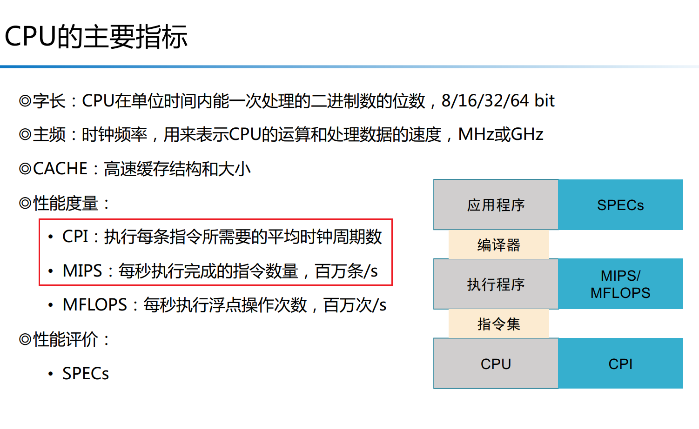
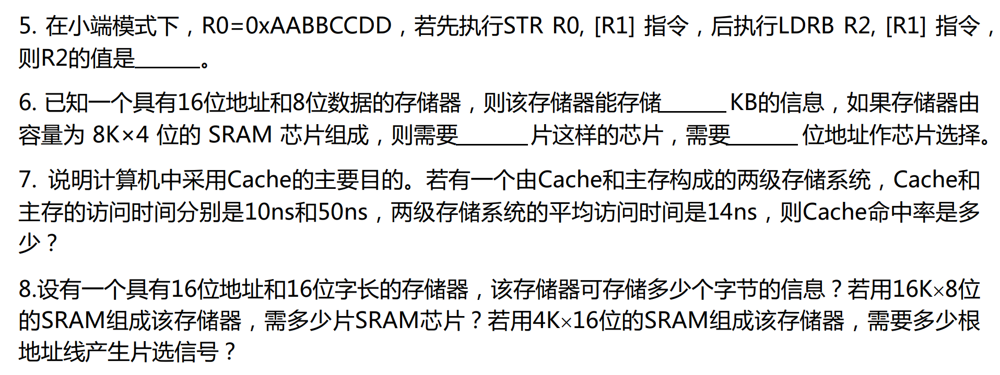
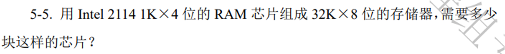
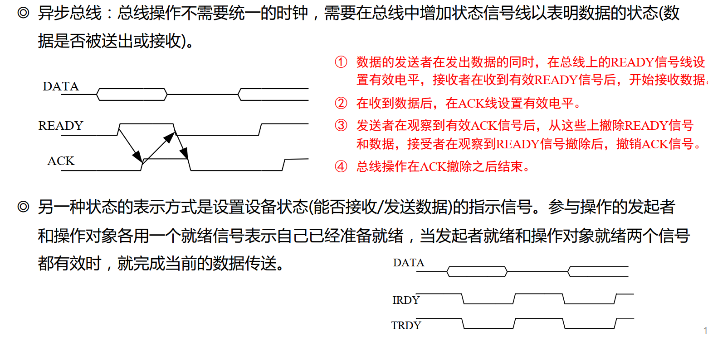
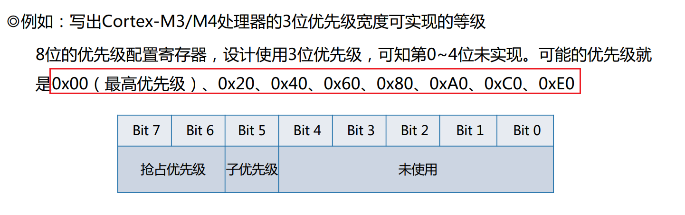
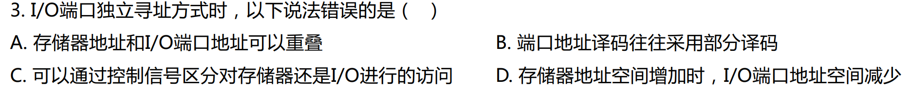
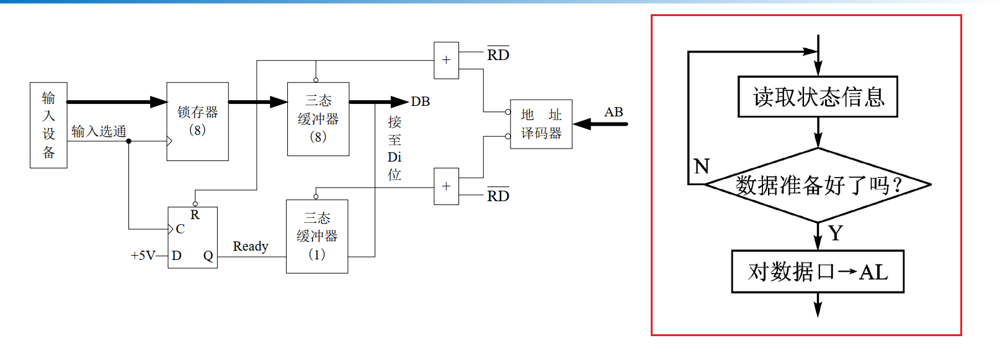
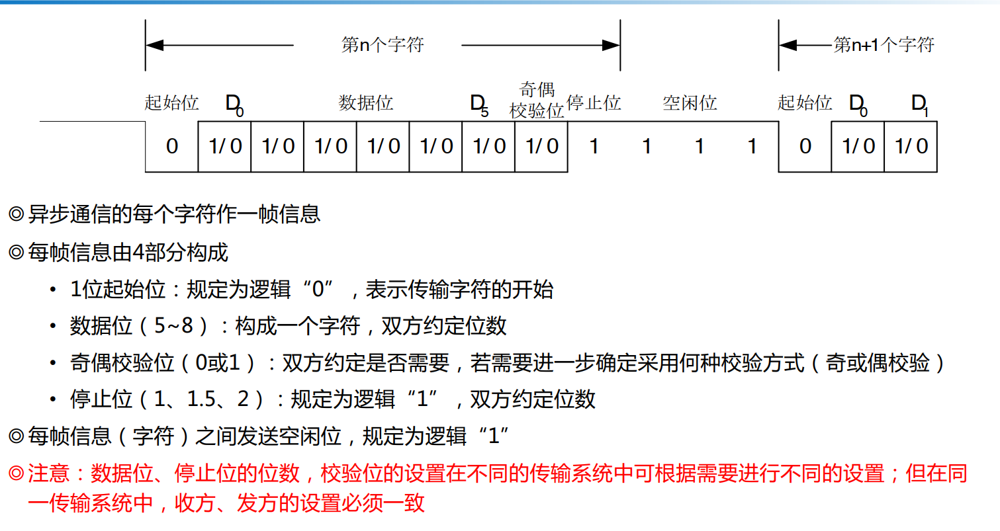

## 第一章课后习题

### 课堂练习

#### 1、微型计算机结构

计算机是按照 **“存储程序控制”** 的原理工作的。MCU的基本硬件由 **运算器、存储器、控制器、寄存器以及I/O输入输出设备**构成。


#### 2、微机系统总线

微机系统总线包括 **数据总线、地址总线、控制总线**（读、写操作） 。

#### 3、微机系统的主要部件

硬件：**CPU 、系统总线、I/O接口、内存（ROM和RAM）**、输入输出设备

软件：系统软件和应用软件


#### 4、进制换算

十六进制数 C6 写成二进制是 1100 0110 ，如果是无符号是，则大小是 198，如果是补码表示的符号数，大小是 -58.

计算：补码生成过程：符号位不变，取反+1。==> 逆推：1100 0110 => 1100 0101 => 0011 1010 = 58，因为是负数，故为 -58.

#### 5、进制换算

把 240.375 换成 八进制数和十六进制数分别为 **360.3 Q** 和 **F0.6 H**

Q：八进制  H：十六进制    D：十进制    B：二进制


#### 6、补码表示范围

采用2的补码形式表示的 4 位二进制整数的范围是 -8 到 7

**最小负数 (绝对值最大)：**

- 符号位为 1。
- **在2的补码中，表示负数时，1000...0 (最高位为1，其余为0) 表示最小的负数。**----溢出问题
- 对于 4 位，即 1000 (二进制)


#### 7、补码运算可能会产生溢出

例如

127 + 1 = 0111 1111 + 0000 0001 = 1000 0000 这是负数还是正数？=>符号位溢出

-128 - 1 = 1000 0000 + 1111 1111 = (1)0111 1111 = 127？溢出

#### 8、符号位标志 C  N(S)  V(O)  Z

判断**无符号数**加减运算是否超出表示范围应该看 **CF** 标志；判断**符号数**加减运算结果是否超出表示范围应看 **OF 和 SF**

- **对于无符号数加法：** 如果最高位产生了进位 (carry-out)，则结果超出了无符号数的表示范围，此时 CF = 1。
  - 例如 (8位)：11111111 (255) + 00000001 (1) = (1)00000000 (0, 真值为256)。CF = 1，表示溢出。
- **对于无符号数减法 (A - B)：** 如果 A < B，即需要向最高位借位 (borrow)，则结果超出了无符号数的表示范围 (通常表现为“环绕”到一个大的正数)，此时 CF = 1 。
  - 例如 (8位)：00000001 (1) - 00000010 (2) = 11111111 (255, 真值为-1)。CF = 1，表示借位/下溢。


#### 9、标志位判断

计算

```
  1000 1011 0100 0101
```


```
+ 1011 0010 1001 0110
```


的结果，并写出四个标志位的值：

**res = 0011 1101 1101 1011      SF = 0，ZF = 0，CF = 1，OF = 1**

### 第一章习题

#### 微型计算机的主要组成部分及其基本功能

1. CPU：

   - ALU 运算单元（运算器）
   - 寄存器：
     - PC寄存器
     - 标志位寄存器
   - 控制器
2. 存储器：

   - 运存 RAM
     - SRAM 静态运存----常用作 CPU内部的高速缓存 cache
     - DRAM 动态随机存储器，常用作电脑中的内存条
   - 内存 ROM
     - flash 闪存
3. I/O输入输出接口：

   - 串行通信

     以比特流的形式，逐位在单条信号线上传输

    - 通信方式
      - 异步通信
      - 同步通信
      
       - 通信方向
         - 单工
         - 半双工
         - 全双工
      
       - 常见的串行通信协议
         1. SPI：同步、全双工，主从模式
         2. I2C：同步、半双工，多主多从
         3. CAN：异步、差分信号，面向message
         4. USB：主从结构，差分信号，支持多种传输速率和类型。

      - 并行通信

        - 握手信号

4. 总线：

   1. 地址总线（Address Bus）：传递地址信息的总线。地址总线的位数决定了CPU可以直接寻址的内存空间大小
   2. 数据总线（Data Bus）：传递数据信息的总线
   3. 控制总线（Control Bus）：传送控制信号的一组总线
      - PC XT
      - PCI
      - PCIe
      - SPI
      - I2C
      - USB
      - AHB
      - SoC
      - APB
      - AXI

#### CPU执行指令的工作过程 ---流水线指令

1. 取指令
2. （译码指令）
3. 执行指令
4. 重复以上步骤

#### 指令流水线定义，多级流水线的优点

1. 指令流水线定义：各个MCU部件并行工作，多条指令的不同执行阶段可以并行执行。
2. 优点：每一时刻都有多条指令被执行，减少指令执行的平均时间
3. 三级流水线：取指令、译码指令、执行指令三个阶段同时进行，即在执行一条指令的同时对下一条指令进行译码，并将第三条指令从指令寄存器 IR 中取出。

#### 微处理器的地址总线为20位，它的最大寻址空间是多少

即2^20 = 1024 bit * 1024 bit = 1 Mb。

#### 微处理器、微控制器、微型计算机、微型计算机系统之间的关系

1. **微处理器CPU**（**Microprocessor, MPU / CPU**），内部结构是算术逻辑单元ALU、寄存器和控制器，只负责运行指令和计算，不负责存储。
2. **微型计算机**是一台小型计算机，内部结构是 微处理器CPU、存储器、三类总线和I/O输入输出接口，是一个完整的计算机结构。
3. **微型计算机系统**是在微型计算机的基础上加上软件结构，包括系统软件和应用软件，是一台完整的个人电脑。
4. 微控制器（MCU）：**微控制器 (MCU)** 可以被理解为将这张图中的“微型计算机 (主机)”的很大一部分（甚至全部核心功能，包括微处理器CPU、存储器RAM/ROM、以及常见的I/O接口，甚至部分总线结构）高度集成到了**一颗单一的芯片上**。因此，**MCU 常常被称为“片上系统 (SoC)”或“单片机”**，它本身就是一个**非常紧凑的微型计算机**，能够独立运行，不需要太多的外部元件。


#### RISC处理器和CISC处理器的特点是

- RISC处理器：体现RISC (Reduced Instruction Set Computer)，精简指令集计算机主要特点，简化指令实现的硬件设计，复杂指令由简单指令合成。
  - 指令集规模精简
  - 具有大量通用寄存器
  - **执行周期段，CPI低**
  - **不支持对内存进行直接操作，需要借助寄存器来操作内存**
- CISC处理器：体现CISC(Complex Instruction Set Computer)，即复杂指令集计算机主要特点，偏重由硬件执行指令，不断增强指令集的复杂度。
  - 指令集规模庞大
  - **支持直接内存操作**
  - 硬件复杂度很高
  - **执行周期长，CPI大**

#### 什么是嵌入式系统？嵌入式系统与通用微机系统在软硬件上有何不同

1. 嵌入式系统定义：嵌入式系统是通过设计可以完成复杂功能的硬件和软件，并使其紧密地耦合在一起地计算机系统。这些系统本身可以是另一个大系统的子系统，即**嵌入式**术语地由来。
2. 不同：
   1. 通用计算机的软件和硬件相对独立，嵌入式系统的软件和硬件紧密绑定


#### 进制转换

将下面十进制数转换成 二进制、O、H。

1. 128 = 1000 0000 B = 200 O = 80 H
2. 65535 = 2^16 - 1 = 1111 1111 1111 1111  B =  17 7777 O = FFFF H
3. 1024 = 2^10 =  0100 0000 0000 B = 2000 O = 400 H

将下面的二进制数转为十进制、十六进制

1. 1011.1010 B = 11.625 D = B.A H

   
2. 111 1101.11 B = 125.75 D = 7D.C H

#### 求原码、反码、补码

设字长 8 位

1. 15

   - 原码： 0000 1111
   - 反码： 0000 1111
   - 补码： 0000 1111

   **对于正数，其原码、反码和补码是完全一样的。**

   只有负数才需要通过取反和加 1 来得到反码和补码。
2. -17

   - 原码： 1001 0001
   - 反码： 1110 1110
   - 补码： 1110 1111

## 第二章课后习题

### 课堂练习

#### CPU的 **程序计数器PC** 指向下一条要执行的指令的地址。


#### Cortex-M3/4的指令流水线级数是 三级

Cortex-M3/4的指令流水线级数是 三级 ：**取指令、译码指令、执行指令**

#### Cortex-M4的三个特殊功能寄存器

1. **程序状态寄存器 PSR**
2. 中断屏蔽寄存器
3. 控制寄存器


#### 冯诺伊曼计算机架构组成

1. 运算器
2. 存储器
3. 控制器
4. 输入输出设备

#### 运算器的逻辑部件

1. 算术逻辑单元 ALU：进行各种算术运算和逻辑运算
2. 累加器
3. 通用寄存器组
4. 程序计数器PC
5. 堆栈指针SP
6. 标志寄存器FR
7. 指令译码器


#### 哈佛架构的理念

不同冯诺依曼架构，哈佛架构将指令和数据存储分开，分别用独立总线相连接到处理器。----即**程序存储空间和数据存储空间分离**


#### CPU的主要指标



#### 决定计算机精度的主要技术指标是计算机的字长

- **计算机的字长 (Word Length) 是什么？**

  ```
  计算机的字长是指 CPU 一次能够并行处理的数据的位数。它通常反映了 CPU 寄存器的大小、数据总线的宽度以及 ALU (算术逻辑单元) 的处理位数。常见的字长有 8 位、16 位、32 位、64 位等。
  ```

### 第二章习题

#### ARM指令集Thumb指令集分别是32、16位的

#### 大端、小端格式存储

1. 一个 32 位 字0x12345678，---- 即 4字节

   - 若采用大端方式存储，则在内存中的排列是：12 34 56 78
   - 若采用小端方式存储，则为： 78 56 34 12
2. ARM 存储字数据有两种方式，即大端格式和小端格式，

   如果有一个 32 位 字 `0x12345678` 存放的起始地址为 `0x0004 0000`，

   在两种格式下分别如何存放？计算机通常情况默认为什么格式？

   - 起始地址为 0x0004 0000。由于是 32 位字（4 字节），它将占用 0x0004 0000、0x0004 0001、0x0004 0002、0x0004 0003 这四个内存地址。
   - **在大端格式下 (Big-Endian)：**

     - 最高有效字节 0x12 存储在最低地址 0x0004 0000。
     - 次高有效字节 0x34 存储在 0x0004 0001。
     - 次低有效字节 0x56 存储在 0x0004 0002。
     - 最低有效字节 0x78 存储在最高地址 0x0004 0003。
   - **在小端格式下 (Little-Endian)：**
   - **Cortex-M 系列处理器（包括 Cortex-M4）通常默认工作在小端模式 (Little-Endian)**。---- 满向下生长栈：

**大端格式与小端格式：**

- **大端格式（Big-Endian**）：
  - 指数据的**高位字节 (Most Significant Byte, MSB)** 存放在内存的**低地址**处
  - 数据的**低位字节 (Least Significant Byte, LSB)** 存放在内存的**高地址**处。
  - 简单记就是“高位在前，低位在后”。
- **小端格式 (Little-Endian)**：
  - 指数据的**低位字节 (Least Significant Byte, LSB)** 存放在内存的**低地址**处。
  - 数据的**高位字节 (Most Significant Byte, MSB)** 存放在内存的**高地址**处。
  - 可以记作“**低位在前，高位在后**” (相对于内存地址的增长方向)。

#### 字（word）与字节（byte）区别

**1. 字节 (Byte)：**

- **定义：** 字节是计算机存储和处理信息的**基本单位**。
- **大小：** 一个字节由 **8 位 (bit)** 组成。
- **标准性：** 字节的大小在计算机领域是**普遍标准**的，无论什么处理器架构，1 个字节都是 8 位。
- **表示范围：** 1 个字节可以表示 2^8 = 256 种不同的值（例如 0-255，或 -128 到 127）。

**2. 字 (Word)：**

- **定义：** “字”是计算机在一次操作中（例如，从内存中读取或写入，或者在 ALU 中处理）能够处理的**自然数据单位**。它通常是 CPU 寄存器的大小、数据总线的宽度，或者是 **CPU 一次性能够处理的数据位数**。
- **大小：** 字的大小是**不固定**的，它取决于具体的**处理器架构**。

  - 在 32 位处理器（如 ARM Cortex-M4，Intel Core i7 的 32 位模式）中，一个字通常是 32 位（4 字节）。
  - 在 64 位处理器（如现代桌面 PC 的 Intel/AMD CPU，ARM Cortex-A 系列的 64 位模式）中，一个字通常是 64 位（8 字节）。
  - 例子：一个 （32 位） 字 0x12345678

    **这里的“32 位字”明确指出了这个“字”的大小是 32 位**。由于 1 字节 = 8 位，所以 32 位 = 4 字节。因此，在这个特定的语境下，“一个 32 位字”就等于“4 字节”。

#### Cortex-M处理器采用的架构是ARMv7

#### ARM微处理器支持的数据类型和对齐要求

ARM 微处理器（特别是 Cortex-M 系列，以及经典的 32 位 ARM 架构）在内存访问和数据处理方面，通常支持以下三种基本数据类型：

1. **字节 (Byte)**
2. **半字 (Half-word)**
3. **字 (Word)**

其位数和对齐要求如下：

- **字节 (Byte):** 8 位
- **半字 (Half-word):** 16 位 ----2字节
- **字 (Word):** 32 位----4字节

#### Cortex-M的复位流程

复位异常的优先级最高，因此在任何情况下，只要进入该状态系统无条件地将 PC 指向**复位向量** 处，以执行系统第一条指令。

- 第一个字表示**主栈指针的初始值**


- 第二个字表示复位处理起始地址的**复位向量**处理器读完这两个字后，会将其赋值给MSP和PC，即**PC无条件指向复位向量**

#### ARM7和Cortex-M4采用的嵌入式体系结构

嵌入式体系结构：

- 冯诺依曼结构
- 哈佛结构

ARM7和Cortex-M4采用的都是哈佛结构：数据存储空间和指令存储空间使用独立的总线连接到处理器。

#### ARM寄存器的种类

经典 ARM 微处理器在物理上共有 37 个 32 位寄存器，其中 31 个为 通用寄存器，6 个为 状态寄存器。

- 通用寄存器用于保存数据和地址
- 状态寄存器用来标识CPU的工作状态和程序的运行状态

1. 31个寄存器：
   1. R0 到 R7 是通用寄存器
   2. R8 到 R12 也是通用寄存器，但是在 FIQ 模式下有独立的影子寄存器（即 R8_fiq - R12_fiq）。所以在物理上，R8-R12 共有 5 + 5 = 10 个寄存器。
   3. R13是**堆栈指针SP**，在每种特权模式下都有独立的影子寄存器（FIQ, IRQ, Supervisor, Abort, Undefined）。所以在物理上，R13 共有 1 (用户模式) + 5 (特权模式) = 6 个寄存器。
   4. R14是**链接寄存器LR**，与 R13 类似，在每种特权模式下都有独立的影子寄存器。所以在物理上，R14 共有 1 (用户模式) + 5 (特权模式) = 6 个寄存器。
   5. R15是**程序计数器PC**
2. 6个状态寄存器：**程序状态寄存器 (PSR) 的所有物理副本**
   1. CPSR (当前程序状态寄存器)：1 个，不分体，但其值会根据模式切换而改变。
   2. SPSR (保存的程序状态寄存器)：每个特权模式都有一个独立的 SPSR，用于保存进入该模式前的 CPSR 值。共有 5 个 SPSR 寄存器（SPSR_fiq, SPSR_irq, SPSR_svc, SPSR_abt, SPSR_und）。

总之，**他就是有 16个 32 位的通用寄存器（R1到R15）和几个特殊寄存器（程序状态寄存器、中断屏蔽寄存器、控制寄存器）**

#### Cortex-M4处理器中的特殊功能寄存器分类

1. 程序状态寄存器（PSR）----表示处理器的状态
   - **应用状态寄存器PSR（APSR）：保存当前指令运算结果的状态（N、V、C、Z 标志位）**
   - 中断状态寄存器（IPSR）：保存当前中断向量号
   - 执行状态寄存器（EPSR）
2. 中断屏蔽寄存器----用于控制异常或中断的使能和禁止
   1. PRIMASK
   2. FAULTMASK
   3. BASEPRI
3. 控制寄存器（CONTROL）----定义线程模式的访问级别和选择堆栈指针


#### Cortex-M4嵌套向量中断控制器NVIC作用

在Cortex-M4微处理器中，**NVIC** 负责处理异常和中断配置、优先级以及中断屏蔽。

#### Cortex-M4向量表的作用

Cortex-M4微处理器向量表中的每一个元素代表 **一个异常类型处理程序**  的起始地址，**每个地址占据一个字，即 4 个字节**。

#### Cortex-M4的寻址位数和可寻址空间

Cortex-M4 MPU 支持多种存储器特性，**以 32 位寻址**，可寻址存储空间为 **4GB**

#### ARM7采用三级流水线模式：取、译码、执行

#### ARM的I/O组织采用的编址方式

- ARM 处理器（包括 Cortex-M 系列）普遍采用 **内存映射 I/O (Memory-Mapped I/O)** 的组织方式。这意味着 I/O 设备的寄存器被分配到 CPU 的主内存地址空间中的特定地址。CPU 通过标准的加载/存储指令（如 LDR, STR）来访问这些 I/O 寄存器，就像访问普通的内存单元一样。
- **独立编址 (Isolated I/O / Port-Mapped I/O)** 则是将 I/O 地址空间与内存地址空间完全分开，需要使用专门的 I/O 指令（如 x86 体系结构中的 IN 和 OUT 指令）来访问 I/O 端口。
- **结论：** ARM 采用的是内存映射 I/O，而不是独立编址。

#### Cortex-M4微处理器的工作状态

- 第一种为**调试状态**：
  - 由于某种原因使微处理器被暂停后，就进入调试状态并停止指令的执行。原因为调试事件或触发断点等。
- 第二种为**Thumb状态**：
  - 当处理器执行**程序代码（Thumb指令）**时，就处于Thumb状态
  - Cortex-M 系列处理器（包括 Cortex-M4）是 ARMv7-M 架构的实现，它们被设计为只支持并执行 **Thumb-2 指令集**。Thumb-2 指令集是 Thumb 指令集的增强版本，它混合了 16 位和 32 位指令，提供了更好的代码密度和性能。
  - Cortex-M 处理器**不支持传统意义上的 32 位 ARM 指令集**（即“ARM 工作状态”）。它们总是处于 Thumb 状态（具体是 Thumb-2）。
- **结论：** Cortex-M4 确实不存在传统的 ARM 工作状态，它只执行 Thumb-2 指令。

#### 异常可被看作中断的一种

- **中断 (Interrupt):** 通常指由 CPU 外部事件（如 I/O 设备完成操作、定时器溢出、外部信号变化等）引起的异步事件。
- **异常 (Exception):** 通常指由 CPU 内部事件（如执行非法指令、除以零、内存访问故障、特权级违规等）引起的同步事件，或者是软件主动触发的（如系统调用）。
- **Cortex-M 的统一处理：** 在 ARM Cortex-M 架构中，有一个统一的**嵌套向量中断控制器 (NVIC)** 来管理所有这些事件。ARM 处理器将所有这些事件（包括复位、各种故障、系统调用、调试请求以及所有的外部中断）都统一称为**异常 (Exception)**。在这种语境下，外部中断 (IRQ) 确实是异常的一种类型。

#### 嵌入式系统的定义及其特点

1. 定义：
   - 嵌入式系统是将软件和硬件紧密结合在一起的，用于实现特定的复杂的设计的一类系统，该系统可为一个大的系统的子系统，即嵌入式名字的由来
2. 特点：
   - 软件和硬件紧密结合
   - 系统可被嵌套

#### MCU 和 CPU的异同

1. **微控制器 (Microcontroller Unit, MCU)**：
   - 是一种片上系统SoC 的简化形式，它除了包含了一颗CPU以外，还在同一芯片上集成了RAM、flash、以及各种外部IO口
   - 用于单一业务场景，嵌入式应用，实时任务
   - 时钟频率较低
2. **中央处理器 (Central Processing Unit，CPU)** ：

- 是一个纯粹的处理器核心，专注于强大的计算能力。本身不包含内存，须要外部芯片（如主板上的内存条、存储设备、各种接口）才能构成一个完整的系统
- 主要用于 计算、数据处理
- 它的时钟频率非常高（GHz级别），架构复杂

#### 简述Cortex-M4的复位流程

1. 复位信号触发
2. Cortex-M4微处理器从存储器中读取头两个字，即地址 `0x0000 0000`读取MSP的初始值，下一字地址`0x0000 0004`的值作为复位向量，并将该值赋值给程序计数器 PC，即 PC 指向复位向量


#### CPU性能指标CPI、MIPS、SPECs习题

有 CPU-A，CPI 为 **cpi-A = 1.4**，高级语言的一条语句经编译后，平均产生 **pi-A = 1.3** 条指令。另有 CPU-B，**cpi-B = 1.2，pi-B = 1.5**。假设二者工作频率相同，试从 SPEC、MIPS、CPI 角度，比较二者的性能。

- **CPI (Cycles Per Instruction，每指令周期数)**
- **定义：** CPI 表示执行一条机器指令平均所需的时钟周期数。
- 在**指令集功能和频率相同**的情况下，CPI 值越小，表示 CPU 执行指令的效率越高，性能越好。
- **MIPS (Millions of Instructions Per Second，每秒百万条指令数)**
  - MIPS 表示 CPU 每秒可以执行的百万条机器指令数量，百万条/s。
  - **性能衡量：** MIPS 值越大，表示 CPU 的指令吞吐率越高，性能越好。
  - **计算公式：** MIPS = 时钟频率 (Hz) / (CPI * 10^6)
- **SPEC (Standard Performance Evaluation Corporation)**
- SPEC 通常指的是使用一套标准基准测试程序来衡量计算机系统的整体性能，这些程序通常用高级语言编写。其核心是衡量执行一个实际程序所需的时间。**执行时间越短，性能越好**。
- **计算公式：** CpHLL = pi * CPI

CPU-B 在所有方面都表现出优于 CPU-A 的性能。

- **CPI 角度：** CPU-B (1.2) < CPU-A (1.4)
- **MIPS 角度：** MIPS-B > MIPS-A
- **SPEC 角度 (CpHLL)：** CpHLL-B (1.80) < CpHLL-A (1.82)

## 第三章习题

### 课堂练习

#### 指令格式

指令的格式一般由表示操作性质的**操作码**和表示操作对象的**操作数**两部分组成。

```c
<opcode>{<cond>}{S} <Rd>,<Rn>{,<shifter,operand>}
```

1. opcode 为 指令操作码，如 MOV，ADD，SUB
2. cond 为 执行条件码， 如 `EQ`, `NE`, `GT` 等。
3. S 表示该指令的执行是否会影响到应用程序状态寄存器 APSR 标志寄存器的值（若写上则影响 APSR）
4. Rd 为目的操作数（寄存器）
5. Rn 第一个操作数寄存器 (通常作为基址或源操作数)。
6. 第二个操作数，其形式多样，是寻址方式的体现。可以是：
   * 立即数: `#<immediate>`
   * 寄存器: `Rm`
   * 寄存器移位: `Rm, <shift_op> #<shift_imm>` 或 `Rm, <shift_op> Rs`
7. 上面的格式中，`"{ }"`内的项可选，`< >`内的项是**必需**的。

#### 指令结果的计算

**已知初始值：**

- R1 = 0x42
- R2 = 0x2

**指令：** ADD R0, R1, R2, LSL #1

1. R2 逻辑左移 1位 ==> R2 = 0x04    ----逻辑左移一位 = 无符号数乘2
2. R0 = R1 + R2 = 0x42 + 0x04 = 0x46

#### 寻址方式判断

1. **指令** **MOV R1, #0x01** **的源操作数寻址方式是：**立即寻址

   MOV (Move) 表示将一个值移动到寄存器。

   这里是将值 0x01 移动到 R1 寄存器。
2. **指令** **LDR R1, [R0, #0x10]** **的源操作数寻址方式是：**基地址变址寻址

```
LDR (Load Register) 表示从内存中加载数据到一个寄存器。
```


```
这里是将地址 [R0, #0x10] 处的数据加载到 R1 寄存器。
```


#### 在汇编过程中不产生指令码，只用来指示汇编程序如何汇编的指令是伪指令

- **A. 汇编指令 (Assembly Instruction):**

  ```
  这是指处理器可以直接执行的机器指令的符号表示形式（例如 ADD R0, R1, R2）。这些指令在汇编过程中会
  ```

  **被翻译成机器码**。
- **B. 机器指令 (Machine Instruction):**

  ```
  这是 CPU 能够直接理解和执行的二进制代码。它是汇编过程的
  ```

  **最终产物**。
- **C. 伪指令 (Pseudo-instruction / Assembler Directive):**

  ```
  伪指令是提供给
  ```

  **汇编器**的指示，用于控制汇编过程、定义数据、分配存储空间、设置程序段属性等。**它们本身不产生可执行的机器码**，但会影响机器码的生成或程序的组织。例如：

  - EQU (定义符号常量)
  - .ORG (设置程序起始地址)
  - .DATA, .TEXT (定义数据段或代码段)
  - .BYTE, .WORD (定义字节或字数据)
  - .GLOBAL (声明全局符号)
    **这些伪指令不对应任何 CPU 指令，CPU 也无法执行它们。它们只在汇编时起作用。**
- **D. 宏指令 (Macro Instruction):**

  ```
  宏是一种文本替换机制。它定义了一段汇编代码的模板，当宏被调用时，汇编器会将宏的定义内容替换到调用点。宏的
  ```

  **展开结果**中通常包含汇编指令和/或伪指令，这些展开后的内容最终会（或影响）产生机器码。宏本身不是不产生机器码的指令，而是生成其他指令的工具。

#### CPU性能指标推断CPU是RISC还是CISC结构

**题目信息：**

- **CPU-A:**
  - cpi-A = 1.4 (每条指令平均需要 1.4 个时钟周期)
  - pi-A = 1.3 (一条高级语言语句平均产生 1.3 条机器指令)
- **CPU-B:**
  - cpi-B = 1.2 (每条指令平均需要 1.2 个时钟周期)
  - pi-B = 1.5 (一条高级语言语句平均产生 1.5 条机器指令)

**问题：** 这两种 CPU，哪种是 RISC 的可能性大些？

**分析 RISC 和 CISC 架构的典型特性：**

1. **关于 pi (每条高级语言语句产生的机器指令数)：**
   - **RISC (精简指令集计算机)：** 指令集中的指令通常比较简单、功能单一。因此，为了完成高级语言中的一个复杂操作或语句，编译器往往需要将其翻译成**多条**简单的 RISC 机器指令。所以，**RISC 架构的 pi 值通常较高**。
   - **CISC (复杂指令集计算机)：** 指令集中的指令功能强大、复杂。一条 CISC 指令可能就能完成多个操作（例如，内存到内存的操作）。因此，完成同样的高级语言语句可能只需要**较少**的 CISC 机器指令。所以，**CISC 架构的 pi 值通常较低**。
2. **关于 cpi (每条机器指令平均所需的时钟周期数)：**
   - **RISC：** 由于指令简单、格式固定，非常适合进行高效的流水线处理。理想情况下，许多 RISC 指令可以在一个时钟周期内完成。因此，**RISC 架构的 cpi 值通常较低**（理想情况下趋近于 1）。
   - **CISC：** 由于指令复杂、变长，执行一条指令可能需要多个时钟周期，尤其当指令涉及复杂的寻址模式或内存访问时。因此，**CISC 架构的 cpi 值通常较高**。

因此，CPU-B是RISC的可能性更大。

### 课后习题

#### 说明堆栈的工作方式，堆栈在函数调用过程中的作用和变化

**一、 堆栈 (Stack) 的工作方式**

堆栈是一种基本的数据结构，它遵循**后进先出 (Last-In, First-Out, LIFO)** 的原则。

在计算机系统中，程序运行时的堆栈是在内存中划分出的一块连续区域，由一个专门的寄存器——**栈顶指针 (Stack Pointer, SP)** 来管理

**堆栈的两种核心操作：**

1. **压栈 (Push):** 将数据元素添加到堆栈的“顶部”。当数据被压入时，栈顶指针会相应地移动，指向新的栈顶位置。
2. **弹栈 (Pop):** 从堆栈的“顶部”移除数据元素。当数据被弹出时，栈顶指针也会相应地移动，指向下一个（或前一个）有效数据。

**堆栈的类型 (由增长方向和栈顶指针指向决定)：**

虽然堆栈有四种组合类型（空递增、满递增、空递减、满递减），但现代处理器（包括 **ARM Cortex-M**）最常用的是**满递减堆栈 (Full Descending Stack)**：

- **向下增长（递减）：** 当数据被压栈时，栈顶指针 (SP) 的值会**减小**，**堆栈向内存的低地址方向扩展。**
- **满栈：** 栈顶指针 (SP) 始终指向堆栈中**最后一个（最新）有效数据项**的内存地址。

**二、 堆栈在函数调用过程中的作用和变化**

```
每次函数调用都会在堆栈上创建一个独立的内存区域，称为
```

**栈帧 (Stack Frame)** 或**活动记录 (Activation Record)**，用于管理本次函数调用的上下文信息。

**堆栈在函数调用过程中的主要作用：**

1. **传递函数参数：**
2. **保存返回地址：**
   - 在跳转到被调用函数执行之前，调用者函数中紧接着调用指令的下一条指令的地址（即函数执行完毕后应该返回到的位置）会被压入堆栈。这样，被调用函数完成后可以准确地返回到调用者的代码流中。
3. **存储局部变量：**
   - 函数内部定义的**非静态局部变量**（也称为自动变量）会被分配在当前函数的栈帧中。当函数被调用时，为其局部变量分配空间；当函数返回时，这部分空间被释放。
4. **保存和恢复寄存器上下文：**
   - 为了确保函数调用不会意外修改调用者或其他函数所需的寄存器值，堆栈用于临时保存这些寄存器的内容。
     - **被调用者保存寄存器 (Callee-saved Registers)：** 根据调用约定，被调用函数在开始执行时会将被它修改的特定寄存器（如果这些寄存器在调用约定中属于“被调用者保存”类型）的当前值压入堆栈。在函数返回前，再从堆栈中恢复这些寄存器到它们原来的值。
     - **调用者保存寄存器 (Caller-saved Registers)：** 如果调用者在调用被调用函数后仍然需要一些可能被被调用者修改的寄存器（属于“调用者保存”类型）的值，调用者会在调用前将这些寄存器压入堆栈，并在被调用函数返回后从堆栈中恢复它们。


#### 堆栈指针SP


#### 举例说明 ARM 的各种寻址方式

## 第四章

## 第五章

### 课堂练习

#### CPU中，寄存器、cache、内存、外存。访问速度最快的是

这是一个计算机系统存储器层次结构 (Memory Hierarchy) 的概念，其访问速度**从快到慢**依次是：

1. **寄存器 (Registers)：**
   - **特点：** 位于 CPU 内部，与 ALU (算术逻辑单元) 和控制单元紧密集成。数量非常有限（通常几十到几百个）。
   - **速度：** 访问速度最快，通常可以在**一个 CPU 时钟周期内**完成读写操作。它们是 CPU 进行各种运算和数据处理时直接操作的数据存储单元。
2. **高速缓存 (Cache)：**
   - **特点：** 位于 CPU 内部（L1, L2 缓存）或靠近 CPU（L3 缓存）。容量比寄存器大，但比内存小。通常由速度较快的 SRAM (静态随机存取存储器) 构成。
   - **速度：** 访问速度非常快，仅次于寄存器。L1 Cache 访问通常需要几个时钟周期，L2 Cache 需要十几个时钟周期，L3 Cache 几十个时钟周期。
3. **主存储器 (Main Memory / RAM)：**
   - **特点：** 通常指 DRAM (动态随机存取存储器)，位于 CPU 外部，通过内存总线连接。容量比 Cache 大得多，但比外存小。
   - **速度：** 访问速度远慢于 Cache 和寄存器。通常需要几十到几百个 CPU 时钟周期。
4. **外存储器 (External Storage / Secondary Storage)：**
   - **特点：** 如硬盘驱动器 (HDD)、固态硬盘 (SSD)。容量最大，非易失性，用于长期存储数据。

#### SRAM和DRAM的特点

- **SRAM (Static Random Access Memory，静态随机存取存储器) 的特点：**
  - **不需要刷新 (No Refresh Needed)。**
  - 速度快。
  - 集成度低（每个存储单元晶体管多）。
  - 功耗相对高。
  - 价格贵。
- **DRAM (Dynamic Random Access Memory，动态随机存取存储器) 的特点：**
  - **需要刷新 (Needs Refreshing)**：数据存储在电容器中，会漏电，需要周期性刷新以保持数据。
  - 速度相对慢。
  - **集成度高**（每个存储单元晶体管少，通常一个晶体管一个电容）。
  - 功耗相对低。
  - 价格便宜。

#### 采用虚拟存储器的主要目的

- **虚拟存储器 (Virtual Memory) 的核心作用**： 为应用程序提供一个逻辑上连续且巨大的地址空间（虚拟地址空间），这个空间可以远大于实际的物理内存。它通过将部分数据/程序存储在辅助存储器（如硬盘）并按需在物理内存和辅助存储器之间交换（页/段的调度）来实现。
- 选项：
  - **A. 提高主存储器的存取速度：** 提高主存储器存取速度的主要机制是**高速缓存 (Cache)**，而不是虚拟存储器。虚拟存储器引入磁盘 I/O，实际上可能降低平均访问速度（如果缺页率高）。
  - **B. 扩大主存储器的存储空间并能进行自动管理和调度：**
    - “扩大主存储器的存储空间”：虚拟存储器提供了一个比实际物理内存更大的**逻辑地址空间**，从而允许运行更大的程序和更多程序。
    - “并能进行自动管理和调度”：操作系统通过分页/分段机制自动地将虚拟地址映射到物理地址，并在物理内存不足时进行页/段的调入/调出，这就是自动管理和调度。
      这完全符合虚拟存储器的主要目的。

#### 片外存储器设计（重点）



**5、**ans= 0x0000 00DD ---- "高位在后，低位在前"

**6、**已知一个具有 16 位地址和 8 位数据的存储器，则该存储器能存储 ______ KB 的信息，如果存储器由容量为 8K×4 位的 SRAM 芯片组成，则需要 ______ 片这样的芯片，需要 ______ 位地址作芯片选择。

Q1：2^16 X 8 bit = 64KB

Q2：每一个 8K X 8位 单元为两片，需要 8 个单元，故为 2 X 8 = 16片

Q3：3 位

- **目标存储器的总地址线数：** 16 位 (A0 ~ A15)。
- **每片 8K×4 位 SRAM 芯片的内部地址线数：**

  - 8K = 213213，所以每片芯片需要 13 条地址线用于其内部寻址 (通常是 A0 ~ A12)。
  - 这 13 条内部地址线会连接到所有 16 片芯片的对应引脚上。
- **用于芯片选择的地址线数：** 这些是总地址线中未被用于片内寻址的高位地址线。

  - 芯片选择地址线数 = 总地址线数 - 片内寻址地址线数 = 16 位 - 13 位 = **3 位**
  - 这 3 位地址线（A13, A14, A15）将用于驱动一个译码器，以选择 8 个 8K×8 位的存储模块中的一个（因为 23=823=8 ）。
- **也可以这么理解**：由 Q2 的回答，每两块芯片级联成一个小单元（unit），一共需要 8 个单元才组成 64K X 8位。进行片选时，需要主芯片使用地址译码器进行片选，每次读写选择一个单元，因此需要2^3 = 8即 3 位进行片选

  ----从片选的角度更好理解

**8、设有一个具有 16 位地址和 16 位字长的存储器，该存储器可存储多少个字节的信息？若用 16K×8 位的 SRAM 组成该存储器，需多少片 SRAM 芯片？若用 4K×16 位的 SRAM 组成该存储器，需要多少根地址线产生片选信号？**

Q1：64K X 2Byte = 128 KB = 64K X 8bit

Q2：

- 数据位宽匹配：目标是16位数据位（16 bit），现在是8位，需要进行位扩展 ==> 两片级联得到一个 16K X 16位的单元
- 地址数量匹配：目标是64 K，现在一个单元是 16K X 16位，需要 4 个单元。
- 总数量：2 X 4 = 8 片

Q3：----从译码器角度去看芯片外片选

- 需要 16 片芯片，因此主芯片使用地址译码器进行译码片选时，需要2^4 = 16，即 4 条地址线进行译码。例如 0000 => 第一片芯片，......1111=>第十六片SRAM芯片

#### 高速缓存cache作用和cache缓存命中率的计算

##### 例一

**说明计算机中采用 Cache 的主要目的。若有一个由 Cache 和主存构成的两级存储系统，Cache 和主存的访问时间分别是 10ns 和 50ns，两级存储系统的平均访问时间是 14ns，则 Cache 命中率是多少？**

**1. 计算机中采用 Cache 的主要目的：**

- Cache (高速缓冲存储器) 的主要目的是**解决 CPU 处理速度与主存储器 (RAM) 访问速度之间日益增大的矛盾**。由于 **CPU 的运算速度远快于主存的存取速度**，如果 CPU 每次都直接从主存获取数据和指令，它会因为等待主存而频繁“停滞”，严重影响系统整体性能。
- Cache 通过利用**程序的局部性原理**（即时间局部性——近期访问过的数据很可能再次访问，和空间局部性——访问一个数据后其附近的数据也可能很快被访问），将 CPU 近期最常访问的数据和指令的副本存储在容量较小但速度快得多（通常由 **SRAM** 构成）的 Cache 中。这样，CPU 大部分时间可以直接从快速的 Cache 中获取所需信息，减少对慢速主存的访问次数，从而**提高 CPU 的利用率、降低平均内存访问时间，并显著提升计算机系统的整体运行性能。**

**2. 计算 Cache 命中率：**

已知条件：

- Cache 的访问时间 ( T_c ) = 10 ns
- 主存的访问时间 ( T_m ) = 50 ns
- 两级存储系统的平均访问时间 ( T_a ) = 14 ns

设 Cache 的命中率为 *H* (即访问 Cache 时数据存在的概率)。

则未命中率为 *1-H*

- 当发生 Cache **命中** 时，所需的访问时间是 T_c
- 当发生 Cache **未命中** 时，需要先访问 Cache (花费 T_c )，发现未命中后再访问主存 （花费 T_m），因此未命中时的总访问时间是 T_c + T_m

平均访问时间 T_a  的计算公式为：

T_a = H*T_c + ( 1 - H ) * ( T_c + T_m )

解得 H = 0.92

因此 cache 缓存命中率为 92%


##### 例二


1. Cache  是一种**容量较小但速度非常快**的存储器，通常由 SRAM 构成。它位于处理器 (CPU) 和主存储器 RAM 之间，作为两者之间的数据缓冲区。
2. Cache 的工作原理基于**程序的局部性原理 (Principle of Locality)**，该原理认为在程序执行期间，对数据和指令的访问往往集中在某个局部区域

   基于此，Cache 的基本工作流程如下：

   1. **CPU 发出内存访问请求：** 当 CPU 需要读取或写入某个内存地址的数据或指令时，它首先不会直接访问主存，而是向 Cache 发出请求。
   2. **Cache 检查：** Cache 控制器会根据 CPU 请求的地址，检查该地址对应的数据是否存在于 Cache 中。
   3. **Cache 命中 (Cache Hit)：**
      - 如果请求的数据**存在**于 Cache 中（称为“命中”），CPU 可以直接从 Cache 中以极快的速度获取数据或将数据写入 Cache。这个过程非常迅速，是 Cache 存在的价值所在。
   4. **Cache 未命中 (Cache Miss)：**
      - 如果请求的数据**不在** Cache 中（称为“未命中”），Cache 控制器会向主存储器发出请求，从主存中获取数据。
      - 在获取到所需数据后，Cache 并不仅仅将单个数据项传输给 CPU，而是会将包含该数据项的**整个数据块（Cache Line / Block）**从主存调入 Cache 的某个位置。这样做是为了利用空间局部性，因为这个块中的其他数据很可能很快会被访问到。
      - 同时，所需的数据会被从 Cache 提供给 CPU。
3. 平均存储周期为：5 X 0.85 + 0.15 X（70 + 5） = 15.5 ns

### 课后习题

#### 半导体存储器分为哪两大类，SRAM由哪几个部分组成

1、分类：

- RAM，随机访问存储器

  - SRAM，静态RAM：只要不断电就不会失去存储的信息
  - DRAM，动态RAM：容易失去存储信息，**需要经常刷新**
- ROM，只读存储器

  - 能读取存储的信息，且存储的信息不会因为断电而丢失
  - 但数据的写入收到限制
  - flash 闪存常用于单片机


2、SRAM的组成部分：----**其实存储器的结构都一个样，此题问的就是半导体存储器的结构**


- **存储体 M**
  - 基本存储电路是存储器的**基础和核心**，就是用于存储二进制信息的"0"和"1"。多个记忆单元(又称基本存储电路)组成一个存储单元，**一个存储单元一般存一个字节（8 bit）的二进制信息**，存储体是存储单元的集合体。
- **地址寄存器 MAR**
  - MAR 存放 CPU 访问的存储单元的地址，经译码驱动电路后指向地址对应的存储单元。
- **译码驱动电路**
- **读写驱动电路**
- **数据寄存器 MDR**
- **控制逻辑**

#### 存储器的地址译码方式及其各自特点

----直接看书本P143页，更清楚

**常考全译码法----例如使用74LS138，3-8线译码器进行译码**

线选法最简单，一根高位地址线连一个片外存储芯片。

**全译码法最复杂，通过组合逻辑电路设计译码电路，常使用译码器进行地址译码。**

例如片内 3 根地址线就可以片选片外8个芯片 ---- 3-8译码器

**线选法 (Linear Selection / Direct Decoding)**

- **工作方式：**
  CPU 地址总线的每一条高位地址线（通常是最高位地址线，例如 A15, A14, A13 等）直接连接到一个存储芯片的片选端 (Chip Select, CS)，或者通过一个简单的非门（反相器）连接。当这条特定的地址线有效（通常为高电平或低电平）时，对应的存储芯片就被选中。地址总线的低位地址线则连接到所有存储芯片的内部地址输入端，用于选择芯片内部的存储单元。
  - **示例：** 如果 A15 接到芯片 A 的 CS，A14 接到芯片 B 的 CS，则当 A15 为 1 且 A14 为 0 时，芯片 A 被选中；当 A14 为 1 且 A15 为 0 时，芯片 B 被选中。
- **特点：**
  - **优点：**
    - **电路最简单：** 不需要复杂的译码逻辑电路，只需少量逻辑门或直接连接，硬件成本低。
    - **译码速度快：** 由于没有复杂的门延迟，地址译码过程非常迅速。
  - **缺点：**
    - **地址空间浪费严重：** 地址总线上的许多组合并未被有效利用。如果用 N 条地址线进行线选，最多只能选择 N 个存储芯片，而这 N 条线可以表示 **2^N** 种状态。例如，如果 A15 选芯片A，A14 选芯片B，那么当 A15 和 A14 都为 1 时，可能导致两个芯片同时被选中（冲突），或其中一个被错误选中。为了避免冲突，通常会设计成互斥选择，但这进一步浪费了地址空间。
    - **地址不连续：** 选中的存储芯片在整个内存地址空间中可能是离散分布的，导致地址空间不连续。
    - **扩展性差：** 随着系统规模的增大，需要更多芯片时，会很快耗尽可用的地址线用于线选，或导致地址冲突。
- **适用场景：** 适用于对成本和速度要求不高，且系统中存储芯片数量非常少（例如，2-4 片）的简单嵌入式系统或单板计算机。

**2. 全译码法 (Full Decoding / Exhaustive Decoding)**

- **工作方式：**
  CPU 地址总线中所有用于选择芯片（或存储区域）的地址线，都通过一个专用的**译码器**（如 3-8 线译码器、4-16 线译码器、或更复杂的逻辑门组合）进行译码。译码器的每一个输出端连接到一个存储芯片的片选端。CPU 地址的每一种有效组合都会唯一地选中一个存储芯片或存储模块。

  - **示例：** 如果用地址线 A15, A14, A13 作为 3-8 译码器的输入，那么译码器会产生 8 个唯一的片选信号，分别连接到 8 片芯片。当 A15A14A13=000 时选中第一片，001 时选中第二片，以此类推。
- **特点：**

  - **优点：**

    - **地址空间利用率高：** 如果有 N 条地址线输入到译码器，可以产生 **2^N**个唯一的片选信号，从而选择 **2^N** 个存储芯片或存储模块。每个芯片都被分配了连续且不重叠的地址空间，充分利用了地址资源，不会浪费地址空间。
    - **地址唯一且连续：** 每个存储芯片或存储区域在整个地址空间中都有唯一的、连续的地址范围，便于软件管理和系统设计。
    - **扩展性好：** 可以方便地通过使用更大规模的译码器或级联译码器来扩展系统中的存储芯片数量。
  - **缺点：**

    - **译码电路相对复杂：** 需要额外的译码器芯片或更多的逻辑门电路，增加了硬件成本和设计复杂性。
    - **译码速度略慢：** 译码器本身存在一定的门延迟，虽然通常很小，但会略微增加内存访问时间。
- **适用场景：** 大多数现代计算机系统、大型嵌入式系统和需要充分利用地址空间、确保地址不重叠的复杂应用。这是目前最常用和推荐的地址译码方法。

**3. 部分译码法 (Partial Decoding)**

- **工作方式：**
  CPU 地址总线中**只有一部分**用于选择芯片的地址线参与译码器的译码，而其余一些高位地址线可能被悬空（不参与译码）、被忽略，或者只进行了不完全的译码。
  - **示例：** 如果有 16 条地址线，理论上 A12-A15 用于片选，但实际只用 A15 作为片选译码器的输入，而 A12-A14 未被使用。
- **特点：**
  - **优点：**
    - **电路比全译码简单：** 使用的译码器规模较小，或需要的逻辑门较少，成本介于线选和全译码之间。
  - **缺点：**
    - **地址重叠/镜像 (Address Mirroring/Aliasing)：** 这是最主要的缺点。由于部分高位地址线未被译码，不同的逻辑地址组合可能会映射到同一个物理存储芯片或存储区域。这意味着同一个物理存储单元在内存地址空间中会有多个不同的逻辑地址。
    - **地址空间浪费 (有效利用率)：** 尽管在逻辑地址空间中可能覆盖了很大的范围，但实际可用的唯一物理存储空间并没有增加，大量地址是冗余的。
- **适用场景：** 在一些对成本极其敏感，且确定未来不会在这些重叠地址空间添加新设备或进行系统升级的极其简单的系统中。例如，某些旧的或资源非常有限的嵌入式设备。


| 特性              | 线选法                       | 全译码法                         | 部分译码法                         |
| ----------------- | ---------------------------- | -------------------------------- | ---------------------------------- |
| **电路复杂度**    | 最简单                       | 较复杂                           | 介于线选与全译码之间               |
| **译码速度**      | 最快                         | 略慢                             | 介于线选与全译码之间               |
| **地址空间利用**  | 浪费严重，地址不连续         | 高效利用，地址唯一且连续         | 存在地址重叠/镜像，实际利用率低    |
| **地址重叠/镜像** | 容易发生冲突（如果设计不当） | 无                               | 常见，一个物理地址对应多个逻辑地址 |
| **扩展性**        | 差                           | 好                               | 差，易产生冲突                     |
| **成本**          | 最低                         | 较高                             | 较低                               |
| **适用场景**      | 小型简单系统                 | 大多数现代计算机系统与复杂嵌入式 | 成本敏感、非常简单且不易扩展的系统 |

#### 片外存储器系统设计例题

##### 例一


##### 例二



##### 例三


​						2164芯片大小是 64K X 1 位


#### 虚拟存储器的定义及其作用

**1. 什么是虚拟存储器 (Virtual Memory)？**

虚拟存储器是一种**计算机系统内存管理技术**。它的核心思想是为应用程序提供一个**逻辑上连续且巨大的地址空间（称为虚拟地址空间）**，这个虚拟地址空间可以远大于计算机实际拥有的物理内存 (RAM) 的大小。

---

虚拟存储器将程序和数据划分为固定大小的块（称为**页 Page**，这是最常见的实现方式，也可能是变长的**段 Segment**），并把这些页（或段）分散地存储在物理内存和速度较慢但容量较大的辅助存储器（如硬盘、SSD）中。当 CPU 需要访问一个虚拟地址时，MMU 会负责将这个虚拟地址实时地转换为物理内存中的实际地址。

如果程序访问的虚拟地址所对应的页当前不在物理内存中，就会触发一个**缺页中断 (Page Fault)**。操作系统会暂停当前程序，从辅助存储器中找到对应的页，将其加载到物理内存的一个可用位置（称为**页框 Page Frame**）中，然后更新地址映射表，最后让程序从中断点继续执行。

---

**总结：**

虚拟存储器是**软硬件结合**的内存管理技术。它为程序提供一个**逻辑上连续、远大于实际物理内存的地址空间**，通过**地址转换**，将数据动态存储在**物理内存和辅助存储器（如硬盘）**上。

**2. 虚拟存储器的作用是什么？**

虚拟存储器在现代计算机系统中扮演着至关重要的角色，其主要作用和带来的好处包括：

1. **提供更大的地址空间，突破物理内存限制：**
- **这是最直接的作用**。它使得应用程序可以访问一个比实际物理内存大得多的内存空间。程序员在编写程序时无需关心物理内存的实际大小，可以假设自己拥有一个理论上无限大的、连续的地址空间，从而可以编写和运行更大的程序，而无需复杂的程序叠加 (overlay) 或分段管理。
2. **实现内存保护与隔离：**
- **每个进程都有自己独立的虚拟地址空间**。通过地址转换机制，操作系统可以严格控制一个进程只能访问其被授权的虚拟地址范围，并映射到特定的物理内存区域。这防止了一个进程（或其错误）意外地访问或破坏其他进程的数据或操作系统的核心区域，极大地提高了系统的稳定性和安全性。
3. **简化内存管理与分配：**

   - **对程序员而言：** 程序员无需关心物理内存的分配、碎片化、空闲块查找等底层细节。他们面对的是**一个整洁、连续的虚拟地址空间。**
   - **对操作系统而言：** 操作系统可以更灵活、更高效地管理物理内存。例如，可以将不连续的物理内存页映射到连续的虚拟地址空间中，解决了内存碎片化问题；同时可以动态地分配和回收内存，提高内存利用率。

#### Cortex-M4芯片的存储器空间大小，其地址空间中允许外扩的存储器地址空间范围及其大小

1. CM 3/4具有32位地址总线，所支持的最大寻址空间是 2^32 X 8位 = 4 X 1024 MB = 4GB(字节)

   范围从 0x0000 0000 到 0xFFFF FFFF。
2. 允许外扩的存储器空间主要指图中标识的 **RAM (1GB)** 和 **DEVICE (1GB)** 这两个区域，它们通常用于连接外部 RAM (如 SDRAM, SRAM) 和其他存储器映射的外部设备。

   - **外部 RAM (External RAM) 区域：**
     - **地址范围：** 0x6000 0000 到 0x9FFF FFFF
     - **大小计算：**
       0x9FFF FFFF - 0x6000 0000 + 1 = 0x4000 0000 字节
       0x4000 0000 字节 = 1 GB
   - **外部设备 (External Device) 区域：**
     - **地址范围：** 0xA000 0000 到 0xDFFF FFFF
     - **大小计算：**
       0xDFFF FFFF - 0xA000 0000 + 1 = 0x4000 0000 字节
       0x4000 0000 字节 = 1 GB

   因此一共允许外扩的存储空间为 2GB

   

## 第六章

### 课堂练习

#### 总线主设备的定义

**总线主设备 (Bus Master)** 是指在计算机系统中，能够**发起并控制总线上的数据传输**的设备。它能够请求总线的所有权，然后自己控制地址线、数据线和部分控制线，直接对内存或其他外设（从设备）进行读写操作，而不需要中央处理器 (CPU) 的每一时刻的干预。

---

以下设备不可作总线主设备的是：

- **A. Intel 8086：** Intel 8086 是一款中央处理器 (CPU)。CPU 是最典型的总线主设备，它负责执行指令、读取数据和指令、写入数据到内存和外设，因此它天然拥有总线控制能力。
- **B. Cortex M4：** Cortex M4 是 ARM 处理器的一个核心，也是一种 CPU。它同样需要控制总线来完成指令的取指、数据的读写以及外设的访问，所以它也是总线主设备。
- **C. 中断控制器 (Interrupt Controller)：** 中断控制器（如 Intel 的 8259 PIC 或 ARM 的 NVIC）是一个管理中断请求的专用芯片或外设。它的主要职责是：
  - 接收来自各种外设的中断请求。
  - 对这些请求进行优先级排序。
  - 将最高优先级的中断请求发送给 CPU。
  - 在 CPU 响应中断时，提供中断服务程序的入口地址（中断向量）。
    **中断控制器本身并不发起对内存或其他设备的读写操作。** 它是一个**总线从设备**，当 CPU 需要对其进行配置（如使能/禁止中断、设置优先级）或读取其状态时，CPU 会作为主设备来访问中断控制器的寄存器。它不具备获取总线控制权并自主进行数据传输的能力。
- **D. DMA 控制器 (DMA Controller)：** DMA (Direct Memory Access) 控制器正是为了减轻 CPU 负担而设计的。它可以在 CPU 的少量配置下，**直接**在内存和外设之间，或者内存和内存之间传输数据，而**无需 CPU 的干预**。为了实现这一点，DMA 控制器在传输数据时，必须从 CPU 手中**取得总线控制权**，**暂时**成为总线主设备。

#### 总线的分类----根据总线时序的不同

**1. 同步总线 (Synchronous Bus)**

- **定义与工作方式：**
  - 总线的所有操作都严格地**由一个公共的时钟信号来同步**。
  - 所有总线设备都连接到这个共享的时钟线上，并且根据时钟的上升沿或下降沿来执行操作（如发送地址、数据、控制信号等）。
  - 数据传输的每个阶段的时序（如地址的发出、数据的稳定、数据的接收）都是预先规定好的，并且是固定时长的时钟周期。
  - 通常不需要复杂的握手信号来确认数据传输的完成，因为时序由时钟统一规定。
- **特点：**
  - **优点：**
    - **控制逻辑简单：** 由于时序由时钟统一管理，总线控制器的设计相对简单。
    - **传输速度快：** 在所有设备都能以相同或接近时钟速度运行时，可以实现较高的传输效率。
  - **缺点：**
    - **缺乏灵活性：** 所有连接到总线的设备都必须能够以相同的时钟频率工作。
    - **速度限制：** **总线速度受限于连接到总线的最慢设备**。如果存在慢速设备，整个总线必须降低速度以适应它，或者通过引入等待状态（Wait State，见半同步总线）来解决。
  - **典型应用/示例：** 早期的 CPU 前端总线 (FSB)、一些简单的内部外设总线、同步 DRAM (SDRAM) 的总线接口。

**2. 半同步总线 (Semi-Synchronous Bus / Hybrid Bus)**

- **定义与工作方式：**
  - 半同步总线结合了同步总线和异步总线的特点，其核心仍然是**由时钟同步**，但为了适应不同速度的设备，**引入了“等待状态 (Wait State)”或“就绪 (Ready)”信号**。
  - 当主设备（如 CPU）发起一个总线操作时，如果从设备（如内存或外设）无法在一个标准时钟周期内完成响应，它会通过一个“就绪”或“等待”信号通知主设备延长当前的总线周期，插入额外的等待周期（即 Wait States）。
  - 主设备会暂停等待，直到从设备准备就绪。
- **特点：**
  - **优点：**
    - **兼顾速度与灵活性：** 既能利用同步总线的高速特性，又能通过等待状态机制适应不同速度的设备，无需降低整个总线的时钟频率。
    - **兼容性好：** 可以在同一总线上连接不同性能的设备。
  - **缺点：**
    - **控制逻辑相对复杂：** 比纯同步总线需要更多的控制逻辑来处理等待状态。
    - **传输效率波动：** 当插入等待状态时，总线事务的效率会降低。
  - **典型应用/示例：** 现代计算机系统中的 PCI (Peripheral Component Interconnect) 总线、很多微控制器内部的 AHB (Advanced High-performance Bus) / APB (Advanced Peripheral Bus) 等总线协议，以及 CPU 连接外部存储器的一些灵活存储器控制器。

**3. 异步总线 (Asynchronous Bus)**

- **定义与工作方式：**
  - 总线操作**不依赖于任何共享的时钟信号**来同步。
  - 数据传输的协调完全通过**“握手信号 (Handshake Signals)”**来实现。发送方在数据准备好后发出一个“请求”信号，接收方在收到数据后发出一个“应答”信号。只有在收到应答信号后，发送方才会撤销请求信号。
  - 这种请求-应答机制确保了数据传输的可靠性，即使发送方和接收方之间的速度差异很大。
- **特点：**
  - **优点：**
    - **高度灵活：** 能够连接任意速度的设备，无需关心彼此的时钟频率。
    - **可靠性高：** 握手机制确保了每一步操作的确认，减少了时序问题的风险。
  - **缺点：**
    - **传输速度相对较慢：** 每次数据传输都需要多步握手信号的往返，导致额外的延迟和开销。
    - **控制逻辑复杂：** 需要更多的逻辑门和信号线来管理握手协议。
  - **典型应用/示例：** 早期计算机系统中的一些慢速 I/O 总线、某些微处理器与慢速外设的通信（如一些并口或串行接口的底层握手）、以及许多现代异步串行通信协议（如 USB 的底层数据包传输、UART 的帧同步）。



#### 总线性能指标的计算

1. **总线数据宽度 (Bus Width)：** 指数据总线的位数。**位宽越大，一次传输的数据量越多。**
2. **总线时钟频率 (Bus Clock Frequency)：** 也叫时钟周期，是指总线工作的时钟速度。**频率越高，单位时间内传输的位越多**。
3. **总线带宽 (Bus Bandwidth) / 数据传输率 (Data Transfer Rate)：**
   - 指总线在单位时间内理论上能够传输的最大数据量。它衡量的是**总线本身的数据传输能力上限**，通常以 MB/s (兆字节/秒) 或 GB/s (吉字节/秒) 表示。
   - **性质：** 这是一个**理论值**或**最大值**，代表了总线的物理极限。
   - 计算公式：带宽 = (数据总线宽度 / 8) * 时钟频率 (对于**非 DDR 类型**的总线，且假设每个周期传输一次数据)。
   - 例如，一个 32 位、100MHz 的总线，理论带宽是 (32/8) * 100MHz = 400 MB/s。
4. **吞吐量 (Throughput)：**
   - 总线在单位时间内的最大的数据传送能力。若总线数据宽度为 w Byte，时钟周期为 T s，则吞吐量最大的**可能值**为 w/T 字节/秒。时钟频率 f = 1/时钟周期，因此吞吐量 = w X f 字节/秒
   - 它指实际传输的**有效数据量**，一般达不到最大值。
   - **决定因素：**
     - 吞吐量受限于系统中**所有组件**（包括 CPU、内存、存储设备、I/O 设备、总线等）的性能和协调能力。它反映的是**系统的实际表现**
   - **所以一般求的是最大吞吐量**。
5. **潜伏期 (Latency)：** 指从主设备发起请求到从设备开始响应之间的时间。潜伏期越短越好。


##### 例题


由 总线数据宽度 和 时钟频率 决定。

传输率即每秒发的总比特数 = 单个时钟周期发的比特数 X 每秒的存取周期个数

传输率计算：

1. 参数：总线数据宽度 w = 32，总线时钟频率 f = 33MHz，一个存取周期 t = 两个总线时钟周期 T
2. 计算 T： T = 1 / f 秒
3. 计算 t： t = 2 X T 秒
4. 每秒的时钟周期个数 N = 1 / t
5. 传输速率 v = N X w = (33MHz X 32 bit) / 2
6. 换算为 MB/s ： v / 8 bit = 66 MBytes/s。（因为 Hz 对应的是 s）

#### PCI总线系统的结构


1. 处理器和cache通过内部总线进行数据交互，并通过桥控制器与DRAM进行读写操作
2. 处理器通过桥控制器和外部PCI总线的信息进行交互

## 第七章

### 课堂练习

#### 中断和异常的定义

##### 1. 中断 (Interrupt)

**定义：** 中断是外设向CPU发出要求服务的请求，即中断请求。----是由**外设**进行触发

##### 2. 异常 (Exception)

**定义：**  异常是**来自处理器内部**的意外事件，通常是由于当前正在执行的指令引起的，或者是处理器检测到的内部错误/特殊条件，它要求处理器暂停当前程序，转而处理该事件。

##### 中断和异常的关系

中断可看作异常的一种。中断对 处理器内核 来说是意外突发事件，请求信号来自外部；异常是内核产生的，即在执行指令或存取时产生的


#### 异常向量表

#### 中断源

1. 定义：能够导致 CPU 产生中断的来源
2. 分类：

   1. 硬中断（外中断）：由外部电路在CPU的引脚上产生中断请求
   2. 软中断：CPU执行程序过程中产生的中断请求
      - 例如：在执行指令时，出现了“除数为 0 ”的情况

   

#### 中断管理---对中断源的分类

不同的中断源可分为**无条件中断和条件中断**

1. 条件中断： 要求 CPU 必须处于某种状态下才能响应中断

   - 开中断状态：

     CPU处于可以响应条件中断的状态
   - 关中断状态：

     CPU处于不可响应中断的状态
   - 例如：按键 Key1 上升沿触发中断事件
2. 无条件中断：对于无条件中断，CPU必须响应。例如不可屏蔽中断（NMI）

#### 中断优先级管理

1. 原因：
   - 存在多个中断源时，这些中断源可能同时向CPU申请中断。因此需要有一个优先级，以确保谁的中断程序最优先执行
2. 中断嵌套：当一个中断程序 A 执行时，有另一个中断源申请中断 B，CPU转去执行 B，再回来执行 A 的情况
3. 中断嵌套规则：
   - 只有高优先级的中断可以打断低优先级的中断。同级中断无法打断

#### 中断向量表

1. 目的：是系统RAM或ROM的一个区域，用于记录CPU支持的中断类型和数量。当发生中断事件时，**引导CPU的程序指针 PC 转移到异常服务程序的入口**。
2. 分类：

   1. 指令向量表
   2. 矢量向量表

      - 在系统存储器里存放的是中断向量，中断向量是异常服务程序的入口地址。
      - Cortex-M系列使用矢量向量表。

#### 中断过程

1. **初始化**：

   - 用户需要对中断源进行**中断优先级、触发方式**的初始化，并且为中断编写响应的**中断服务程序（ISR）**，即中断回调函数。
2. **中断申请**

   - 外设向 CPU 发送中断请求信号
3. **中断响应**

   1. 处理器接受中断请求，开始中断响应
   2. 判断此中断的响应优先级是否高于当前中断的响应优先级

      ---

      如果此中断优先级更高：
   3. **保存断点地址**
   4. **将程序指针 PC 指向 ISR 的地址入口**，开始执行 ISR
4. **中断服务**

   1. 中断服务就是执行中断服务程序
5. **中断返回**

   1. ISR 结束后返回断点位置，继续执行原始程序

#### Cortex-M的中断源

##### 硬中断中断源

主要是**外部中断源**，由**嵌套向量中断控制器 NVIC（nested vectored interrupt controller）来管理**

##### 软中断中断源


#### Cortex-M的中断屏蔽寄存器


**每个异常（包括中断）都有一个优先等级，数值越小优先级越高**

#### Cortex-M的中断优先级管理

##### Cortex-M的中断优先级由谁管理

由 NVIC 和 SCB 中 两种寄存器来管理

##### 中断优先级的实现



**数值越小优先级越高**

##### 8位优先级寄存器的部分划分及其作用

1. 分组优先级（也叫抢占优先级）
   - 决定了是否能嵌套。高组优先级中断可以嵌套低组的
2. 子优先级
   - 如果组优先级一样，且当前正在执行一组的优先级（ B ）中断，此时 A 的子优先比 B 高，也不能抢占 CPU
   - 只有当 A 和 B 同时请求中断时，A 的子优先级比 B 高，此时 A 就可以优先被执行

#### Cortex-M优先级配置问题

Cortex-M4 微处理器的优先级配置寄存器为 8 位宽，假设只有最高 3 位有效，其中最高 2 位为抢占优先级，另外 1 位为子优先级。当子优先级的值为 0 时，请给出 Cortex-M4 微处理器可用的优先级配置。（请按照从低优先级到高优先级的顺序书写）所有可用的优先级是：0x______ (最低)、0x______、0x______、0x______ (最高)。

1. 优先级数值与优先级高低的关系： 在 ARM Cortex-M 处理器中，**数值越小，优先级越高**。0 是最高的优先级，而 2^N - 1 是最低的优先级
2. 优先级寄存器结构： 优先级配置寄存器是 8 位宽。
3. 有效位 ： 题目说明只有**最高 3 位有效**。这意味着这 3 位是 Bit 7、Bit 6、Bit 5。
4. 抢占优先级与子优先级分配：
   - 最高 2 位用于**抢占优先级**。这些位是 Bit 7 和 Bit 6。
   - 另外 1 位用于**子优先级**。这 1 位是 Bit 5。由题，子优先级为 0，因此 Bit 5 为 0。

故可用优先级为 0x00 、0x01、0x10、0x11。由于数值越小优先级越高。

因此答案为：

**0x1100 0000、0x80、0x40、0x00**

#### Cortex-M中断过程 LR寄存器与PC的操作

1. 初始化
2. 中断请求
3. 中断响应过程
   1. 多个寄存器和返回地址被压入当前使用的栈。例如使用 MSP 栈指针，则压栈在 MSP指向的区域
   2. 从中断向量表取出中断向量，转入中断服务处理程序执行指令
   3. **程序计数器 PC 更新为异常处理的起始地址**
   4. **链接寄存器 LR 更新为 EXC_RETURN 的值，这个 EXC_RETURN 用于保存异常处理流程的状态信息，包括压栈时是使用哪一个指针**
4. 中断服务
   1. 此时微处理器处于特权访问等级，使用主栈指针 MSP
   2. **中断处理服务结尾，EXC_RETURN 数值会被加载到程序计数器 PC中，触发中断返回过程**
5. 中断返回
   1. 中断返回由 EXC_RETURN 数值触发。
   2. **当异常（中断）申请被CPU接受后，EXC_RETURN 的值就被写入到 LR 中，在中断服务结束前被写入 PC，触发中断返回。**

##### 例题

**Cortex-M3/M4 处理器系统中，从中断服务程序中实现中断返回，可以通过：( )。**
A. 更新 LR 寄存器为返回地址
B. 调整堆栈指针
C. 加载 LR 寄存器到 PC 中来触发
D. 加载 LR 寄存器中的返回地址到 PC 中

答案：C

执行 BX LR（将 LR 的内容加载到 PC）是触发 Cortex-M 处理器异常返回机制的关键动作。

当 PC 接收到 EXC_RETURN 这个特殊值时，硬件就会启动中断上下文恢复的过程。

#### Corte-M中断例题

#### 例一

**4. 下列关于Cortex-M处理器中断的说法，不正确的是：( )**

**A. Cortex-M处理器的NVIC控制器只接收外部中断请求IRQ，不可屏蔽中断NMI和SysTick系统节拍中断的请求；**

- **"只接收外部中断请求IRQ"：**Cortex-M 处理器的 NVIC (嵌套向量中断控制器) 不仅管理外部中断请求 (IRQ，即来自片上外设，如定时器、串口等的中断)，它还管理许多**内部异常/中断**，例如：
  - SysTick (系统节拍定时器中断)
  - SVC (系统服务调用)
  - PendSV (可挂起系统服务)
  - HardFault (硬错误)
  - MemManage (内存管理错误)
  - BusFault (总线错误)
  - UsageFault (用法错误)
    所以说“只接收外部中断请求IRQ”是**错误**的。
- **"不可屏蔽中断NMI和SysTick系统节拍中断的请求"：**
  - **NMI (Non-Maskable Interrupt，不可屏蔽中断)：** NMI 确实是不可屏蔽的，其优先级最高（仅次于复位），不能通过软件来禁止。
  - **SysTick (系统节拍定时器中断)：** SysTick 中断是**可屏蔽的**。
  - 由于这个选项包含两个不正确的点（NVIC 的管理范围和 SysTick 的可屏蔽性），因此整个选项是错误的。

**B. 定时器、串口中断产生IRQ，而SysTick中断来自内核；**

- **"定时器、串口中断产生IRQ"：** 这是正确的。定时器和串口是微控制器上的外设，它们产生的中断信号就是外部中断请求 (IRQ)，由 NVIC 进行管理。
- **"而SysTick中断来自内核"：** 这是正确的。SysTick 定时器是 ARM Cortex-M 处理器**核心**（System Control Block，SCB 的一部分）的组成部分，它产生的中断属于内部核心中断。

**C. 外部中断IRQ可以通过软件设置寄存器来产生软中断；**

- **分析：** 这是正确的。Cortex-M 处理器支持**软件触发中断 (Software Triggered Interrupts)**。通过向 NVIC 的 **STIR (Software Trigger Interrupt Register)** 寄存器写入对应的 IRQ 号，就可以模拟一个外部中断请求，从而在软件中触发指定的中断。这种机制常用于操作系统中的任务切换或进程间通信。

**D. STM32F4内核的NVIC就是Cortex-M4内核的子集，在中断输入通道、中断优先级等资源方面都进行了裁剪。**

- **分析：** STM32F4 系列芯片使用的是 ARM Cortex-M4 内核。NVIC 是 Cortex-M4 内核 IP 的一部分。
  - “STM32F4内核的NVIC”实际上就是**Cortex-M4 内核的 NVIC**。
  - “在中断输入通道、中断优先级等资源方面都进行了裁剪”：这是指 芯片制造商 (STMicroelectronics) 在将 Cortex-M4 内核集成到 STM32F4 芯片时，对 NVIC 的具体实现和外设连接进行了裁剪和优化。

#### 例二----优先级判断

**Cortex-M 处理器各种异常中，优先级最高的是：( )**
A. NMI
B. 调试中断
C. IRQ#0
D. HARDFAULT

答案： A

- **A. NMI：** 优先级为 **-2**。
- **B. 调试中断 (DebugMonitor)：** 优先级是可配置的，通常低于 NMI 和 HardFault。
- **C. IRQ#0：** 优先级是可配置的，即使配置为最高优先级 0，也低于 NMI (-2) 和 HardFault (-1)。
- **D. HARDFAULT：** 优先级为 **-1**。

#### 例三----中断屏蔽寄存器由中断优先级

**Cortex-M 处理器内核的中断屏蔽寄存器 PRIMASK 可以禁止除了 NMI 外的所有异常。( )**

错误。

PRIMASK不能禁止的异常：不可屏蔽中断 NMI、硬故障 HardFault

只有 FAULTMASK 才能禁止除了 NMI 外的所有异常

#### 例四----CPU堆栈与中断嵌套

**CPU 采用堆栈保存断点地址并不适合实现中断嵌套。( )**

答案：错误

**CPU 采用堆栈保存断点地址恰恰是实现可靠、高效中断嵌套的基石**。如果没有堆栈，而是使用单个寄存器来保存返回地址，那么一旦发生中断嵌套，上一次的返回地址就会被覆盖而丢失，从而无法正确返回到原来的执行流。

#### 例五----矢量中断与指令型中断

##### 一、**矢量中断指令型中的中断向量表使用更灵活，可以动态修改。( )**

正确

##### 二、**矢量中断中，异常编号乘以 4 可以得到向量表中该矢量地址的起始位置。( )**

正确

处理器通过 向量表基地址 + (异常编号 * 4) 来计算出对应中断向量在向量表中的精确地址。

### 课后练习

#### Cortex-M怎么实现中断返回

通过加载 LR 寄存器中的值（即 EXC_RETURN）到 PC来触发中断返回

#### Cortex-M的中断屏蔽寄存器类型

1. PRIMASK：可以禁止除复位、NMI、硬故障 HardFAULT以外的异常
2. FAULTMASK：可以禁止除 NMI 以外的异常
3. BASEPRI

#### 指令型中断向量表存放的内容

**指令型中断向量表中存放的一般是 ______。**

- A.跳转到中断服务程序入口的指令
- B. 中断向量指令
- C. 保存断点地址的指令
- D. 中断类型号

**指令型（或指令向量型，Instruction-based Vector Table）：** 这种类型的中断向量表中，每个条目不是直接存储地址，而是存储一条或几条**跳转指令**。当发生中断时，处理器会执行这个地址处的指令，这条指令会引导处理器跳转到实际的 ISR 入口地址。

因此答案是 A

#### 中断系统可以实现中断嵌套的主要原因

- **A. 通过堆栈保护断点**
- **B. 可以通过指令来开中断**
- **C. 具有中断优先级管理机制**
  - 这是实现中断嵌套的**最核心、最主要的原因**。一个完善的中断系统必须能够为不同的中断源设置不同的优先级。只有当一个新到来的中断请求的优先级**高于**当前正在执行的 ISR 的优先级时，处理器才会响应它并实现嵌套。
- **D. 使用硬件中断控制器**

## 第八章

### 课堂练习

#### IO接口、IO端口定义以及独立编址和同一编址的区别

##### I/O接口

- 定义：

  - I/O接口是CPU（或主系统）与外部设备（简称外设）之间进行信息交换的中间环节和逻辑电路。
  - 常用的外设有：键盘、鼠标、触摸屏、打印机、显示器
- 作用：

  - **数据缓冲：** 解决CPU与外设之间速度不匹配的问题，通常设有数据缓冲寄存器。
  - **信号电平与格式转换：** 由于外设信号种类丰富（如声音、图像、按键电平），因此 I/O 接口需要将这些信号转换为 CPU 能看懂的数字信号；同时也能将数字信号转换为外设所需要的信号形式。因此IO口常接有ADC、DAC
- 关系

  - IO接口一侧连接CPU子系统，另一侧连接外设。
  - 在和CPU进行数据交换时，都是使用并行方式进行数据传输。
  - 对于并行接口，它和CPU以及外设进行数据交换时并行方式，因此不需要实现数据的并行、串行转换
  - 对于串行接口，它和CPU是并行方式交换数据，和外设是串行方式交换数据，需要实现数据的并行和串行转换功能

##### I/O端口 port

- 定义：I/O接口中可被CPU访问的三类寄存器（数据、状态、控制寄存器）的统称。每个端口都有一个唯一的地址。
- 作用：
  - CPU与IO接口之间进行通信时，常会产生 数据、状态信息、控制信息三类信息。
  - 为了存放这些信息，IO接口电路就需要**几个不同地址的寄存器**，每个寄存器称为一个I/O端口
- 分类：
  - 数据寄存器，也称为数据端口
  - 状态寄存器，也称为状态端口
  - 控制寄存器，也称为控制端口


##### I/O端口的编址方式----独立编址和统一编址

1. **统一编址 Memory-Mapped I/O：**

   - 定义：

     统一编址又叫存储器映像编址。它采用的方法是
   
     **存储器和IO端口共用同一个地址空间**。即使用同一块内存，地址编址相同，不为端口的编址重新划分一块独立的地址空间，而是**在一块大的地址空间里，划分出一小块内存地址永久地分配给端口使用**。

   - 优点：

     - 由于IO端口地址是整个存储器存储空间的一部分，因此可以使用存储器的 读、写 信号对其进行操作，不需要额外的输入输出信号
     - **任何对存储器数据进行操作的指令都可以对IO端口进行操作**，例如 LDR、STM、MOV指令，不需要额外的指令集
     - I/O端口的地址是存储器的一部分，因此不会出现地址重名的情况。即**不会出现两个端口共用同一个地址的情况**
   
   - Cortex-M系列微处理器、ARM微处理器常采用统一编址的方式
   
2. **独立编址 (I/O-Mapped I/O / Port-Mapped I/O)：**

   - 定义：

     ​	独立编址又叫I/O映像编址。它采用的方式是将I/O**端口和存储器分开编址**，存储器和I/O端口在两个独立的地址空间里。
   
     ​	例如存储器地址空间为 1MB，范围：00000H到FFFFFH，而 I/O端口地址空间 64KB，地址范围为 0000H到FFFFH。因此会出现**地址重叠**的情况。

   - 缺点：

     - 采用这种方式，由于存储器的地址空间的一部分和I/O端口的地址空间是重叠的，所以**无法通过地址来区分外设（IO端口）和存储器**，需要使用专门的读、写信号线控制 IO端口的读写
     - 需要专门的IO端口操作指令
   
- 优点：
  
     - 地址码较短
  - 译码电路简单

##### 例一



ans = D，D的特性是统一编址的。

##### 例二

I/O 端口的编址方式有____和____两种。如果 CPU 的指令系统中，访问存储器和访问 I/O 设备使用相同的指令，则该系统使用的 I/O 编址方式是：________。

1. 统一编址
2. 独立编址
3. 统一编址

##### 例三

ARM处理器通过 **统一编址** 的方式完成 I/O 功能

##### 例四

I/O 设备通过 I/O 接口与 CPU 交换信息，这些信息的种类一般包括 ____ 信息，____信息和 ____ 信息。对于打印机这类外设而言，是否缺纸的信息属于 ____ 信息。

1. 数据信息、状态信息、控制信息
2. 状态信息

---

当 I/O 设备与 CPU 之间进行信息交换时，这些信息可以分为以下三类：

1. **数据信息 (Data Information):**
   - 这是 I/O 设备与 CPU 之间进行数据传输的主要内容。
   - CPU 往设备送： CPU 要输出给设备的数据，例如要打印的字符、要显示在屏幕上的像素数据、要发送到网络的数据包。
   - 设备往 CPU 送： 设备输入给 CPU 的数据，例如键盘输入的字符、鼠标的坐标、传感器采集的数值、摄像头捕捉的图像数据。
2. **控制信息 (Control Information):**
   - 这是 CPU 向 I/O 设备发出的指令和命令，用于控制设备的动作、设置其工作模式或配置其功能。
   - CPU 往设备送： 总是由 CPU 发送给设备。例如，启动打印、暂停打印、设置串口的波特率、选择硬盘的磁道和扇区、开启/关闭某个传感器。
3. **状态信息 (Status Information):**
   - 这是 I/O 设备向 CPU 报告其当前工作状态、就绪情况或发生错误的信息。
   - 设备往 CPU 送： 总是由设备发送给 CPU。例如，设备是否忙碌、数据是否准备好、缓冲区是否已满、是否发生错误（如打印机卡纸、缺纸）。

#### Intel x86处理器和ARM处理器采用的IO端口编址方式的不同

1. Intel x86：
   - 采用的是**独立编址**方式，即将存储器的地址空间和I/O端口的地址空间分开，因此会有地址重叠的情况出现。
2. ARM：
   - 采用的是**统一编址**方式，即存储器和I/O端口共用一块地址空间，可通过地址序号来分辨外设和存储器，不会出现地址重叠的现象。

#### F407的GPIO模块

##### 定义

GPIO（General Purpose Input Output）即通用输入输出接口，是 MCU 必备的最基本的输入输出接口。GPIO是 MCU芯片 可以控制的I/O引脚，通过这些引脚，MCU可以实现和外设的通信。


##### 基本特性

- Stm32F407ZG为例，它有 9 组 GPIO引脚，命名为 GPIOA,GPIOB......GPIOI。
- 每一组GPIO端口都有 16个IO引脚，如 PA0 到 PA15
- GPIO口可以进行编程来配置相关功能
- 每组GPIO端口，有 4 个 32位寄存器
- GPIO 引脚可作为通用 的输入输出使用，也可以作为复用功能使用，还具有外部中断功能

##### 工作模式

1. 输入模式 GPIO_INPUT

   1. 上拉模式
   2. 下拉模式
   3. 浮空

   以上模式通过编程的引脚初始化时的 GPIO.PULL 配置上下拉电阻
2. 输出模式

   1. 推挽输出
   2. 开漏输出
   3. 上拉/下拉/浮空

   
3. 复用功能

   1. 开漏/推挽输出
   2. 上拉/下拉/浮空
4. 模拟输入输出模式----基本不用

##### 寄存器地址表示方式

常用 “基地址 + 偏移量”的方式表达 I/O寄存器的地址


##### 例题

下面有关 GPIO 说法不正确的是：( )

A. GPIO引脚可以作为外部中断源使用

B. 可以通过编程来配置每一位I/O引脚的工作模式

C. I/O寄存器地址采用"基址 + 偏移地址"的表达形式

D. GPIO的输入模式下可以选择配置I/O引脚为推挽或开漏模式。

**答案：D**

输入模式只能配置上下拉电阻/浮空模式

#### CPU与外设之间的四种通信方式

##### 总览

1. 无条件传送方式 Unconditional Transfer
2. 查询传送方式 Programmed I/O / Polling
3. 中断传送方式 Interrupt-Driven I/O
4. DMA方式 Direct Memory Access, 直接存储器存取方式

##### 无条件传送方式

1. 定义

   CPU不管外设的状态（外设是否准备好接收数据），在需要和外设交换信息时，直接用输入或输出指令和外设交换信息。
2. 特点：

   - CPU和外设只有**数据信息**的传送，没有**状态信息**。

##### 查询传送方式

1. 定义：

   - 又称 异步传送方式
   - CPU要遵循 “先查询，后传送”的原则，保证外设已经是在“准备好(Ready)”状态，才开始传送数据
2. 流程：

   1. 先从状态端口读入状态字
   2. 如果状态是“Ready”，开始数据传送
   3. 如果状态是“not Ready”，则继续**查询**，直到状态时“Ready”时才开始数据传送
3. 查询方式**接收方**流程框图：

   
4. 查询方式**发送方**流程框图：


1. 优点：容易编写控制程序，CPU与外设可以很好配合工作
2. 缺点：**CPU需要不断轮询外设的状态**，在此期间无法执行其他任务，极大影响了CPU的工作效率。服务员不可能一直等你点完餐才去下一桌询问点餐情况，效率太低。

##### 中断传送方式

1. 目的：
   - 为了节省查询传送方式CPU不断轮询外设状态进而浪费的时间，提高CPU计算效率
2. 定义：
   - CPU不会轮询外设状态，而是跳过等待时间去执行其他任务
   - 当外设准备好数据传送后，可向CPU发送一个 **“中断请求”** 信号，CPU响应中断请求后，会**暂停执行**当前的任务，转而**执行“中断服务程序**”。在“中断服务程序” 中完成与外设的一次数据传送后，返回被中断的主程序里，继续执行当前任务。
3. 工作流程：
   1. 外设未准备好数据的接收，CPU继续执行主程序里的任务，不去轮询外设状态
   2. 外设准备好数据接收，向CPU发出**“中断请求”**信号
   3. CPU收到**“中断请求”**信号，暂停当前主程序中断，进入**“中断服务函数”**
   4. 在**“中断服务函数”**里完成与外设的一次数据传送，返回主程序，继续执行任务

##### DMA 直接存储器存取方式

1. 目的：

   - 为了释放CPU，即CPU不再进行数据的传送工作，而是交给专门负责与外设和内存交互的模块
   - 以上三种方式都需要CPU参与工作：
     - 外设请求数据交互时需要CPU进行确认
     - 外设和内存的数据交互需要借助CPU中转
     - 大量数据涌入时由于地址指针 SP 的频繁改变和栈帧的大量使用极大增加系统开销
2. 定义：

   - 外设和存储器进行数据交换时，不需要经过CPU中转，由专门的模块----DMA控制器（DMAC）来完成
3. 流程：

   ```
   AK 简写：ACK； RQ简写：Request
   ```


   1. 当外设准备好数据以后，通过接口向 DMAC 发送一个请求信号 **DMARQ**（DMA申请）
   2. DMAC 收到此信号后，向CPU发送**HRQ**信号，通过总线仲裁器申请**获得总线的控制权**
   3. CPU 相应发出 **HLDA** 信号，交出总线控制权
   4. DMAC 收到 HLDA 信号后，**开始接管总线**，并向 I/O 设备发出 **DMAAK**（ACK） 信号，完成存储器与外设的**直接连接**
   5. 存储器和外设开始交换数据
   6. DMA传送完成后，自动撤销发向CPU的 HRQ 信号，将总线的控制权还给 CPU。

   
4. 特点：

   - 传输速度高，适合高速传输的外设
   - 需要专门的DMAC，成本高

##### 例一：DMA方式下，数据从内存到外设的路径是

内存 ==> DMAC ==> 外设

从外设到内存反之，总之不会经过 CPU 中转

##### 例二：DMAC 和 cache 的作用区别

1. 高速缓存器 cache：主要用于 CPU 与 主存储器 DRAM 的高速数据交互的缓冲器
2. DMAC：主要用于 **外设与内存** 之间数据的高速传输

### 课后习题

#### 接口、端口的定义

#### 查询方式、中断方式、DMA方式的优点及区别

#### 简述 DMA 方式传送数据的过程

#### GPIO端口的I/O引脚的基本使用方式

#### GPIO引脚初始化代码编写


#### 串行通信与并行通信定义

##### 并行通信

1. 定义：
   - 并行接口与外设交换数据时一般是 **n 位数据同时发送**
   - 为了保证可靠数据传输，一般还需要设置两根控制应答关系的控制线：Ready、ACK，称其为  “握手联络线” handshake

##### 串行通信

1. 定义：

   - 正如其名，通过一对数据线，将数据 **一位一位** 的传送。
   
2. 好处：

   1. 适合远距离传输
   2. 功耗低
   
3. 数据传送方式

   - 单工方式：

     只使用**一个信道**，并且只允许数据**单向传输**
   
   - 半双工：

     只使用**一个信道**，允许数据**双向传送**，但不允许双向数据**同时**传送！
     
   - 全双工：
   
     使用**两个信道** channel，允许数据**双向传送**


#### 异步通信和同步通信的特点

##### 同步通信 synchronous data communication

1. 要求
   - 以**数据块**为单位进行传送，每个数据块称为一帧 frame，每帧有若干个字符。
   - 要求 通信双方要协调发送、接收之间的动作，以确保发送、接收准确的信息
   - 必须使用同一时钟源作为时钟信号，必须使用同一套 信息格式、传输控制步骤、差错校验方式。
2. 优点：
   - 使用同一时钟源，传输速度快
   - 使用的附加帧字段更少，传输效率高

##### 异步通信 asynchronous data communication

1. 定义：

   - 以 字符 为单位进行传输
   - 两字符间的传输间隔不固定，但同一个字符内部的每一位是以固定的时间间隔来传送的
   - 即将数据切成块，两块数据之间的发送间隔不固定；块内部的相邻比特的数据发送时间间隔固定x发送格式：
   
   
   
   - 一位起始位，规定电平为 0，也称空号（space）
   - 字符之间的空闲为用高电平 1 填充
3. 传输速率参数：

   收发双方需要约定**数据传输速率**，根据速率确定收、发时钟的频率。

   串行通信中常使用**每秒钟传送多少位二进制数**来衡量传输速率

   因此**传输速率单位为 bit / s**

   1. 波特率：
      - 传输速率也可以用波特率表示，单位为 Band
      - 表示每秒钟传送的码元符号的个数
      - 1 Band = 1 bit / s
      - 常用波特率：110 b/s、300 b/s、600 b/s、1200 b/s、2400 b/s、4800、9600、19200 b/s
   2. 位周期：
      - 波特率的倒数： T = 1/f
4. 接收端时钟信号选择：

   - 异步通信中，收、发双方无需使用同一个时钟源，只需要**时钟信号频率相同**即可。
   - **波特率因子**
     - **一般接收端时钟信号选择 波特率 的 16、32或64倍**，这个倍数称为波特率因子
     - 目的：用于准确检验发送方数据的起始位，提高抗干扰率

#### 串行通信传输的指标计算


1. 波特率 = 传输速率
2. 时钟频率 = 波特率 X 波特率因子 = 19.2KHz
3. 每秒钟传送的字符 = （1200 b/s）/ （1 + 7 + 1 + 1） =   120 个
4. 传输效率 = 有效字符数 / 总传输字符数 = 70%

#### 说明 DMA方式 的原理、优点和使用场景

1. 原理：
2. 优点：
   1. 不再需要 CPU 参与数据的传输，极大减少了CPU数据处理的负担
   2. 提高了CPU的计算效率
3. 使用场景
   1. 当外设与存储器有大量的数据需要进行高速交互时

#### DAC、ADC的定义