# csNetwork笔记

## 参考教材

计算机网络：自顶向下方法（原书第七版）

## 第二章

### 重点

1. Http状态码、缓存Web cache、进程processing 基本概念
2. SMTP 基本概念
3. DNS 基本原理和计算
4. P2P基本原理、三个工作流程：分块、对等传输、最稀缺最优先原则、计算
5. DACP 协议和工作原理

### 2.1 应用层协议原理

#### 2.1.1 应用程序体系

1. C/S体系
2. P2P体系

#### 2.1.2 进程通信

##### 定义

​	运行在主机上的一个程序   program running within a host.

##### 同一主机上的进程

​	在同一主机内，两个进程使用进程间通信（由操作系统定义）进行通信。

##### 不同主机上的进程间的通信

​	在两个不同主机上的进程，通过跨越计算机网络交换**报文(message)**进行通信。processes in different hosts communicate by **exchanging messages**

##### 进程与计算机网络之间的接口----套接字socket

1. 进程通过一个称为**套接字( socket) 的软件接口**向网络发送报文和从网络接收**报文**

2. 由于该套接字是建立网络应用程序的可编程接口，因此套接字也称为应用程序和网络之间的 **应用程序编程接口 (Application Programming , Interface , API)** 

3. **应用程序开发者对于运输层的控制**仅限于:①选择运输层协议;②也许能设定几个运输层参数，如最大缓存和最大报文段长度

   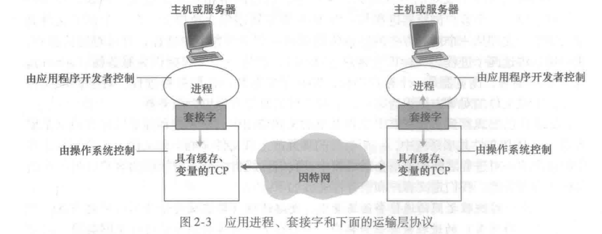

​	在因特网中，主机由其 **IP 地址 (IP address) 标识** 。IP 地址是一个 32 比特的量且它能够唯一地标识该主机。除了知道报文发送目的地的主机地址外，**发送进程**还必须指定运行在接收主机上的接收套接字。 因为一般而言一台主机能够运行许多网络应用。**目的地端口号 (port number)** 用于这个目的 

​	也就是说，to receive messages, process  must have **identifier**。**identifier** includes both **IP address** and **port numbers associated with process on host**.

example port numbers:

1. HTTP server: 80 
2. mail server: 25 SMTP邮件服务端口号是25

#### 2.1.3 应用层协议

##### 网络应用和应用层协议的区别

​	应用层协议只是网络应用的一部分。

​	例如 Web 是一种客户-服务器应用，它允许客户按照需求从 Web 服务器获得文档。该 Web 应用有很多组成部分，包括文档格式的标准(即 HTML) 、 Web 浏览器(如 Firefox 和 Mìcrosoft Intemet Explorer)，Web 服务器(如 Apache 、 Microsoft 服务器程序) ，以及一个应用层协议 。

##### 一般的网络应用及其所用协议

| 网络应用    | Web  | E-mail | Remote login | P2P file sharing | Streaming media  | Directory service(目录服务) |
| ----------- | :--: | :----: | :----------: | :--------------: | :--------------: | :-------------------------: |
| Application | HTTP |  STMP  |    Telnet    |        BT        | special protocol |             DNS             |
| Transport   | TCP  |  TCP   |     TCP      |     TCP/UDP      |       UDP        |             UDP             |
| IP          |  IP  |   IP   |      IP      |        IP        |        IP        |             IP              |

### 2.2 Web和HTTP

#### 2.2.1 Web page构成


#### 2.2.2 HTTP 概述

​	Web 的应用层协议是**超文本传输协议 (HyperText Transfer Protocol , HTTP)**，它是 Web的核心。 HTTP 由两个程序实现：一个客户程序和一个服务器程序 。 客户程序和服务器程序运行在不同的端系统中，通过交换HTTP 报文进行会话 。

​	HTTP 定义了 Web 客户向 Web 服务器请求 Web 页面的方式，以及服务器向客户传送 Web 页面的方式 。

​	HTTP 使用 **TCP** 作为它的**支撑运输协议**(而不是在 UDP 上运行)。 

##### 工作流程

1. 开始客户首先发起一个与服务器的 TCP 连接 。一旦连接建立，该浏览器和服务器**进程**就可以通过套接字接口访问 TCP。
2. 客户向它的套接字接口发送HTTP 请求报文并从它的套接字接口接收 HTTP 响应报文
3. 服务器从它的套接字接口接收 HTTP 请求报文和向它的套接字接口发送 HTTP 响应报文
4. 一旦客户向它的socket发送了一个请求报文，该报文就脱离了客户的控制并进入 TCP 的控制 

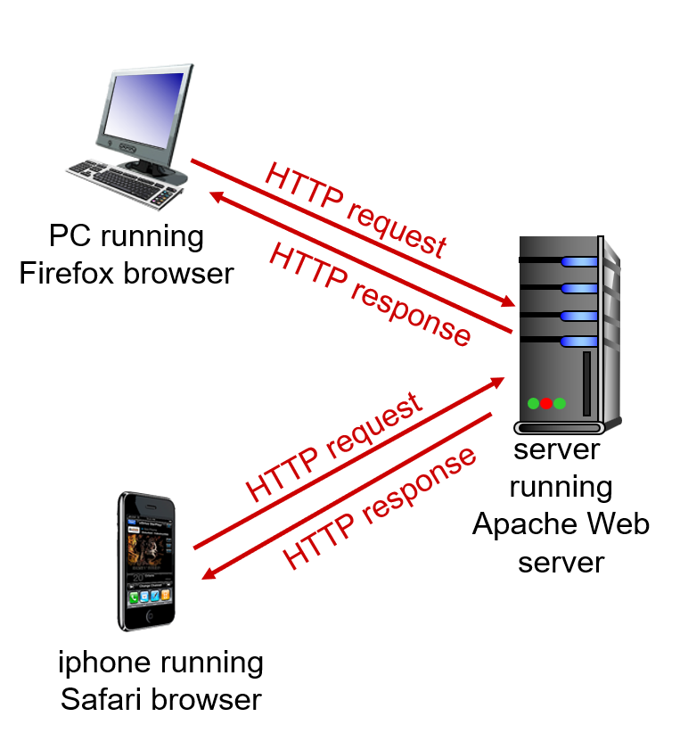

##### HTTP协议是"无状态"协议

服务器向客户发送被请求的文件，而不存储任何关于该客户的状态信息	 

HTTP 服务器并不保仔关于客户的任何信息，所以我们说 HTTP 是一个无状态协议( stateless protocol) 。 

#### 2.2.3 持续连接和非持续连接


##### 非持续连接

假设主机需要向服务器请求 10个对象 object (9张图，一个html文件)，那么他就要建立10次TCP连接，每次HTTP请求只请求一个对象。每个 TCP 连接在服务器发送一个对象后关闭，即该连接并不为其他的对象而持续下来

##### 持续连接

##### 延迟计算 两个RTT

1. RTT 定义：往返时间 Round-Trip Time，是指一个短分组从客户到服务器然后再返回客户所花费的时间

2. 由于HTTP请求使用TCP协议作为传输层协议，因此涉及"三次握手"的过程，因此总的响应时间 total average response time  是  **两个RTT+服务器传输HTML文件的时间**

   

#### 2.2.4 HTTP报文

##### 请求报文


##### 请求报文格式阅读

1. 报文文本使用 ASCII 文本书写
2. 第一行叫做**请求行(request line)**，有三个字段：**方法字段（GET、POST）、URL字段和HTTP版本字段**
3. 后面的所有行总称叫做**首部行（header line）**，Host 指明了对象所在的主机
4. User- agent: 首部行用来指明用户代理，即向服务器发送请求的浏览器的类型，这里是火狐浏览器
5. 通过包含 Connection：keep-alive 首部行，该浏览器告诉服务器请求建立持续连接。如果是 close，则不要麻烦地使用持续连接，它要求服务器在发送完被请求的对象后就关闭这条连接。

##### 请求报文的通用格式


1. **sp**表示空格，**cr**表示回车/空行，**lf**表示换行字符

2. **entity body 实体体**：使用 GET 方法时实体体为空，而使用 POST 方法时才使用该实体体 。

   用户提交表单时，HTTP 客户常常使用 POST 方法，例如当用户向搜索引擎提供搜索关键词时。使用 POST 报文时，用户仍可以向服务器请求一个Web页面，但Web页面的特定内容依赖用户再表单字段中输入的内容。如果字段方法是POST，那么**entity body里面的内容**就是用户在表单字段中的输入值。**比如在搜索框内输入一个字符串，然后点击搜索，这时候会使用POST方法，而entity body 的内容就是你填写的字符串**

##### HTTP 响应报文


##### 响应报文格式阅读

1. 第一行叫做**初始状态行（status line）**：三个重要字段：**协议版本字段、状态码、响应状态信息**
2. 后面的行统一叫做**首部行（head line）**：
   - Connection：close 告诉客户这是一次非持续性连接
   - **Date**：**首部行指示服务器产生并发送该报文的日期和时间**。注意：并**不是**这个对象（实体体）创建或最后修改的时间，而是服务器将该对象插入到这个响应报文并把这个报文发送给客户的时间
   - Server：类似请求报文的 User-Agent
   - **Last-Modified：指示对象创建或者最后修改的日期和时间。**
   - **Content-Length：被发送对象中的字节数。**这里是 6821个字节
   - Content-type：实体体中的对象属性。这里是h5文件
3. 然后是**实体体（entity body）**：即那一堆数据，包括请求的对象本身

##### 一些常见的状态码

- 200 OK：请求成功，信息在返回的响应报文中 。
- 301 Moved Pennanently：请求的对象已经被永久转移了，新的 URL 定义在响应报文的Location：首部行中。客户软件将自动获取新的 URL。
- 400 Bad Request：一个通用差错代码，指示该请求不能被服务器理解 。
- 404 Not Found：被请求的文档不在服务器上 。
-  505 HTTP Version Not Supported：服务器不支持请求报文使用的 HTTP 协议版本 。

#### Web cache 缓存 | 命中率

##### 定义

​	**Web 缓存器（Web cache）**也叫**代理服务器（proxy server）**，能够代表Web服务器来满足 HTTP 请求的网络实体。他有自己的磁盘存储空间，**可在磁盘里保存最近请求过的对象的副本**。

##### 例子一（中文）

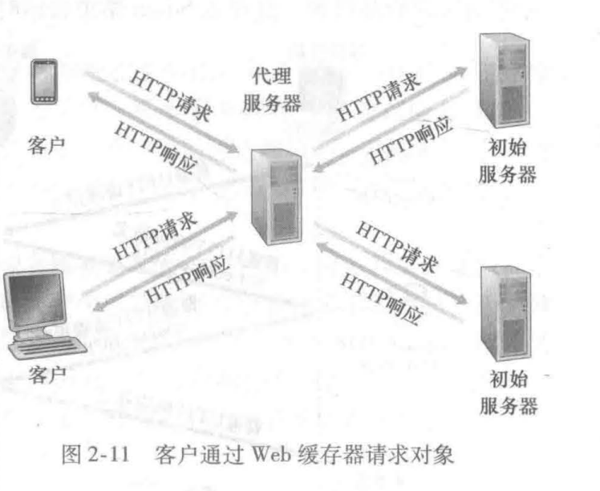

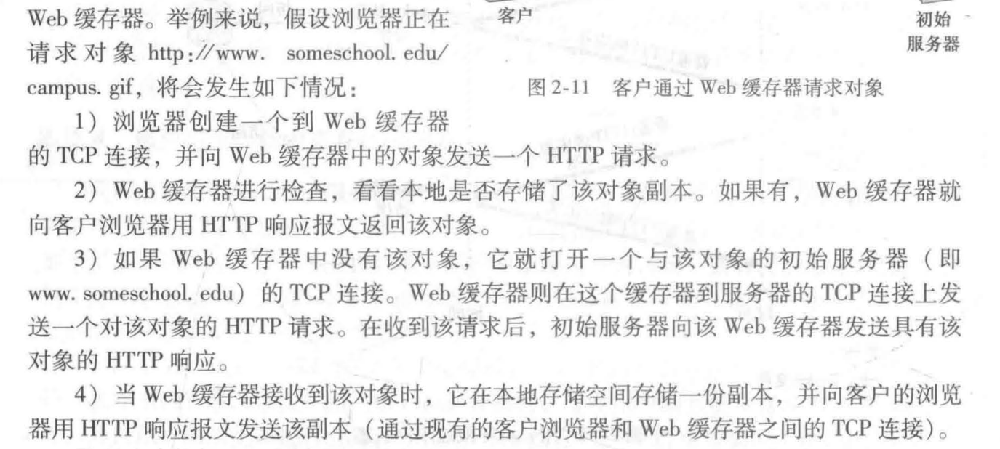

##### 例子二 缓存率、命中率（hit rate）、响应时延的计算


LAN 宽带的利用率（机构中的局域网的流量强度） = （15 个请求/s）*（1MB/请求）/（100Mbps）= 0.15

链路上的流量强度(access link的利用率) = （15 个请求/s）*（1MB/请求）/（15Mbps）= 1

这意味着**局域网上的流量强度较小，可以忽略考虑由局域网导致的请求时延。**


使用Web缓存器：**缓存器的命中率（hit rate）指的是一个缓存器所满足的请求的比率**，通常在 0.2 ~ 0.7


也就是说，本来每一个请求都要通过链路前往因特网去一侧的服务器获得响应(平均响应时延 = 因特网一侧的路由器将该请求发送到对应服务器的时延 + 链路传输的时延)，现在有一部分请求的响应在本地机构的Web缓存器中存有，不需要经过链路寻找响应，因此这一部分时延近乎为0，例子中只有 0.6 的流量需要经过链路去服务器请求。

##### 例题三 计算

chatper-2 第六题

### 2.3 电子邮件

#### 2.3.1 SMTP

##### 电子邮件主要组成部分

1. **用户代理（user agent）**：“mail reader”，负责撰写、编辑、阅读邮件信息；发送和接收的消息存储在服务器上
2. **邮件服务器（mail server）**：**mailbox（邮箱）** contains incoming messages for user，**message queue（报文队列）** 负责 outgoing（传出） (to be sent) mail messages。
3. **简单邮件协议（Simple Mail Transfer Protocol，SMTP）**：SMTP 是因特网电子邮件中主要的应用层协议。它使用 TCP 可靠数据传输服务，从发送方的邮件服务器向接收方的邮件服务器发送邮件 。 

##### 传输过程


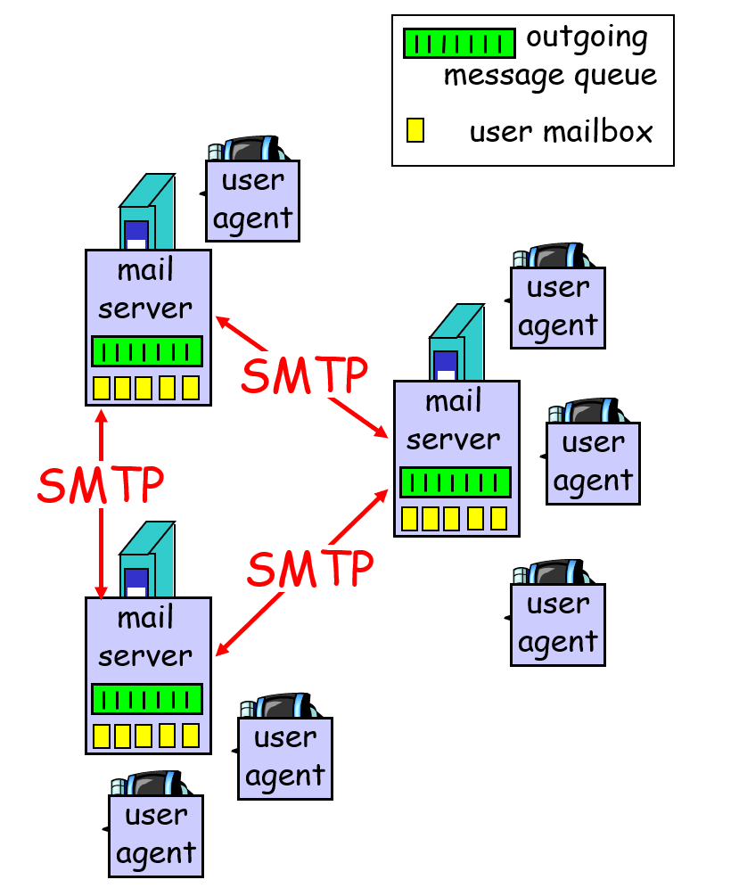


可以这么类比：

​	就像生活中寄信一样，**用户代理就是寄信和收信人，邮箱服务器就是邮局，邮箱就是邮局存放寄信、收信双方邮件的柜子，SMTP协议就是邮局之间的联系方式**。当你寄一封信时，你需要写好寄信人姓名和地址、收信人姓名和地址，并将它转交给邮局。邮局根据寄信人地址（邮件地址，例如AAA@qq.com），将信封放入邮筒（报文队列 message queue），通知邮差（创建一个到收件人的邮箱服务器上的STMP服务器的TCP连接），等待邮差来取。邮差（SMTP）确定好信封收件地址（TCP握手）后，将邮件送往收件人的邮箱里。当收件人查看自己的邮箱时（使用用户代理访问邮件服务器里自己的邮箱），就能看到邮件。

#### 2.3.2 邮件报文格式

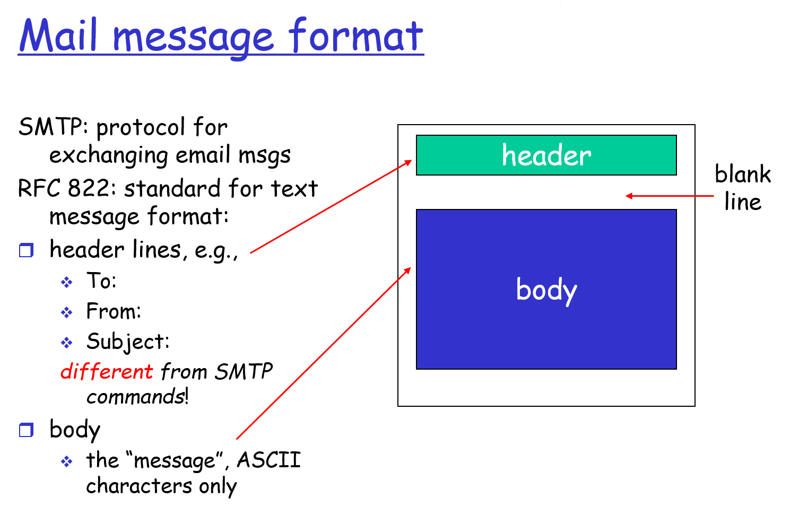

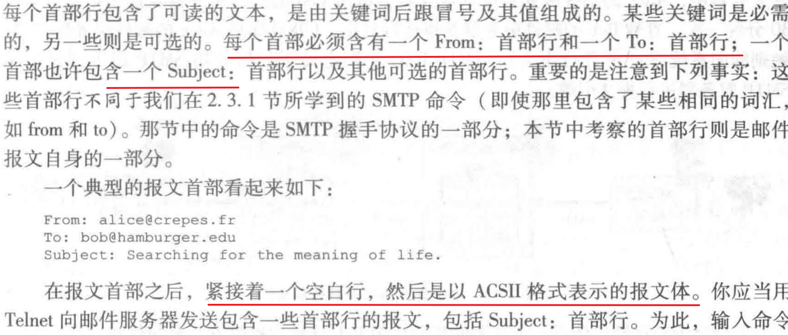

##### 邮件阅读例子：

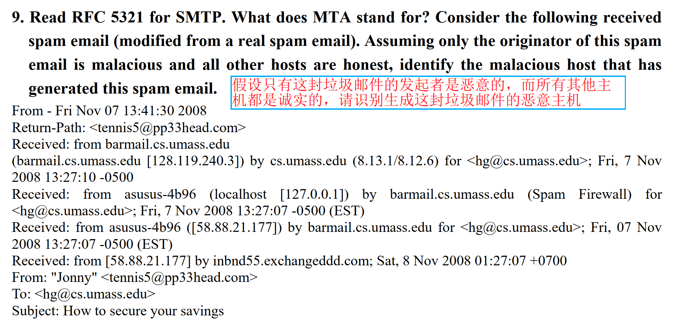

解答：

要识别恶意主机，我们需要分析邮件的 Received: 头部。**Received: 头部是邮件路径的可靠记录。当邮件从一个MTA传输到另一个MTA时，每个MTA都会在邮件头部添加一个 Received: 字段。**

**重要规则：**

- Received: 头部是**倒序**记录的。最上面的 Received: 头部是**接收方邮件服务器添加的**，记录了它从哪个MTA收到的邮件。
- 最下面的 Received: 头部是**发送方邮件服务器（或者直接连接到发送方的第一个MTA）添加的**，记录了它从哪个客户端或MTA收到的邮件。

1. **MTA 的定义：**

   - MTA stands for Mail Transfer Agents.
   - A mail is forwarded by a source to a MTA and then it follows a sequence of MTAs to reach the receiver’s mail reader.
   - **解释：** 这部分是对MTA的准确定义。邮件从发送方（源，可以是一个邮件客户端MUA或者另一个MTA）开始，通过一系列的MTA（邮件传输代理）进行中转，最终到达接收方的邮件阅读器（MUA，如Outlook、Gmail网页版）。

2. **分析邮件链和识别恶意主机：**

   - We see that this spam email follows a chain of MTAs. An honest MTA should report where it receives the message.

   - **解释：** 这强调了 Received: 头部的重要性。一个“诚实”的MTA会忠实地记录它从哪个地方（哪个IP地址、主机名）接收到了邮件。这意味着，如果你从后往前看 Received: 头部（即从最新的到最旧的），你会看到邮件的传输路径。

   - Notice that in this email, “asusus-4b96 ([58.88.21.177])” does not report where it receives the email.

   - **解释：** 这是答案中的**关键论点**。让我们回顾邮件头部的相关行：

     ```bash
     Received: from barmail.cs.umass.edu (...) by cs.umass.edu (...)
     Received: from asusus-4b96 (localhost [127.0.0.1]) by barmail.cs.umass.edu (Spam Firewall) (...)
     Received: from asusus-4b96 ([58.88.21.177]) by barmail.cs.umass.edu for <hg@cs.umass.edu>; Fri, 07 Nov 2008 13:27:07 -0500 (EST)
     Received: from [58.88.21.177] by inbnd55.exchangedddd.com; Sat, 8 Nov 2008 01:27:07 +0700
     ```

     答案这里指的 “asusus-4b96 ([58.88.21.177])” 实际上是倒数第二条 Received: 头部记录的**发送方信息** (from 字段)。这条记录是 barmail.cs.umass.edu 接收时记录的。

     然而，答案说它“does not report where it receives the email”。这句话的理解是：**通常一个 MTA 会在 Received: 头部中记录 from [source_host] by [receiving_host]。** 当它自己是 [source_host] 时，它就没有理由记录自己从哪里接收（除非是从MUA）。**这里真正的槽点是：**

     1. **重复的 asusus-4b96 记录：** barmail.cs.umass.edu 连续两次声称从 asusus-4b96 收到邮件，但IP地址 (127.0.0.1 vs 58.88.21.177) 却不同，且时间戳完全相同。这本身就极不寻常，表明有人在伪造 Received: 头部。
     2. **localhost [127.0.0.1] 的欺骗性：** 垃圾邮件发送者常常伪造源信息，插入一个 localhost 或其他内部地址，试图让邮件看起来像是在目标网络内部生成的。

     **答案的精髓在于**，所有诚实的MTA都应该在它们**接收邮件时**，在其 Received: 头部**准确记录邮件来自哪里**。倒数第一条 Received: (即 Received: from [58.88.21.177] by inbnd55.exchangedddd.com;...) 是由 inbnd55.exchangedddd.com 添加的。它明确指出了邮件是从 58.88.21.177 发送给它的。

     而**“asusus-4b96 ([58.88.21.177])”**这个实体（或者更准确地说，是其背后的IP 58.88.21.177）是**发送方**，而不是接收方。它**没有**像一个诚实的MTA那样，在收到邮件时添加一个 Received: 头部来记录它**自己**从哪里接收到了邮件（因为它就是最初的发起者，它没有“接收”这封邮件，而是“发送”了）。

   - As we assume that the only originator is dishonest, so “asusus-4b96 ([58.88.21.177])” must be the originator.

   - **解释：** 结合题目假设（只有发起者是恶意的，其他都是诚实的），我们追踪邮件路径。最底层的 Received: 头部 (from [58.88.21.177] by inbnd55.exchangedddd.com) 是由 inbnd55.exchangedddd.com 这个**诚实**的MTA添加的。这意味着 inbnd55.exchangedddd.com 从 58.88.21.177 接收了邮件。

     - 而那个声称来自 asusus-4b96 ([58.88.21.177]) 并同时包含 localhost [127.0.0.1] 的重复且时间冲突的头部，是**明显伪造**的。
     - 由于 58.88.21.177 是 inbnd55.exchangedddd.com 记录的**第一跳外部来源**，并且邮件中又包含了伪造的头部（这些伪造通常由发送邮件的客户端或其第一个不诚实的MTA进行），根据“只有发起者是恶意的”这个前提，那么 58.88.21.177 就是那个恶意的主机。

### 2.4 DNS

#### 2.4.1 作用

​	DNS域名解析系统（Domain Name System，DNS）是将主机名转换为IP地址的一种目录服务（Directory server）。

​	DNS是：一个由分层的DNS服务器实现的分布式数据库；一个能让主机查询分布式数据库的协议。

#### 2.4.2 所提供的服务

1. 主机别名（host aliasing）
2. 邮件服务器别名（mail server aliasing）
3. 负载分配/负载均衡（load distribution）

#### 2.4.3 工作原理

##### 拥有一个分布式、层析的数据库


为解决单一DNS服务器要处理巨量（十亿级）的域名解析压力，故全球范围内设立了层次性的大量DNS server，主要有三种类型：

1. 根DNS server：提供TLD服务器的IP地址
2. 顶级域（Top-Level Domain，TLD）DNS server：包括`com、org、net、edu、gov`和所有国家的顶级域（`uk、fr、ja、cn`），都有 TLD 服务器集群。TLD服务器提供了 权威DNS server 的IP地址
3. 权威 DNS server：因特网上具有公共可访问主机（如Web服务器、邮件服务器）的每个组织机构必须提供公共可访问的DNS记录，这些记录会把这些主机的名字映射为IP地址。一个组织的权威DNS服务器就存储着这些记录。

##### 本地DNS服务器 local DNS server

​	当主机（host）发起DNS请求之后，该请求（设为RE ）会被发往 local DNS server，这个本地DNS服务器就是一个**代理角色**，负责和其他DNS服务器交互，直到知道这个请求的主机名是谁的IP地址为止。

##### DNS 解析过程 | 递归查询(recursive query) | 迭代查询(iterative query)

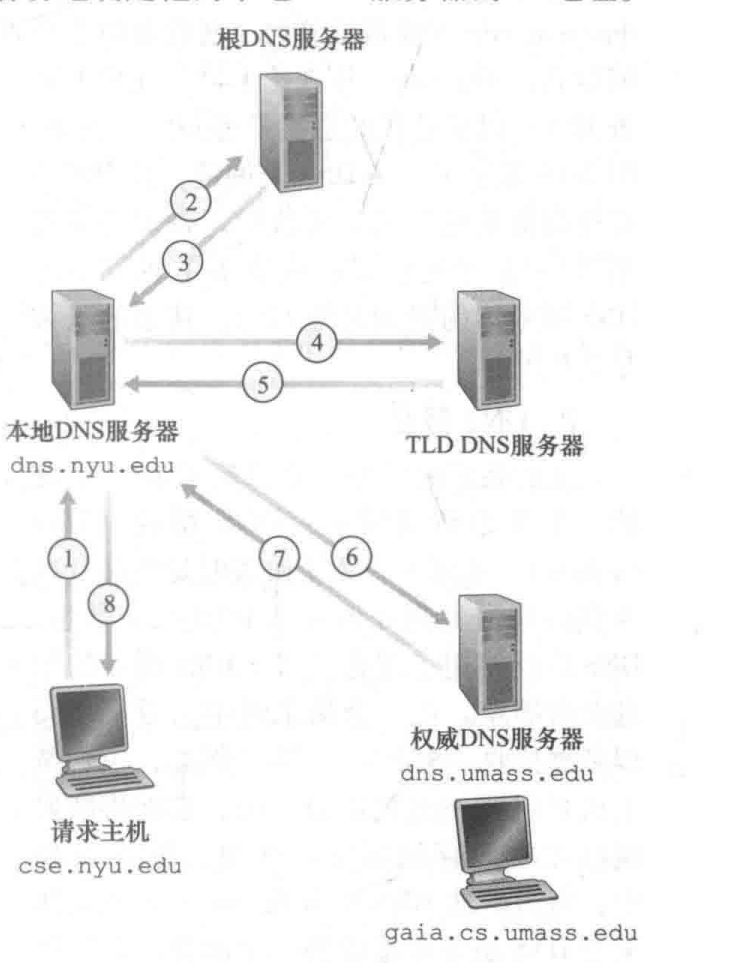


1. 首先请求主机  cse.nyu.edu  发出一个**DNS查询报文**（设为 RE），想要和 gaia.cs.umass.edu 建立连接。也就是说，想要知道这个域名的 IP 地址是多少
2. RE 被发往本地DNS服务器 dns.nyu.edu 。本地DNS服务器并不知道 RE 是谁的域名，位于哪个IP段内，于是**它向根服务器转发 RE** ，想要知道 RE中的域名 是哪一个DNS服务器下的记录。
3. 根服务器收到 RE 后，查看前缀，发现顶级域名是 .edu，则**将负责.edu前缀的 TLD  的IP地址列表返回给本地DNS服务器**
4. 本地DNS服务器知道 TLD 的 IP 后，会**向其中一个 TLD DNS server 发送 RE**
5. TLD 收到 RE 后注意到 .umass.edu 前缀，查询自己存有的IP列表，发现有 .umass.edu 的权威DNS服务器，该权威 DNS 服务器是负责马萨诸塞大学的 dns. unlass. edu。**因此将此 权威 DNS server( dns.umass.edu）的 IP地址转发给 本地DNS server**
6. 本地DNS server 获取到权威服务器的IP后，**直接向此IP发送 RE**。
7. 权威DNS服务器收到 RE 后，**直接用 gaia.umass.edu 的 IP 地址与本地DNS服务器进行响应**。

综上，为了获得一台主机名的映射，一共发送了 **4 份查询 message 和 4 份 回答报文**。

#### DNS 缓存（DNS caching）

##### 作用

​	为了改善时延性能并减少在因特网上到处传输的DNS message 数量，DNS系统经常采用DNS 缓存技术。

##### 原理

​	和Web cache 一样，在一个请求链（request chain）中，某一台DNS服务器接收一个DNS问答的时候，会将这次问答的主机名和IP映射存储起来，**当下一次请求的主机名和这次相同时，会先在自己的缓存里寻找，如果找到，直接返回 IP，不需要继续转发了**。同理，既然是缓存，这个映射就不会保留太长时间。

##### 例题

​	你能提出一种方法来粗略地确定哪些 Web 服务器（部门外）在你的部门用户中最受欢迎吗？你能想出一种方法来判断几秒钟前某个外部网站是否很可能被你部门的计算机访问过吗？请解释一下。

​	根据 DNS 缓存的原理，去查看这台 DNS 服务器的缓存里，存储最频繁的主机名和映射 IP即可。 查看DNS缓存中刚刚缓存的主机名和IP。

### 2.5 P2P文件分发

#### 2.5.1 Def：

​	从单一的服务器向大量主机(称为对等方)分发一个大文件 。对等方接受到部分文件后可利用自己的上传能力向""服务器+大量主机""构成的网络上传自己已有的部分。  特别是，当一个对等方接收到某些文件数据，它能够使用自己的上载能力重新将数据分发给其他对等方 。 

#### 2.5.2 常见的P2P文件分发协议 BitTorrent

#### 2.5.3 与C/S文件分发体系的比较

- C/S中是一个服务器向每一个对等方发送文件副本
- P2P中是服务器将文件发送到由对等方组成的网络中，每一个对等方都可以从其他对等方那获得该文件的副本的任一部分（不管是否已经有了）。

#### 2.5.4 示例比较


- **C/S体系分发：**

  

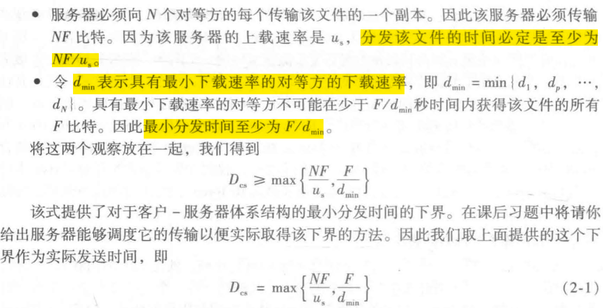

​	可知，当N足够大，Dcs 取决于max{第一项}，因此，分发时间随着 N 的增大线性增大。

- **P2P体系分发：**


​	实际上分件分发分发的是一个个文件块而不是单个比特，因此**以上公式很适合用来近似实际的分发时间**

#### 2.5.5 BitTorrent 

##### 术语

1. **洪流（torrent）**：所有参与文件分发的对等方
2. **文件块（chunk）**：一个洪流中对等方会彼此下载等长度的文件块
3. **追踪器（tracker）**：当一个对等方加入某洪流时，它向追踪器注册自己，并周期性地通知追踪器它仍在该洪流中。以这种方式，追踪器跟踪参与在洪流中的对等方 。  

##### 工作原理

​	当一个对等方首次加入一个洪流时，它没有块 。 随着时间的流逝，它累积了越来越多的块 。 当它下载块
时，也为其他对等方上载了多个块。一旦某对等方获得了整个文件，它也许(自私地)离开洪流，或(大公无私地)留在该洪流中并继续向其他对等方上载块 。 同时，任何对等方可能在任何时候仅具有块的子集就离开该洪流，并在以后重新加入该洪流中。 

##### 工作流程

1. 一个新对等方 A 加入torrent，先向 tracker 注册自己，tracker 会随机从参与 torrent的对等方中选取一个子集（设有50个对等方），并将这50个对等方的 IP 发给 A。
2. A 拿着这张表和里面的对等方尝试建立 TCP 连接。 和 A 成功建立起连接的对等方称为 A 的临近对等方
3. A 周期性地询问每个 临近对等方 它们拥有的文件块的列表（假设 A 有 L 个临近对等方），那么 **A 会根据这 L 个块列表以及自身现在还没有的块，向这 L 个邻居发出请求，请求自己还缺少的块**。
4. A 采用**最稀缺优先（rarest first）的原则**，针对 **A 还缺少的块的前提下**，查看这 L 个块列表，寻找最稀缺的块（ L 个邻居中副本最少的块），并优先请求那些最稀缺的块，加快这些块的分发速度。**注意：是在自己缺少的块里面再去寻找 L 个邻居中副本最少的块。毕竟你也不想帮别人白打工是吧**
5. 为了加快这最稀缺块的分发速度，A 需要和自己邻居中传输速率最高的邻居（设为 B）进行连接。同时，过了一段时间后，A 需要将自己已有的块（邻居自己的最稀缺块）传输给其中一个邻居，**一报还一报**。


#### P2P三个原则 分块、对等传输、最稀缺原则

##### 分块传输

​	当文件从服务器传输到对等方网络时，是将文件随机分成一段一段的文件块进行传输。或者说，文件大小是 F bit，它是一整个从服务器上传到对等方网络中，但是每个对等方收到的文件并不是一整个文件，而是文件的随机一部分，**相当于它只分发到了文件的一块文件块**，**它需要和其他对等方进行文件块（自己缺失的）的传输才能获得完整的文件**。只有在p2p体系中获得到完整的一个文件 F bit才会退出这个对等方网络。

##### 对等传输

​	一个 torrent中，对等方会彼此传输等长度的 chunk。

##### 最稀缺原则 rarest first

​	A 加入一torrent并拥有 L 个邻居后，A 查看 L 个块列表，寻找**在自己缺少的chunk的前提下邻居中副本数量最少的chunk**，并优先传输这些chunks。

### 2.6 UDP和TCP socket

#### 2.6.1 UDP socket

##### 数据分组被从socket推出之前的处理

​	使用UDP时，数据分组被从socket推出之前，需要**为其附上一个目的地址，包含目的主机的IP和目的地socket的端口号**。

##### 端口号 port number

​	一台主机可能运行许多网络应用迸程，每个进程具有一个或多个套接字，所以在目的主机指定特定的套接字也是必要的 。当生成一个套接字时 ，就为它分配一个称为**端口号 (port nunlber)** 的标识符  

##### 特点

​	每发一个数据分组都要附上一个目的地址的头。一旦数据发送出去，就不会再管理这个包，不管这个包是否到达目的地址，故称为"不可靠传输"。

#### 2.6.2 TCP socket

##### 工作过程

1. 先进行握手过程，将客户的socket地址（包括 IP 和 port number）和 目的主机的 socket地址（IP + port number）关联起来

2. 当建立连接（握手成功后），服务器会为客户开一个新的socket进行数据的传输。也就是说，之前那个socket只负责建立连接，一旦确定连接建立，就会使用新的socket和客户建立通道（网络隧道），进行数据传输。

3. 通过通路进行数据的传输，不需要为数据包附上目的地址

   

### 网络架构与应用架构的区别及网络层、应用层解析（补充）

#### 问题1：网络架构和应用架构之间有什么区别？

网络架构 (Network Architecture) 和应用架构 (Application Architecture) 是计算机系统中两个不同但相互关联的概念。它们关注的是系统设计的不同方面。

#### 1. 网络架构 (Network Architecture)

*   **含义/关注点：** 网络架构指的是一个计算机网络的**整体设计和组织方式**。
*   **核心组成：**
    *   **网络拓扑 (Network Topology):** 网络的物理或逻辑布局，如星型、总线型、环型、网状等。
    *   **网络设备 (Network Devices):** 如路由器、交换机、集线器、防火墙、接入点 (AP) 等。
    *   **传输介质 (Transmission Media):** 如双绞线、光纤、无线电波等。
    *   **网络协议栈 (Network Protocol Stack):** 如 TCP/IP 模型或 OSI 模型，定义了不同层次的通信协议。
    *   **寻址和路由 (Addressing and Routing):** 如何为设备分配地址（如 IP 地址、MAC 地址）以及数据包如何在网络中找到路径。
    *   **网络服务 (Network Services):** 如 DNS (域名系统)、DHCP (动态主机配置协议) 等。
    *   **网络安全 (Network Security):** 防火墙、入侵检测/防御系统、VPN 等。
*   **目标：** 设计一个能够满足特定性能、可靠性、可扩展性、安全性和成本要求的网络基础设施。
*   **例子：** 公司的局域网 (LAN) 设计、广域网 (WAN) 连接方案、数据中心的网络布局、互联网的整体结构。
*   **可以理解为：** 城市的道路系统、交通规则、信号灯、邮政系统等基础设施，它们使得信息（车辆、信件）可以在不同地点之间流动。

#### 2. 应用架构 (Application Architecture)

*   **含义/关注点：** 应用架构指的是一个**特定软件应用程序的内部结构、组件及其相互关系的设计**。由应用程序开发人员设计，并决定应用程序的总体结构。is designed by an application developer and dictate the broad structure of the application
*   **核心组成：**
    *   **组件/模块/服务 (Components/Modules/Services):** 应用程序被分解成的各个功能单元。
    *   **组件间的交互 (Interactions between Components):** 组件之间通信的方式，如函数调用、消息传递、API 调用等。
    *   **数据管理 (Data Management):** 应用程序如何存储、访问和处理数据（例如，数据库的选择和设计、缓存策略）。
    *   **用户界面 (User Interface, UI) 和用户体验 (User Experience, UX):** 用户如何与应用程序交互。
    *   **业务逻辑 (Business Logic):** 实现应用程序核心功能的代码。
    *   **技术栈 (Technology Stack):** 选择的编程语言、框架、库等。
    *   **部署模型 (Deployment Model):** 应用程序如何部署到服务器或云平台。
    *   **非功能性需求：** 如性能、安全性、可伸缩性、可靠性、可维护性。
*   **目标：** 设计一个能够满足用户需求、易于开发和维护、并且能够适应未来变化的软件应用程序。
*   **例子：** 一个电子商务网站的架构（可能采用微服务架构，包含用户服务、订单服务、产品服务等）、一个移动银行应用的架构、一个企业资源规划 (ERP) 系统的架构。
*   **可以理解为：** 一座建筑物的蓝图，描述了建筑的各个房间、楼层、水电系统如何设计和连接，以实现建筑的功能。

#### 主要区别总结

| 特征         | 网络架构                           | 应用架构                                     |
| :----------- | :--------------------------------- | :------------------------------------------- |
| **关注对象** | 网络的整体结构和数据在网络中的传输 | 单个软件应用程序的内部结构和功能实现         |
| **范围**     | 多个设备和系统之间的连接与通信     | 单个应用程序内部的组件和交互                 |
| **组成部分** | 路由器、交换机、协议、拓扑、寻址   | 模块、服务、API、数据库、用户界面、业务逻辑  |
| **目标**     | 可靠、高效、安全的数据传输基础设施 | 功能完善、性能良好、易于维护和扩展的软件应用 |
| **层次**     | 更偏向于基础设施层和通信的“管道”   | 更偏向于软件实现层和在“管道”中运行的内容     |

---

#### 网络层 (Network Layer) 和应用层 (Application Layer) 的含义

这两个术语通常与网络协议栈模型（如 OSI 模型或 TCP/IP 模型）相关。

#### 网络层 (Network Layer)

*   **在协议栈中的位置：** 通常是协议栈的第三层（OSI 模型）或与互联网层（TCP/IP 模型）相对应。位于数据链路层之上，传输层之下。
*   **主要功能：**
    1.  **逻辑寻址 (Logical Addressing):** 为网络中的设备分配逻辑地址（例如，IP 地址），用于唯一标识主机。
    2.  **路由 (Routing):** 决定数据包从源主机到目的主机所经过的最佳路径。路由器工作在网络层，根据路由表和路由协议（如 OSPF, BGP, RIP）做出转发决策。
    3.  **数据包转发 (Packet Forwarding):** 将数据包从一个网络接口转发到另一个网络接口，使其更接近最终目的地。
    4.  **分段和重组 (Fragmentation and Reassembly):** 如果数据包太大而无法通过某个网络链路，网络层负责将其分割成更小的片段，并在目的地的网络层进行重组（尽管在 IPv6 中，分段主要由源主机处理）。
*   **核心协议示例：** IP (Internet Protocol) 是网络层最核心的协议。ICMP (Internet Control Message Protocol) 也工作在网络层，用于错误报告和诊断。
*   **数据单元：** 在网络层，数据单元通常被称为**数据包 (Packet)** 或**数据报 (Datagram)**。
*   **可以理解为：** 邮政系统中的地址系统（IP 地址）和邮件分拣、路由中心（路由器），负责将信件（数据包）从一个城市（网络）传递到另一个城市（网络），并最终送达正确的街道地址（主机）。

#### 应用层 (Application Layer)

*   **在协议栈中的位置：** 通常是协议栈的最顶层，第七层（OSI 模型）或第五层（TCP/IP 模型中的上三层合并）。直接为用户应用程序提供网络服务。
*   **主要功能：**
    1.  **提供应用程序接口 (Application Programming Interface, API):** 允许应用程序访问网络服务。
    2.  **定义应用程序协议 (Application Protocols):** 规定了不同主机上应用程序之间通信的规则和数据格式。例如，Web 浏览器和 Web 服务器之间如何交换信息，邮件客户端和邮件服务器之间如何交换邮件。
    3.  **处理用户数据：** 负责数据的表示、编码、加密（如果需要）等，以便在网络上传输或呈现给用户。
*   **核心协议示例：** HTTP/HTTPS (用于 Web 浏览)、FTP (用于文件传输)、SMTP (用于发送邮件)、POP3/IMAP (用于接收邮件)、DNS (用于域名解析)、Telnet/SSH (用于远程登录) 等。
*   **数据单元：** 在应用层，数据单元通常被称为**消息 (Message)** 或**数据 (Data)**。
*   **可以理解为：** 邮局提供的具体服务类型，如普通信件服务（SMTP）、包裹服务（FTP）、查询地址服务（DNS）等。用户（应用程序）选择使用哪种服务来发送或接收特定类型的信息。

#### 总结

*   **网络架构**是关于整个网络的蓝图和规则，而**应用架构**是关于单个软件的设计。
*   **网络层**负责在网络中将数据包从源头路由到目的地，使用 IP 地址等。
*   **应用层**直接与用户应用程序交互，使用特定的协议（如 HTTP, FTP）来提供网络服务。

## 第三章 运输层

### 3.1 概述

#### 报文段 segment

​	应用层的报文message经过 socket 到达运输层时，运输层会将message分组成较小的块，每一块的头部加上一个运输层报文段。我们将运输层分组称为**报文段 segment**

#### 运输层协议 TCP UDP的作用

​	最基本的责任是将两个主机host间 IP 的交付服务扩展为运行在 主机上的两个进程之间的交付服务。也就是说，本来主机间是通过 IP 连接到一起的，**不能确定 两个位于不同主机上的进程间的数据交互**，只能确定两台主机进行数据交互。**现在运输层将这个事扩展到进程之间，即两进程通过socket进入到传输层，数据到达目的主机后有确定的socket可以进入正确的进程里**

​	**运输层的多路复用（transport-layer multiplexing）和多路分解（demultiplexing）**就是完成将主机间交付扩展到进程间交付这个事的

#### TCP 

​	称为**可靠数据传输（reliable data transfer）**，通过流量控制、序号、确认和定时器使得数据可被正确地传输到接收进程。并且**拥塞控制（congestion control）**的提供可控制流量发送速率，避免通道被流量淹没

### 3.2 多路复用和多路传输

#### 定义

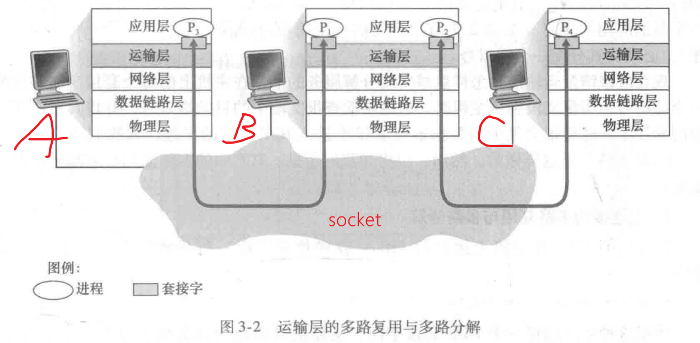

​	假设A 、B、C是主机，阴影部分是socket。一台host上同时可能有多个processing，每个进程对应有一个socket与传输层相连。

​	假设 A 此时多个进程同时发出不同的message，传输层会给每一份message的头部附上一份首部信息（包含目的主机 IP 和 socket），生成不同的segments，并将segments发向网络层，**这个过程就叫多路复用**。类似于家里同时有多个人写了不同的信，你将这些信收起来，为它们写上收信地址和收信人（对应 IP 和 socket）。

​	假设 A写的信都是给 B的，可以是写给相同的人，也可以是不同的人。当信送到 B 后，B家里负责收信的人会得到多个信封，他会根据信封上的收信地址和收信人（B的 IP 和 B的socket），将信封送到对应的收信人手中，**这个过程叫做多路分解**。学术性来说，就是 A 的segments到达B后，B的运输层协议查看segments的运输层首部信息，检查 目的IP和socket，IP没错的话验证socket是否存在，如果有，就将segment送到对应的socket，segment经过socket后解包成message，给到对应的进程。

#### 多路复用要求

1. socket有唯一标识符
2. 每个segment 有特殊字段来指示要交付到的对应socket（哪一台host的哪一个socket）
3. 特殊字段包含**源端口字段（source port number） 和 目的端口字段（destination port number）**。主机端口有**2^16 = 65536个，其中 0 ~ 1023是固定的周知端口号（well-known port number）**，是RFC文档里规定留给 http、ftp、SMTP等协议用的端口号。

#### segment 封装格式


#### UDP 的多路复用与多路分解

​	UDP是不可靠传输，他不关心能不能将message安全送到目的进程，因此一个UDP socket是由一个二元组标识的，只包含目的 IP 和 目的端口号。UDP会根据目的 IP 和端口号，将它送到目的地址，由目的服务器送到对应的socket里。----只发送不返回对方是否收到了的消息

#### TCP 的多路复用和多路分解

​	TCP与UDP不同：TCP的socket是一个四元组：源IP、源socket、目的IP、目的socket。

### 3.3 UDP

#### 常见的使用UDP协议的应用


#### UDP 报文结构

​	首部只有4个字段，**每个字段由两个字节组成**，一共只占 8 个字节的空间

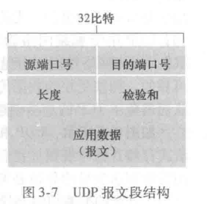

### 3.4 可靠数据传输原理

#### 3.4.1rdt


#### 3.4.2 流水线可靠传输协议


### 3.5 TCP

#### 3.5.1 TCP连接


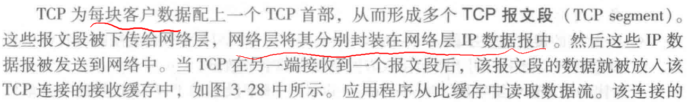


#### 3.4.2 TCP 报文段结构


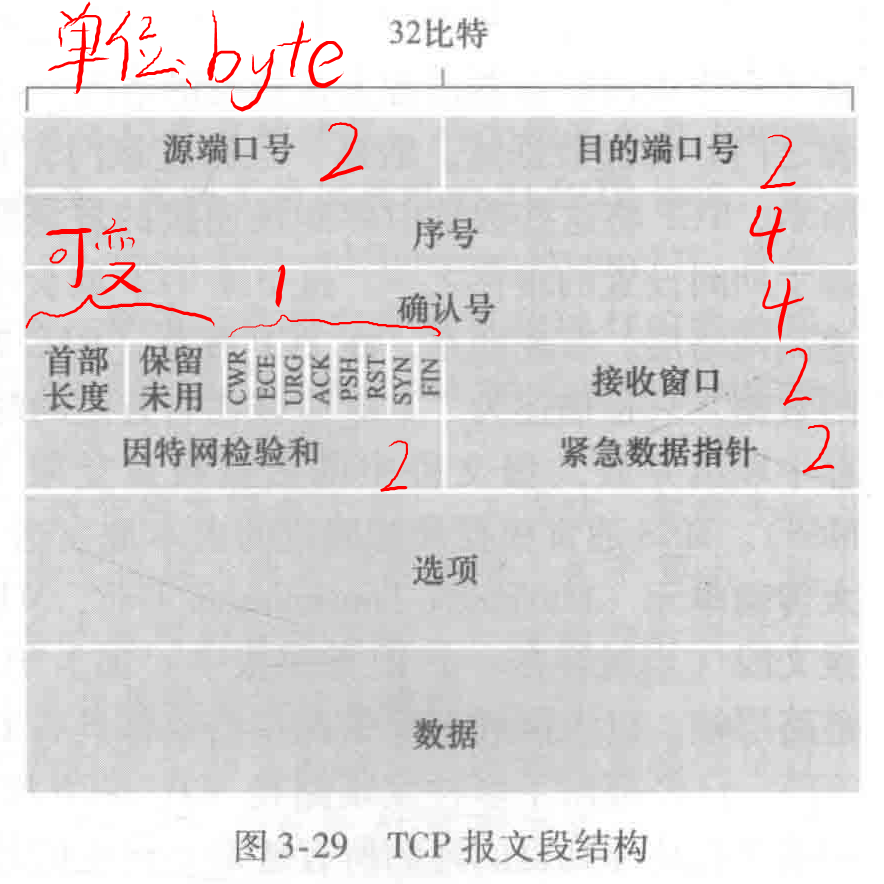


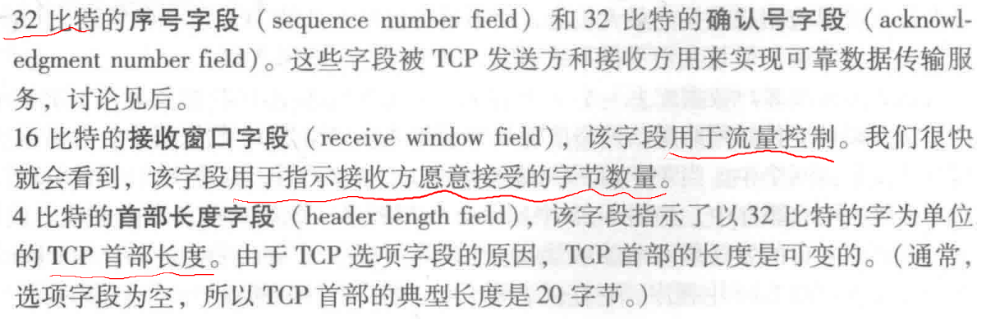


### 3.5 流量控制

#### 流量控制服务 flow-control service

#### 拥塞控制 congestion control

#### 接收窗口 receive window rwnd

​	接收窗口用于给发送方一个指示一一**该接收方还有多少可用的缓存空间 。**主机 B 上的应用进程不时地从该缓存中读取数据 。

​	假设主机 A 通过一条 TCP 连接向主机 B 发送一个大文件。主机 B 为该连接分配了一个接收缓存，并用 **RcvBuffer** 来表示其大小。

**SendBase (Send Base)** 是发送方维护的一个变量。它表示**已发送但尚未确认的字节中，序列号最小的那个字节的序列号**。---- **即接收方下一个要接收的字节数据的序列号**

**ACK y (接收方发送):** TCP的确认号（Acknowledgment Number）字段。这个字段的值 y 表示**接收方期望从发送方收到的下一个字节的序列号**。

**LastByteRcvd:** 从网络中到达的并且己放入主机 B 接收缓存中的数据流的最后一个字节的编号 。

**LastByteRead：**主机 B 上的应用进程从缓存读出的数据流的最后一个字节的编号 

由于 TCP 不允许已分配的缓存溢出，下式必须成立:
	**LastByteRcvd - LastByteRead <=  RcvBuffer**
接收窗口用rwnd表示，根据缓存可用空间的数量来设置:
	**rwnd = RcvBuffer - [ LastByteRcvd - LastByteRead ]**

由于该空间是随着时间变化的，所以 rwnd 是动态的 。  


#### LastByteSent 和 LastByteAcked

​	LastByteSent - LastByteAcked = 主机A 发送到TCP连接通道中但未被接收方接收（确认）的数据量。通过将未确认的数据量控制在 **rwnd** 以内，保证host A 不会让 host B 的接收缓存 **RvcBuffer** 溢出

#### LastByteRcvd 与 ACK y 之间的关系

- **LastByteRcvd (接收方):** 如前所述，是接收方已经连续接收到的最高字节的序列号。
- **ACK y (接收方发送):** TCP的确认号（Acknowledgment Number）字段。这个字段的值 y 表示**接收方期望从发送方收到的下一个字节的序列号**。

##### 关系

这是TCP确认机制的核心。接收方发送的ACK号 y **总是**等于 LastByteRcvd 的值加1。

**ACK y = LastByteRcvd + 1**

### 3.6 拥塞控制原理

### 3.7 拥塞控制算法

#### 3.7.1 拥塞控制所用名词

1. **RcvBuffer 接收缓存**

2. LastByteRead 接收主机上的应用进程从缓存读出的数据流的最后一个字节的编号 

3. LastByteRcvd 从网络中到达的并且己放入接收主机 接收缓存中的数据流的最后一个字节的编号 

4. LastByteSent 发送主机发送的最近一个字节的编号

5. LastByteAcked 接收主机正好接收结束的最近一个字节的编号

6. **rwnd 接收窗口**  

   RcvBuffer 除去正在处理的缓存数据外的空闲空间（ 接收方当前还有多少缓冲区空间可以接收数据，由接收方的处理能力决定）。

   **rwnd = RcvBuffer - [ LastByteRcvd - LastByteRead ]**

7. **cwnd 拥塞窗口**  发送方当前允许发送的最大未确认数据量，由网络拥塞状况决定。

#### 拥塞算法第一步：慢启动 ---- 初始启动时

1. 

#### 第二步：拥塞避免 ----出现拥塞时

#### 第三步：快速恢复 ---- 处理拥塞 冗余ACK情况

### 拥塞控制小结

TCP拥塞控制的目标是：**在不使网络过载的情况下，尽可能地提高数据传输速率**。它通过调整发送窗口的大小（特别是拥塞窗口 cwnd）来实现这一目标。

#### 核心概念回顾

1. **拥塞窗口 (Congestion Window, cwnd)：** 发送方当前允许发送的最大未确认数据量，由网络拥塞状况决定。
2. **接收窗口 (Receive Window, rwnd)：** 接收方当前还有多少缓冲区空间可以接收数据，由接收方的处理能力决定。
3. **发送窗口 (Send Window)：** min(cwnd, rwnd)，实际允许发送的最大数据量。
4. **慢启动阈值 (Slow Start Threshold, ssthresh)：** 一个门限值。cwnd 达到这个值后，TCP拥塞控制从慢启动阶段进入拥塞避免阶段。
5. **MSS (Maximum Segment Size)：** TCP报文段的最大数据部分大小。

#### TCP拥塞控制的四个阶段（或算法）

TCP拥塞控制主要包括四个核心算法：

1. **慢启动 (Slow Start, SS)**
2. **拥塞避免 (Congestion Avoidance, CA)**
3. **快速重传 (Fast Retransmit, FR)**
4. **快速恢复 (Fast Recovery, FRc)**

它们之间的关系可以理解为一种状态机，根据网络反馈（主要是ACK和丢包事件）进行转换。

#### 前言 

​	超时比丢包还要严重。

​	超时意味着整条TCP 通道都拥堵住了，绝对会产生丢包事件。

​	丢包（由冗余ACK产生）只是意味单个数据包丢失，快速重传即可解决。

------


#### 1. 慢启动 (Slow Start, SS)

- **目的：** 在连接刚建立时，或者长时间没有数据传输后，用于快速探测网络中的可用带宽，迅速提升 cwnd。
- **机制：**
  - 初始 cwnd 通常为1 MSS。
  - 每收到一个ACK，cwnd 增加1 MSS。
  - 这意味着每个**往返时间 (RTT)** 结束时，cwnd 会翻倍（因为一个RTT内发送了 cwnd 个段，就会收到 cwnd 个ACK）。
  - 或者说，慢启动是指数级增长
- **如何知道网络状况良好？** 只要没有丢包事件（**没有收到重复ACK或超时**），就认为网络状况良好，可以继续指数增长。


------


#### 2. 拥塞避免 (Congestion Avoidance, CA)

- **目的：** **当 cwnd 达到 ssthresh 后**，TCP认为已经找到了网络的大致容量，**不再指数级增长，而是线性增长**，以更谨慎地探测额外带宽，避免引起拥塞。
- **机制：**
  - 每收到一个ACK，cwnd 增加 1/cwnd MSS。
  - 这意味着每个**往返时间 (RTT)** 结束时，cwnd 增加1 MSS（因为一个RTT内收到 cwnd 个ACK，cwnd 最终会增加 cwnd * (1/cwnd) = 1 MSS）。
  - **也就是每一次RTT结束，cwnd增加一个MSS**
- **超时**时：**cwnd = 1 MSS，ssthresh 置为 原先的 cwnd 的一半**，并进入**慢启动**阶段。
- 由**冗余3个ACK触发丢包**时：**尝试快速恢复** ：ssthresh = cwnd/2，cwnd = 1/2 cwnd+ 3*MSS//跳转到 FRc 模式。**退出 FRc 返回 CA 模式时，cwnd = ssthresh。**

------


#### 3. 快速重传 (Fast Retransmit, FR)

- **目的：** 在超时定时器（RTO）到期之前，尽早地发现丢包并重传，从而提高吞吐量，减少不必要的等待。
- **机制：** 当发送方收到**三个或三个以上重复的ACK**（即，确认同一个序列号的ACK连续出现三次或更多次）时，它会认为该ACK所确认的下一个报文段已经丢失，并立即重传该报文段，而不需要等待RTO（重传超时）定时器超时。

------


#### 4. 快速恢复 (Fast Recovery, FRc)

- **目的：** 在快速重传发生后，避免立即将 cwnd 降到1 MSS（像慢启动那样），而是保持较高的发送速率，从而更快地恢复到拥塞避免阶段。它适用于网络中只有少量丢包，而不是网络大面积拥塞的情况。
- **机制（通常是TCP Reno的行为）：**
  1. 当收到**三个重复ACK**时：
     - 执行**快速重传**，立即重传丢失的报文段。
     - 将 ssthresh 设置为 cwnd 的一半（ssthresh = cwnd / 2）。
     - 将 cwnd 设置为 cwnd（当前cwnd的一半） + 3 * MSS（这3个MSS是因为收到了3个重复ACK，每个重复ACK表示一个数据包已经离开了网络，所以窗口可以扩大一些）。
     - 进入**快速恢复阶段**。
  2. **在快速恢复阶段**：
     - 每收到一个额外的重复ACK，cwnd 增加1 MSS（继续膨胀窗口）。 ---- **线性增长**
     - 当收到**新的ACK**（即**确认了所有中间丢失并重传的报文段的ACK**），**表示丢失的报文段已经被成功确认** 时：
       - 退出快速恢复阶段。
       - **将 cwnd 设置为 ssthresh。**
       - 进入**拥塞避免阶段**。

------


#### 阶段之间的转换关系 (关键点)

理解这些转换的关键在于两种不同的丢包检测机制：**超时** 和 **冗余ACK**。

1. **慢启动 (SS) 何时转为拥塞避免 (CA)？何时不转？**
   - **转为CA：** 当 cwnd 达到或超过 ssthresh 时。这是预期的、健康的增长方式。
   - **不转（转为其他阶段）：**
     - 如果在慢启动期间发生**超时事件**（RTO定时器到期）：这意味着网络状况可能非常糟糕（例如，大量丢包，或者网络中断），TCP会保守地将 ssthresh 设置为 cwnd 的一半，然后将 cwnd 重置为1 MSS，并再次进入**慢启动**阶段。
     - 如果在慢启动期间收到**三个重复ACK**：这意味着有丢包，但网络仍在传输数据。TCP会将 ssthresh 设置为 cwnd 的一半，将 cwnd 设置为 ssthresh + 3 * MSS，并进入**快速恢复**阶段。
2. **拥塞避免 (CA) 何时转为快速恢复 (FRc)？何时不转？**
   - **转为FRc：** 当收到**三个重复ACK**时。这表明发生了少量丢包，但网络可能并未崩溃，可以尝试快速恢复。
   - **不转（转为慢启动）：** 如果发生**超时事件**：这表明网络状况可能非常糟糕，即使在拥塞避免阶段，也需要大幅降低 cwnd，将 ssthresh 设置为 cwnd 的一半，将 cwnd 重置为1 MSS，并进入**慢启动**阶段。
3. **快速恢复 (FRc) 何时转为慢启动 (SS)？何时不转？**
   - **转为SS：** 如果在快速恢复阶段内又发生了**超时事件**：这表明快速恢复未能成功解决拥塞问题，网络情况比预想的更糟。此时，需要再次将 ssthresh 设置为 cwnd 的一半，将 cwnd 重置为1 MSS，并进入**慢启动**阶段（重新从头开始探测）。
   - **不转（转为CA）：** 当收到**新的ACK**（确认了在快速恢复之前丢失的报文段）时：这表明重传成功，丢包问题已解决。此时，退出快速恢复阶段，将 cwnd 设置为 ssthresh，并进入**拥塞避免**阶段。

#### 丢包事件和超时事件的区别

- **丢包事件 (Packet Loss Event)：** 这是一个**事实**，指数据包在传输过程中丢失了。
- **超时事件 (Timeout Event)：** 这是发送方**检测到丢包的一种机制**。当发送方发送一个报文段后，启动一个重传定时器。如果在定时器到期前没有收到该报文段的ACK，就认为该报文段丢失了，并触发超时事件。
  - **特点：** 超时通常意味着网络中存在**严重的拥塞**，**导致数据包丢失**，或者报文段和ACK的延迟非常大，以至于超过了RTO。它是一个非常强烈的拥塞信号。
- **冗余三个ACK (3 Duplicate ACKs)：** 这是发送方**检测到丢包的另一种机制**，也称为**快速重传触发器**。当接收方连续收到乱序的数据包时，它会重复发送最近一次正确接收的报文段的ACK。当发送方收到**三个或更多个相同的重复ACK**时，它就推断在这些重复ACK所确认的序列号之后的某个报文段已经丢失。
  - **特点：** 冗余ACK的出现表明网络中**只有局部性的丢包**（例如，一个报文段丢失），而不是大面积的拥塞或网络中断，因为后续的数据包仍然能够到达接收方并生成ACK。它是一个相对弱的拥塞信号。

#### 总结 "冗余三个ACK是丢包，冗余单个ACK是超时？"

- **“冗余三个ACK是丢包”：**
  - **是。** 收到三个或更多个重复ACK被TCP视为一个**丢包事件**的有力证据（具体是快速重传的触发条件），并会启动**快速重传**和**快速恢复**机制。它代表了**“通过重复ACK检测到的丢包”**。
- **“冗余单个ACK是超时？”：**
  - **否。** 收到单个冗余ACK通常只是指示**报文段乱序到达**，它不足以触发丢包检测（因为无法区分是乱序还是丢包），更不会直接导致超时。**超时**是由发送方的重传定时器到期而触发的，与收到几个重复ACK无关。超时是 **“通过RTO定时器到期检测到的丢包或严重延迟”**。

总而言之，TCP拥塞控制通过对这两种不同拥塞信号（超时 vs. 3个重复ACK）采取不同的响应策略，以期在网络拥塞时既能有效避免网络崩溃，又能最大化传输效率。

#### 例子 ---- 以冗余ACK的丢包事件为例

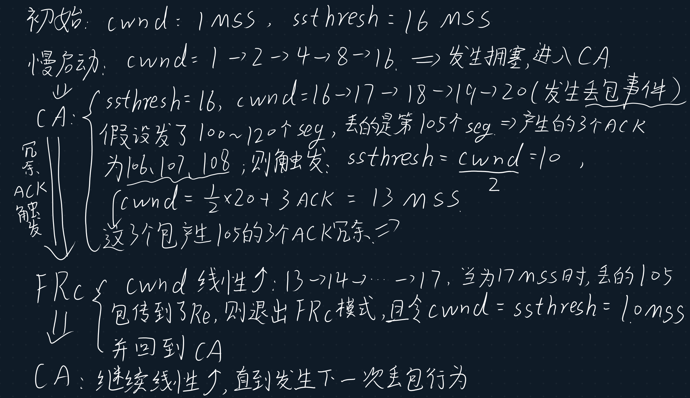


## 第四章 网络层 数据平面

### 4.1 网络层概述

#### 网络层功能

1. **转发（forwarding）**：当一个分组到达某路由器的一条输入链路时，路由器必须按照**路由器自己的路由转发表**将分组移动到正确的输出链路。

   ​	更具体地说，**转发是单个路由器将沿某条输入链路到达自身节点处的分组转发到合适的输出链路，**时间上通常只有几纳秒

   ​	**forwarding是网络层的数据平面执行的主要功能。**

2. **路由选择（routing）**：当分组从发送方转发到接收方时，网络层必须根据**路由选择算法为这些分组计算合适的转发路径**

   ​	更具体地说，路由选择是指确定分组从源到目的地所采取的端到端的网络处理范围，即确定一条可从源到目的地的路线，类似于规划导航路线。

3. **术语：**

   1. **路由选择算法 routing algorithm**
   2. **转发表 forwarding table**：路由器检查到达分组首部的**一个或多个字段值**，进而使用**这些首部值在其转发表中索引**，通过这种方法来转发分组。**这些值对应存储在转发表项中的值**，指出了该分组将被转发的路由器的输出链路接口 。  

#### 路由器中转发表的配置 ---- SDN方法

​	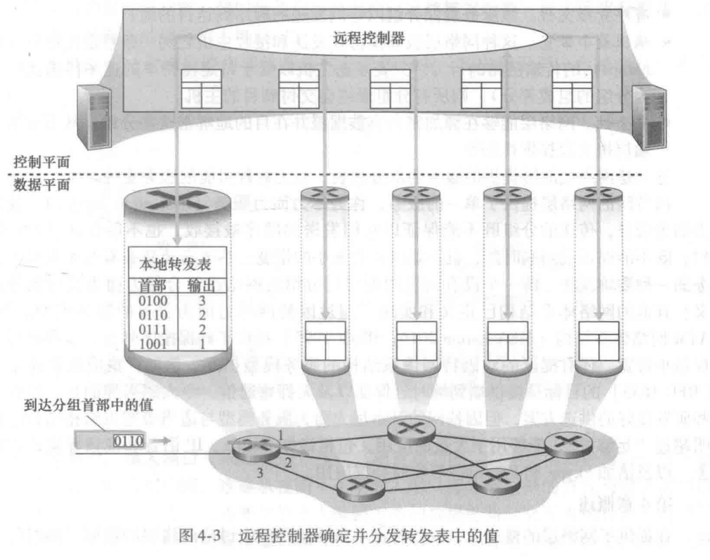

#### 网络服务模型 network service model

##### 需要解决的问题

1. 运输层向网络层发送分组时，网络层能确保分组能交到目的地么
2. 发送多个分组时，网络层能保证分组依序到达目的地么
3. 发送连续两个分组的时间间隔和接收俩个分组的时间间隔会相同么
4. 网络层会提供网络中拥塞的反馈信息么

##### 服务模型应具有的特性

1. **确保交付 。** 该服务确保分组将最终到达目的地。  
2. **具有时延上界的确保交付** 。 该服务不仅确保分组的交付，而且在特定的主机到主机时延上界（最大实验限度，如100ms）内交付。
3. **有序分组交付** 。 该服务确保分组以它们发送的顺序到达目的地  。
4. **确保最小带宽** 。 这种网络层服务模仿在**发送和接收主机之间一条特定比特率（例如1Mbps）的传输链路的行为**。只要发送主机以低于特定比特率的速率传输比特(作为分组的组成部分) ，则所有分组最终会交付到目的主机。 
5. **安全性** 。 网络层能够在源加密所有数据报并在目的地解密这些分组，从而对所有运输层报文段提供机密性 。  

##### 因特网的网络服务模型----尽力而为服务 best-effort service

​	尽量保证传输过程能够拥有以上特性，但不保证具有以上特性。

​	即一个没有向目的地交付分组的网络也符合尽力而为交付服务的定义。

#### 特定术语 分组交换机 路由器

1. 定义 **转发** 和 **交换** 这两个术语意思相同
2. **分组交换机**：一台通用分组交换设备，它根据分组首部字段中的值，以及自己的转发表，从输入链路接口到输出链路接口转移分组
3. **链路层交换机（link-layer switch**）：基于链路层帧中的字段值做出转发决定----链路层设备
4. **路由器（router）**：基于网络层数据报中的首部字段值做出转发决定----网络层设备

### 4.2 路由器工作原理

#### 路由器硬件模型及其功能


1. **输入端口（input port）：**
   1. **在输入端口要进行查找功能：查询路由转发表以决定该分组要前往（被转发）的输出端口**
   2. 与数据链路层交互来执行数据链路层功能
   3. 与物理层交互。
2. **交换结构**： 交换结构将路由器的输入端口连接到它的输出端口 。 这种交换结构完全包含在路由器之中
3. **输出端口**：从交换结构接收分组，并执行必要的链路层、物理层功能，将分组放到输出链路上
4. **路由选择处理器**：执行控制平面功能，计算和维护路由转发表

#### 4.2.1 输入端口处理和基于目的地转发	

##### 输入端口处理

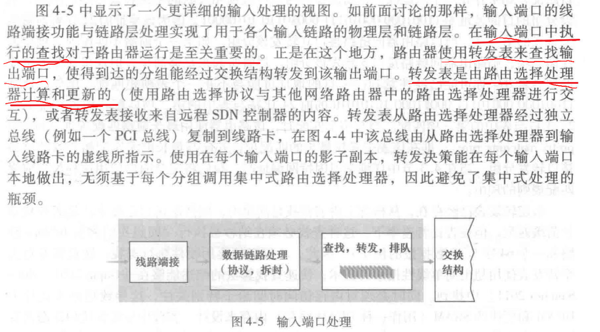


##### 基于目的地转发 的 算法 ---- 最长前缀匹配规则


​	路由器可以根据分组目的 IP 地址 的 **前缀（prefix）**与该路由器的转发表 进行匹配，如果匹配成功，就将其送到对应的输出端口。如果前三个都没匹配成功，直接使用最后一个端口进行转发。若有多个匹配项，则采用 **最长前缀匹配规则（longest prefix matching rule）**，**寻找分组可与转发表表项匹配的最长前缀项，使用与该最长前缀项关联的接口进行转发。**

### 4.3 IPv4、寻址、IPv6

#### 4.3.1 IPv4 datagram format


##### 关键字段如下：

1. **版本(号)** ：这 **4 比特**规定了数据报的 IP 协议版本。 通过查看版本号，路由器能够确定如何解释 lP 数据报的剩余部分
2. 首部长度 。
3. 服务类型 。 服务类型 (TOS) 比特包含在 IPv4 首部中，以便使不同类型的 IP 数据报（例如， 一些特别要求低时延、高吞吐量或可靠性的数据报）能相互区别开来
4. **数据报长度 。** 这是 IP 数据报的总长度（首部加上数据），**以字节计** 。 因为该字段长为 16 比特，所以 IP 数据报的理论最大长度为 65 535 字节 。**数据报很少有超过 1500 字节的**
5. **标识、标志、片偏移** 。 这 三个字段与所谓 **IP 分片**有关
6. **寿命** 。 **寿命 (Time-To-Live , TTL)** 字段用来确保数据报不会永远（如由于长时间的路由选择环路）在网络中循环 。 每当一台路由器处理数据报时，该字段的值减 1。若 TTL字段减为 0 ，则该数据报必须丢弃 。
7. 协议。该字段通常仅当一个 IP 数据报到达其最终目的地时才会有用 。 **该字段值指示了lP数据报的数据部分应交给哪个特定的运输层协议** 。 例如，值为 6 表明数据部分要交给 TCP ，而值为 17 表明数据要交给 UDP 。
8. 首部检验和 。 首部检验和用于帮助路由器检测收到的 IP 数据报中的比特错误 。 首部检验和是这样计算的:将首部中的每 2 个字节当作一个数，用反码算术对这些数求和 。
9. **源和目的 IP 地址** 。 当某源生成一个数据报时，它在源 IP 字段中插入它 的 IP 地址，在目的 IP 地址字段中插入其最终目的地的地址 。 通常源主机通过 DNS 查找来决定目的地址，就像第二章谈的
10. 选项。选项字段允许 IP 首部被扩展 。 首部选项意味着很少使用
11. **数据（有效载荷）**：我们来看看最后也是**最重要的字段**，这是数据报存在的首要理由！在大多数情况下， IP 数据报中的数据字段包含要交付给目的地的运输层报文段 ( TCP 或 UDP)。

**首部总长**：注意到一个 IP 数据报有总长为 20 字节的首部(假设无选项) 。 如果数据报承载一 个TCP 报文段，则 每个(无分片的)数据报共承载了**总长 40 字节的首部 （20 字节的 IP 首部加上 20 字节的 TCP 首部）**以及应用层报文


#### 4.3.2 IPv4 datagram 分片

##### 关键概念

- **原始数据报 (Original Datagram):** 指的是**未分片前**，包括IP头部和上层协议数据在内的整个IP数据报。
- **数据部分 (Payload/Data Portion):**  IP  数据报中报文段segment的那一部分。
- **IP头部 (IP Header):** IPv4的标准头部大小是 **20字节**。
- **MTU (Maximum Transmission Unit):** 链路层可以传输的最大帧大小，对于IP层来说，它限制了单个IP数据报（包括IP头部）的最大大小。

##### 分片的原因和概念

​	**分片 (Fragmentation)：**将一个大的 IP 数据报分割成多个小的 **IP 数据报片段（fragment）**的过程。

​	**原因**：因为链路层传输时可能目的路径上的链路所用协议不同，造成每段链路 MTU 大小可能不同，进而导致 IP 数据报的大小要随 MTU 的大小进行调整。 

##### 怎么分片以及接收方怎么确认分片是否丢失

- **识别号 (Identification):** 

  ​	**原始数据报和所有由该原始数据报形成的分片数据报**都使用**相同**的识别号，用于在目的端重组时识别它们是否是同一个较大的数据报的片。

  ​	当生成数据报时，发送方要为datagram 贴上标识号。**发送主机通常为它发送的每个数据包标识 + 1（递增）。**

- **标志 (Flags):**

  - **MF (More Fragments) 位：** 如果设置为1，表示这不是原始数据报的最后一个分片。如果设置为0，表示这是最后一个分片。

- **片偏移 (Fragment Offset):**

  - 表示当前分片的数据部分在原始数据报数据部分中的起始位置。
  - 这个值以 **8字节为单位**。这意味着除了最后一个分片外，所有分片的数据部分大小都必须是8的倍数。
  - 计算方法：（当前分片数据部分的起始字节在**原始数据报数据部分**中的偏移量） / 8。
  - 因为 **IP头部中的Fragment Offset字段只有13位**，无法直接表示每个字节的精确偏移量。为了能够表示更大的偏移量，TCP/IP协议设计者决定使用8字节作为单位。这意味着，**除了最后一个分片，所有分片的数据部分长度都必须是8字节的倍数。**

#### 4.3.3 IPv4 编址

##### 接口 interface

​	主机与物理链路之间的边界叫接口，用于将数据包封装成 帧（frame）并发送到链路上。

##### 点分十进制记法 dotted-decimal notation

​	每个 IP 地址长度是 32 bit。地址中的每个字节（ 8 bit ）用它的十进制形式标识，每个字节间用 dot 隔开。例如 IP 192.168.1.1 中 192 就是第一个字节的十进制等价数，二进制为 `11000001`。

##### 全球因特网中的每台主机和路由器接口，都必须有一个 全球唯一的 IP 地址标识

##### 子网 subnet

​	**子网 (Subnet)** 是一个大的IP网络被逻辑上分割成若干个较小的、独立的网络段。在一个子网中，所有连接的设备（主机和路由器接口）都共享同一个**网络前缀（network prefix）**。

**例子：**

​	形如 223.1.1.xxx、223.1.2.xxx、223.1.4.xxx，意思是前24位比特是相同的，它们每一个都是一个一个子网的 IP ，**子网内部的主机的 IP 的 前缀是相同的**，叫做网络前缀。子网的 IP 是一段 IP地址（一块连续的 IP地址）。IP编址为为第一个子网分配一个地址： 223.1.1.0/24，其中 **/24 的记法叫做子网掩码(network mask)，指示 32 比特中的前 24比特定义了子网的地址。**任何要连到 223.1.1.0/24 网络 的主机 的 IP 地址必须是223.1.1.xxx形式

**特点：**

- **无需路由器即可直接通信：** 同一个子网内的设备可以直接通过二层交换机进行通信，而不需要通过路由器。
- **独立的广播域：** 每个子网都是一个独立的广播域。广播消息只会在子网内部传播，不会跨越路由器。
- **路由器的作用：** 路由器是连接不同子网的设备。路由器的每一个接口都必须连接到一个不同的子网，并且每个接口都有该子网内的一个IP地址。

**比喻：网络岛**

- **岛屿：** 每个子网就像是一个独立的“岛屿”，岛上的所有设备都属于这个岛屿，它们之间可以自由地、直接地交流（即数据在二层直接转发，不需要路由）。
- **海洋：** 连接这些“岛屿”的可能是“海洋”（公共互联网或其他广域网连接）。
- **港口/桥梁：** 路由器扮演着“港口”或“桥梁”的角色。路由器的每个接口就像一个独立的“码头”，连接着一个特定的“岛屿”。数据要从一个岛屿（子网）发送到另一个岛屿（子网），就必须通过这些“港口”和“桥梁”（路由器）进行“跨海”传输（即三层路由）。

##### 子网掩码 network mask 

​	例如一个子网的 IP 为 223.1.1.0/24 ，则其中的 /24 即子网掩码。

**作用：**

​	用于区分IP地址中哪些位是网络ID，哪些位是主机ID。**子网掩码中连续的 1 表示网络位，连续的 0 表示主机位。**

注意：**子网掩码是连续的 1 和 0。** 中间不能有 101 这样的跳变。

##### 特别的子网 IP

- **0.0.0.0**：固定用于当一个新的主机加入子网时，其广播请求与DHCP服务器交互并获得子网IP时所用的暂时性 IP。或者说，当DHCP服务器收到 一个 0.0.0.0 的DHCP发现报文时，就知道有主机在请求获得子网 IP 要加入子网。 

- **255.255.255.255(广播地址)**：固定用于广播时，DHCP服务器发出的 DHCP提供报文时所用的暂时性 IP 。

  ​	因为当一个新的主机加入子网并请求获得子网 IP 时，它广播所发的DHCP发现报文的目的IP地址就是255.255.255.255。**DHCP服务器发出的 DHCP提供报文时用的源 IP 就是255.255.255.255**，用于广播到 新主机时，新主机能够识别这是一封回应它的DHCP提供报文，里面有推荐使用的子网 IP。

因此这两个 IP 是固定 IP，每一个子网里都不能将它们分给子网主机。

##### CIDR 无类别域间路由选择

​	因特网的地址分配策略被称为无类别域间路由选择（Classless Interdomain Routing，CIDR）。使用子网寻址时，32 比特的 IP 地址被划分为 网络地址 + 主机地址，并且也具有点分十进制数形式：a.b.c.d/x，其中 /x 是子网掩码，x 指示了网络地址的比特数。

**优点：**

1. **无类别 (Classless)：** 不再有A、B、C类的限制。一个IP地址的网络部分不再由它的第一个八位字节决定，而是由其后的“/”符号和数字（即前缀长度）来精确定义。
   1. A 类 地址：指的是 网络 IP 部分长度为 8 位，后面的 24 位都用来做子网主机 IP
   2. B 类 地址：指的是 网络 IP 部分长度为 16 位，后面的 16 位都用来做子网主机 IP
   3. C 类 地址：指的是 网络 IP 部分长度为 24 位，后面的 8 位都用来做子网主机 IP
   4. 会出现很大的缺点：C 类可分配主机 IP 才 256-  2 = 254个，而B类可分配 65536 - 2 = 65534 个IP，子网根本用不到这么多 IP，造成极大的地址浪费。
2. **网络前缀 (Network Prefix)：** CIDR 地址的表示方法是 IP地址/前缀长度。例如，192.168.1.0/24。
   - **IP地址：** 192.168.1.0。
   - **前缀长度 (/24)：** 表示IP地址的前24位是网络部分（网络ID），剩下的 32 - 24 = 8 位是主机部分（主机ID）。
3. **子网掩码 (Subnet Mask)：** 前缀长度可以直接推导出子网掩码。/24 对应 255.255.255.0。/20 对应 255.255.240.0。

**作用**：

1. **更高效的IP地址分配 (Variable Length Subnet Masking - VLSM / 可变长子网掩码)：**
   - CIDR允许网络管理员**使用任何长度的网络前缀**来创建子网，不受A、B、C类的限制。这意味着你可以根据实际需求，创建大小不一的子网。
   - 例如，一个 /24 的网络可以被进一步划分为多个 /27 或 /28 的子网，每个子网的主机数量更少，从而减少IP地址浪费。
2. **路由聚合/路由汇总 (Route Aggregation / Supernetting)：**
   - 这是CIDR解决路由表膨胀问题的关键。通过路由聚合，多个连续的、具有共同网络前缀的子网可以在路由表中被一条**更短前缀**的路由条目所代表。
   - 例如，如果你有 203.0.113.0/24、203.0.114.0/24、203.0.115.0/24 等一系列网络，这些网络可能都属于同一个ISP或大型机构。通过CIDR，它们可以被聚合为一条 203.0.112.0/21 的路由条目，大大减少了骨干路由器所需的路由信息。 ---- 减少了网络地址 ，增加了 三位 主机地址
   - 这有点像“超网”的概念，将多个小网络合并成一个更大的逻辑网络进行路由。
3. **支持层次化路由 (Hierarchical Routing)：**
   - CIDR促进了互联网路由的层次化结构。例如，一个大型ISP可以被分配一个大的CIDR块，然后该ISP再将其划分为更小的块分配给其客户。这样，外部路由器只需要知道如何到达ISP的整个块，而不需要知道其内部每个客户的具体子网。

**例子：**

1. **192.168.1.0/24**	
   - 网络ID（网络地址）：192.168.1.0  即前24位
   - 主机ID： 0.0.0.0 后8位
   - 子网掩码：255.255.255.0 即前24位是网络ID，故全是 1，后 8 位是主机ID，故全是 0
   - 可用主机数：2^8 - 2 = 254
2. **192.168.1.0/27** **(VLSM的应用)**
   - 网络ID：192.168.1.0 前27位
   - 主机ID： 0.0.0.0 后5位
   - 子网掩码：255.255.255.224（1110 0000 是224）
   - 可用主机数： 32 - 2 = 30
   - 意味着 **192.168.1.0/24**这个网络可被划分成 8 个（占用了3位 主机ID） /27 的子网，每个子网可用主机数为 30个

#### 子网划分 Subnetting

##### 定义

​	**子网划分**是指将一个大的IP网络（通常由一个网络地址和默认子网掩码定义）逻辑上分成若干个更小的、独立的网络段（即子网）。这样做的目的是更有效地利用IP地址资源、提高网络性能、增强网络安全性以及简化管理。

##### 为什么要进行子网划分？

- **减少广播域：** 每个子网都是一个独立的广播域。广播消息只会在子网内部传播，不会跨越路由器。这减少了网络中不必要的广播流量，提高了网络效率。
- **提高网络性能：** 减小广播域可以降低网络设备的CPU负载，并且可以减少冲突域（在以太网中），从而提高整体网络性能。
- **安全性：** 不同子网之间通常需要通过路由器进行通信，路由器可以配置防火墙规则，实现对不同子网间流量的过滤和控制，增强安全性。
- **IP地址有效利用：** 特别是在早期IP地址稀缺的时代，子网划分可以避免浪费大量的IP地址。例如，一个C类地址 /24 有254个可用主机，如果一个部门只需要10个主机，就可以通过子网划分将这个网络分成多个小网络，每个小网络只分配所需数量的地址。

##### 怎么划分子网----计算

子网划分是通过**借用IP地址的**主机位**来创建额外的**网络位**（即增加子网掩码的长度）来实现的。

**IP地址结构：**网络地址 + 主机地址
**子网掩码：** 用于区分IP地址中哪些位是网络地址，哪些位是主机地址。子网掩码中连续的 1 表示网络位，连续的 0 表示主机位。

**一般步骤：**

1. **明确需求：**
   - 你拥有哪个原始网络地址和子网掩码（例如：192.168.1.0/24）。
   - 你需要划分出多少个子网？或每个子网需要容纳多少台主机？（这两个是互相制约的，满足一个即可推导出另一个）
2. **确定新的子网掩码（即借用多少位主机位）：**
   - **方法一：根据需要的子网数量。** 如果**需要 N 个子网**，则**需要借用 n 位主机位**，使得 2^n >= N。
   - **方法二：根据每个子网需要的主机数量。** 如果每个子网需要 H 台主机，则**需要保留 h 位主机位**（用于主机ID），使得 2^h - 2 >= H (减2是因为网络地址和广播地址不能分配给主机)。然后 n = 32 - (原始网络位数) - h。
3. **计算新的子网掩码：** 将原始子网掩码的位数加上 n（借用的主机位数），得到新的CIDR表示法，然后转换为点分十进制。
4. **计算子网的步长 (Block Size / Increment)：** 这是**划分新子网的关键**。找到新子网掩码中最后一个发生变化的八位字节（即从1变为0的边界所在的八位字节）。用 256 减去这个八位字节的十进制值，得到的就是子网地址的增量。
5. **列出每个子网的信息：**
   - **网络地址 (Network Address)：** 每个子网的第一个地址（主机位全为0）。
   - **可用主机范围 (Usable Host Range)：** 从网络地址加1到广播地址减1。
   - **广播地址 (Broadcast Address)：** 每个子网的最后一个地址（主机位全为1）。
   - **子网掩码：** 新计算出的子网掩码。

##### 划分例子

**例1：根据子网数量需求进行划分**

​	你有一个C类网络地址 192.168.1.0/24。现在需要每个子网能够容纳至少 10 台主机。请列出前两个子网的详细信息。

**解答：**

1. **原始网络：** 192.168.1.0/24 (子网掩码是 255.255.255.0)。
2. **确定主机位数 h：**
   - 每个子网需要容纳至少 10 台主机。
   - 2^h - 2 >= 10
   - 当 h=1 时，2^1-2=0 (不足10)
   - 当 h=2 时，2^2-2=2 (不足10)
   - 当 h=3 时，2^3-2=6 (不足10)
   - 当 h=4 时，2^4-2=14 (满足10)
   - 所以，需要保留 **4 位** 作为主机位。
3. **计算新的子网掩码：**
   - 总位数 32 - 主机位 4 = 28。
   - 新的子网掩码是 /28。
   - 转换为点分十进制：/28 表示前28位是1。
     - 11111111.11111111.11111111.**1111**0000 (最后一位的1111是借用的4位)
     - 最后一个八位字节：11110000 转换成十进制是 128 + 64 + 32 + 16 = 240。
   - **新的子网掩码是 255.255.255.240。**
4. **计算可划分的子网数量：**
   - 借用的位数：28 - 24 = 4 位。
   - 可划分的子网数量：2^4 = 16 个。
5. **计算子网步长：**
   - 最后一个八位字节的子网掩码值是 240。
   - 子网步长 = 256 - 240 = 16。这意味着每个子网的网络地址在第四个八位字节上以16递增。
6. **列出子网信息：**
   - **子网 1：**
     - 网络地址：192.168.1.0/28
     - 可用主机范围：192.168.1.1 到 192.168.1.14
     - 广播地址：192.168.1.15
   - **子网 2：**
     - 网络地址：192.168.1.16/28
     - 可用主机范围：192.168.1.17 到 192.168.1.30
     - 广播地址：192.168.1.31

**例2：根据每个子网主机数量需求进行划分**

你有一个C类网络地址 192.168.10.0/24。你的公司有三个部门，每个部门需要至少 25 台主机。请为公司划分足够的子网，并列出前两个子网的：网络地址、子网掩码、可用主机IP范围、广播地址。

**解答：**

1. **原始网络信息：**
   - IP地址：192.168.10.0
   - 原始子网掩码：/24 (255.255.255.0)。这意味着前24位是网络位，后8位是主机位。
2. **确定每个子网所需主机位数 (h)：**
   - 每个子网至少需要25台主机。
   - 我们知道 2^h - 2 >= 25。
   - 如果 h=4，2^4 - 2 = 14 (不足25)
   - 如果 h=5，2^5 - 2 = 30 (满足25)
   - 所以，我们需要保留 **5 位** 作为主机位。
3. **计算新的子网掩码 (n，借用位数)：**
   - 原始主机位是 8 位。
   - 借用位数 n = 8 - 5 = 3 位。
   - 新的网络位总长度 = 24 + 3 = 27。
   - 新的子网掩码是 /27。
4. **将 /27 转换为点分十进制子网掩码：**
   - /27 意味着前27位是1。
   - 11111111.11111111.11111111. **111**00000 (最后八位，借用了3位)
   - 最后一位的十进制值是 128 + 64 + 32 = 224。
   - **新的子网掩码是 255.255.255.224。**
5. **计算子网数量和步长：**
   - 子网数量：2^n = 2^3 = 8 个子网（满足划分3个部门的需求）。
   - 子网步长 (或块大小)：256 - 224 = 32。这意味着每个子网的网络地址在第四个八位字节以32递增。
6. **列出前两个子网的详细信息：**
   - **子网 1 (Department 1)：**
     - 网络地址：192.168.10.0/27
     - 可用主机IP范围：192.168.10.1 到 192.168.10.30
     - 广播地址：192.168.10.31
     - 子网掩码：255.255.255.224
   - **子网 2 (Department 2)：**
     - 网络地址：192.168.10.32/27
     - 可用主机IP范围：192.168.10.33 到 192.168.10.62
     - 广播地址：192.168.10.63
     - 子网掩码：255.255.255.224
   - **子网 3 (Department 3)：** (虽然只要求前两个，但为了完整性，这里也列出)
     - 网络地址：192.168.10.64/27
     - 可用主机IP范围：192.168.10.65 到 192.168.10.94
     - 广播地址：192.168.10.95
     - 子网掩码：255.255.255.224

**例三：给定IP和子网掩码，分析其所属子网**

给定IP地址 192.168.10.75 和子网掩码 255.255.255.240。
请确定：

1. 该IP地址所属的网络地址。
2. 该子网的广播地址。
3. 该子网可用的主机IP地址范围。
4. 该子网可用的最大主机数量。

**解答：**

1. **转换为二进制：**
   - IP地址 192.168.10.75： 11000000.10101000.00001010.01001011
   - 子网掩码 255.255.255.240：11111111.11111111.11111111.11110000 (/28)
2. **网络地址 (IP地址 AND 子网掩码)：**
   - ​     11000000.10101000.00001010.01001011
   - &  11111111.11111111.11111111.11110000
   - ​     -------------------------------------
   - ​     11000000.10101000.00001010.01000000
   - 转换为十进制：192.168.10.64
   - **网络地址是：192.168.10.64**
3. **广播地址：**
   - 子网掩码是 /28，意味着主机位有 32 - 28 = 4 位。
   - 在网络地址 192.168.10.64 的基础上，将主机位（最后4位）全部置为1。
   - 01000000 (64的二进制) 的最后4位是 0000。
   - 将 0000 变为 1111，得到 01001111。
   - 01001111 转换为十进制是 64 + 8 + 4 + 2 + 1 = 79。
   - **广播地址是：192.168.10.79**
4. **可用主机IP地址范围：**
   - 从网络地址的下一个地址到广播地址的前一个地址。
   - **范围是：192.168.10.65 到 192.168.10.78。**
5. **可用主机数量：**
   - 主机位有4位 (2^4 - 2)
   - 16 - 2 = 14

#### DHCP 协议

​	DHCP（动态主机配置协议，Dynamic Host Configuration Protocol）是一个局域网的网络协议，用于自动化地为网络设备分配IP地址、子网掩码、默认网关、DNS服务器地址等网络配置信息。

​	DHCP的工作流程通常被称为 **DORA** 过程，分别代表 Discover（发现）、Offer（提供）、Request（请求）和 ACK（确认）。

##### DHCP 工作流程 (DORA)

1. **Discover (发现)**

- **发起方：** 客户端（新接入网络的设备，或需要更新IP配置的设备）。
- **发送消息：** DHCP Discover message。 DHCP发现报文，是一个广播消息
- **发送方式：** 客户端在此时还没有IP地址，所以它会发送一个目的IP地址为 255.255.255.255（广播地址）的UDP数据包，源IP地址为 0.0.0.0。数据包中会包含客户端的MAC地址以及一个**事务ID（Transaction ID）**。
- **目的：** 寻找网络中的DHCP服务器。

2. **Offer (提供)**

- **发起方：** 收到 DHCP Discover 消息的DHCP服务器。
- **发送消息：** DHCP Offer message。DHCP 提供报文，广播消息
- **发送方式：** DHCP服务器会**从其可用的IP地址池中选择一个IP地址，连同子网掩码、你的第一跳路由器（常叫默认网关）、DNS服务器地址、IP地址租用期（address lease time）**等配置信息，封装成 DHCP Offer 消息。由于客户端此时仍然没有IP地址，服务器通常会将此消息作为**广播**发送（或者直接发送到客户端的MAC地址，但早期客户端通常会在Discover消息中设置一个广播标志，让服务器也以广播形式回应）。消息中同样包含事务ID。
- **目的：** 向客户端提供一个或多个可用的IP配置方案。如果网络中有多个DHCP服务器，它们都可能回应 DHCP Offer。

3. **Request (请求)**

- **发起方：** 客户端。
- **发送消息：** DHCP Request message。DHCP 请求报文
- **发送方式：** 客户端收到一个或多个 DHCP Offer 消息后，会选择其中一个（通常是第一个收到的或偏好的）方案。然后，客户端发送一个 DHCP Request 广播消息。这个消息中会明确指明它**选择了哪个DHCP服务器提供的哪个IP地址**（通过“请求IP地址”和“服务器标识符”字段）。
- **目的：**
  - 正式向选定的DHCP服务器请求分配该IP地址及配置。
  - 同时，也告知**其他DHCP服务器**它已经选择了某个服务器的方案，让其他服务器收回它们之前提供的IP地址，并将其放回地址池。

4. **ACK (确认)**

- **发起方：** 客户端所选择的DHCP服务器。
- **发送消息：** DHCP ACK（Acknowledgment）message 单播消息。DHCP ACK报文 
- **发送方式：** 选定的DHCP服务器收到 DHCP Request 后，会最终确认分配这个IP地址和其他配置信息。它会发送一个 DHCP ACK 消息给客户端。此时，客户端已经知道了自己即将使用的IP地址，所以服务器通常会以**单播**形式发送此消息到客户端的新IP地址。
- **目的：**
  - 正式确认IP地址租约成功，并将完整的配置信息发送给客户端。
  - 客户端收到 DHCP ACK 后，就可以正式使用分配到的IP地址和其他网络参数进行通信了。

##### 额外的重要流程和概念：

- **DHCP 租约 (Lease)：** DHCP分配的IP地址通常是临时的，有租约时间。客户端需要在租约到期前更新租约。
  - **租约更新：** 通常在租约时间过半（T1时间）时，客户端会直接向之前分配IP的DHCP服务器发送 DHCP Request （单播）。如果成功，服务器会回应 DHCP ACK。
  - **重新绑定：** 如果T1时间到期未收到回应，客户端会在租约时间八分之七（T2时间）时，再次发送 DHCP Request （广播），尝试联系任何DHCP服务器。
  - **过期：** 如果租约到期后仍未成功更新，客户端会放弃当前IP地址，并重新开始DORA过程。
- **DHCP NAK (Negative Acknowledgment)：** 如果客户端请求的IP地址由于某种原因（例如IP地址已被占用，或与网络不兼容等）无法分配，DHCP服务器会发送 DHCP NAK 消息给客户端，客户端将重新开始DORA过程。
- **DHCP Relay Agent (DHCP 中继代理)：**
  - 由于 DHCP Discover 和 DHCP Request 消息都是广播消息，它们默认无法穿透路由器（路由器不转发广播）。
  - 在大型网络中，通常每个子网内不会都部署DHCP服务器。这时，路由器会配置一个 **DHCP 中继代理**。
  - DHCP 中继代理会将客户端的 DHCP Discover 和 DHCP Request 广播消息**转发**（以单播形式）给指定的DHCP服务器（通常在另一个子网）。
  - DHCP服务器收到消息后，会将 DHCP Offer 和 DHCP ACK 单播给DHCP中继代理，再由中继代理转发给客户端。
  - 这样，客户端即使不在DHCP服务器所在的子网，也能获取到IP地址。

##### 为什么DHCP服务器回应Offer时也采用广播 (255.255.255.255)？

1. **客户端尚未完全配置IP：** 尽管客户端知道自己将可能使用的IP地址，但它在收到 DHCP Offer 之前并没有正式配置该IP地址到自己的网络接口上。在很多实现中，客户端在 DHCP Offer 阶段仍然不拥有一个有效的IP地址，无法接收单播IP报文。为了确保Offer能够到达客户端，广播是最保险的方式。
2. **早期客户端实现兼容性：** 早期或某些简化实现的客户端可能无法处理DHCP Offer的单播。为了最大程度的兼容性，DHCP服务器选择广播。

### ICMP 协议

​	ICMP (Internet Control Message Protocol) 是**互联网控制消息协议**的缩写。它是 TCP/IP 协议族中的一个核心协议，主要用于在 IP 网络中传递**控制消息和错误报告**。

#### ICMP 的核心功能和目的：

1. **错误报告 (Error Reporting):**
   - 当路由器或主机在处理 IP 数据报时遇到问题（例如，数据报无法送达、TTL过期、需要分片但设置了“不分片”标志等），它会向原始发送方发送一个 ICMP 错误消息。
   - **重要性：** IP 协议本身是“尽力而为”且无连接的，它不会通知发送方数据报是否成功送达。ICMP 填补了这一空白，让发送方能够知道网络中发生了什么问题。
2. **网络诊断和查询 (Network Diagnostics and Queries):**
   - ICMP 也用于网络管理员和用户进行网络诊断，检查网络连接性、延迟和路径等信息。
   - **重要性：** 这是 ping 和 traceroute (或 tracert) 这类常用网络工具的基础。

#### ICMP 的特点：

- **位于网络层 (OSI L3):** ICMP 协议与 IP 协议紧密结合，它不是一个独立的传输协议（如 TCP 或 UDP），而是 IP 协议的“辅助”或“支持”协议。ICMP 消息被封装在 IP 数据报的有效载荷（payload）中。
- **不提供可靠性：** ICMP 消息本身也是通过 IP 数据报传输的，因此它和 IP 一样，不提供可靠传输（即 ICMP 消息本身也可能丢失）。它不会为自己发送的错误消息提供确认或重传。
- **没有端口号：** ICMP 消息不是为了在应用层进程之间传输数据，而是为网络层（IP层）或网络管理工具提供信息，因此它不使用 TCP 或 UDP 的端口号。

#### 常见的 ICMP 消息类型：

ICMP 消息通过其**类型 (Type)** 和**代码 (Code)** 字段来区分不同的消息内容。

##### 1. 错误报告消息：

- **Destination Unreachable (目标不可达) - Type 3:**
  - **Code 0:** Network Unreachable (网络不可达)
  - **Code 1:** Host Unreachable (主机不可达)
  - **Code 2:** Protocol Unreachable (协议不可达)
  - **Code 3:** Port Unreachable (端口不可达)
  - **Code 4:** Fragmentation Needed and Don't Fragment (DF) Bit Set (需要分片但DF位被设置，用于PMTUD)
  - **Code 5:** Source Route Failed (源路由失败)
  - ...等等
  - **场景：** 当路由器无法将数据包转发到目标网络或主机时，或目标主机没有监听指定端口时，发送此消息。
- **Time Exceeded (时间超时) - Type 11:**
  - **Code 0:** TTL (Time To Live) Exceeded in Transit (TTL在传输过程中过期)
  - **Code 1:** Fragment Reassembly Time Exceeded (分片重组时间过期)
  - **场景：** 数据包的 TTL 字段在传输过程中变为 0（通常由路由器发送，防止数据包在网络中无限循环），或分片在规定时间内未能全部到达。这是 traceroute 工具工作的基础。
- **Redirect (重定向) - Type 5:**
  - **Code 0:** Redirect Datagram for the Network (网络重定向)
  - **Code 1:** Redirect Datagram for the Host (主机重定向)
  - **场景：** 路由器告诉发送方，有更好的路径可以到达目标网络或主机，并建议发送方将数据包发送到另一个路由器。
- **Parameter Problem (参数问题) - Type 12:**
  - **Code 0:** Pointer indicates the error (指向错误的参数)
  - **场景：** IP 头部中存在非法或有问题的字段。

##### 2. 查询/信息消息：

- **Echo Request (回显请求) - Type 8:**
  - **场景：** 发送方发送此消息以测试与目标主机的连通性。这是 ping 命令发送的请求包。
- **Echo Reply (回显回复) - Type 0:**
  - **场景：** 接收方收到 Echo Request 后，发送此消息作为响应。这是 ping 命令接收到的回复包。
- **Timestamp Request/Reply (时间戳请求/回复) - Type 13/14:**
  - **场景：** 用于测量两个主机之间的时间差，但不如直接测量 RTT 常用。

#### ICMP 的应用示例：

- **Ping 工具：** 使用 ICMP 的 Echo Request (Type 8) 和 Echo Reply (Type 0) 消息来测试两台主机之间的连通性以及测量往返延迟 (RTT)。
- **Traceroute/Tracert 工具：** 通过发送 TTL (Time-To-Live) 逐渐增加的 IP 数据包，并利用 ICMP 的 Time Exceeded (Type 11, Code 0) 消息来发现数据包从源到目标的路径（经过了哪些路由器），并测量每个跳的延迟。
- **Path MTU Discovery (PMTUD)：** 当数据包设置了“不分片”标志 (DF Bit) 但遇到小于数据包大小的 MTU 链路时，路由器会发送 ICMP Destination Unreachable (Type 3, Code 4) 消息给发送方，告诉它需要更小的 MTU。发送方收到后会调整后续数据包的大小。

#### 安全注意事项：

​	由于 ICMP 可以用于网络诊断和发现信息，它也可能被恶意用户利用进行网络侦察（例如，通过 ping 扫描发现活跃主机）或拒绝服务攻击（例如，Smurf 攻击）。因此，许多防火墙和网络设备会配置规则来限制或过滤某些类型的 ICMP 消息，以增强安全性。

#### Ping 和 Traceroute 的区别

##### ping (Packet Internet Groper)

ping 是一个非常基础且常用的网络工具，用于测试主机之间 IP 层级的连通性。

- **目的：**
  1. **测试连通性：** 检查目标主机是否可达。
  2. **测量往返时间 (RTT)：** 估算数据包从源主机发送到目标主机并返回所需的时间。
  3. **检测丢包：** 报告在传输过程中是否有数据包丢失。
- **工作原理：**
  - ping 命令发送 **ICMP Echo Request (类型 8)** 消息到目标主机。
  - 如果目标主机可达且允许 ICMP 响应，它会回复 **ICMP Echo Reply (类型 0)** 消息。
  - ping 测量发送请求和接收回复之间的时间差，从而计算 RTT。它还通过发送多个请求并统计回复的数量来计算丢包率。
- **提供的信息：**
  - 目标主机的 IP 地址。
  - 每个数据包的 RTT (毫秒)。
  - TTL (Time To Live) 值。
  - 传输的字节数。
  - 丢包率和发送/接收/丢失的数据包数量。
- **适用场景：**
  - 快速检查某个网站或服务器是否在线。
  - 诊断基本的网络连接问题（例如，无法访问某个网站时，首先 ping 一下看是不是网络不通）。
  - 粗略估计网络延迟。
- **局限性：**
  - 只告诉你源和目标之间**是否**连通以及**延迟**是多少，但无法告诉你数据包在中间经过了哪些路由器或在哪里可能出现了问题。
  - 许多防火墙和路由器会配置为阻止或限制 ICMP Echo 请求和回复，这可能导致 ping 失败，即使目标主机实际上是可达的（但这通常意味着目标主机不允许 ICMP 探测）。

##### traceroute / tracert

traceroute 用于显示数据包从源主机到目标主机所经过的路径（即“跳数”或“路由器的序列”），并测量到达每个中间路由器的往返时间。

- **目的：**
  1. **路径发现：** 找出数据包在互联网上从源到目标所经过的路由器（跳）。
  2. **定位故障点：** 帮助确定网络中断或延迟增加发生在哪一跳。
  3. **分析路由：** 了解流量是如何路由的，以及是否存在非预期的路径。
- **工作原理：**
  - traceroute 的核心机制是利用 IP 头部中的 **TTL (Time To Live) 字段**和 **ICMP Time Exceeded (类型 11，代码 0)** 消息。
  - **逐步探测：**
    1. traceroute 首先发送一个数据包，将其 TTL 值设置为 1。
    2. 当这个数据包到达第一个路由器时，路由器会将 TTL 减 1。由于 TTL 变为 0，路由器会丢弃该数据包，并向源主机发送一个 **ICMP Time Exceeded** 消息。这个消息中包含了该路由器的 IP 地址。
    3. 源主机接收到第一个路由器的 ICMP Time Exceeded 消息后，发送第二个数据包，将其 TTL 值设置为 2。
    4. 这个数据包会通过第一个路由器（TTL减1，变为1），到达第二个路由器。第二个路由器再次将 TTL 减 1，变为 0，然后丢弃数据包，并向源主机发送 ICMP Time Exceeded 消息。
    5. 这个过程重复进行，每次 TTL 值递增 1，直到数据包最终到达目标主机。
  - **到达目标：** 当数据包到达目标主机时，如果它是一个 UDP 数据包（这是 traceroute 的常见做法，通常发送到一个不常用的端口），目标主机可能会回复一个 **ICMP Port Unreachable (类型 3，代码 3)** 消息，表示该端口没有应用程序监听，这标志着路径的结束。如果使用 ICMP Echo Request，目标会回复 Echo Reply。
- **提供的信息：**
  - 到达目标主机所经过的每个路由器的 IP 地址（或主机名，如果可解析）。
  - 到达每个路由器（跳）的三个往返时间 (RTT) 测量值（通常发送三个探测包来获取更精确的测量）。
  - 如果某个路由器没有响应，会显示星号 (*)。
- **适用场景：**
  - 当 ping 失败时，traceroute 可以帮助你找出故障发生在哪一跳。
  - 当延迟较高时，traceroute 可以帮助你识别哪一跳引入了大部分延迟。
  - 分析网络拓扑和路由路径。
- **局限性：**
  - 由于负载均衡、防火墙或 ICMP 速率限制，traceroute 报告的路径可能不总是完全准确或稳定。某些路由器可能不会回复 ICMP Time Exceeded 消息，导致出现 *。
  - traceroute 测量的是到每个跳的 RTT，而不是跳之间的 RTT。跳之间的延迟需要通过计算来推断。
  - 路径可能不是对称的，即去程和回程可能经过不同的路径。

##### 总结比较表：

| 特性         | ping                                     | traceroute / tracert                                         |
| ------------ | ---------------------------------------- | ------------------------------------------------------------ |
| **主要目的** | 测试端到端连通性，测量往返延迟和丢包率。 | 发现数据包到目标所经过的路径（跳），测量到每跳的延迟。       |
| **工作原理** | 发送 ICMP Echo Request/Reply。           | 逐步增加 IP 数据包的 TTL 值，利用 ICMP Time Exceeded 消息从中间路由器获取信息。 |
| **底层协议** | ICMP (Internet Control Message Protocol) | ICMP (Time Exceeded, Port Unreachable)，通常结合 UDP 或 ICMP Echo Request。 |
| **提供信息** | 目标是否可达，直接的 RTT，丢包率。       | 路由路径上的每个路由器（跳），到达每个跳的 RTT。             |
| **输出格式** | 总结性统计（成功/失败，平均 RTT）。      | 逐跳列出 IP 地址和 RTT。                                     |
| **适用场景** | 快速诊断基本连通性。                     | 故障定位（哪个路由器有问题），路由分析。                     |
| **比喻**     | “喂，你在吗？我听到你了吗？”             | “喂，第一个路口，你是谁？下一个路口，你是谁？” 这样一路问过去。 |

简单来说：

- **ping 告诉你“路通不通，堵不堵？”** (连通性和延迟)。
- **traceroute 告诉你“路是怎么走的，哪个路口堵了？”** (路径和故障点)。

## 第五章 网路层 控制平面

## 第六章 链路层

### 重点

#### 随机接入协议中的ALOHA协议

#### CSMA/CD协议

#### MAC地址定义 MAC = LAN = 

#### ARP寻址 ---- 寻找MAC地址

#### IP 与 MAC 的转化 ---- ARP

### 6.1 链路层概述

#### 6.1.1 专用术语

1. **节点（node）**：将**运行链路层协议的任何设备均称为节点 ( node)** 。节点包括主机、路由器、交换机和 WiFi 接入点
2. **链路（link）**：我们也把**沿着通信路径连接相邻节点的通信信道称为 链路 (link)** 。为了将一个数据报从源主机传输到目的主机，数据报必须通过沿端到端路径上的各段链路传输。 
3. **帧（frame**）：链路层运输数据报的形式，在通过特定的链路时，传输节点将数据报封装在**链路层帧**中，并将该帧传送到链路中。

#### 6.1.2 链路层提供的服务

- **帧( framing) ：**在每个网络层数据报经链路传送之前，几乎所有的 链路层协议 都要将其用 **链路层帧** 封装起来。**一个 帧 由一个数据字段和若干首部字段组成**，其中 **网络层数据报 就插在数据字段中**。帧的结构由链路层协议规定，帧有几种不同的格式
- **链路接入**：**媒体访问控制（Medium Access Control，MAC） 协议规定了帧在链路层传输的规则** 。更有趣的情况是当多个节点共享单个广播链路时，即所谓多路访问问题。这里，MAC 协议用于协调多个节点的帧传输
- **可靠交付：** 当链路层协议提供可靠交付服务时，它保证无差错地经链路层移动每个网络层数据报。与运输层可靠交付服务类似，链路层的可靠交付服务通常是通过确认和重传取得的。链路层可靠交付服务通常用于易于产生高差错率的链路。许多有线的链路层协议不提供可靠交付服务----因为大部分是低比特差错率链路
- 差错检测和纠正：当帧中的 一个比特作为 1 传输时，接收节点中的链路层硬件可能不正确地将其判断为 0 ，反之亦然 。 这种比特差错是由信号衰减和电磁噪声导致的。

#### 6.1.3 链路层在何处实现

​	以下是一个主机体系结构，链路层主体部分是在**网络适配器（network adapter）**中实现，网络适配器也叫**网络接口卡（Network Interface Card，NIC）**。网络适配器的核心是**链路层控制器**，是一块集成许多链路服务（framing、链路接入、差错检测等）的专用芯片，链路层许多功能使用硬件完成，而不是软件。

  

### 6.2 多路访问链路协议

#### 6.2.1 信道划分协议

##### 常用类型

1. TDM时分多路复用
2. FDM频分多路复用
3. CDMA码分多址技术

##### TDM

1. **定义：**

   ​	TDM采用将时间划分成**时间帧（time frame）**，再进一步将 time frame 划分为 **N 个时隙（slot）**。假设有一个信道支持N个节点的传输且信道速率为 R bps。那么 TDM 做法是给每一个节点都分配一个 时隙（slot），每一个时隙到来时对应节点即可使用信道传输自己要传输的 帧（链路层的传输报文）。

   

2. **缺点：**

   1. 传输速率低，每个节点传输帧时，它的最大速率只能是 R/N bps，因为能给它在一 time frame 里使用的时间只有那 一刻时隙 slot。
   2. 当某一时间帧使用信道的节点很少时（不是每一时间帧所有节点都在传输数据），例如只有一个节点在传输数据，**此时信道的利用率非常之低！**

##### FDM

1. 定义：

   ​	使用 频分复用技术 将信道划分为不同的带宽。即将大的信道划分为 N 个小信道，每一个小信道分配给一个节点使用。（不管节点有没有数据要传输）

2. 缺点：

   1. 和 TDM 一样，当信道某一段时间只有少数节点使用时，信道的利用率很低！毕竟每个节点的传输速率固定为 R/N bps。

##### CDMA

​	**码多分址（Code Division Multiple Access，CDMA）技术**采用对每一个节点分配一种不同的编码，然后每个节点用它**唯一的编码**对它发送的数据进行编码。如果编码确定唯一，那么就算不同的节点同时传输，它们对应的接收方可以根据编码的不同去正确接收发送方的数据比特，从而丢弃其他节点传过来的数据。

​	这样就算只有一个节点发送数据时，它能够使用一整条信道进行传输，速率为 R bps，传输速率极大提高且不用担心碰撞问题。

#### 6.2.2 随机接入协议

##### 时隙ALOHA（slot ALOHA）和 纯ALOHA（pure ALOHA）

核心：

- slot ALOHA 中 某一节点 在 传输成功的概率：p*(1-p)^(N-1)
- slot ALOHA 效率的计算公式：N p (1-p)^(N-1)
- pure ALOHA效率的计算公式：N p (1-p)^[2*(N-1)]
- slot ALOHA 最大效率 = 37%
- pure ALOHA 最大效率 = 18% ---- slot ALOHA最大效率的一半

1. **slot ALOHA** ---- use slot 理念

   时隙 ALOHA 是一种随机访问协议，用于多节点共享一个公共信道。其特点是：

   1. **时隙 (Slots):** 时间被划分为离散的、固定长度的时隙。帧的传输必须在时隙的开始处进行。

   2. **随机传输:** 如果一个节点有帧要发送，它会在下一个时隙以一定的概率 p 传输。

   3. **冲突检测:** 如果在一个时隙内有多个节点传输，就会发生冲突，**所有传输的帧都会被破坏。**

   4. **重传:** 发生冲突后，节点会随机选择一个后续时隙，以相同的概率 p 再次尝试传输。

   5. **成功传输:** 只有一个节点在一个时隙内传输时，传输成功。

   6. **吞吐量 (Throughput) 的定义：**

      在 ALOHA 协议中，吞吐量通常指的是在单位时间内成功传输的帧数（或帧的比特数）。对于时隙 ALOHA，如果一个时隙的长度是 T_slot，那么吞吐量可以表示为**每时隙成功传输的概率**。	

   7. **协议的总效率**：是在任意一个时隙内，只有**一个**节点成功传输的概率。

   

   

   

   - **成功时隙（successful slot）**：刚好有一个节点传输的时隙称为一个成功时隙
   - **时隙ALOHA 的效率（effeciency）**：当有大量的活跃节点且每个节点总有大量的帧要发送时，长期运行中成功时隙的份额 。
   - **slot ALOHA 最大效率的求解：**

   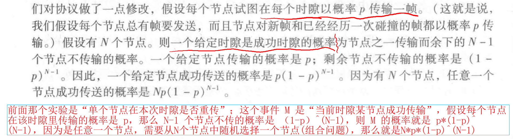

   

   

2. **pure ALOHA** ---- 不使用时隙理论

   第一个ALOHA是一个非时隙，完全分散的协议。

   - **一个给定的节点成功传输一次的概率是 ：p*(1-p)^[2(N-1)]**
   - 它的效率计算公式为：N X p X  (1-p)^[2(N-1)]
   - **最大效率是 1/(2e)，即时隙ALOHA的一半！**

##### CSMA 载波侦听多路访问协议

**CSMA、CSMA/CD规则：**

1. **载波侦听（carrier sensing）：一个节点在传输前先听信道。**如果来自另一个节点的帧正在信道上传输，则节点一直等待，知道检测到一小段时间内信道上没有传输，才开始传输。就像一个绅士。

2. **碰撞检测（collision detection）**：当一个传输节点在传输时一直在侦听此信道。如果它检测到一个节点正在传输干扰帧（有杂乱帧传输），它就停止传输，在重复“侦听 - 当空闲时传输”的循环之前等待一段随机时间。就像你与他人**正巧同时开始说话**，你就停止说话，等一段随机时间后再开始说话。

3. 以太网中**指数退避 (Binary Exponential Backoff)** 算法：

   ​	在 CSMA/CD 以太网中，当发生冲突后，发送方不会立即重传，而是会等待一个随机的时间。这个随机时间是从一个称为“**槽时间 (slot time)**”的单位中选择的。

   - **冲突退避 (Backoff):** 当一个节点检测到冲突时，它会等待一个随机的退避时间，然后再尝试重传。
   - **槽时间 (Slot Time):** 在经典的以太网中，一个槽时间被定义为**两倍的最大传播延迟** (2 * T_slot ). 它也是以太网帧的**最小传输时间**（不包括前导码和帧开始定界符，通常是64字节-- 512比特）。
     - **槽时间的重要性：** 它是确保冲突能被检测到的最小时间单位。
   - **退避算法中的 K 值：**
     - 在二进制指数退避算法中，当第 n 次冲突发生时，节点会从 [0, 2^n- 1] 的范围内随机选择一个整数 K。
     - 然后，节点会等待 K *512 bit 的时间。
     - n 是冲突次数的函数（第一次冲突 n=1，第二次 n=2，以此类推，直到 n=10 后保持 K=10）。

**CSMA/CD （CSDA with collision detection）**

​	

#### 6.2.3 轮流协议

### 6.3 交换局域网

#### MAC 地址 

##### 谁具有链路层地址

​	事实上，不是主机或者路由器具有链路层地址，而是**它们的适配器（网络接口）**具有链路层地址。因此，具有多个适配器的主机或者路由器将有多个链路层地址，就像同一台主机可以配置多个IP一样。

​	重要的是，链路层交换机（中间转发层）并不具有链路层地址，因为它只负责转发数据报，不是收数据报并将其上传给上层协议的。

##### 链路层地址的称呼

​	链路层地址有很多称呼，比如 **MAC地址、LAN地址（LAN address）、物理地址（physical address）**。

##### MAC 地址的长度和命名

​	MAC地址长度为 **6 字节**。地址常用十六进制命名，即**每个字节对应一对十六进制数**。**每个适配器的MAC地址全球唯一**。IEEE 管理全球的MAC地址空间，由其规定一段前缀地址（如前三个字节的地址）授权给公司后，公司自己为剩下的MAC地址空间命名（例如后三字节地址）。

#### 6.3.1 链路层寻址和 ARP算法

##### ARP 算法的必要性和作用

1. 必要性：

   ​	网络层的数据报传到这里后，需要走链路层将数据报传到对应的主机上。链路层(物理)并不知道网络层 IP 是什么，适配器只知道MAC地址。因此需要ARP将 IP 转化成MAC地址，让适配器能够把数据发到子网里对应的主机

2. 作用：

   - **将 网络层 IP 和 链路层地址 MAC地址 相互转换。**
   - 如果发送方只知道目标的IP地址，而不知道其MAC地址，ARP协议就是用来发现这个MAC地址的。

##### ARP 表（ARP table）

​	每台主机或路由器在其内存中具有一个 **ARP 表 (ARP lable)** ，这张表包含胆地址到 MAC 地址的映射关系 。  

​	该 ARP 表也包含一个**寿命 (TTL ) 值**，它指示了从表中删除每个映射的时间 。从一个表项放置到某 ARP 表中开始，一个表项通常的**过期时间是 20 分钟** 。  

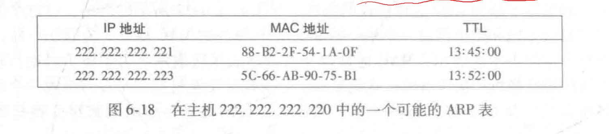

##### ARP 的工作原理（两台主机位于同一子网）：

1. **ARP 查询 (ARP Request)：**

   - 当主机 A（IP地址 IP_A，MAC地址 MAC_A）想向主机 B（IP地址 IP_B）发送数据时，会先查看自己的**ARP表**里有没有主机 B 的MAC地址。

     如果有，直接从表里读取 IP_B 对应的MAC地址封装到 帧 里转发；

     如果没有，则构造一个 **ARP分组（ARP packet）** 的特殊分组，目的IP 是 IP_B，目的地址是**广播地址**

   - 这个 ARP 分组报文中包含：IP_A、MAC_A、IP_B，以及一个空的 MAC_B 字段。

   - 主机 A 将这个 ARP 请求报文封装在一个以太网帧中。这个帧的**目标 MAC 地址**被设置为**广播地址（FF:FF:FF:FF:FF:FF）**。

   - 主机 A 将这个**广播帧**发送到局域网。

2. **ARP 响应 (ARP Reply)：**

   - 局域网中的**所有设备**都会收到这个广播 ARP 分组报文。
   - 每个设备的适配器会把帧里的ARP分组向上传递给APR模块。ARP模块会检查 ARP 分组中的目标 IP 地址（IP_B）是否和自己的 IP 地址匹配。
   - **只有当某个设备发现 IP_B 是自己的 IP 地址时（例如，主机 B），它才会响应。**
   - 主机 B 会构建一个 **ARP 响应报文**，其中包含自己的 **IP 地址 (IP_B) 和 MAC 地址 (MAC_B)。**
   - 主机 B 将这个 ARP 响应报文封装在一个以太网帧中。这个帧的**目标 MAC 地址**被设置为**主机 A 的 MAC 地址 (MAC_A)**，因为主机 B 知道主机 A 的 MAC 地址（从 ARP 请求中获得）。
   - 主机 B 将这个单播帧发送回主机 A。

3. **ARP 缓存 (ARP Cache)：**

   - 当主机 A 收到 ARP 响应后，它就知道了 IP_B 对应的 MAC_B。

   - 主机 A 会将这个 IP-MAC 映射关系存储在自己的 **ARP 表**中，以便后续可以直接使用，而不需要每次都发送 ARP 请求。

   - ARP 缓存表中的条目通常有一个**生存时间 (TTL)**，过期后会被删除，如果需要再次通信，则会重新进行 ARP 解析。

   - 把 IP_B 和对应的 MAC_B 存储到自己的 ARP表 中后，主机 A 会重新发一个 IP 数据报，并封装成帧，目的IP 和 目的 MAC地址 都是 主机B 的。

     

##### **ARP 协议是局域网通信的基础。**


##### ARP 的工作过程（两台不同子网下的主机）

​	当两个主机属于不同的子网时，它们之间的数据传输就不能直接通过 MAC 地址在局域网内进行，而必须经过**路由器**。这是一个跨越**网络层**边界的通信过程。

**核心思想：**

- **同子网内通信：** 直接通过 ARP 解析 MAC 地址，封装帧并发送。

- **不同子网间通信：** 

  ​	通过路由器进行转发。发送方需要将数据报发送给**默认网关（也就是主机的第一跳路由器，Default Gateway）** 的 MAC 地址，路由器负责将其转发到目标子网。

假设：

- **主机 A：** IP: 192.168.1.10/24，MAC: MAC_A
- **主机 B：** IP: 192.168.2.20/24，MAC: MAC_B
- **路由器 (R1)：**
  - 接口 1 (连接子网 1)：IP: 192.168.1.1/24，MAC: MAC_R1_1
  - 接口 2 (连接子网 2)：IP: 192.168.2.1/24，MAC: MAC_R1_2

主机 A 要向主机 B 发送数据报。

**步骤：**

1. **主机 A 判断目标是否在同一子网：**
   - 主机 A 会将自己的 IP 地址 (192.168.1.10) 和目标 IP 地址 (192.168.2.20) 与自己的子网掩码 (255.255.255.0) 进行按位与运算，得到网络地址。
   - 192.168.1.10 AND 255.255.255.0 = 192.168.1.0
   - 192.168.2.20 AND 255.255.255.0 = 192.168.2.0
   - 发现网络地址不同（192.168.1.0 != 192.168.2.0），因此主机 A 知道主机 B 不在同一个子网。
2. **主机 A 将数据发送给默认网关----前提是知道默认网关的MAC地址：**
   - 由于目标不在本地子网，主机 A 知道它需要将数据发送给它的**默认网关**（路由器 R1 的接口 1）。
   - 主机 A 会**查看自己的路由表**，找到默认网关的 IP 地址 (192.168.1.1)。
3. **ARP 解析网关 MAC 地址：**
   - 主机 A 现在需要知道默认网关 (192.168.1.1) 的 MAC 地址 (MAC_R1_1)。
   - 如果主机 A 的 **ARP 缓存表**中没有 192.168.1.1 对应的 MAC 地址，它会发送一个 **ARP 查询广播**（目标 IP 是 192.168.1.1，目标 MAC 是 FF:FF:FF:FF:FF:FF）。
   - 路由器 R1 的接口 1 会收到这个 ARP 请求，并发送一个 **ARP 响应**（包含 MAC_R1_1）给主机 A。
   - 主机 A 将 MAC_R1_1 存入 **ARP 缓存表**。
4. **封装数据报并发送到网关：**
   - 主机 A 构建原始的 IP 数据报：
     - **源 IP:** 192.168.1.10
     - **目的 IP:** 192.168.2.20
   - 主机 A 将这个 IP 数据报封装成一个以太网帧：
     - **源 MAC:** MAC_A
     - **目的 MAC:** MAC_R1_1 (这是默认网关接口 1 的 MAC 地址)
     - **数据部分：** IP 数据报 (其中包含源IP 192.168.1.10 和目的IP 192.168.2.20)
   - 主机 A 将这个帧发送到它的本地局域网。
5. **路由器 R1 接收并转发：**
   - 路由器 R1 的接口 1 收到这个以太网帧。它发现目的 MAC 地址是它自己的 MAC_R1_1。
   - 路由器 R1 解封装该帧，取出 IP 数据报。
   - 路由器 R1 检查 IP 数据报的**目的 IP 地址** (192.168.2.20)。
   - 路由器 R1 查询自己的**路由表**。根据路由表，它知道 192.168.2.20 位于它连接的子网 2（通过接口 2）。
   - 路由器 R1 接着需要将这个 IP 数据报转发到子网 2。
6. **路由器 R1 ARP 解析目标主机 MAC 地址 (在子网 2)：**
   - 路由器 R1 现在需要知道主机 B (192.168.2.20) 在子网 2 中的 MAC 地址 (MAC_B)。
   - 如果路由器 R1 的 ARP 缓存中没有 192.168.2.20 对应的 MAC 地址，它会通过接口 2 发送一个 ARP 请求广播（目标 IP 是 192.168.2.20，**目标 MAC 是 FF:FF:FF:FF:FF:FF**）。
   - 主机 B 收到这个 ARP 请求，并发送一个 ARP 响应（包含 MAC_B）给路由器 R1 的接口 2。
   - 路由器 R1 将 MAC_B 存入 ARP 缓存。
7. **路由器 R1 封装数据报并发送到主机 B：**
   - 路由器 R1 将原始的 IP 数据报（**源 IP 和目的 IP 不变**）重新封装成一个新的以太网帧：
     - **源 MAC:** MAC_R1_2 (这是路由器 R1 接口 2 的 MAC 地址)
     - **目的 MAC:** MAC_B (这是主机 B 的 MAC 地址)
     - **数据部分：** IP 数据报 (源IP 192.168.1.10，目的IP 192.168.2.20)
   - 路由器 R1 将这个帧发送到子网 2。
8. **主机 B 接收数据：**
   - 主机 B 收到这个以太网帧，发现目的 MAC 地址是它自己的 MAC_B。
   - 主机 B 解封装该帧，取出 IP 数据报。
   - 主机 B 发现目的 IP 地址是自己的 192.168.2.20，将数据报递交给上层协议栈（如 TCP 或 UDP）进行处理。

#### 6.3.2 以太网

##### 以太网常见带宽

##### 以太网帧格式


#### 6.3.3 链路层交换机


#### 6.3.4 虚拟局域网

### 6.4 链路层虚拟化

## 第七章 无线网络和移动网络

### 重点

​	Wifi 802.11 和移动IP的工作方式

### 7.1 概述

#### 无线主机和无线通信链路 wireless host and wireless communication link

#### 基站 | 基础设施模式 | 自组织网络 | 切换 | 网络基础设施 

**base station**

**infrastructure mode**

**ad hoc network**

**handoff**

**网络基础设施**

#### 无线网络分类

分类准则

分类：

1. 单跳，基于基础设施 signal hop, infrastructure-based
2. 单跳，无基础设施 Signal hop，infrastructure-less
3. 多跳，基于基础设施 Multi-hop，infrastructure-based
4. 多跳，无基础设施 Multi-hop，infrastructure-less

### 7.2 无线信道损伤 wireless channel impairments

#### 路径损耗 path loss

#### 多径传播 multipath propagation

#### 来自其他源干扰 interference from other source

#### 网络特征术语

1. 信噪比 signal-to-noise SNR
2. 比特差错率 BER

#### CDMA 协议 | 码片速率计算方式

### 7.3 WiFI：802.11 无线LAN

#### 7.3.1. 体系结构

##### BBS 基本服务集

##### 基础无线LAN

##### 信道与关联 ---- Wifi丛林、信标帧、信道、SSID、两种扫描方式、站点加入一WiFi 咖啡屋的过程


#### 7.3.2 802.11 MAC协议----CSMA/CA、处理隐藏终端 RTS、CTS

### 7.5 移动管理

#### 7.5.1 移动节点的定义和术语

1. **移动节点定义** 
2. **归属网络 home network**
3. **归属代理 home agent**
4. **永久地址 permanent address**
5. **外部网络/被访网络 visited network**
6. **外部代理 foreign agent**
7. **转交地址 care-of-address**
8. **通信者 correspondent**


#### 7.5.2 寻址

#### 7.5.3 路由选择到移动节点

### 7.6 移动IP

