## 3.1. 离散信源的分类与数学模型

### 3.1.1. 信源分类

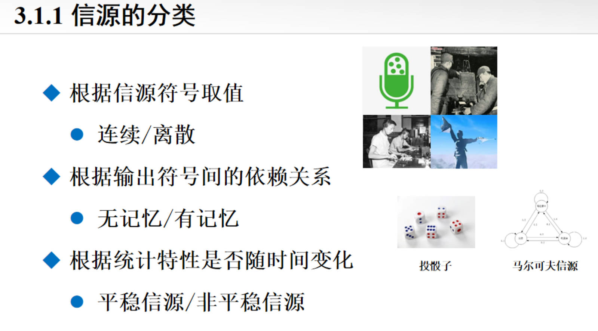

### 3.1.2. 离散无记忆信源的数学模型

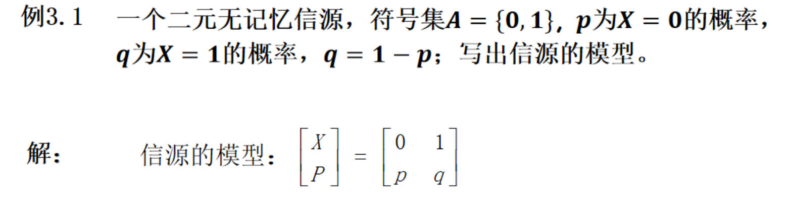

### 3.1.3. 离散有记忆信源模型

### 3.1.4. 离散平稳信源的数学模型

## 3.2. 离散无记忆信源的扩展

### 3.2.1. 等长消息扩展

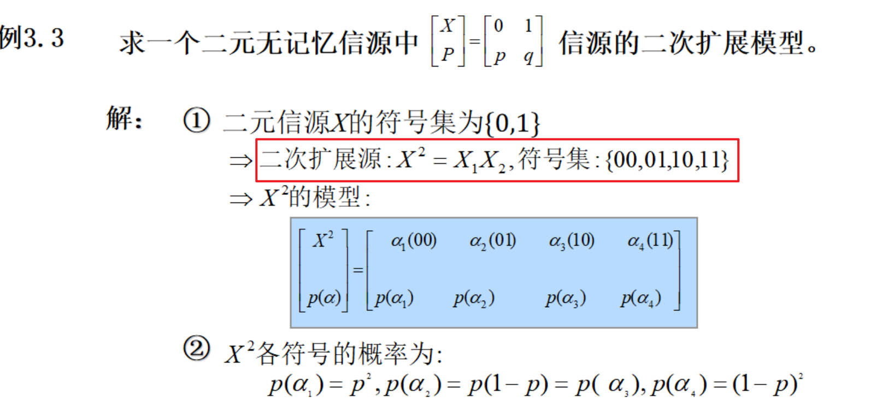

---

## 3.3. 离散平稳信源的熵

### 重点

**计算熵：**

1. **无记忆信源：单符号信源、等长扩展信源**
2. **平稳有记忆信源**

### 3.3.1. 单符号信源的熵

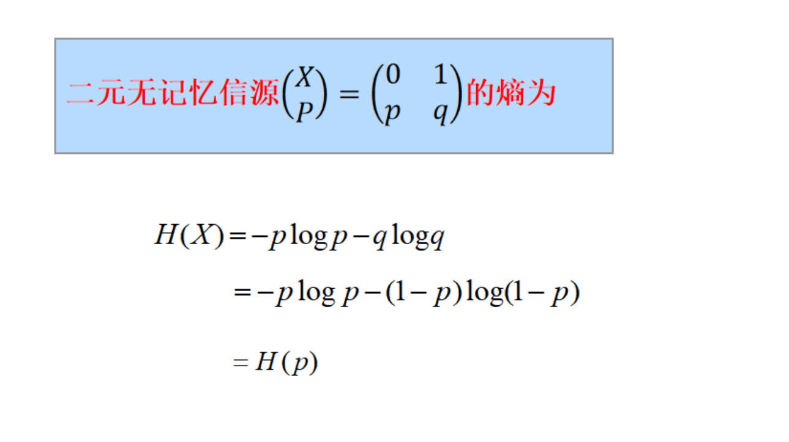

**熵的性质**：

1. **可加性**
2. **链原则**
3. **离散最大熵定理**
4. 唯一性
5. **确定性**：某一事件概率为1，熵就为0
6. **非负性**：熵恒大于等于0
7. 对称性

### 3.3.2. 等长无记忆扩展源的熵

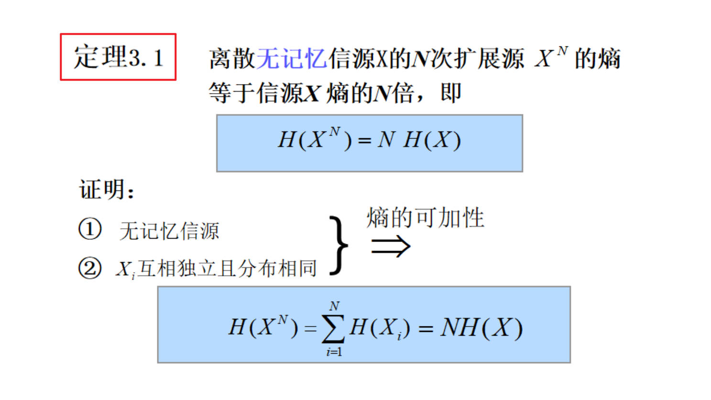

### 3.3.3. 平稳有记忆信源的熵

**重点**：

1. **平均符号熵**
2. **极限符号熵**
3. **条件熵**
4. **三者的核心关系**：极限熵等于最小的平均符号熵。当信源为有限记忆时，可计算极限条件熵求极限熵，避免采用平均符号熵求极限熵。

**定理3.3的解释**

## 3.4. 有限状态马尔可夫链

### 3.4.1. 马氏链

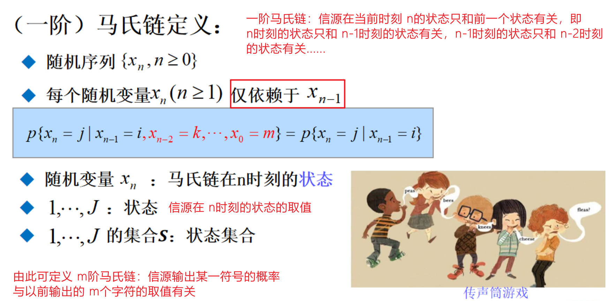

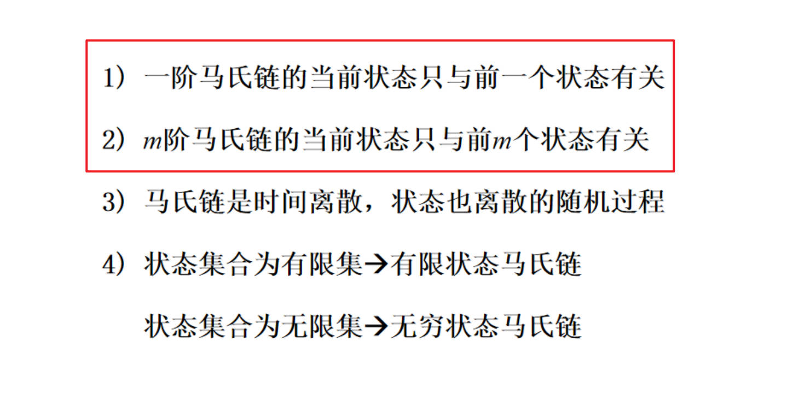

### 3.4.2. 齐次马氏链

平稳马尔可夫链通常用来描述有记忆信源。为了全面描述其特性，常用以下三种形式：**状态转移概率矩阵**、**状态转移图**和**网格图**。

**1. 状态转移概率矩阵**

*   **定义**：
    
    设马尔可夫链有 $N$ 个状态，状态空间为 $S = \{s_1, s_2, \dots, s_N\}$
    
    定义 $p_{ij}$ 为从时刻 $t$ 的状态 $s_i$ 转移到时刻 $t+1$ 的状态 $s_j$ 的条件概率，即：
    $$
    p_{ij} = P(X_{n+1} = s_j | X_n = s_i)
    $$
    
    由这些概率构成的矩阵 $P$ 称为状态转移概率矩阵。
    
*   **形式**：
    $$
    P = \begin{pmatrix}
    p_{11} & p_{12} & \cdots & p_{1N} \\
    p_{21} & p_{22} & \cdots & p_{2N} \\
    \vdots & \vdots & \ddots & \vdots \\
    p_{N1} & p_{N2} & \cdots & p_{NN}
    \end{pmatrix}
    $$

*   **基本性质**：
    1.  **非负性**：$p_{ij} \ge 0$。
    2.  **归一性**：矩阵的每一行元素之和等于 1，即 $\sum_{j=1}^{N} p_{ij} = 1$（因为从某一状态出发，必然会转移到某个状态）
    3.  对于平稳（齐次）马尔可夫链，矩阵 $P$ 不随时间 $n$ 的变化而变化

**2. 状态转移图**

*   **定义**：
    
    一个有向图，其中节点代表状态，有向边代表状态之间的转移。
    
*   **构成要素**：
    
    1.  **节点**：图中有 $N$ 个节点，每个节点代表一个状态 $s_i$
    2.  **有向边**：如果 $p_{ij} > 0$，则画一条从节点 $s_i$ 指向 $s_j$ 的箭头
    3.  **权值**：在有向边旁标注转移概率 $p_{ij}$。如果是马尔可夫信源，通常还会标注伴随该状态转移输出的符号 $a_k$
    
*   **特点**：
    
    *   能够直观地看出哪些状态是相通的（连通性）
    *   容易识别出周期性、吸收态等结构特征
    *   **自环**：如果存在 $p_{ii} > 0$，则会有一条指向自己的箭头

**3. 网格图**

网格图（又称格图、篱笆图）是将状态转移图**在时间轴上**展开的形式

它侧重于描述马尔可夫链随时间演变的过程，常用于维特比算法（Viterbi Algorithm）和卷积码的描述

*   **定义**：
    
    一个二维的图，横轴表示时间 $t$，纵轴表示可能的状态
    
*   **构成形式**：
    
    1.  **列**：每一列代表一个离散的时间点（时刻 $t, t+1, \dots$）。每一列包含 $N$ 个节点，垂直排列，代表该时刻所有可能的状态
    2.  **枝**：连接第 $t$ 列状态 $s_i$ 和第 $t+1$ 列状态 $s_j$ 的连线
    3.  **重复结构**：对于平稳马尔可夫链，每两个相邻时刻之间的连接结构（拓扑和概率）**完全相同**
    
*   **特点与用途**：
    
    *   **路径**：网格图上的一条从左向右的路径，对应着马尔可夫链的一条具体的状态序列（进而对应一个符号序列）
    *   它清晰地展示了状态序列的时间演化历史
    *   非常适合用于分析序列的概率计算和寻找最大概率路径（即最大似然译码）

**总结对比**

|       描述形式       |    侧重点    |                  典型应用场景                  |
| :------------------: | :----------: | :--------------------------------------------: |
| **状态转移概率矩阵** | **数值计算** |        求解平稳分布、计算熵、数学推导。        |
|    **状态转移图**    | **拓扑结构** |  快速理解信源结构、判断连通性、直观展示模型。  |
|      **网格图**      | **时间演化** | 分析具体的时间序列、路径搜索、维特比译码算法。 |

**例子**：

用状态转移图和网格图描述该 **状态转移矩阵**
$$
P = \begin{bmatrix}
1/3 & 1/3 & 1/3 \\
1/4 & 1/2 & 1/4 \\
1/4 & 1/4 & 1/2
\end{bmatrix}
$$

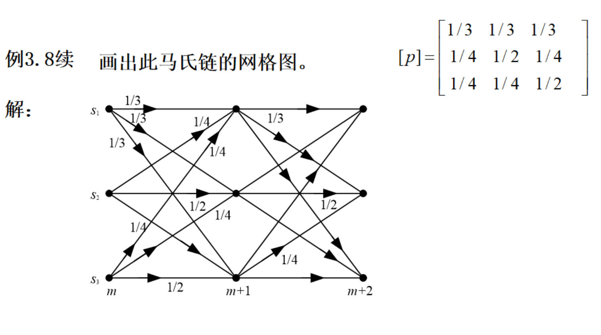

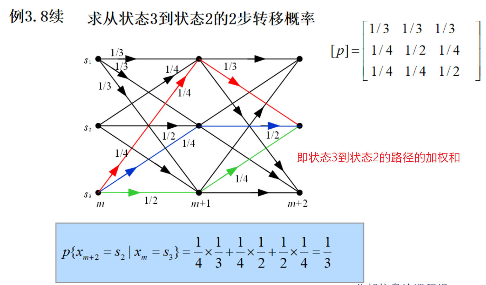

### 3.4.3. Kolmogorov-Chapman方程

**Kolmogorov-Chapman 方程**（通常简称 C-K 方程）是描述马尔可夫链的动态特性的核心数学工具

简单来说，C-K方程揭示了**多步转移概率**与**单步（或较少步）转移概率**之间的关系

**1. 核心概念定义**

在介绍方程之前，先明确两个符号：
*   **$P_{ij}$**：**单步转移概率**。指系统当前处于状态 $i$，下一步转移到状态 $j$ 的概率。
*   **$P_{ij}^{(n)}$**：**n  步转移概率**。指系统当前处于状态 $i$，经过 $n$ 步转移后，恰好处于状态 $j$ 的概率

**2. Kolmogorov-Chapman 方程的表述**

对于齐次马尔可夫链，C-K 方程描述了这样一个逻辑：**要从状态 $i$ 经过 $n+m$ 步到达状态 $j$，中间必须经过某个状态 $k$**

**标量形式**

对于任意两个正整数 $n$ 和 $m$（$n, m \ge 1$），以及任意状态 $i, j \in S$（状态空间），有：

$$
 P_{ij}^{(n+m)} = \sum_{k \in S} P_{ik}^{(n)} P_{kj}^{(m)} 
$$
**直观解释**：

1. 过程从 $i$ 出发

2. 先经过 $n$ 步，系统到达了某个中间状态 $k$，概率为 $P_{ik}^{(n)}$

3. 再从这个中间状态 $k$ 出发，经过 $m$ 步，到达目标状态 $j$，概率为 $P_{kj}^{(m)}$

   因为中间状态 $k$ 可能是状态空间 $S$ 中的任意一个状态，根据全概率公式，我们需要对所有可能的中间状态 $k$ 求和

**矩阵形式**

如果定义 $n$ 步转移概率矩阵为 $\mathbf{P}^{(n)}$，其中第 $i$ 行第 $j$ 列的元素是 $P_{ij}^{(n)}$，那么 C-K 方程可以写成非常优雅的矩阵乘法形式：

$$
\mathbf{P}^{(n+m)} = \mathbf{P}^{(n)} \cdot \mathbf{P}^{(m)}
$$
**3. C-K 方程的重要推论（核心）**

对于齐次马尔可夫链，利用 C-K 方程可以推导出一个极其重要的性质，这是在做计算时最常用的：

当 $n=1, m=1$ 时：
$$
\mathbf{P}^{(2)} = \mathbf{P}^{(1)} \cdot \mathbf{P}^{(1)} = \mathbf{P} \cdot \mathbf{P} = \mathbf{P}^2
$$
 以此类推，我们可以得到：
$$
 \mathbf{P}^{(n)} = \mathbf{P}^n 
$$
**这意味着**：齐次马尔可夫链的 **n 步转移概率矩阵**，等于其 **1 步转移概率矩阵的 $n$ 次幂**。

只要知道了单步转移矩阵 $\mathbf{P}$，就可以通过矩阵乘法求出任意步数后的状态分布

---

设马氏链的初始状态概率分布为 
$$
\mathbf{p}^{(0)} = (p_1^{(0)},p_2^{(0)},...p_J^{(0)})^T
$$
其中 $J$ 为状态数， $T$为转置，经 $k$ 步转移后的状态概率分布为 
$$
(\mathbf{p}^{(k)})^T = (p_1^{(k)},p_2^{(k)},...p_J^{(k)})^T
$$
则有：
$$
(\mathbf{p}^{(k)})^T = (\mathbf{p}^{(0)})^T\mathbf{P}^k = (\mathbf{p^{(m)}})^T\mathbf{P}^{k-m}
$$
**即齐次马氏链的初始状态概率分布给定后，可以使用上式求出转移后的任何时刻的状态分布**

---

**说白了 C-K方程在求平稳马氏链时，就是提供了求解 n 时刻状态的概率分布的方式**

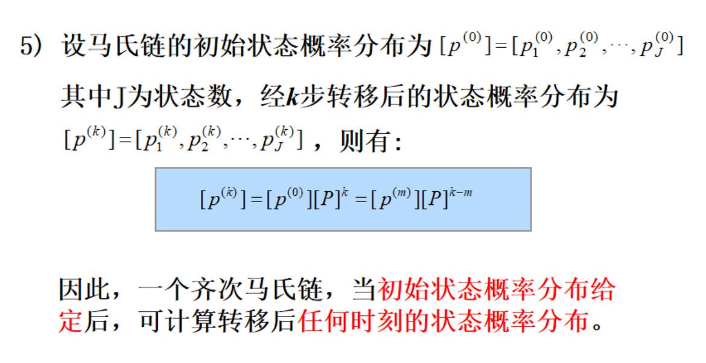

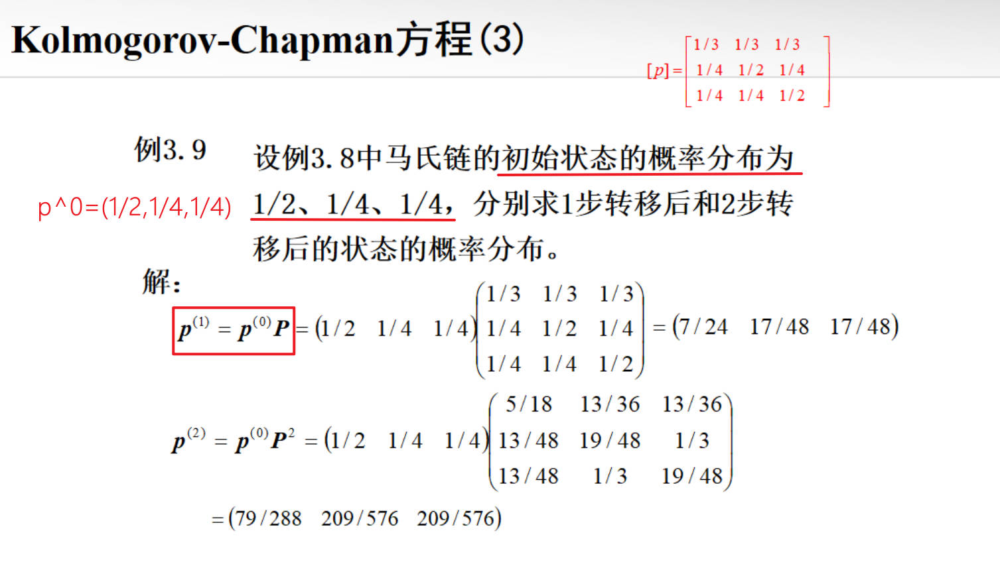

### 3.4.4. 马氏链的平稳分布

**方程表达式**：

设平稳状态分布为 $W = \begin{pmatrix} \pi_1, & \pi_2, & \pi_3 \end{pmatrix}$，它满足方程：
$$
W \cdot P = W
$$

$$
\pi_1+\pi_2+  \pi_3 = 1
$$

**方程一**即图中的第一个方程。

