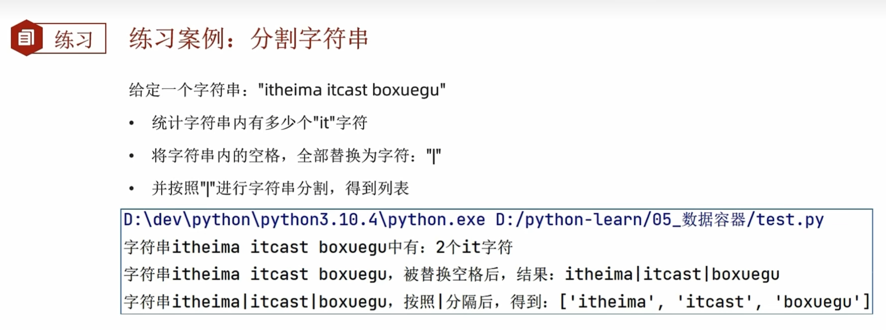
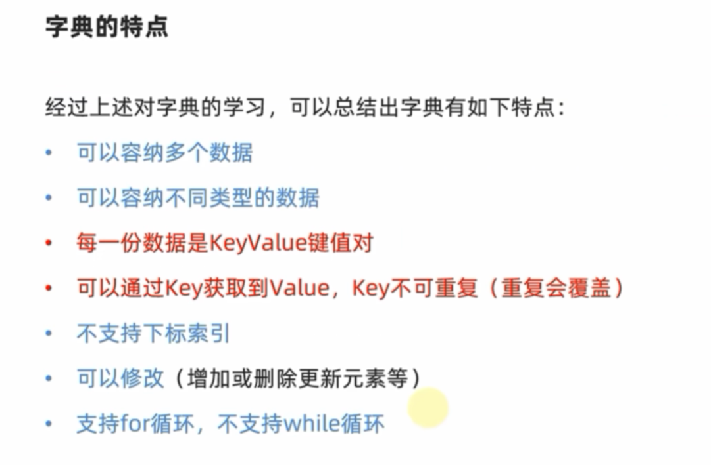

# 数据容器入门

## 基础概念

### 定义	

​	一种可以容纳容纳多份数据的数据类型，容纳的每一份数据称为一个元素。每一个元素可以是任意类型的数据，如字符串、数字、布尔等

### 类型

1. 列表 list
2. 元组 tuple
3. 字符串 string
4. 集合 set
5. 字典 dict

## 列表  List

### 基本语法

```py
# 字面量
[element1,element2.element3,...]

# 定义变量
变量名称 = [元素1，元素2，...]

# 空列表定义 初始化一个列表
变量名称 = []
变量名称 = list()
```

1、列表内的每一个数据，称为元素

- 以  `[ ]` 作为标识
- 列表中的每一个元素用逗号隔开

2、类似于C/C++中的数组，**但是！列表允许在同一个list里面存储不同的数据类型的元素!**

```py
name_list = ['hello',666,True]
print(name_list)
print(type(name_list))

# output
# ['hello', 666, False]
# <class 'list'>
```

3、而且列表支持**嵌套**：即`list`里的元素可以是一个`list`

```py
name_list = ['hello',666,False,[1,2,3],{'name':'黑马程序员'}]
print(name_list)
print(type(name_list))

# output
# ['hello', 666, False, [1, 2, 3], {'name': '黑马程序员'}]
# <class 'list'>
```

###  列表下标索引访问元素

类似C++中的数组，能通过下标访问 list 中的元素

特殊点：

1. List不仅可以正向索引：从 0 到 n-1；也可以反向索引：从 -n 到 -1

   ```py
   List_1 = [1,2,"hello","world"]
   print("正向索引:")
   for i in range(0,len(List_1)):
       print(List_1[i])
   
   print("反向索引:")
   for i in range(-len(List_1),0):
       print(List_1[i])
   """
   正向索引:
   1
   2
   hello
   world
   反向索引:
   1
   2
   hello
   world
   """
   ```

2. 若 List 为嵌套列表，可以通过 下标复用 方式访问 被嵌套列表里的元素

   ```python
   List_1 = [1,2,"hello","world"]
   for i in List_1:
       print(i)
   
   List_2 = [List_1,3,4,[7,8,9]]
   print(f"列表2的长度: {len(List_2)}")
   
   for i in range(len(List_2[0])):
       print(List_2[0][i])
   
   for i in range(len(List_2)):
       if isinstance(List_2[i],list):
           for j in range(len(List_2[i])):
               print(List_2[i][j],end=" ")
       else:
           print(List_2[i],end=" ")
   """
   结果：
   1
   2
   hello
   world
   列表2的长度: 4
   1
   2
   hello
   world
   1 2 hello world 3 4 7 8 9
   """
   ```

### 列表推导式

​	列表推导式是一种用一行代码来创建新列表的简洁、优雅的方式

#### 核心思想：从 for 循环到列表推导式

```py
squares = []  # 1. 创建一个空列表
for x in range(10):  # 2. 遍历一个序列
    squares.append(x**2)  # 3. 对每个元素进行操作，并添加到新列表中

print(squares)
# 输出: [0, 1, 4, 9, 16, 25, 36, 49, 64, 81]
```

这个过程需要三行代码。现在，看看如何用列表推导式在一行内完成同样的事情。

**使用列表推导式：**

```py
squares = [x**2 for x in range(10)]

print(squares)
# 输出: [0, 1, 4, 9, 16, 25, 36, 49, 64, 81]
```

它把 for 循环的三个核心部分——**操作**、**循环**——都整合到了一对方括号 [] 中。

#### 语法结构分解

一个基本的列表推导式由三部分组成：

```py
new_list = [expression for item in iterable]
```

1. **expression**：对 item 进行的操作，其结果会成为新列表的元素。在上面的例子中，就是 x**2。
2. **for item in iterable**：一个标准的 for 循环，用于遍历源序列。在上面的例子中，就是 for x in range(10)。
3. **[]**：表示我们正在创建一个新的列表。 

你可以这样理解它的执行顺序，就像读一句话一样：
“对于 `源序列` 中的每一个` item`，执行 expression 操作，并将结果收集到一个新列表中。”

### 列表的操作方法-增删查改

#### 方法def-类class中的内置函数


#### 列表的查询方法-.index(value)

 

```py
List_1 = [1,2,"hello","world"]
List_2 = [List_1,3,4,[7,8,9]]
val = []
# 输出指定元素值对应的下标
print(List_1.index(1))  # Output: 0
print(List_1.index("hello"))  # Output: 2

for i in range(len(List_1)):
    i = List_1.index("hello")
    val.append(i)
print(val)  
# Output: [2,2,2,2]
val.clear()
for i in range(len(List_1)):
    i = List_1.index(List_1[i])
    val.append(i)
print(val) 
"""
Output:
0
2
[2, 2, 2, 2]
[0, 1, 2, 3]
"""
```

#### 修改元素值

##### 修改特定索引的元素值

语法：列表[下标] = 值   	

```py
list[index] = value
```

```py
List_1 = [1,2,"hello","world"]

List_1[2] = "Hi"
print(List_1)
"""
output:
[1, 2, 'Hi', 'world']
"""
```

#### 插入元素

##### 在指定索引位置插入元素

```python
# 语法
list.insert(index,value)
```

**不同于C++，若插入的索引值大于当前列表长度n时，他不会报错，只会在列表末尾插入该值，列表长度+1  ==> 容易内存泄漏**

```python
List_1 = [1,2,"hello","world"]

List_1.insert(8, "inserted_value")
print(List_1)

List_1.insert(3, "inserted_value") 
print(List_1)

for i in range(3):
    List_1.insert(len(List_1)+10, i) # 注意这个 + 10
print(List_1)
"""
output:
[1, 2, 'hello', 'world', 'inserted_value']
[1, 2, 'hello', 'inserted_value', 'world', 'inserted_value']
[1, 2, 'hello', 'inserted_value', 'world', 'inserted_value', 0, 1, 2]
"""
```

##### 在列表末尾追加元素

##### 在列表末尾追加单个元素

```py
# 语法
list.append(value)
```

##### 追加其他数据容器存储的元素

```py
# 语法
list.extend(contanier)
"""
将其他数据容器 contanier 的内容(元素)取出，依次追加到列表尾部
"""
```

```py
List_1 = [1,2,"hello","world"]
List_2 = [List_1,3,4,[7,8,9]]

for i in range(len(List_2)):
    if isinstance(List_2[i], list):
            List_1.extend(List_2[i])
    else:
        List_1.append(List_2[i])
print(List_1) 
"""
output:
[1, 2, 'hello', 'world', 1, 2, 'hello', 'world', 3, 4, 7, 8, 9]
"""
```

#### 删除元素

##### del list[index] --调用delete函数

##### list.pop(index)--使用list类内置方法

```py
List_1 = [1,2,"hello","world"]
List_2 = [List_1,3,4,[7,8,9]]

del List_2[0][1:]
print(List_2)
List_2[3].pop(2)
print(List_2)
"""
output:
[[1], 3, 4, [7, 8, 9]]
[[1], 3, 4, [7, 8]]
"""
```

##### 删除指定元素在列表中的第一个匹配项 .remove(val)

```py
"""
删除某元素值 value 在 list 中的第一个匹配项
"""
# 语法:
list.remove(value)
```

```py
List_1 = [1,2,"hello","world"]
List_2 = [List_1,3,4,[7,8,9]]

List_1.remove("hello")  # Remove "hello" from List_1
print(List_1)  # Output: [1, 2, 'world']
List_1.remove(2222) #ouput: ValueError: list.remove(x): x not in list
```

##### 清空列表内容 .clear(val)

```py
list.clear()
```

#### 查询方法

##### 统计某元素在列表中的数量 .count(val)

```py
List_2 = [List_1,3,4,[7,8,9],3,3,3,3]

print(List_2.count(3)) 
"""
output:
5
"""
```

##### 统计列表的元素个数 len(list)

```py
List_2 = [List_1,3,4,[7,8,9],3,3,3,3]

print(len(List_2)) # output: 8
```

#### 方法总结


#### 列表的遍历操作-while | for

##### 通过while循环操作

```py
List_2 = [List_1,3,4,[7,8,9]]

index = 0
while index < len(List_2):
    print(List_2[index])
    index +=1
```

##### for 循环操作

```py
List_2 = [List_1,3,4,[7,8,9]]

for i in range(len(List_2)):
    print(List_2[i])
```

------

## 元组 tuple

### 特点

元组同列表 **list** 一样，可以封装多个、不同类型的元素，但有一个很大的不同点：**元组一旦定义完成，就不可以修改！！！**就像C++里定义了一个 **const Array**,是 **只读** 的

### def

元组的定义使用小括号 **()**，且使用逗号隔开各个数据，数据可以是不同的数据类型。

```py
# 方式一
tuple_1 = (1,"2",3)
# 嵌入式元组
tuple_2 = (tuple_1,2,3,"4")
# 空元组
tuple_3 = ()
tuple_4 = tuple() # tuple 类
```

**注意：当元组只有一个元素时，这个数据后面要带逗号！**

### 元组的操作

#### .index()查找指定元素值的下标

#### .count()统计某个元素值在元组中的次数

#### len(tuple)计算元组长度

```py
# 方式一
tuple_1 = (1,"2",3)
# 嵌入式元组
tuple_2 = (tuple_1,2,3,"hello")

for i in tuple_2:
    print(f"the index of {i} in tuple is:{tuple_2.index(i)}")
print(f"Tuple's length is {len(tuple_2)}")
"""
output:
the index of (1, '2', 3) in tuple is:0
the index of 2 in tuple is:1
the index of 3 in tuple is:2
the index of hello in tuple is:3
Tuple's length is 4
"""
```

### 元组嵌套其它数据结构

#### 嵌套 List

```py
list_1 = [1,"2",3]
# 嵌入式元组
tuple_2 = (list_1,2,3,"hello")

tuple_2[0][1]="hello"
for i in tuple_2:
    print(f"the index of {i} in tuple is:{tuple_2.index(i)}")
   """
ouput:
the index of [1, 'hello', 3] in tuple is:0
the index of 2 in tuple is:1
the index of 3 in tuple is:2
the index of hello in tuple is:3
   """
```

### 综合案例


```py
Tp = ("周杰伦",11,['footbal','music'])

# check index
age = 11
print(f"Zhou's age is in index {Tp.index(age)} ")
# Find stu's name
idx_1 = 0 
print(f"Name is {Tp[idx_1]}")
# delete "football"
del Tp[2][0]
print("hobby is",Tp[2])
# Add hobby "codding"
Tp[2].append("codding")
print("Now hobby is",Tp[2])
"""
output:
Zhou's age is in index 1 
Name is 周杰伦
hobby is ['music']
Now hobby is ['music', 'codding']
"""
```

------


## 字符串

### Def - 存放字符char的容器-同C++

### 下标访问字符串内容

和列表相同，有两种下标索引方式：

1. **正向索引：从 0 到 n-1**
2. **反向索引：从 -n 到 -1**

### 特点: 和元组一样是一个常量

​	和元组一样是一个常量，**无法修改**容器的内容。

### 操作语法

#### .index()方法查询指定元素值的下标

#### .replace(str1,str2)替换方法

```py
# 语法
str_4 = str3.replace(str1,str_2)
```

 **将 str2 的内容覆盖到 str3 中的 str1（即 str1 是 str3 的一部分），同时将覆盖的字符串存储到新的字符串 str_4 中，但 str_1 的值不变！**

```py
str_1 = "hello,today is a nice day!"
str_4 = str_1.replace("hello,","Hi!")
print(f"String_1 val is still {str_1}")
print(f"But string_4's val is {str_4}")
"""
output:
String_1 val is still hello,today is a nice day!
But string_4's val is Hi!today is a nice day!
"""
```

#### .split()方法


```py
str_1 = "hello, today is a nice day!"
print(f"String_1 val is {str_1}")
ls = str_1.split(" ") # 通过 space 进行字符切分
print(ls)
"""
output:
String_1 val is hello, today is a nice day!
['hello,', 'today', 'is', 'a', 'nice', 'day!']
"""
```

#### .strip()规整操作


**但是，该语法只能去除首个匹配的字符！且相同字符只会去掉一个，要想全部去掉只能用 .replace(value)，而且碰到与字符不同时就会停下匹配**

-----很鸡肋，不管了

```py
str_1 = " 12hello, today is a nice day!12 "
print(f"String_1 val is {str_1}")
print(f"Now string_1 val is {str_1.strip()}") # 注意：str_1是常量，本身值不会变！
print(f"Now string_1 val is {str_1.strip('12')}") # 无空格时连首尾的1、2都没去掉！
print(f"Now string_1 val is {str_1.strip(' 12')}") # 有空格！
"""
output:
String_1 val is  12hello, today is a nice day!12 
Now string_1 val is 12hello, today is a nice day!12
Now string_1 val is  12hello, today is a nice day!12
Now string_1 val is hello, today is a nice day!
"""
```

#### .count(value) 统计某字符char在str中的出现次数

#### len(string) 计算长度

#### endswith

判断字符串以什么字符结尾

```py
a.endswith('abcd')
```

是否以abcd结尾，返回 True 或 False。

#### startswith(prefix)

**startswith(prefix)**: 检查字符串是否以 prefix 开头，返回 True 或 False。

**find(sub)**: 查找子字符串 sub 第一次出现的位置，如果找不到则返回 -1

**index(sub)**: 与 find() 类似，但如果找不到子字符串会抛出 ValueError 异常。

**upper()**: 将所有字符转换为大写。

**lower()**: 将所有字符转换为小写。

**title()**: 将每个单词的首字母转换为大写

#### join

**join(iterable)**:  使用调用该方法的字符串作为分隔符，将一个可迭代对象（如列表）中的所有元素连接成一个新的字符串。

```py
words = ['hello', 'world', 'python']
separator = " "
sentence = separator.join(words)
print(sentence)  # 输出: hello world python

items = ['apple', 'banana', 'cherry']
csv_line = ",".join(items)
print(csv_line)  # 输出: apple,banana,cherry
```


#### 操作小结


####  练习案例



参考代码:

```py
"""
练习案例：字符串语法
"""

str1 = "ithudahuw ithudan hwdabit"
print(f"it has {str1.count('it')} 'it'")
str2 = str1.replace(' ','|')
print(f"{str2}")
ls1 = str2.split('|')
print(f"所得列表：{ls1}")
"""
it has 3 'it'
ithudahuw|ithudan|hwdabit
所得列表：['ithudahuw', 'ithudan', 'hwdabit']
"""
```

## 序列切片


### 切片操作


例如

```py
ls[0::2]# 从头到尾，步长为2
```

**只需注意：得到的是一个新序列，而不是对原序列做了操作**

- ```py
  ls[::]#表示遍历整个序列，且步长为 1
  ```

- 如果为

  ```py
  ls[::-1] #表示遍历整个序列，并且是从尾到头，逆序遍历
  ```

### 案例

```py
"""
练习案例：序列的切片---拿到"小小怪下士"这个字符串
"""
# python string_grammer.py
s = "来过带他把,哪在士下怪小小,怪大大是我"
print(s)
ss = s[::-1]
print(ss)
i1 = ss.index("小")
i2 = ss.index("士")
# 通过索引获取元素后，再提取前5个字符
res = ss[i1:i2 + 1:]
print(res)

```

## 集合Set

### 特性

1. 不支持重复元素（元素唯一）-----核心
2. 内部元素无序

### 语法

- 列表 

  ```py
  ls = [a,v,b]
  ```

- 元组

  ```py
  tu = (1,2,"dd")
  ```

- 字符串

  ```py
  str = "adhsud"
  ```

- 集合（set）

  ```py
  # 1.
  set() # 空集合
  a = set()
  # 2.
  set0 = {1,2,"11"}
  set = {12}
  print(set0)
  print(set)
  # {1, 2, '11'}
  # {12}
  ```

### 常用操作

#### 注意事项

**因为集合是无序的，所以集合不支持下标索引访问集合内部元素**

#### 添加元素

1. 语法：

   ```py
   a = set()
   a.add(value)
   ```

2. 结果：

   集合本身被修改

```py
a = set()
set0 = {1,2,"11"}
a.add("1")
print(set0)
print(a)
# {1, 2, '11'}
# {'1'}
```

#### 移除元素

1. 语法：

   ```py
   set0 = {1,2,"11"}
   set0.remove(1)
   print(set0)
   # {2, '11'}
   ```

​	集合本身被修改

#### 从集合中随机取出元素

1. 语法

   ```py
   set0 = {1,2,"11"}
   o = set0.pop() ---此处
   print(set0)
   print(o)
   # {2, '11'}
   # 1
   ```

2. 结果

   得到一个元素的结果。同时集合本身被修改

#### 清空集合

1. 语法：

   ```py
   set.clear()
   ```

####  取出两个集合的差集

1. 语法

   集合1.difference(集合2)，取出集合一与集合二的差集：集合一有的而集合二没有

   ```py
   set0 = {1,2,"11",3,4,5,6,7}
   set1 = {1,2,8,9,"22"}
   set2 = set0.difference(set1)
   print(set2)
   # {3, 4, 5, 6, 7, '11'}
   ```

2. 结果

   - **得到一个新集合**
   - **集合一和集合二不变**

#### 消除两个集合的差集

1. 语法

   集合1.difference_update（集合2）

2. 功能

   比较集合1和集合2，删除集合1中与集合二相同的元素。

3. 结果

   **集合1被修改，集合2不变**

```py
set0 = {1,2,"11",3,4,5,6,7}
set1 = {1,2,8,9,"22"}
set0.difference_update(set1)
print(set0)
# {3, 4, 5, 6, 7, '11'}
```

#### 两个集合合并

1. 语法

   ```py
   set1.union(set2)
   ```

2. 功能

   将集合1和集合2组成新的集合

3. 结果

   得到一个新集合set3，但是集合1和集合2不变

   ```py
   set0 = {1,2,"11",3,4,5,6,7}
   set1 = {1,2,8,9,"22"}
   set2 = set0.union(set1)
   print(set2)
   # {1, 2, 3, 4, 5, 6, 7, 8, 9, '11', '22'}
   ```

### 操作总结


------

### 小测试

```py
"""
去重：
ls = ['a','a','a',1,1,1,2,2,3,4,5,6,6,6,7,7,8,'b','c']
"""
ls = ['a','a','a',1,1,1,2,2,3,4,5,6,6,6,7,7,8,'b','c']
a = set()
for i in ls:
    a.add(i)
print(a)
# {1, 2, 3, 4, 5, 6, 7, 8, 'b', 'c', 'a'}
```


## 字典

### 字典的定义

字典是 Python 中的一种可变、无序的数据结构，用于存储一系列的**键-值对**。

- **键 (Key):** 必须是**唯一**且**不可变**的类型，例如字符串、数字（整数或浮点数）、元组 (tuple)。列表或字典本身不能作为键，因为它们是可变的。**键用于索引和查找对应的值。**
- **值 (Value):** 可以是任意类型的 Python 对象，例如数字、字符串、列表、元组，甚至另一个字典。**值可以重复。**
- **键-值对:** 每个键与其对应的值构成一个键-值对，它们是字典中存储的基本单元。

你可以把字典想象成一本真正的字典或电话簿：

- **键** 就像是你要查的单词或人名。
- **值** 就像是这个单词的解释或这个人的电话号码。

例如：


#### 语法

```py
# 空字典定义
a = {}
b = dict()
# 定义字典变量
person = {
    "name":"Jay",
    "age" : 18,
    "city":"Beijing"
}
# 使用dict()和键值对的元组列表定义
dog = dict([('name','Bob'),("age",2)])
cat = dict(name="CJ",age = 10)
print(person)
print(dog)
print(cat)
"""
{'name': 'Jay', 'age': 18, 'city': 'Beijing'}
{'name': 'Bob', 'age': 2}
{'name': 'CJ', 'age': 10}
"""
```

#### dict() 函数介绍

dict() 是 Python 的一个内置构造函数，用于创建字典对象。

#### 字典值value的获取

字典同集合一样，**不能通过下标索引获取元素值**。

- **使用键索引** `[]`:

  可以通过键值Key获得对应的元素值 --------就像你查字典一样

  ```py
      person = {
          "name":"Jay",
          "age" : 18,
          "city":"Beijing"
      }
      # 使用dict()和键值对的元组列表定义
      dog = dict((('name','Bob'),("age",2)))
      cat = dict(name="CJ",age = 10)
      print(person['name'])
      # Jay
  ```

- **使用 .get() 方法:** 这是更安全的方式，如果键不存在，它会返回 None 或你指定的默认值，而不是报错。

  ```py
  person = {"name": "Alice", "age": 25}
  print(person.get("name"))      # 输出: Alice
  print(person.get("country"))   # 输出: None
  print(person.get("country", "Unknown")) # 输出: Unknown (指定默认值)
  ```

#### 字典嵌套

字典的 key 和 value 可以是任意的数据类型，除了 key 不能为字典。

那么，这就意味着**字典可以嵌套**

有一需求：记录每个学生的各科的考试成绩

| 姓名 | 语文 | 数学 | 英语 |
| :--: | :--: | :--: | :--: |
|  王  |  77  |  66  |  88  |
|  周  |  44  |  55  |  99  |
|  林  |  11  |  22  |  33  |

分析：

姓名作为 key，成绩作为 value。 	value 可看为一个字典：key 是科目名字，value是分数

因此数据结构为：

```python
score-table = {
	"姓名":{
        "语文":"score-1",
        "数学":"score-2",
        "英语":"score-3"
    }
}
```


```py

score_table = {
	"王":{
        "语文":77,
        "数学":66,
        "英语":88
    },
    "周":{
        "语文":44,
        "数学":55,
        "英语":99
    },
    "林":{
        "语文":11,
        "数学":22,
        "英语":33
    }
}
print(f"王的成绩{score_table['王']}")
print(f"周的成绩{score_table['周']}")
print(f"林的成绩{score_table['林']}")
print(f"王的语文成绩:{score_table['王']['语文']}")
"""
王的成绩{'语文': 77, '数学': 66, '英语': 88}
周的成绩{'语文': 44, '数学': 55, '英语': 99}
林的成绩{'语文': 11, '数学': 22, '英语': 33}
王的语文成绩:77
"""
```


### 操作

#### 修改现有元素的值

字典[key] = value

```py
person = {"name": "Alice", "age": 25}
person["age"] = 26  # 修改 age 的值
print(person)  # 输出: {'name': 'Alice', 'age': 26}
```

#### 添加新的键-值对

1. 字典[key] = value

   字典的 key 不可以重复，否则就是对已有的 key 进行修改

   ```py
   person = {"name": "Alice", "age": 25}
   person["city"] = "New York" # 添加新的键值对
   print(person)  # 输出: {'name': 'Alice', 'age': 25, 'city': 'New York'}
   ```

2. .update()方法

   ```py
   sample = {
           "a":1,
           "b":2,
           "c":3
           }
   print(sample)
   sample["a"] = 11
   sample["d"] = 4
   sample.update([("e",5),("f",6)])
   print(sample) 
   # {'a': 1, 'b': 2, 'c': 3}
   # {'a': 11, 'b': 2, 'c': 3, 'd': 4, 'e': 5, 'f': 6}
   ```

#### 删除元素

1. `del`关键字

   ```py
   sample = {
           "a":1,
           "b":2,
           "c":3
           }
   print(sample)
   sample["a"] = 11
   sample["d"] = 4
   sample.update([("e",5),("f",6)])
   print(sample) 
   
   del sample["e"]
   print(sample) 
   """
   {'a': 1, 'b': 2, 'c': 3}
   {'a': 11, 'b': 2, 'c': 3, 'd': 4, 'e': 5, 'f': 6}
   {'a': 11, 'b': 2, 'c': 3, 'd': 4, 'f': 6}
   """
   
   ```

2. **.pop()**方法

   结果：删除指定键的元素，并返回该键对应的值。

   ```py
   sample = {
           "a":1,
           "b":2,
           "c":3
           }
   print(sample)
   sample["a"] = 11
   sample["d"] = 4
   sample.update([("e",5),("f",6)])
   print(sample) 
   
   sample.pop("e")
   print(sample) 
   """
   {'a': 1, 'b': 2, 'c': 3}
   {'a': 11, 'b': 2, 'c': 3, 'd': 4, 'e': 5, 'f': 6}
   {'a': 11, 'b': 2, 'c': 3, 'd': 4, 'f': 6}
   """
   ```

   

3.  **.clear()**方法

   结果：清空字典

   ```py
   sample = {
           "a":1,
           "b":2,
           "c":3
           }
   print(sample)
   sample["a"] = 11
   sample["d"] = 4
   sample.update([("e",5),("f",6)])
   print(sample) 
   
   sample.clear()
   print(sample) 
   """
   {'a': 1, 'b': 2, 'c': 3}
   {'a': 11, 'b': 2, 'c': 3, 'd': 4, 'e': 5, 'f': 6}
   {}
   """
   ```

#### 获取全部的key

语法：字典.keys()

结果：得到字典中所有的key

```py
sample = {
        "a":1,
        "b":2,
        "c":3
        }
sample["a"] = 11
sample["d"] = 4
sample.update([("e",5),("f",6)])

keys = sample.keys()
print(keys)
"""
dict_keys(['a', 'b', 'c', 'd', 'e', 'f'])
"""
```

#### 字典的遍历

- 遍历 key

  使用 for 循环遍历 key 或者使用方法 .keys()获得所有 key，二者效果相同

  ```py
  person = {"name": "Alice", "age": 25, "city": "New York"}
  for key in person: # 直接遍历字典默认是遍历键
      print(key)
  """ 或者 """
  for key in person.keys()
  	print(key)
  ```

- 遍历 value

  ```py
  person = {"name": "Alice", "age": 25, "city": "New York"}
  for val in person.values(): # 直接遍历字典默认是遍历键
      print(val)
  ```

- 遍历 键-值 对（最常用）

  ```py
  for key, value in person.items():
      print(f"Key: {key}, Value: {value}")
  # 输出:
  # Key: name, Value: Alice
  # Key: age, Value: 25
  # Key: city, Value: New York
  ```

  ```py
  sample = {
          "a":1,
          "b":2,
          "c":3
          }
  sample["a"] = 11
  sample["d"] = 4
  sample.update([("e",5),("f",6)])
  
  keys = sample.items()
  print(keys)
  """
  dict_items([('a', 11), ('b', 2), ('c', 3), ('d', 4), ('e', 5), ('f', 6)])
  """
  ```

#### 获取字典中键-值对的数量

**len(my_dict):** 获取字典中键-值对的数量。

```py
person = {"name": "Alice", "age": 25}
print(len(person)) # 输出: 2
```

#### 检查一个键是否存在于字典中

**key in my_dict:** 检查一个键是否存在于字典中。

返回 `True`或者`False`

**只检查键，不检查值**

```py
person = {"name": "Alice", "age": 25}
print("name" in person)  # 输出: True
print("country" in person) # 输出: False
print("Alice" in person) # 输出: False (只检查键，不检查值)
```

### 字典特点



### 小练习


```py
employee_salaries = {
    "王":{
        '部门':"科技部",
        '工资':3000,
        '级别':1
    },
    "周":{
        '部门':"市场部",
        '工资':3000,
        '级别':2
    },
    "林":{
        '部门':"市场部",
        '工资':7000,
        '级别':3
    },
    "张":{
        '部门':"科技部",
        '工资':4000,
        '级别':1
    },
    "刘":{
        '部门':"市场部",
        '工资':6000,
        '级别':3
    }
}
print(f"输出前:{employee_salaries}")   
for i in employee_salaries:
    for j,k in employee_salaries[i].items():
        if j == '级别' and k == 1:
            employee_salaries[i]['工资'] += 1000
            employee_salaries[i]['级别'] += 1
print(f"结果:{employee_salaries}")    
```


## 核心区别总结表

| 特性 (Feature)  | **列表 (List)** | **元组 (Tuple)** | **字符串 (String)** | **集合 (Set)**          | **字典 (Dictionary)** |
| --------------- | --------------- | ---------------- | ------------------- | ----------------------- | --------------------- |
| **可变性 **     | **可变 **       | **不可变**       | **不可变 **         | **可变 **               | **可变 **             |
| **有序性 **     | **有序 **       | **有序 **        | **有序 **           | **无序**                | **有序 **             |
| **元素唯一性 ** | 允许重复元素    | 允许重复元素     | 允许重复字符        | **元素必须唯一**        | **键 (Key) 必须唯一** |
| **语法 **       | [ ]             | ( )              | " " 或 ' '          | { } (非空) / set() (空) | {key: value}          |
| **访问方式 **   | 通过索引 [i]    | 通过索引 [i]     | 通过索引 [i]        | 不支持索引              | 通过键 [key]          |


### 1. 列表 (List)

列表是 Python 中最常用、最灵活的数据结构。

- **特点：**

  - **可变:** 创建后可以随意添加、删除或修改其中的元素。
  - **有序:** 元素存储的顺序就是你放入的顺序，可以通过索引访问。
  - **允许重复：** 可以包含任意多个相同的元素。

- **语法：** 使用方括号 [] 定义，元素之间用逗号 , 分隔。

  ```py
  # 创建一个列表
  my_list = [1, "apple", 3.14, "apple"]
  empty_list = []
  ```

- **常见操作：**

  ```py
  my_list.append("orange")      # 在末尾添加元素 -> [1, "apple", 3.14, "apple", "orange"]
  my_list[0] = "one"            # 修改元素 -> ["one", "apple", 3.14, "apple", "orange"]
  my_list.remove("apple")       # 删除第一个匹配的元素 -> ["one", 3.14, "apple", "orange"]
  print(my_list[1])             # 通过索引访问 -> 3.14
  ```

- **主要应用场景：**

  - 当你需要**一个会动态变化的元素集合**时，例如：存储用户的待办事项、文章的评论列表、一个班级的学生名单等。
  - 是 Python 中最通用的序列容器。

### 2. 元组 (Tuple)

元组可以看作是“不可变”的列表。

- **特点：**

  - **不可变:** 一旦创建，就**不能**修改、添加或删除其中的元素。
  - **有序 :** 和列表一样，元素是有顺序的，可以通过索引访问。
  - **允许重复：** 同样可以包含重复的元素。

- **语法：** 使用圆括号 () 定义，元素之间用逗号 , 分隔。

  ```py
  # 创建一个元组
  my_tuple = (1, "apple", 3.14, "apple")
  empty_tuple = ()
  # 注意：只有一个元素的元组需要加一个逗号
  single_tuple = (1,)
  ```

- **常见操作：**

  ```py
  print(my_tuple[1])     # 通过索引访问 -> "apple"
  # 下面的操作会报错 TypeError
  # my_tuple[0] = "one"
  # my_tuple.append("orange")
  ```

- **主要应用场景：**

  - 当**你希望数据是“只读”的，不应被意外修改时**。例如：函数返回多个值、坐标点 (x, y)、数据库记录。
  - 因为其不可变性，元组可以作为字典的**键**，而列表不能。
  - 通常比列表的内存占用稍小，处理速度稍快。

### 3. 字符串 (String)

字符串是专门用来表示文本的序列。

- **特点：**

  - **不可变:** 和元组一样，字符串一旦创建就不能被修改。任何对字符串的修改操作（如替换、拼接）都会**返回一个新的字符串**。
  - **有序 :** 字符串中的每个字符都有固定的顺序，可以通过索引访问。
  - **允许重复：** 可以包含重复的字符，例如 "hello"。

- **语法：** 使用单引号 ' ' 或双引号 " " 定义。

  ```py
  my_str = "Hello, World!"
  ```

- **常见操作：**

  ```py
  print(my_str[0])             # 访问单个字符 -> 'H'
  print(my_str[7:12])          # 切片操作 -> 'World'
  new_str = my_str.replace("World", "Python") # 返回新字符串 -> "Hello, Python!"
  # 下面的操作会报错 TypeError
  # my_str[0] = 'J'
  ```

- **主要应用场景：**

  - 处理任何文本信息，如用户名、文件内容、消息等。

### 4. 集合 (Set)

集合是一个不包含重复元素的无序集合。

- **特点：**

  - **可变:** 可以添加或删除元素。
  - **无序 :** 元素没有固定的顺序，因此不支持索引访问。
  - **元素唯一:** 集合会自动去除所有重复的元素。

- **语法：** 使用花括号 {} 定义，或者使用 set() 函数。

  ```py
  # 创建一个集合
  my_set = {1, "apple", 3.14, "apple"} # "apple" 只会出现一次
  print(my_set) # 输出可能是 {1, 3.14, 'apple'}，顺序不保证
  
  # 创建一个空集合必须用 set()
  empty_set = set()
  # 注意：{} 创建的是空字典
  ```

- **常见操作：**

  ```py
  my_set.add("orange")   # 添加元素
  my_set.remove(1)       # 删除元素
  print("apple" in my_set) # 检查成员是否存在 (非常快) -> True
  
  # 数学运算
  set1 = {1, 2, 3}
  set2 = {3, 4, 5}
  print(set1 | set2)     # 并集 -> {1, 2, 3, 4, 5}
  print(set1 & set2)     # 交集 -> {3}
  ```

- **主要应用场景：**

  - **去重：** 将一个列表转换为集合可以快速去除所有重复项。
  - **关系测试：** 快速判断一个元素是否存在于一个集合中。
  - 进行数学上的集合运算（并集、交集、差集等）。

### 5. 字典 (Dictionary)

字典是一种以**“键-值”(key-value)对**形式存储数据的集合。

- **特点：**

  - **可变** 可以添加、删除或修改键值对。
  - **有序 ** 从 Python 3.7 开始，字典会保持键值对的插入顺序。在更早的版本中是无序的。
  - **键唯一** 字典中的键必须是唯一的且不可变的（如字符串、数字、元组），值则可以重复。

- **语法：** 使用花括号 {} 定义，每个元素是 key: value 的形式。

  ```py
  # 创建一个字典
  my_dict = {
      "name": "Alice",
      "age": 30,
      "city": "New York"
  }
  empty_dict = {}
  ```

- **常见操作：**

  ```py
  print(my_dict["name"])        # 通过键访问值 -> "Alice"
  my_dict["age"] = 31           # 修改值
  my_dict["email"] = "alice@example.com" # 添加新的键值对
  del my_dict["city"]           # 删除键值对
  print(my_dict.keys())         # 获取所有键
  print(my_dict.values())       # 获取所有值
  ```

- **主要应用场景：**

  - 当你需要将数据与标签（键）关联起来时。例如：存储一个用户的个人信息、表示一个 JSON 对象、存储配置参数等。
  - 提供了非常快速的基于键的查找。

### 生动的比喻

- **列表 (List):** 像一张**购物清单**，你可以随时在上面添加、划掉或修改商品，而且商品的顺序就是你写下的顺序。
- **元组 (Tuple):** 像一份**已签署的合同**，内容是固定的，不能再做任何修改。
- **字符串 (String):** 就像书本里的一句话，你可以读它，但不能直接在书上用橡皮擦掉一个字来修改它。
- **集合 (Set):** 像一个**装满独特弹珠的袋子**，你只关心里面有哪些种类的弹珠，不关心它们的顺序，而且每种弹珠只有一个。
- **字典 (Dictionary):** 就像一本真正的**字典**，你可以通过“单词”（键）快速查到它的“释义”（值）。

## 数据容器的通用操作

​	一个对象是“可迭代的”，意味着它可以被逐一遍历其中的元素。这是所有通用操作的基础。

​	列表、元组、字符串、集合、字典都是可迭代对象。

### 遍历

#### 遍历 

使用 for 循环是遍历所有这些容器最通用的方法。

- **列表 (list):** 遍历每个元素

  ```py
  my_list = [1, 'a', True]
  for item in my_list:
      print(item)
  ```

- **元组 (tuple):** 遍历每个元素

  ```py
  my_tuple = (1, 'a', True)
  for item in my_tuple:
      print(item)
  ```

- **字符串 (str):** 遍历每个字符

  ```py
  my_string = "hello"
  for char in my_string:
      print(char)
  ```

- **集合 (set):** 遍历每个元素（注意：集合是无序的，遍历的顺序不固定）

  ```py
  my_set = {1, 'a', True}
  for element in my_set:
      print(element)
  ```

- **字典 (dict):** 遍历方式有多种，最常见的是遍历键、值或键值对。

  ```py
  my_dict = {'name': 'Alice', 'age': 25}
  
  # 默认遍历键 (keys)
  for key in my_dict:
      print(key)  # 输出 'name', 'age'
  
  # 明确遍历值 (values)
  for value in my_dict.values():
      print(value) # 输出 'Alice', 25
  
  # 遍历键值对 (items)，最常用！
  for key, value in my_dict.items():
      print(f"{key}: {value}") # 输出 'name: Alice', 'age: 25'
  ```

#### 成员资格测试 (in 和 not in)

检查一个元素是否存在于容器中

- **列表/元组/集合:** 检查元素是否存在。

  ```py
  my_list = [1, 2, 3]
  print(2 in my_list)  # True
  ```

- **字符串:** 检查一个**子字符串**是否存在

  ```py
  my_string = "hello world"
  print("world" in my_string) # True
  print("z" in my_string)     # False
  ```

- **字典:** **默认只检查键 (key) 是否存在。**

  ```py
  my_dict = {'name': 'Alice', 'age': 25}
  print('age' in my_dict)      # True
  print('Alice' in my_dict)    # False (因为 'Alice' 是值，不是键)
  
  # 如果想检查值是否存在，需要使用 .values()
  print('Alice' in my_dict.values()) # True
  ```

### 通用统计功能

#### 长度/元素个数统计 (len())

获取容器中元素的数量。

- **列表/元组/集合:** 返回元素的个数。

  ```
  my_list = [1, 2, 3]
  print(len(my_list)) # 3
  ```

- **字符串:** 返回字符的个数。

  ```
  my_string = "hello"
  print(len(my_string)) # 5
  ```

- **字典:** 返回**键值对**的个数。

  ```
  my_dict = {'name': 'Alice', 'age': 25}
  print(len(my_dict)) # 2
  ```

#### 其他统计函数 (max(), min(), sum())

- **列表/元组/集合:**

  ```py
  nums = [1, 5, 2, 9]
  print(max(nums)) # 9
  print(min(nums)) # 1
  print(sum(nums)) # 17
  ```

- **字符串:** max() 和 min() 根据字符的编码顺序（如ASCII或Unicode）返回值。sum() 不能用于字符串。

  ```py
  my_string = "python"
  print(max(my_string)) # 'y'
  print(min(my_string)) # 'h'
  # sum(my_string) # 会报错 TypeError
  ```

- **字典:** **默认对键 (keys) 进行操作。**

  ```py
  my_dict = {1: 'a', 5: 'b', 2: 'c'}
  print(max(my_dict)) # 5 (比较键 1, 5, 2)
  print(sum(my_dict)) # 8 (对键求和 1+5+2)
  
  # 如果要对值进行操作，需要明确指出
  my_dict_str_keys = {'one': 1, 'five': 5, 'two': 2}
  print(max(my_dict_str_keys.values())) # 5 (比较值 1, 5, 2)
  print(sum(my_dict_str_keys.values())) # 8 (对值求和 1+5+2)
  ```

### 通用类型转换语法

可以使用容器类型的内置函数（如 list(), tuple(), set() 等）在这些可迭代对象之间进行转换。

#### 1. 转换为列表 (list())

```py
# 从元组
my_tuple = (1, 2, 3)
print(list(my_tuple))   # [1, 2, 3]

# 从字符串
my_string = "abc"
print(list(my_string))  # ['a', 'b', 'c']

# 从集合
my_set = {1, 2, 3}
print(list(my_set))     # [1, 2, 3] (顺序不保证)

# 从字典 (只转换键)
my_dict = {'a': 1, 'b': 2}
print(list(my_dict))    # ['a', 'b']
```

#### 2. 转换为元组 (tuple())

```py
# 从列表
my_list = [1, 2, 3]
print(tuple(my_list))   # (1, 2, 3)

# 从字符串
my_string = "abc"
print(tuple(my_string)) # ('a', 'b', 'c')

# 从集合
my_set = {1, 2, 3}
print(tuple(my_set))    # (1, 2, 3) (顺序不保证)

# 从字典 (只转换键)
my_dict = {'a': 1, 'b': 2}
print(tuple(my_dict))   # ('a', 'b')
```

#### 3. 转换为集合 (set())

**注意：** 转换为集合会自动**去除重复元素**，并且结果是**无序的**。

```py
# 从列表 (去重)
my_list = [1, 2, 2, 3, 1]
print(set(my_list))     # {1, 2, 3}

# 从元组 (去重)
my_tuple = ('a', 'b', 'a')
print(set(my_tuple))    # {'a', 'b'}

# 从字符串 (去重)
my_string = "hello"
print(set(my_string))   # {'h', 'e', 'l', 'o'}

# 从字典 (只转换键)
my_dict = {'a': 1, 'b': 2}
print(set(my_dict))     # {'a', 'b'}
```

#### 4. 转换为字符串 (str())

str() 会将**整个容器对象**转换为其字符串表示形式，而不是遍历元素。

```py
my_list = [1, 2, 3]
print(str(my_list))     # "[1, 2, 3]"

my_tuple = (1, 2, 3)
print(str(my_tuple))    # "(1, 2, 3)"

my_set = {1, 2, 3}
print(str(my_set))      # "{1, 2, 3}"

my_dict = {'a': 1}
print(str(my_dict))     # "{'a': 1}"
```

#### 5. 转换为字典 (dict())

转换为字典的要求比较特殊，**输入的可迭代对象必须是“键值对”的形式**，例如一个包含元组（每个元组有两个元素）的列表。

```py
# 从一个包含(键, 值)元组的列表
kv_list = [('name', 'Alice'), ('age', 25)]
print(dict(kv_list))    # {'name': 'Alice', 'age': 25}

# 从一个包含(键, 值)元组的元组
kv_tuple = (('a', 1), ('b', 2))
print(dict(kv_tuple))   # {'a': 1, 'b': 2}

# 注意：你不能直接转换一个简单的列表、元组或集合，因为它们没有提供键值对信息
# dict([1, 2, 3]) # 会报错 ValueError
```

### 总结表格

| 操作/转换          | 列表 list    | 元组 tuple   | 字符串 str   | 集合 set       | 字典 dict           |
| ------------------ | ------------ | ------------ | ------------ | -------------- | ------------------- |
| **for item in x**  | 遍历元素     | 遍历元素     | 遍历字符     | 遍历元素(无序) | 遍历键              |
| **item in x**      | 检查元素     | 检查元素     | **检查子串** | 检查元素       | **检查键**          |
| **len(x)**         | 元素数量     | 元素数量     | 字符数量     | 元素数量       | 键值对数量          |
| **max(x), min(x)** | 按元素值     | 按元素值     | 按字符编码   | 按元素值       | 按键                |
| **sum(x)**         | 元素求和     | 元素求和     | **不支持**   | 元素求和       | 对键求和            |
| **list(x)**        | (返回副本)   | ✅            | ✅            | ✅              | ✅ (**只含键**)      |
| **tuple(x)**       | ✅            | (返回副本)   | ✅            | ✅              | ✅ (**只含键**)      |
| **set(x)**         | ✅ (去重)     | ✅ (去重)     | ✅ (去重)     | (返回副本)     | ✅ (**只含键,去重**) |
| **dict(x)**        | **需键值对** | **需键值对** | **不支持**   | **需键值对**   | (返回副本)          |