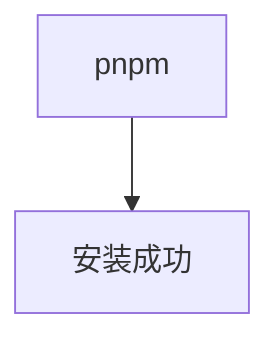
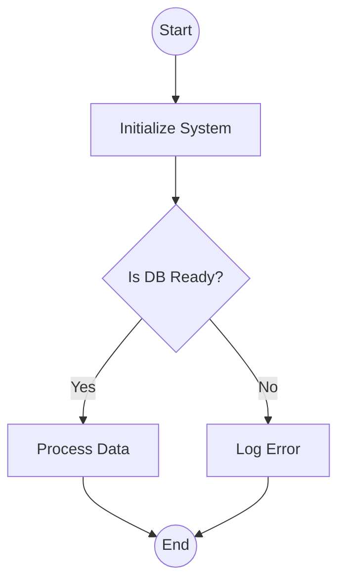
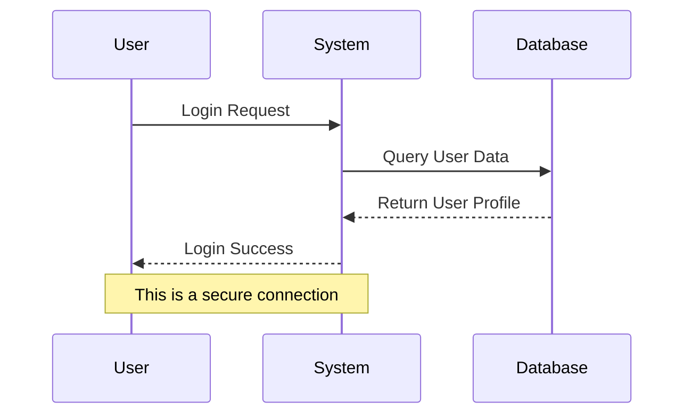
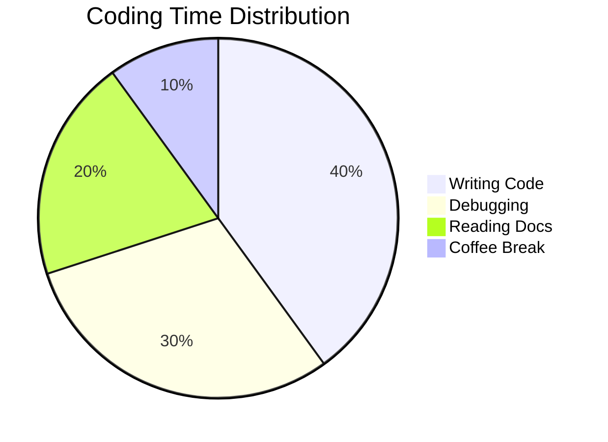
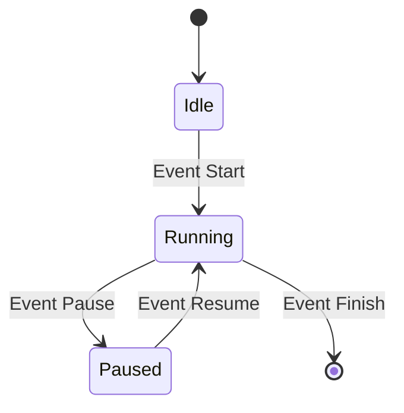
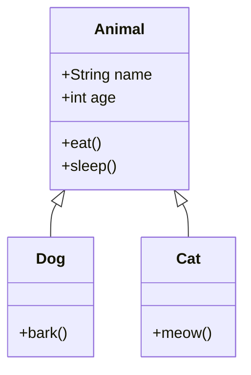

```log title="hello.log"
test
test
```

> Test

Test `inline code`

| Header 1 | Header 2 | Header 3 |
| -------- | -------- | -------- |
| Row 1    | Data 1   | Data 2   |
| Row 2    | Data 1   | Data 2   |
| Row 3    | Data 1   | Data 2   |

test 1:

-----

test 2:


-----
test 3:


-----
test 4:饼图


-----
test 5:柱状图



-----
test 6:类图



