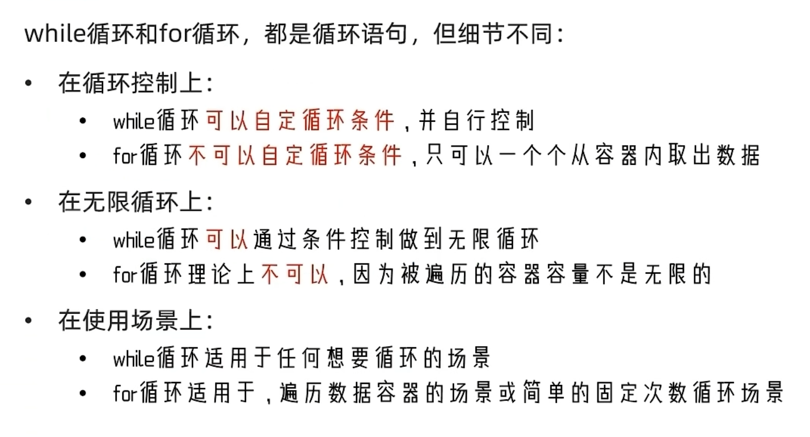

# Python合集第二集：基础语句(判断、循环)

## Bool 类型和比较运算符

> Bool类型代表逻辑门
>  True为真，本质是 1； False为假，0；
>  **与C++不同的是，True 和 False 都是首字母大写， 对大小写敏感**
>  与bool量有关的运算符： == != >= <= > <
>  例如： 6 > 2 为 true， 5 == 2 为false

## 判断结构----if-else语句

> **格式：与C++不同的是判断内容不需要括号，直接写。
>  而且执行体（执行内容）与其他代码段的分隔的格式是一个换行或者说，只有相连的、缩进统一的代码才会归入 if执行体 Python 是通过缩进来判断代码块的划分**

注意： else的后面需要接一个冒号，即： else:

即： if 判断条件 ： 条件成立时，程序执行的内容    

​	else：
​     	others 其他代码段

例如：

```python
age = int(input("请输入一个数："))
if age < 18:
    print("你的年龄是：%d" %age)
    print("嘻嘻")
else:
    print("你好")
print('World!')
```

### if-elif-else 语句----elif用于实现多个判断条件 elif即 else if

例如：

```python
age = int(input("Enter your age: "))
if age >= 0 and age < 18:
    print("You are a teenager")
elif age >= 18 and age < 65:
    print("You are a adult")
else:
    print("You are an elder")
```

### if-else语句嵌套

利用 **缩进** 将内层 if 和外层 if 嵌套起来

例如：

```python
age = int(input("Enter your age: "))
if 0 <= age < 18:
    print("Your age is teenager")
    if age <= 12:
        print("You are in primary school")
elif age >= 18 and age < 65:
    print("You are a adult")
    if age <= 35:
        print("You can continue doing work")
else:
    print("You are an elder")
```

## while循环体：

语法：
 while 判断条件 :
      循环体内容
 例如：一个简单的猜数游戏

```python
import random
num = random.randint(1, 100)
counts = 0
val = int(input())
while val != num:
    if val > num:
        print("大了")
    else:
        print("小了")
    val = int(input())
    counts += 1

print(counts)
```

### while循环嵌套 ---- 和if-else 嵌套一样

**补充**:

1.  print() 取消自动换行的方法： print("内容", end = '')
2. 转义符号 \t 可以使多行字符串自动对齐//左对齐 一个 \t 默认是一个tab的缩进内字符串对齐的功能才会生效，太长不行
    print("Heldwo \t\tworld")
    print("Ydawdaou \tqaadadwwdaare")

例子：打印九九乘法表

```python
i = 1; j =1
while i<=9:
    while j<=i:
        print("%d * %d = %d \t"%(j,i,i*j),end='')
        j+=1
    i += 1
    j = 1
    print()
```

## For 循环语句

语法： for 临时变量 in 待处理数据集 :
      循环体
 for循环是每次从数据集中依次取一个值赋给临时变量，然后执行循环体 -----常用来遍历

例如：

```python
name = "abcdefg"
for Name in name:
    print("%s "%Name,end='' )
output : a b c d e f g
```

求name里面有多少个特定字母：

```python
name = "ahdiqwndpwahdalwdjawoidhaoiwd"
ans = 0
for x in name:
    if x == 'a':
       ans += 1
print(ans)
```

### for循环的range语句：

待数据处理集严格来说是序列类型，即序列内容可以被依次取出值的变量类型，包括：字符串、List、tuple
range顾名思义，就是限定一个范围，告诉for循环从哪开始到哪结束
定义：**def __new__(cls, __start: SupportsIndex, __stop: SupportsIndex, __step: SupportsIndex = ...) -> Self: ...**
即存在三个参数：开头、结尾、步长 --- start 、 end、 step，
注意：这个相当于数组，输出的最后一个是 arr[end -1]
如果只写一个参数，默认为结尾（保证range区间有限）；开头默认为字符串首位或者0；步长默认为1，即逐个遍历

对于integer： range(2)表示从 0 开始到 1 结束,即C++中的for(int i = 0; i < 2; i++)， range(1,4,1)表示从1开始到3结束，步长为1

例子：打印九九乘法表

```python
for i in range(1,10):# 即 range(1,9,1)
    for j in range(1,i+1):# 相当于C++中的for(int i = 1;i < i+1; i++)
        print("%d * %d = %d\t"%(j,i,i*j),end='')
    j = 1
    print()
```

### continue and break

continue 用于结束当前这一轮的循环，但并未退出循环体； break则是直接退出循环体

嵌套循环时，continue就是退出continue所在层的循环体，break 和continue一样

---
## For 和 while 的区别


---

## 逻辑运算符

### 与 and

### 或 or

### 非 not


