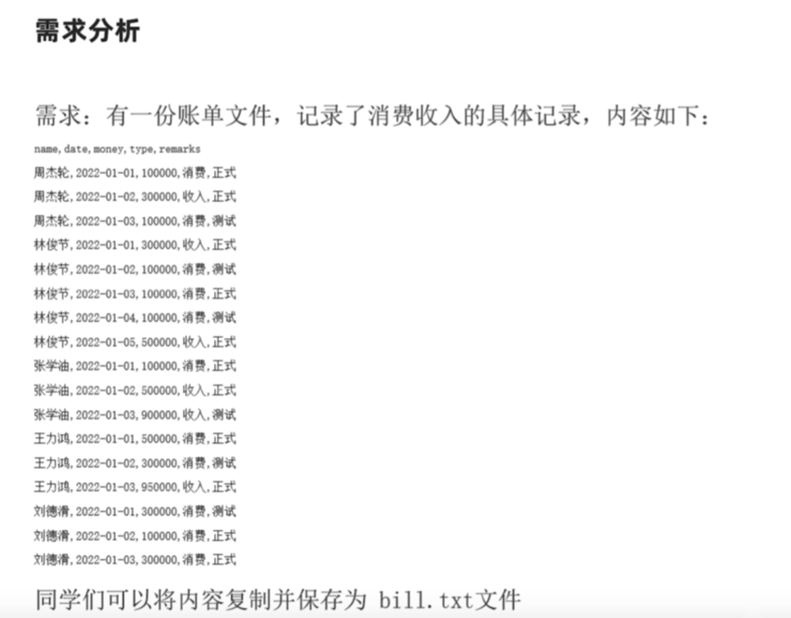
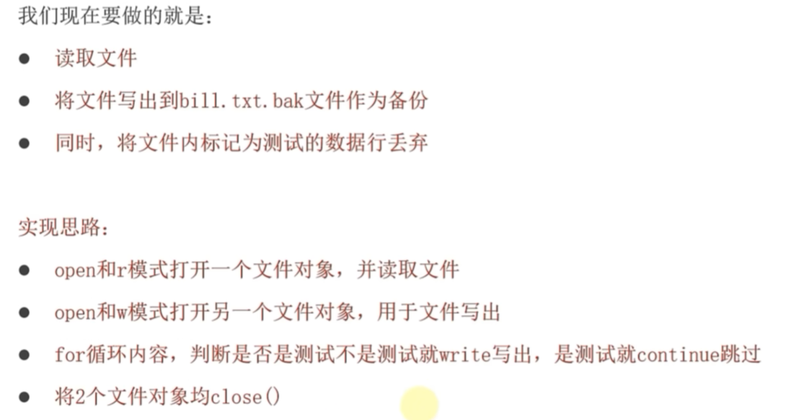

# 文件操作

## 打开文件 open()

​	open() 函数用于打开一个文件，并返回一个文件对象。如果文件不存在，根据不同的模式，可能会创建新文件或报错。

```py
file_object = open(file, mode='r', encoding=None)
```

- `file`: 必需参数，表示要打开的文件的路径（可以是相对路径或绝对路径）。
- `mode:` 可选参数，表示文件的打开模式，默认为 'r'（只读文本）。
- `encoding`: 可选参数，指定文件的编码格式，对于文本文件非常重要。在处理中文时，通常使用 'utf-8'。
- `file_object`此时是open函数的文件**对象**，也就是C++中的类的实例化。

```py
try:
    f = open("tt.txt",'r',encoding='utf-8')
    print(type(f))
    print(f)
except:
    print('Error')
# <class '_io.TextIOWrapper'>
# <_io.TextIOWrapper name='tt.txt' mode='r' encoding='utf-8'>
```

## 读写文件 

### 读取文件

有多种方法可以从文件中读取内容：

#### read(size)

​	**read(size)**: 读取指定大小（字节）的内容。如果省略 size 或为负数，则读取整个文件。

```py
try:
    with open("tt.txt",'r',encoding='utf-8') as f:
        print(f"{f.read()}")
except:
    print('Error')
# hello,world!
```

#### readline()

​	**readline()**: 读取文件中的一行（直到换行符 \n）。

```py
try:
    with open("tt.txt",'r',encoding='utf-8') as f:
        print(f"{f.readline()}")
except:
    print('Error')
# hello,
```

#### readlines()

​	**readlines()**: 读取所有行，并返回一个包含每行字符串的列表。

```py
try:
    with open("tt.txt",'r',encoding='utf-8') as f:
        print(f"{f.readlines()}")
except:
    print('Error')
# ['hello,\n', 'world!']
```

​	readlines() 返回的列表中，每个字符串（除了最后一个，如果文件末尾没有换行的话）都会包含末尾的换行符 \n。

使用**列表推导式 (List Comprehension)** 可以快速简洁地删除所有空白字符。

可以在读取行的同时，对每一行应用字符串的 .strip() 或 .rstrip() 方法。

- **.strip()**: 移除字符串**首尾**的所有空白字符（包括空格、制表符 \t 和换行符 \n）。这是最常用的。
- **.rstrip()**: 只移除字符串**末尾**的空白字符。

```py
# 创建一个示例文件
with open('data.txt', 'w', encoding='utf-8') as f:
    f.write("First line\n")
    f.write("Second line \n") # 注意末尾有空格
    f.write("  Third line with leading spaces\n")

# --- 使用 .strip() ---
try:
    with open("data.txt",'r',encoding='utf-8') as f:
        content = f.readlines()
        res = [line.strip() for line in content]
        print(res)
except:
    print('Error')

# ['hello,', 'world!']
    
# 如果你觉得列表推导式不太好理解，使用传统的 `for` 循环也能达到同样的效果。这种方式更明确，但代码稍长一些。
clean_lines = []
with open('data.txt', 'r', encoding='utf-8') as f:
    lines_raw = f.readlines()
    for line in lines_raw:
        clean_lines.append(line.strip())
```

#### 直接迭代文件对象

**直接迭代文件对象 (推荐)**: 这是最常用、最高效的逐行读取方式。

```py
try:
    with open("tt.txt",'r',encoding='utf-8') as f:
        for i in f:
            print(i.strip())
except:
    print('Error')
# hello,
# world!
```

## 关闭文件

操作完文件后，**务必关闭文件**以释放系统资源。如果不关闭，可能会导致数据丢失或文件损坏。

**基本语法：**

```
file_object.close()
```

**示例：**

```
f = open('example.txt', 'r', encoding='utf-8')
# ... 进行读写操作 ...
f.close()
print("文件已关闭。")
```

**推荐的方式：使用`with open()`语句**

​	为了避免忘记调用 close()，推荐使用 with 语句来管理文件对象。with 语句会在代码块执行完毕后**自动关闭文件**，即使在代码块中发生异常。

```py
with open('example.txt', 'r', encoding='utf-8') as f:
    # 在这个代码块中，文件 f 是打开的
    content = f.read()
    print("文件内容已读取。")
# 离开 with 代码块后，文件 f 会被自动关闭，无需手动调用 f.close()
print("文件已自动关闭。")
```


## 文件写入

使用 'w' 模式打开文件会**清空并覆盖**原有内容。

- **write(string)**: 将指定的字符串写入文件。

  ```py
  content_to_write = "这是第一行。\n这是第二行。"
  with open('output.txt', 'w', encoding='utf-8') as f:
      f.write(content_to_write)
  print("内容已写入 output.txt (覆盖模式)。")
  ```

- **writelines(list_of_strings)**: 将一个字符串列表写入文件（**注意：不会自动添加换行符**）。

  ```py
  lines = ["第一行\n", "第二行\n", "第三行"]
  with open('output_lines.txt', 'w', encoding='utf-8') as f:
      f.writelines(lines)
  print("多行内容已写入 output_lines.txt (覆盖模式)。")
  ```

## 追加写入

使用 'a' 模式打开文件会在文件末尾**追加**新内容，而不会清空原有内容。


## 常用文件模式 (mode)：

| 模式 | 描述                                                         |
| ---- | ------------------------------------------------------------ |
| 'r'  | **只读 **。默认模式。如果文件不存在，会抛出 FileNotFoundError。 |
| 'w'  | **只写**。如果文件存在，会**覆盖**原有内容；如果文件不存在，会创建新文件。 |
| 'a'  | **追加 (Append)**。如果文件存在，在文件末尾追加内容；如果文件不存在，会创建新文件。 |
| 'x'  | **独占创建**。如果文件已存在，会抛出 FileExistsError；如果不存在，则创建并以写入模式打开。 |
| 'b'  | **二进制模式**。可以与其他模式组合使用，如 'rb' (只读二进制)、'wb' (只写二进制)。用于处理非文本文件，如图片、音频、视频等。 |
| '+'  | **读写模式**。可以与其他模式组合，如 'r+' (读写，文件必须存在)、'w+' (读写，覆盖或创建)、'a+' (追加读写)。 |

**核心要点：**

*   **`with open(...) as f:`** 是处理文件的最佳实践。
*   **指定编码 `encoding='utf-8'`** 是处理文本文件（尤其是包含非英文字符）时的好习惯。
*   **区分 `'w'` (覆盖) 和 `'a'` (追加)** 是写入文件时的关键。
*   **读取时 `for line in f:`** 是逐行处理文件的最高效方式。
*   **`.strip()`** 是处理从文件中读取的行时非常有用的字符串方法。

## 练习





```py
try:
    with open('file_excercise.txt','r',encoding='utf-8') as f:
        print('It is ok to open origin file.')
        with open('output_file.txt.bak','w',encoding='utf-8') as f2:
            f2.write('name,date,money,type,remarks\n')
            for i in f:
                line = i.strip()
                if line.endswith('正式'):
                    f2.write(i)
except:
    print('Error')    
    
# name,date,money,type,remarks
# 周，2022-01-01，1000，消费，正式
# 周，2022-01-03，1001，消费，正式
# 周，2022-01-22，10004，消费，正式
# 林，2022-03-01，10006，消费，正式
# 张，2022-06-01，10090，消费，正式
# 李，2022-06-01，103300，消费，正式
# 李，2022-07-01，100220，消费，正式
# 王，2022-09-01，10020，消费，正式
# 刘，2022-10-01，100330，消费，正式    
```

