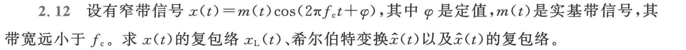

## 2-1

**题目 2.1：设 m(t) 是功率为 2 W 的实信号，求 z(t) = m(t) + j·2m(t) 的功率**

---

### 1. 相关知识点介绍

这道题考察的是信号**平均功率**的基本计算方法，特别是针对复数信号的功率计算。

在通信原理中，信号可以分为能量信号和功率信号。功率信号是指在无限长时间内，其平均功率是有限的非零常数，而能量是无限的。这道题中的 `m(t)` 就是一个功率信号。

对于一个复数信号 `z(t) = x(t) + j·y(t)`，它的总功率等于其实部 `x(t)` 的功率与虚部 `y(t)` 的功率之和。这是因为信号的功率被定义为其瞬时功率（即幅值平方）在时间上的平均，而复数幅值的平方 $|z(t)|^2$ 正好等于 $x(t)^2 + y(t)^2$

在您的知识清单中，这个知识点对应于：

*   **确定性信号分析 -> 1. 功率谱、功率密度谱的计算** (功率是功率谱密度在整个频率轴上的积分)
*   **随机信号分析 -> 2. 数字特征 -> 6. 平均功率** (更直接的定义)

### 2. 使用的公式

**1. 功率信号的平均功率定义：**

对于一个（可能是复数）信号 `s(t)`，其平均功率 `P` 定义为：
$$
P_s = \lim_{T \to \infty} \frac{1}{T} \int_{-T/2}^{T/2} |s(t)|^2 dt
$$
如果信号是随机过程，则功率是其二阶矩：$ P_s = E[|s(t)|^2] $

**2. 复数信号的模的平方：**

对于复数信号 `z(t) = x(t) + j·y(t)`，其模的平方为：
$$
 |z(t)|^2 = z(t) \cdot z^*(t) = x(t)^2 + y(t)^2
$$
其中 $z^*(t)$ 是 `z(t)` 的共轭

**3. 复数信号的功率：**

将公式 (2) 代入公式 (1)，可得复数信号 `z(t)` 的功率 $P_z$：
$$
P_z = \lim_{T \to \infty} \frac{1}{T} \int_{-T/2}^{T/2} [x(t)^2 + y(t)^2] dt 
$$

$$
P_z = \lim_{T \to \infty} \frac{1}{T} \int_{-T/2}^{T/2} x(t)^2 dt + \lim_{T \to \infty} \frac{1}{T} \int_{-T/2}^{T/2} y(t)^2 dt
$$

$$
 P_z = P_x + P_y 
$$

这表明，**复信号的总功率等于其实部信号的功率与虚部信号的功率之和**

### 3. 解题思路和步骤

**步骤 1：分解复信号 z(t) 的实部和虚部**

根据题目，信号 `z(t) = m(t) + j·2m(t)`
*   实部为：`x(t) = m(t)`
*   虚部为：`y(t) = 2m(t)`

**步骤 2：计算实部的功率 $P_x$**

实部 `x(t)` 就是 `m(t)`。题目已经给出 `m(t)` 的功率为 2 W
所以，$P_x = P_m = 2$ W。

**步骤 3：计算虚部的功率 $P_y$**

虚部 `y(t) = 2m(t)`

我们来计算它的功率 $P_y$：
$$
P_y = \lim_{T \to \infty} \frac{1}{T} \int_{-T/2}^{T/2} [y(t)]^2 dt = \lim_{T \to \infty} \frac{1}{T} \int_{-T/2}^{T/2} [2m(t)]^2 dt 
$$

$$
 P_y = \lim_{T \to \infty} \frac{1}{T} \int_{-T/2}^{T/2} 4 \cdot m(t)^2 dt
$$

将常数 4 提出：
$$
 P_y = 4 \cdot \left( \lim_{T \to \infty} \frac{1}{T} \int_{-T/2}^{T/2} m(t)^2 dt \right) 
$$

括号内的部分正好是 `m(t)` 的功率 `P_m` 的定义。
所以，$P_y = 4 \cdot P_m = 4 \times 2 = 8$ W

**步骤 4：计算 z(t) 的总功率 $P_z$**

根据公式 $P_z = P_x + P_y$，我们将实部和虚部的功率相加：
$$
P_z = 2 \text{ W} + 8 \text{ W} = 10 \text{ W}
$$
**结论：** 信号 `z(t)` 的功率为 10 W

---

## 2-2

**题目 2.2：考虑题 2.2 图中的 4 个信号，求它们两两之间的内积**

---

### 1. 相关知识点介绍

这道题的核心知识点是**信号的内积**（Inner Product）与**信号的正交性**（Orthogonality）

**1. 信号的内积：**
在信号分析中，我们常常把信号类比为矢量

正如矢量的点积（内积）可以衡量两个矢量的相似程度（或夹角），信号的内积也用于衡量两个信号在某个时间范围内的**相似性**或**相关性**。如果两个信号波形越  “像”，它们的内积绝对值就越大；如果它们波形差异很大，内积就可能很小甚至为零

**2. 信号的正交性：**
如果两个非零信号的内积为零，我们就称这两个信号是**正交的**

这是一个在通信系统中极其重要的概念。正交的信号互不相关，可以被完美地区分开。这构成了许多现代通信技术的基础，例如：

*   **正交频分复用 (OFDM)**：将高速数据流分成多个低速子流，在大量相互正交的子载波上进行传输，大大提高了频谱利用率
*   **码分多址 (CDMA)**：为不同用户分配相互正交的地址码（伪随机序列），使得多个用户的信号可以在同一时间和同一频率上传输而互不干扰

**3. 信号的能量：**
一个信号与自身的内积，在物理上等于该信号的总**能量**

这道题中的四个信号都是在有限时间内不为零的，因此它们都是能量信号

在知识清单中，这个知识点主要对应于：

*   **确定性信号分析 -> 3. 能量信号、功率信号的自相关函数、互相关函数的关系和计算**。信号的内积可以看作是两个信号互相关函数在零延迟（τ=0）时的取值。
*   **确定性信号分析 -> 2. 能量谱、能量密度谱的计算**。信号的能量是其与自身的内积，也是其能量谱密度在整个频率轴上的积分。

### 2. 使用的公式

**1. 信号内积的定义：**

对于两个实数能量信号 `f(t)` 和 `g(t)`，它们的内积 $<f(t), g(t)>$ 定义为：
$$
 <f(t), g(t)> = \int_{-\infty}^{\infty} f(t)g(t) dt 
$$

这个积分计算的是**两个信号乘积曲线下的面积**

**2. 信号正交的条件：**

两个信号 `f(t)` 和 `g(t)` 正交，当且仅当：
$$
<f(t), g(t)> = 0
$$
**3. 信号能量的定义：**

信号 `f(t)` 的能量 $E_f$ 定义为：
$$
E_f = \int_{-\infty}^{\infty} |f(t)|^2 dt = <f(t), f(t)>
$$

### 3. 解题思路和步骤

我们需要计算 6 对信号的内积：$<w,x>, <w,y>, <w,z>, <x,y>, <x,z>, <y,z>$

基本思路是：确定两个信号**同时不为零**的时间区间，然后在这个区间上对它们的乘积进行积分

**Step 0: 信号的数学表达式**

*   `w(t)`: 在 `[0, 2T]` 区间为 1
*   `x(t)`: 在 `[0, T]` 区间为 1
*   `y(t)`: 在 `[T, 2T]` 区间为 1
*   `z(t)`: 在 `[0, T]` 区间为 1，在 `[T, 2T]` 区间为 -0.5

**Step 1: 计算 `<w(t), x(t)>`**

*   **重叠区间**: `[0, T]`
*   **乘积**: $w(t)x(t) = 1 * 1 = 1$
*   **积分**:
    $$
    <w(t), x(t)> = \int_{0}^{T} 1 \cdot 1 \,dt = [t]_{0}^{T} = T
    $$
    
*   

**Step 2: 计算 `<w(t), y(t)>`**

*   **重叠区间**: `[T, 2T]`
*   **乘积**: $w(t)y(t) = 1 * 1 = 1$
*   **积分**:
    $$
    <w(t), y(t)> = \int_{T}^{2T} 1 \cdot 1 \,dt = [t]_{T}^{2T} = 2T - T = T
    $$
    
*   

**Step 3: 计算 `<w(t), z(t)>`**

*   **重叠区间**: `[0, 2T]`，但 `z(t)` 是分段函数，所以积分也要分段
*   **积分**:
    $$
    <w(t), z(t)> = \int_{0}^{2T} w(t)z(t) \,dt = \int_{0}^{T} 1 \cdot 1 \,dt + \int_{T}^{2T} 1 \cdot (-0.5) \,dt\\= [t]_{0}^{T} + [-0.5t]_{T}^{2T} = T + (-0.5 \cdot 2T - (-0.5 \cdot T)) = T - 0.5T \\= 0.5T
    $$
    
     

**Step 4: 计算 `<x(t), y(t)>`**

*   **重叠区间**: `x(t)` 的非零区间是 `[0, T]`，`y(t)` 的非零区间是 `[T, 2T]`。它们没有重叠部分（只有一个点 T 重合，对积分无影响）
*   **乘积**: `x(t)y(t) = 0` 对所有 `t` 成立
*   **积分**:
    $$
    <x(t), y(t)> = \int_{-\infty}^{\infty} 0 \,dt = 0
    $$
*   **结论**: 信号 `x(t)` 和 `y(t)` 是**正交**的。

**Step 5: 计算 `<x(t), z(t)>`**

*   **重叠区间**: `[0, T]`
*   **乘积**: `x(t)z(t) = 1 * 1 = 1`
*   **积分**:
    $$
    <x(t), z(t)> = \int_{0}^{T} 1 \cdot 1 \,dt = [t]_{0}^{T} = T
    $$

**Step 6: 计算 `<y(t), z(t)>`**

*   **重叠区间**: `[T, 2T]`
*   **乘积**: `y(t)z(t) = 1 * (-0.5) = -0.5`
*   **积分**:
    $$
    <y(t), z(t)> = \int_{T}^{2T} 1 \cdot (-0.5) \,dt = [-0.5t]_{T}^{2T} = (-0.5 \cdot 2T) - (-0.5 \cdot T) = -T + 0.5T = -0.5T
    $$
    
*   

**总结：**

*   `<w(t), x(t)> = T`
*   `<w(t), y(t)> = T`
*   `<w(t), z(t)> = 0.5T`
*   `<x(t), y(t)> = 0` （`x(t)` 和 `y(t)` 正交）
*   `<x(t), z(t)> = T`
*   `<y(t), z(t)> = -0.5T`

---

## 2-5

这是一个非常经典和重要的题目，因为它将时域操作（加窗）、频域分析（傅里叶变换）和信号的基本属性（能量、带宽）紧密地结合在了一起

**题目 2.5：求信号 g(t) = rect(t/Tₛ)cos(πt/Tₛ) 的能量、傅里叶变换、能量谱密度、主瓣带宽**

---

### 1. 相关知识点介绍

这道题综合考察了确定性信号分析中的多个核心概念。\

**1. 能量信号 (Energy Signal):**

一个信号如果在其整个持续时间内总能量是有限的，那么它就是能量信号

这类信号的平均功率为零。在时域上，能量信号的波形通常是“脉冲状”的，即只在有限的时间内有显著的幅值。本题中的 `g(t)` 是一个被矩形窗截断的余弦波，其持续时间有限 (从 $-Tₛ/2 到 +Tₛ/2$)，因此它是一个典型的能量信号

**2. 傅里叶变换 (Fourier Transform):**

傅里叶变换是信号分析的基石

它能将信号从我们直观感受到的**时域 (time domain)** 转换到**频域 (frequency domain)**。时域描述了信号的幅值如何随时间变化，而频域则描述了这个信号由哪些频率的正弦/余弦波组成，以及每个频率分量的“强度”和相位。`g(t)` 的傅里叶变换 `G(f)` 会告诉我们这个余弦脉冲的频率构成。

**3. 能量谱密度 (Energy Spectral Density, ESD)**

能量谱密度，记为 $Ψ_g(f)$，描述了信号的**能量是如何在不同频率上分布的**

它的物理意义是“单位频率的能量”

对 ESD 在整个频率轴上进行积分，就能得到信号的总能量

根据**巴塞伐尔定理 (Parseval's Theorem)**，**信号的能量谱密度就是其傅里叶变换幅度的平方**，即 
$$
Ψ_g(f) = |G(f)|²
$$
**4. 带通信号与主瓣带宽 (Main Lobe Bandwidth):**

信号 `g(t)` 是一个**带通信号**，因为它是由一个低通信号（矩形窗）与一个余弦载波相乘得到的

它的频谱能量集中在载波频率 $f_c$  附近，而不是在零频附近

由于时域上的截断（乘以矩形窗），信号在频域上会产生“展宽”和“旁瓣”。**主瓣**是频谱中能量最集中的部分，**主瓣带宽**就是这个中心频带的宽度，通常定义为**频谱主瓣中心两侧的第一个零点之间的距离**。这是衡量信号所占用的主要频率范围的一个非常实用的指标

在知识清单中，这些知识点对应于：

*   **确定性信号分析 -> 2. 能量谱、能量密度谱的计算**
*   **确定性信号分析 -> 4. LTI系统的输出信号、系统函数的谱计算** (其中包含了傅里叶变换作为核心工具)
*   **确定性信号分析 -> 6. 带通信号、带通滤波器的等效基带表示** (本题信号就是一个典型的带通信号)

### 2. 使用的公式

**1. 信号能量 (时域定义):**
$$
E_g = \int_{-\infty}^{\infty} |g(t)|^2 dt
$$
**2. 傅里叶变换定义:**
$$
G(f) = \mathcal{F}[g(t)] = \int_{-\infty}^{\infty} g(t)e^{-j2\pi ft} dt
$$
**3. 能量谱密度 (ESD):**
$$
\Psi_g(f) = |G(f)|^2
$$
**4. 能量 (频域定义 - Parseval's定理):**
$$
E_g = \int_{-\infty}^{\infty} |G(f)|^2 df = \int_{-\infty}^{\infty} \Psi_g(f) df
$$
**5. 常用傅里叶变换性质:**

* **时域相乘 ↔ 频域卷积:** $F[g₁(t) · g₂(t)] = G₁(f) * G₂(f)$ (卷积)

* **调制性质 (余弦相乘):** 这是一个非常重要的特例，
  $$
  F[m(t)cos(2πf_c t)] = \frac{1}{2}[M(f - f_c) + M(f + f_c)]
  $$

**6. 常用傅里叶变换对:**
*   **矩形脉冲:** 
    $$
    rect(t/τ) ↔ τ * sinc(τf)
    $$
    
    *   其中 `sinc(x) = sin(πx) / (πx)`
    
* **余弦函数:** 
  $$
  cos(2πf_c t) ↔ \frac{1}{2}[δ(f - f_c) + δ(f + f_c)]
  $$

*   

### 3. 解题思路和步骤

我们将按顺序求解这四个量

#### 步骤一：求傅里叶变换 G(f)

信号 `g(t)` 是一个低通信号 $m(t) = rect(t/Tₛ)$ 与一个载波 $cos(πt/Tₛ)$的乘积。
1. **识别低通信号及其频谱:**
   低通信号为 $m(t) = rect(t/Tₛ)$

   根据傅里叶变换对 $rect(t/τ) ↔ τ * sinc(τf)$，令 $τ = Tₛ$，可得其频谱为：
   $M(f) = Tₛ\ sinc(Tₛf)$

2. **识别载波频率:**
   载波为 $cos(πt/Tₛ)$

   我们将其写成标准形式 $cos(2πf_c t)$

   $2πf_c = π/Tₛ  =>  f_c = 1/(2Tₛ)$

3. **应用调制性质:**
   现在使用调制性质
   $$
   F[m(t)cos(2πf_c t)] = \frac{1}{2}[M(f - f_c) + M(f + f_c)]
   $$
   将 $M(f)$ 和 $f_c$ 代入：
   $$
    G(f) = \frac{1}{2} \left[ T_s \text{sinc}(T_s(f - \frac{1}{2T_s})) + T_s \text{sinc}(T_s(f + \frac{1}{2T_s})) \right] 
   $$

   $$
    G(f) = \frac{T_s}{2} \left[ \text{sinc}(T_s f - \frac{1}{2}) + \text{sinc}(T_s f + \frac{1}{2}) \right] 
   $$

   这就是信号 `g(t)` 的傅里叶变换

   它是由两个 `sinc` 函数构成的，一个中心在 $f_c$，另一个在 $-f_c$

#### 步骤二：求能量谱密度 $Ψ_g(f)$

根据定义 $Ψ_g(f) = |G(f)|²$
$$
 \Psi_g(f) = \left| \frac{T_s}{2} \left[ \text{sinc}(T_s f - \frac{1}{2}) + \text{sinc}(T_s f + \frac{1}{2}) \right] \right|^2
$$

$$
\Psi_g(f) = \frac{T_s^2}{4} \left[ \text{sinc}(T_s f - \frac{1}{2}) + \text{sinc}(T_s f + \frac{1}{2}) \right]^2
$$

由于两个 `sinc` 函数在频域上间隔较远，它们的重叠部分很小，通常我们主要关心这两个谱的包络形状

#### 步骤三：求信号能量 $E_g$

我们可以通过时域积分来S求解，这通常比对复杂的频域表达式积分要简单得多S
1. **写出能量积分式:**
   $$
    E_g = \int_{-\infty}^{\infty} |g(t)|^2 dt = \int_{-\infty}^{\infty} \left[ \text{rect}(\frac{t}{T_s}) \cos(\frac{\pi t}{T_s}) \right]^2 dt
   $$
   

2. **利用 rect 函数的性质确定积分上下限:**
   $rect(t/Tₛ)$ 只在 $t ∈ [-Tₛ/2, Tₛ/2]$ 区间内为 1，其余为 0。
   $$
   E_g = \int_{-T_s/2}^{T_s/2} \cos^2(\frac{\pi t}{T_s}) dt
   $$
   

3. **使用三角恒等式:** $cos²(θ) = \frac{1}{2}(1 + cos(2θ))$
   $$
   E_g = \int_{-T_s/2}^{T_s/2} \frac{1}{2} \left[ 1 + \cos(\frac{2\pi t}{T_s}) \right] dt
   $$
    

4. **进行积分:**
   $$
   E_g = \frac{1}{2} \left[ t + \frac{T_s}{2\pi} \sin(\frac{2\pi t}{T_s}) \right]_{-T_s/2}^{T_s/2} 
   $$

   $$
    E_g = \frac{1}{2} \left[ (\frac{T_s}{2} - (-\frac{T_s}{2})) + \frac{T_s}{2\pi} (\sin(\pi) - \sin(-\pi)) \right] 
   $$

   由于 `sin(π) = 0` 和 `sin(-π) = 0`，后面的项为 0
   $$
    E_g = \frac{1}{2} [T_s] = \frac{T_s}{2} 
   $$

   所以，信号的总能量为 $Tₛ/2$

#### 步骤四：求主瓣带宽 $B_{main}$

由于这两个 `sinc` 函数在频域上离得**足够远**，它们的主瓣**几乎不重叠**。因此，当我们分析正频率区域的频谱形状时，它完全由中心在正频率的那个 `sinc` 函数主导；同理，负频率区域的频谱形状由中心在负频率的那个 `sinc` 函数主导

**在物理意义上没有负半轴，因此，当计算“主瓣带宽”时，实际上是在问：这个信号在正频率轴上占据的核心频带有多宽**

1.  **分析频谱结构:**
    `G(f)` 的频谱在正半轴的主瓣由 $sinc(Tₛf - 1/2)$ 决定，其中心在 $Tₛf - 1/2 = 0$，即 $f = 1/(2Tₛ) = f_c$
2.  **寻找主瓣的第一个零点:**
    `sinc(x)` 函数的零点在 $x = ±1, ±2, ...$ 处。主瓣两侧的第一个零点对应 $x = ±1$
    令 $x = Tₛf - 1/2$，我们有：
    
    *   $Tₛf - 1/2 = 1$  => $Tₛf = 3/2` => `f₁ = 3/(2Tₛ)$
    *   $Tₛf - 1/2 = -1$ => $Tₛf = -1/2` => `f₂ = -1/(2Tₛ)$
3.  **计算带宽:**
    主瓣带宽是这两个零点频率之差：
    $$
     B_{\text{main}} = f_1 - f_2 = \frac{3}{2T_s} - (-\frac{1}{2T_s}) = \frac{4}{2T_s} = \frac{2}{T_s} 
    $$
    
    所以，信号的主瓣带宽为 $2/T_s$

**总结：**

*   **傅里叶变换 G(f):** $(Tₛ/2) [sinc(Tₛf - 1/2) + sinc(Tₛf + 1/2)]$
*   **能量 E_g:** $Tₛ/2$
*   **能量谱密度 Ψ_g(f):** $(Tₛ²/4) [sinc(Tₛf - 1/2) + sinc(Tₛf + 1/2)]²$
*   **主瓣带宽 B_main:** $2/T_s$

## 2-11

这道题考察的是一个非常核心且深刻的概念：**信号的表示不是唯一的，它取决于我们选择的参考基准**

**题目 2.11：设有带通信号 s(t) = a(t)cos(2πf_c t) - b(t)sin(2πf_c t)，其中 a(t), b(t) 是基带信号。求 s(t) 以 cos(2πf_c t + θ) 为参考载波的复包络。**

---

### 1. 相关知识点介绍

**1. 带通信号 (Bandpass Signal):**

在通信系统中，我们通常需要将包含信息的低频基带信号（如语音、数据）“搬移”到适合在信道中传输的高频段

这个过程就是**调制**，得到的信号就是**带通信号**。它的频谱集中在某个较高的中心频率 $f_c$ 附近

一个通用的带通信号 `s(t)` 可以表示为正交形式：
$$
s(t) = x_I(t)cos(2πf_c t) - x_Q(t)sin(2πf_c t)
$$
其中 $x_I(t)$ 称为**同相分量 (In-phase)**，$x_Q(t)$  称为**正交分量 (Quadrature)**。它们都是低通（基带）信号，共同承载了原始信号的全部信息

**2. 复包络 (Complex Envelope) / 等效低通表示:**

直接分析或仿真高频振荡的带通信号 `s(t)` 是非常低效的

因此，我们引入**复包络** `s̃(t)` 的概念。复包络是一个**复数的基带信号**，它完整地描述了带通信号的幅度和相位的变化，但去除了高频载波的振荡：**复包络的实部是同相分量 (I)，虚部是正交分量 (Q)**
$$
s̃(t) = x_I(t) + jx_Q(t)
$$

这种用一个低频复信号来表示一个高频实信号的方法，称为**等效低通表示法**。它极大地简化了通信系统的分析和设计。

**3. 解析信号 (Analytic Signal):**

为了从数学上严谨地得到复包络，我们需要借助**解析信号** $s_+(t)或 z(t)$。对于任意实信号 `s(t)`，其解析信号定义为：
$$
s_+(t) = s(t) + jŝ(t) = z(t)
$$

其中 `ŝ(t)` 是 `s(t)` 的**希尔伯特变换 (Hilbert Transform)**；解析信号是一个复信号，其频谱在负频率部分为零。它与原始实信号 `s(t)` 包含完全相同的信息。

**4. 复包络与解析信号的关系:**
解析信号 $s_+(t)$ 可以看作是复包络 $s̃(t)$ 进行了频谱搬移（调制）的结果。

它们的关系是：
$$
s_+(t) = s̃(t) · e^{j2πf_c t}
$$
反过来，我们可以通过解调解析信号来获得复包络：
$$
s̃(t) = s_+(t) · e^{-j2πf_c t}
$$
而原始的实信号 `s(t)` 可以从复包络中恢复：
$$
s(t) = Re[s̃(t) · e^{j2πf_c t}]
$$
这个关系式隐含了一个**默认的参考载波**是 $cos(2πf_c t)$

---

**一个信号的解析信号是唯一的**：

**解析信号的唯一性，来源于希尔伯特变换的唯一性**

对于一个给定的实信号 `s(t)`，它的希尔-伯特变换 `ŝ(t)` 是**唯一确定**的。既然解析信号 `s+(t)` 的定义是 `s(t) + jŝ(t)`，而 `s(t)` 是已知的，`ŝ(t)` 又是唯一确定的，那么 `s+(t)` 自然也是唯一确定的

---

**本题的关键**在于，参考载波不再是 $cos(2πf_c t)$，而是 $cos(2πf_c t + θ)$。这意味着复包络的定义也随之改变

新的复包络（我们记为 $s̃_θ(t)$）与 $s(t)$ 的关系变为：
$$
s(t) = Re[s̃_θ(t) · e^{j(2πf_c t + θ)}]
$$
我们的任务就是根据这个新的关系来求解 $s̃_θ(t)$

在知识清单中，这些知识点对应于：
*   **确定性信号分析 -> 5. 希尔伯特变换与解析信号**
*   **确定性信号分析 -> 5.1. 解析信号特性**
*   **确定性信号分析 -> 5.2. 复包络、复载波**
*   **确定性信号分析 -> 6. 带通信号、带通滤波器的等效基带表示**

### 2. 使用的公式

1. **带通信号通用表示:**

   
   $$
   s(t) = a(t)cos(2πf_c t) - b(t)sin(2πf_c t)
   $$
   

2. **欧拉公式:**

   
   $$
   e^{jφ} = cos(φ) + jsin(φ)\\cos(φ) = \frac{e^{jφ} + e^{-jφ}}{2}\\sin(φ) = \frac{e^{jφ} - e^{-jφ}}{2j}
   $$

   

3. **解析信号与复包络的关系 (标准参考载波):**

   
   $$
   s_+(t) = s(t) + jŝ(t) = (\ a(t) + jb(t)\ ) · e^{j2πf_c t}
   $$
   

4. **实信号与复包络的关系 (相位偏移参考载波):**

   
   $$
   s(t) = Re[\ s̃_θ(t) · e^{j(2πf_c t + θ)}\ ]
   $$
   

5. **三角恒等式 (用于验证):**
   $$
   cos(A+B) = cosAcosB - sinAsinB\\sin(A+B) = sinAcosB + cosAsinB
   $$
   

### 3. 解题思路和步骤

我们将使用一种最直接和根本的方法：从解析信号出发，因为**一个信号的解析信号是唯一的，不随我们选择的参考载波而改变**

> - **解析信号 $s_+(t)$ 是信号 $s(t)$ 的一个内在的、客观的数学属性**，就像它的能量、功率、傅里叶变换一样。它不依赖于我们如何去观察或描述它。
> - **复包络 $s̃(t)$ 和参考载波 $e^{jω_c t}$ 是为了方便分析而引入的一套“表示方法”或“坐标系”**
>
> 这道题的本质是：我们有一个客观存在的实体（唯一的解析信号 s+(t)），现在我们从两个不同的“观察角度”（即用两个不同的参考载波）去描述它
>
> - **观察角度1（标准参考载波）**：$s_+(t) = [a(t) + jb(t)] · e^{jω_c t} $
> - **观察角度2（带相偏的参考载波）**：$s_+(t) = s̃_θ(t) · e^{j(ω_c t + θ)}$

#### 步骤一：求 s(t) 的解析信号 $s_+(t)$

对于一个形如 $s(t) = a(t)cos(ω_c t) - b(t)sin(ω_c t)$ 的带通信号（其中 `a(t)` 和 `b(t)` 是带宽远小于 $f_c$ 的基带信号），其希尔伯特变换 `ŝ(t)` 有一个非常简洁的结果：
$$
ŝ(t) ≈ a(t)sin(ω_c t) + b(t)cos(ω_c t)
$$
(这是因为对 `cos` 的希尔伯特变换是 `sin`，对 `sin` 的是 `-cos`，且基带信号可视为常数提出)

因此，解析信号 $s_+(t) = s(t) + jŝ(t)$ 为：
$$
s_+(t) = [a(t)cos(ω_c t) - b(t)sin(ω_c t)] + j[a(t)sin(ω_c t) + b(t)cos(ω_c t)]
$$
其中 $ω_c = 2πf_c$

重新组合上式，把 `a(t)` 和 `b(t)` 作为系数：
$$
s_+(t) = a(t)[cos(ω_c t) + jsin(ω_c t)] + b(t)[-sin(ω_c t) + jcos(ω_c t)]
$$

注意到 `j² = -1`，所以 
$$
jcos(ω_c t) - sin(ω_c t) = j(cos(ω_c t) + \frac{1}{j}sin(ω_c t)) = j(cos(ω_c t) - jsin(ω_c t))
$$
那么得到：
$$
s_+(t) = a(t)[cos(ω_c t) + jsin(ω_c t)] + b(t)[-sin(ω_c t) + jcos(ω_c t)]\\\\s_+(t) = a(t)e^{jω_c t} + b(t)[j^2sin(ω_c t) + jcos(ω_c t)]\\\\s_+(t) = a(t)e^{jω_c t} + jb(t)[j sin(ω_c t) + cos(ω_c t)]\\\\s_+(t) = a(t)e^{jω_c t} + jb(t)e^{jω_c t}\\s_+(t) = (\ a(t) + jb(t)\ )e^{jω_c t}
$$
这个结果是正确的，它表明以 $cos(ω_c t)$ 为参考载波的**标准复包络**就是 $s̃(t) = a(t) + jb(t)$

#### 步骤二：建立新旧复包络的关系

解析信号 $s_+(t)$ 是唯一的

它既可以由标准复包络 $s̃(t)$ 生成，也可以由我们要求的、以带相位偏移的载波为参考的**新复包络** $s̃_θ(t)$ 生成

1. $$
   s_+(t) = s̃(t) · e^{jω_c t} = (a(t) + jb(t))e^{jω_c t}
   $$

2. $$
   s_+(t) = s̃_θ(t) · e^{j(ω_c t + θ)}
   $$

   

#### 步骤三：求解新的复包络 $s̃_θ(t)$

既然两种表示方法都指向同一个解析信号，那么它们必然相等
$$
s̃_θ(t) · e^{j(ω_c t + θ)} = (a(t) + jb(t))e^{jω_c t}
$$
现在，我们从中解出 $s̃_θ(t)$：
$$
s̃_θ(t) = (a(t) + jb(t)) · \frac{e^{jω_c t}}{e^{j(ω_c t + θ)}}\\
s̃_θ(t) = (a(t) + jb(t)) · e^(jω_c t - j(ω_c t + θ))\\\\
s̃_θ(t) = (a(t) + jb(t)) · e^{-jθ}
$$

这就是最终的答案

#### 结果分析与验证

这个结果非常直观：当我们将参考载波的相位**超前** `θ` 时，为了保持原始的实信号 `s(t)` 不变，等效的复包络的相位就必须**滞后** `θ`

我们可以将结果展开：
$$
s̃_θ(t) = (a(t) + jb(t))(cos(θ) - jsin(θ))\\
s̃_θ(t) = [a(t)cos(θ) + b(t)sin(θ)] + j[b(t)cos(θ) - a(t)sin(θ)]
$$

所以，新的同相分量是 $a(t)cos(θ) + b(t)sin(θ)$，新的正交分量是 $b(t)cos(θ) - a(t)sin(θ)$

**结论**
信号 `s(t)` 以 $cos(2πf_c t + θ)$ 为参考载波的复包络为 $(a(t) + jb(t))e^{-jθ}$

---

### 补充知识

这三个概念——希尔伯特变换、解析信号、复包络——是通信原理中从实信号分析走向复信号分析的关键桥梁，是理解现代调制解调技术（如QAM）的基础

#### 一、希尔伯特变换

**1. 定义**

希尔伯特变换将一个实信号 $s(t)$ 变换为另一个实信号 `ŝ(t)`（读作 "s-hat of t"）

它有两种等价的定义：

*   **时域定义（卷积）：** `ŝ(t)` 是 `s(t)` 与 `h(t) = 1/(πt)` 的卷积。
    $$
    \hat{s}(t) = s(t) * \frac{1}{\pi t} = \int_{-\infty}^{\infty} \frac{s(\tau)}{ \pi(t-\tau) } d\tau
    $$
    
    
*   **频域定义（滤波）：** 
    
    希尔伯特变换在频域上相当于一个特殊的滤波器，其传递函数为 $H(f) = -j * sgn(f)$
    $$
    H(f) = \begin{cases} -j, & f > 0 \\ 0, & f = 0 \\ j, & f < 0 \end{cases}
    $$
    
    这意味着，$ŝ(t)$ 的傅里叶变换 $\hat{S}(f)$ 与 $s(t)$  的傅里叶变换 $S(f)$ 的关系是：
    $$
    \hat{S}(f) = H(f)S(f) = -j \cdot \text{sgn}(f) \cdot S(f)
    $$
    

**2. 作用与物理意义：理想的 90° 移相器**

希尔伯特变换最核心的物理意义是**它是一个理想的宽带 90° 移相器**

从频域定义 `H(f)` 来看：
*   **幅度特性：** $|H(f)| = 1$ (对于 f ≠ 0)；这意味着它**不改变**信号中任何频率分量的幅度。
*   **相位特性：**
    *   当 `f > 0` 时，`H(f) = -j = e^(-jπ/2)`。它将所有**正频率分量**的相位**延迟 90°**（或 -π/2）
    *   当 `f < 0` 时，`H(f) = j = e^(+jπ/2)`。它将所有**负频率分量**的相位**超前 90°**（或 +π/2）

**核心作用**

希尔伯特变换的主要作用是为了构造一个与原信号 `s(t)` **正交 (Orthogonal)** 的信号 `ŝ(t)`

对于能量信号，这意味着它们的内积（互相关为0）为零：
$$
\int_{-\infty}^{\infty} s(t)\hat{s}(t) dt = 0
$$

这个正交性是构建解析信号和复包络的基础

#### 二、解析信号

**1. 定义**

对于任意实信号 `s(t)`，其对应的解析信号 $s_+(t)$ 是一个复信号，定义为：
$$
 s_+(t) = s(t) + j\hat{s}(t)
$$

它由原始实信号作为实部，希尔伯特变换后的信号作为虚部构成

**2. 作用与特性**

解析信号是一个功能强大的数学工具，其最重要的特性是**它的频谱是单边谱**

*   **频谱特性：** 解析信号 $s+(t)$ 的傅里叶变换 $S_+(f)$ 为：
    $$
     S_+(f) = \begin{cases} 2S(f), & f > 0 \\ S(0), & f = 0 \\ 0, & f < 0 \end{cases} 
    $$
    **推导：** 
    $$
    S_+(f) = F[s(t) + jŝ(t)] \\= S(f) + jŜ(f) = S(f) + j[H(f)S(f)] \\= S(f)[1+jH(f)]
    $$
    

    当 $f>0$ 时，$1+j(-j)=2$；当$ f<0 $时，$1+j(j)=0$

*   **核心作用**

    1. **消除频谱负半轴**： 通过构造解析信号，我们去掉了频谱中的负频率部分；负频率在数学上是必要的（因为实信号的频谱是共轭对称的），但在物理上是冗余的。去掉它并不会损失任何信息。

    2. **明确定义瞬时参数**：  对于一个普通实信号 $Acos(ωt+φ)$，我们无法唯一地定义其“瞬时包络”和“瞬时相位”。但对于解析信号，我们可以无歧义地定义**瞬时包络 `A(t)`** 和**瞬时相位 `φ(t)`**：

       * $$
         s_+(t) = A(t)e^{jφ(t)}
         $$

         

       * 瞬时包络: 
         $$
         A(t) = |s+(t)| = \sqrt{s^2(t) + \hat{s}^2(t)}
         $$
         

       * 瞬时相位: 
         $$
         φ(t) = arg[s+(t)]
         $$
         

    3. **通往复包络的桥梁：** 解析信号是计算复包络的中间步骤

#### 三、复包络/ 等效低通信号

**1. 定义**

对于一个中心频率为 $f_c$ 的实带通信号 `s(t)`，其**复包络** `s̃(t)` (读作 "s-tilde of t") 是一个**复数的基带（低通）信号**。它通过将解析信号的频谱从 `f_c` 附近搬移到零频附近得到；有两个求解公式

*   **求解公式（分析）**
    $$
    \tilde{s}(t) = s_+(t) \cdot e^{-j2\pi f_c t}
    $$
    
    
    这个过程在频域上看，就是将 `S+(f)` 向右平移 `f_c`，从而将频谱的中心从 `f_c` 移到 0
    
*   **关系公式（合成）：**
    
    原始的实带通信号 `s(t)` 可以由复包络重建：
    $$
    s(t) = \text{Re}[\tilde{s}(t) \cdot e^{j2\pi f_c t}]
    $$
    如果将复包络写作直角坐标形式 $s̃(t) = s_I(t) + j s_Q(t)$，那么：
    $$
    s(t) = Re[\ (\ s_I(t) + j s_Q(t)\ ) (\ cos(2πf_c t) + jsin(2πf_c t)\ )]\\
    s(t) = s_I(t)cos(2πf_c t) - s_Q(t)sin(2πf_c t)
    $$
    
    这里的 $s_I(t)$ 就是**同相分量**，$s_Q(t)$ 就是**正交分量**

**2. 作用与意义**

复包络是通信系统分析和仿真中**最实用**的概念之一

1. **简化分析与仿真：** 

   带通信号 `s(t)` 包含高频载波，变化非常快。而复包络 `s̃(t)` 是一个基带信号，变化缓慢。在计算机仿真中，处理 `s̃(t)` 所需的采样率远低于处理 `s(t)`，极大地节省了计算资源。我们可以对基带的复包络进行各种处理（如滤波、放大），最后再把它“搬”回高频，得到最终的带通信号

2. **承载全部信息：** 复包络 `s̃(t)` 包含了原始基带信号的**全部信息**

   *   它的**幅度 $|s̃(t)|$** 对应了带通信号的**幅度调制信息 (AM)**
   *   它的**相位 $arg[s̃(t)]$** 对应了带通信号的**相位调制信息 (PM/FM)**

3. **现代数字调制的数学模型**： 像 QPSK、16QAM 这类现代数字调制技术，其本质就是直接构建复包络 `s̃(t)`。星座图上的每一个点，都代表了一个复包络 `s̃(t)` 的一个可能的复数值

#### 四、常用希尔伯特变换对

以下是一些在分析中最常用的希尔伯特变换对：

| 信号 `s(t)`        | 希尔伯特变换 `ŝ(t)` | 备注                                      |
| ------------------ | ------------------- | ----------------------------------------- |
| `cos(2πf₀t)`       | `sin(2πf₀t)`        | `cos` 信号的所有分量相移 -90° 得到 `sin`  |
| `sin(2πf₀t)`       | `-cos(2πf₀t)`       | `sin` 信号的所有分量相移 -90° 得到 `-cos` |
| `A` (常数)         | `0`                 | 直流分量 (f=0) 被滤掉                     |
| `δ(t)` (冲击函数)  | `1/(πt)`            | 系统的冲激响应                            |
| $m(t)cos(2πf_c t)$ | $m(t)sin(2πf_c t)$  | $m(t)$是带宽远小于$f_c$的基带信号         |
| $m(t)sin(2πf_c t)$ | $-m(t)cos(2πf_c t)$ | 同上                                      |

#### 五、三者关系和目的

**核心思想**： 我们的最终目标是**用一个缓慢变化的低频复信号（复包络）来等效地表示一个快速振荡的高频实信号（带通信号）**，从而极大地简化通信系统的分析和仿真。希尔伯特变换和解析信号是实现这个目标所必须经过的中间步骤和数学工具

**它们的关系：一个三步走的流程**

可以把从一个实带通信号 `s(t)` 得到其复包络 `s̃(t)` 的过程看作是三步：

**起点：一个实带通信号 `s(t)`**

*   **特点：** 真实世界中的信号，高频振荡，频谱关于零频共轭对称（即有正、负两个频段）
*   **问题：** 包含  冗余  的负频率信息，难以直接分析其幅度和相位的变化

**第一步：使用希尔伯特变换创建正交分量**

* **作用/角色**： **正交信号生成器**

* **它做了什么**： 希尔伯特变换接收实信号 `s(t)`，并输出另一个实信号 `ŝ(t)`。这个 `ŝ(t)` 在所有频率上都比 `s(t)` 延迟了 90°

* **为什么需要它**： 

  一个实信号 `s(t)` 本质上是一维的

  为了能完整地描述幅度和相位，我们需要一个二维（复平面）的表示。希尔伯特变换为我们创造了与 `s(t)`（可以看作是 X 轴）完全正交的另一个维度 `ŝ(t)`（可以看作是 Y 轴）。没有 $ŝ(t)$，我们就无法构建复平面上的向量。

**第二步：组合成解析信号以消除冗余**

*   **作用/角色**： **信息完备的单边谱信号**
*   **它做了什么**： 将原始信号 `s(t)`作为实部，将其正交版本 `ŝ(t)` 作为虚部，组合成一个复信号 $s_+(t) = s(t) + jŝ(t)$
*   **为什么需要它**
    1.  **消除负频率**： 解析信号 `s+(t)` 的频谱只存在于正半轴，完全消除了冗余的负频率信息，但没有丢失任何原始信息
    2.  **数学上的完备性**： 它将幅度和相位信息“打包”进了一个单一的复数表达式中 $A(t)e^{jφ(t)}$，使得瞬时幅度和瞬时相位有了明确的数学定义
*   **局限性：** 解析信号 $s_+(t)$ 仍然是一个**高频信号**，它依然以 $e^(j2πf_c t)$ 的速度在复平面上快速旋转

**第三步：解调得到复包络以简化分析**

* **作用/角色：** **最终的等效低通表示**

* **它做了什么：** 将解析信号 $s_+(t)$ 乘以一个反向旋转的复载波 $e^{-j2πf_c t}$，从而“抵消”掉它的高频旋转。这个过程在数学上就是**解调**或**频谱搬移**
  $$
  s̃(t) = s_+(t) * e^{-j2πf_c t}
  $$
  

*   **为什么需要它：**
    
    1.  **降维打击：** 这是我们的最终目标。`s̃(t)` 是一个**低频（基带）**信号，它的变化速度与原始消息信号一样缓慢，非常便于分析和计算机仿真
    2.  **信息载体：** 这个低频的复包络 `s̃(t)` 包含了原始高频信号 `s(t)` 的**全部调制信息**。它的幅度 $|s̃(t)|$ 就是幅度变化，它的相位 `arg[s̃(t)]` 就是相位变化

总结与类比

| 概念             | 信号类型  | 频段            | 核心作用                                            |
| :--------------- | :-------- | :-------------- | :-------------------------------------------------- |
| **希尔伯特变换** | 变换/算子 | -               | **工具**：为实信号 `s(t)` 创建一个正交的搭档 `ŝ(t)` |
| **解析信号**     | 复信号    | **带通** (高频) | **中间产品**：消除负频率，将信息打包成复数形式      |
| **复包络**       | 复信号    | **基带** (低频) | **最终产品**：用于分析和仿真的等效低通信            |

**一个生动的类比：**

想象一下你在观察一个**旋转木马**

1. **实信号 `s(t)`**：  你站在木马的正南方，只能看到一匹马在你面前左右来回移动（东西方向的投影）；你只得到了部分信息。

2. **希尔伯特变换 `ŝ(t)`** ：你派一个朋友站在木马的正西方，他只能看到这匹马前后移动（南北方向的投影）；这是与你观察正交的信息。

3. **解析信号 `s+(t)`**：

   你们俩用对讲机实时沟通，将你们各自观察到的位置（东西 `s(t)` 和南北 `ŝ(t)`）组合起来，就能在脑海中构建出这匹马在二维平面上做圆周运动的完整轨迹。这个轨迹就是解析信号；**但是，这个轨迹本身仍然是高速旋转的**

4. **复包络 `s̃(t)`**： 

   现在，你跳上旋转木马的中心，和木马一起旋转

   从你的视角看，那匹马几乎是静止的（或者只是相对于你缓慢地前后移动，如果它在木马上还有自己的小幅运动）；你看到的这个相对静止的向量，就是**复包络**；它去除了整体的旋转，只留下了真正的信息（马相对于木马自身的变化）。

这个从地面观察到跳上木马观察的过程，完美地诠释了从 `s(t)` 到 `s̃(t)` 的变换，以及每个工具在其中扮演的角色

## 2-12

