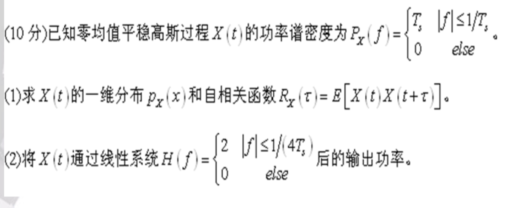

## 1️⃣3-1

**题目 3.1：设 Y(t) = X(t)cos(2πf_c t + θ)，其中 X(t) 是零均值平稳过程，其自相关函数为 R_X(τ)，功率谱密度为 P_X(f)，θ 是与 X(t) 独立的、在 [0, 2π] 上均匀分布的随机变量。求 Y(t) 的均值、平均自相关函数、功率谱密度**

### 1. 相关知识点介绍

这道题是分析**随机信号调制**的经典入门题。它将一个基带随机过程 `X(t)` (可视为携带信息的信号) 与一个高频正弦载波相乘，这个过程在通信中称为**双边带抑制载波调幅 (DSB-SC)**。题目引入了随机相位 `θ`，这是确保调制后信号 `Y(t)` 成为**广义平稳过程 (WSS)**，也称宽平稳 的关键

**1. 随机过程**

一个随机过程可以被看作是随时间演变的一族或一个集合的随机变量。在通信中，噪声、未经编码的用户信息等都可以建模为随机过程。

**2. 广义平稳过程 (Wide-Sense Stationary, WSS)**

这是实际系统中最常用的一种随机过程模型；一个随机过程是宽平稳的，如果它满足两个条件：

* **均值是常数**： $E[X(t)] = μ$ (不随时间 `t` 变化)

* **自相关函数仅与时间差有关**：$E[X(t)X(t+τ)] = R_X(τ)$ (只依赖于 `τ`，不依赖于 `t`)

  宽平稳性极大地简化了系统分析，因为它允许我们使用强大的频域工具，如功率谱密度

**3. 自相关函数 (Autocorrelation Function)**

$R_X(τ)$描述了一个随机过程在某个时刻 `t` 的值与 $τ$ 秒之后在 $t+τ$ 时刻的值之间的**相关程度**。它是衡量过程内部时间依赖性的一个关键指标。

**4. 功率谱密度 (PSD)**

$P_X(f)$ 描述了随机过程的**功率在不同频率上的分布情况**；它告诉我们信号的“能量”集中在哪些频段。

**5. 维纳-辛钦定理 (Wiener-Khinchin Theorem)**

这是随机过程分析的基石，它建立了时域的自相关函数和频域的功率谱密度之间的桥梁：**一个广义平稳过程的自相关函数和功率谱密度构成一个傅里叶变换对**
$$
P_X(f) = F[R_X(τ)]\\
R_X(τ) = F⁻¹[P_X(f)]
$$
**本题核心思想**

*   利用**统计独立性** $E[AB] = E[A]E[B]$ 来分别计算信号部分 `X(t)` 和载波部分 $cos(...)$ 的期望
*   利用三角函数和差化积公式来处理自相关函数中的载波相乘项
*   通过对随机相位 `θ` 求期望（积分），来消除自相关函数对起始时间 `t` 的依赖，证明 $Y(t)$ 是宽平稳的
*   最后，应用维纳-辛钦定理，通过对 `Y(t)` 的自相关函数进行傅里叶变换，求得其功率谱密度

在知识清单中，这道题涉及以下所有核心概念：
*   **随机信号分析 -> 2. 随机过程的统计特征** (均值, 自相关函数, 功率谱密度)
*   **随机信号分析 -> 3. 平稳随机过程** (特别是 3.2 宽平稳随机过程)
*   **随机信号分析 -> 3.6. 维纳-辛钦定理**

### 2. 使用的公式

1. **期望的性质:**
   *   $E[c] = c$ (c为常数)
   *   $E[A+B] = E[A] + E[B]$
   *   若 A, B 独立, $E[AB] = E[A]·E[B]$

2. **随机相位 $θ ~ U[0, 2π]$ 的期望:**

   
   $$
   E[cos(ωt + nθ)] = \frac{1}{2π}∫_{0}^{2π} cos(ωt + nθ) dθ = 0 \text{ (对于整数 n ≠ 0)}
   $$
   
   
   
   $$
   E[sin(ωt + nθ)] =  \frac{1}{2π}∫_{0}^{2π} sin(ωt + nθ) dθ = 0 \text{ (对于整数 n ≠ 0)}
   $$
   
   
   
3. **三角恒等式 (积化和差):**
   $$
   cos(A)cos(B) = \frac{1}{2}[cos(A-B) + cos(A+B)]
   $$

4. **维纳-辛钦定理:**
   $$
   P_Y(f) = ∫_{-∞}^{∞} R_Y(τ)e^{-j2πfτ} dτ
   $$

5. **傅里叶变换调制定理:**
   $$
   F[g(t)cos(2πf_c t)] = \frac{1}{2}[G(f - f_c) + G(f + f_c)]
   $$

### 3. 解题思路和步骤

#### 步骤一：求 Y(t) 的均值

$$
E[Y(t)] = E[X(t)cos(2πf_c t + θ)]
$$

因为 `X(t)` 和 `θ` 相互独立，所以：
$$
E[Y(t)] = E[X(t)] · E[cos(2πf_c t + θ)]
$$
题目已知 `X(t)` 是零均值过程，所以 
$$
E[X(t)] = 0\\

E[Y(t)] = 0 · E[cos(2πf_c t + θ)] = 0
$$
**结论：`Y(t)` 的均值为 0**

> 注：即使 `X(t)` 均值不为零，因为 $E[cos(2πf_c t + θ)] = 0$，`Y(t)` 的均值也为 0

#### 步骤二：求 Y(t) 的自相关函数

$$
R_Y(t, t+τ) = E[Y(t)Y(t+τ)]
= E[X(t)cos(2πf_c t + θ) · X(t+τ)cos(2πf_c(t+τ) + θ)]
$$

将 `X` 项和 `cos` 项归类，并利用独立性：
$$
R_Y(t, t+τ)= E[X(t)X(t+τ)] · E[cos(2πf_c t + θ)cos(2πf_c(t+τ) + θ)]
$$
第一项就是 `X(t)` 的自相关函数 $R_X(τ)$，第二项使用积化和差公式：
$$
E[\frac{1}{2}{cos(-2πf_c τ) + cos(2πf_c(2t+τ) + 2θ)}]= \frac{1}{2}E[cos(2πf_c τ)] + \frac{1}{2}E[cos(2πf_c(2t+τ) + 2θ)]
$$

*   $cos(2πf_c τ)$ 对于随机变量 `θ` 来说是常数，所以 $E[cos(2πf_c τ)] = cos(2πf_c τ)$
*   对于第二项，由于 `θ` 在 `[0, 2π]` 上均匀分布，`2θ` 则在 `[0, 4π]` 上均匀分布（覆盖两个周期），其 `cos` 的期望为 0

所以，`cos` 项的期望最终为 $\frac{1}{2}cos(2πf_c τ)$

将两部分结果乘起来：
$$
R_Y(t, t+τ) = R_X(τ) · \frac{1}{2}cos(2πf_c τ)
$$

由于结果只与 `τ` 有关，与 `t` 无关，证明了 `Y(t)` 是宽平稳过程。因此我们可以将其记为 $R_Y(τ)$
**结论：`Y(t)` 的自相关函数为** $R_Y(τ) = (1/2)R_X(τ)cos(2πf_c τ)$

#### 步骤三：求 Y(t) 的功率谱密度

根据维纳-辛钦定理，$P_Y(f)$ 是 $R_Y(τ)$ 的傅里叶变换
$$
P_Y(f) = F[R_Y(τ)] = F[\frac{1}{2}R_X(τ)cos(2πf_c τ)]
= \frac{1}{2} F[R_X(τ)cos(2πf_c τ)]
$$

我们应用傅里叶变换的调制定理，其中 $g(τ) = R_X(τ)$，其傅里叶变换 $G(f) = P_X(f)$
$$
F[R_X(τ)cos(2πf_c τ)] = (1/2)[P_X(f - f_c) + P_X(f + f_c)]
$$

代回原式：
$$
P_Y(f) = \frac{1}{2} · \frac{1}{2}[P_X(f - f_c) + P_X(f + f_c)]
= \frac{1}{4}[P_X(f - f_c) + P_X(f + f_c)]
$$
**结论：`Y(t)` 的功率谱密度为** $P_Y(f) = \frac{1}{4}[P_X(f - f_c) + P_X(f + f_c)]$

这个结果的物理意义非常清晰：基带信号 `X(t)` 的功率谱被搬移到了 $+f_c$ 和 $-f_c$ 处，并且总功率被分成了四份（$+f_c$ 和 $-f_c$ 各一半，同时因为 `cos` 的功率是 1/2，所以功率减半，再因为双边带谱，再减半）

---

### 补充知识

#### ✍️简要

1. 随机过程最重要的模型就是 广义平稳WSS
2. WSS 最重要的统计特性就是 均值和自相关$R_s(\tau)$，而平均功率由 自相关表示
3. 因此需要掌握的核心就是 
   1. ✍️均值、自相关、平均功率、功率谱的一般计算式
   2. ✍️WSS 模型的特性
   3. ✍️WSS 下均值和自相关的公式
   4. ✍️WSS下成立维纳-辛钦定律

为快速学习，这里直接给出重点内容：

**✍️1. 统计特性的一般计算式**

1. **均值**

   随机过程 $X(t)$ 的均值函数（或集合平均）是：
   $$
   \mu_X(t) = E[X(t)]
   $$

2. **自相关**

   衡量一个随机过程在两个不同时刻 $t_1, t_2$ 的值之间的关联程度：
   $$
   R_X(t_1, t_2) = E[X(t_1)X(t_2)]
   $$
   自相关函数描述的是，未来 $t +\tau$ 时刻与现在 $t$ 时刻的关联程度，如果一个信号变化很小，以 
   $$
   x(t) = 0.0001t + 0.2
   $$
   为例，显然 $t$  的变化很慢，因此 $t$ 和 $t + \tau$ 时刻的 $x(t)，x(t+\tau)$ 的值很接近，意味着：我知道 t 时刻的值，有很大概率能够正确预测到 $t + \tau$ 时刻的值，那么相关性就很大。

3. **平均功率**

   这是对随机过程最有意义的功率度量；对瞬时功率求统计平均，得到的结果就是平均功率
   $$
   P_{avg} = E[X^2(t)] = \int_{- \infty}^{	\infty} P_X(f)df
   $$
   由方差Var可扩展得到：
   $$
   E[X^2(t)] = \sigma_X^2(t) + \mu_X^2(t)
   $$
   这个公式的物理意义极为重要：

   ​										总平均功率 = 交流功率+ 直流功率

   *   $E[X^2(t)]$ 是信号的总平均功率
   *   $\sigma_X^2(t)$（方差）是信号围绕其均值的波动部分的功率，即交流功率
   *   $\mu_X^2(t)$（均值的平方）是信号直流分量的功率，即直流功率

**✍️2. WSS定义**

一个随机过程$x(t)$若满足以下两点：

1. 均值是一个常数
   $$
   E[X(t)] = μ \text{（其中 $\mu$ 为一个常数）}
   $$
   
2. 自相关函数只和时间差 $\tau$有关，而和时刻无关
   $$
   E[X(t₁)X(t₂)] = R_X(t₂ - t₁)
   $$

则可称为**广义平稳WSS**

**✍️3.WSS模型下平均功率计算式**
$$
R_X(0) = E[X(t) · X(t)] = E[X(t)²]
$$
即 时间差$\tau = 0$时的自相关函数的值为平均功率 $E[X^2(t)]$，进而得到直流功率和交流功率：
$$
\text{直流功率：} \mu_X^2 = E[X(t)]^2 = \mu^2\\
\text{交流功率（方差）：} Var(X) = R_X(0) -  \mu_X^2 = R_X(0) - \mu^2
$$

**✍️4. WSS下成立的维纳-辛钦定律**

正因为 $R_X(τ)$ 是 `τ` 的单变量函数，我们才能够对它进行傅里叶变换；而这个傅里叶变换的结果，就是功率谱密度 $P_X(f)$
$$
P_X(f) = F[R_X(τ)]  \text{（维纳-辛钦定理）}
$$
在随机过程中，能量一般默认为无限，因此研究能量没有意义，而是去研究**功率**

**维纳-辛钦定理**：

**功率信号的功率谱密度$P_X(f)$与其自相关函数$R_X(\tau)$是一对傅里叶变换**

---

---

想象一下，之前分析的信号，比如 `sin(t)`，都是**确定性信号**；你闭着眼睛都知道它在任意时刻 `t` 的精确值

但现实世界充满了不确定性。比如：
*   电路中的热噪声
*   无线信道中的信号衰落
*   语音信号（你无法预知下一个人会说什么）

这些就是**随机信号**或**随机过程**。我们无法写出一个精确的函数来描述它，因为在同一个时刻 `t`，它下一次出现的值可能就变了（比如你重新打开一次收音机听到的背景噪声）

既然无法精确描述，我们该怎么办？**我们转而描述它的统计规律和宏观特性**。这就好比我们无法预测单个水分子的运动轨迹，但我们可以精确地描述水的温度、压强和流速

均值、自相关函数、功率谱密度就是描述随机过程宏观特性的“三驾马车”

#### 1. 均值 - 信号的直流分量

*   **直观理解：**   想象用示波器观察一个信号，它不停地上下随机跳动；均值就是这个跳动图形的“平均高度”或“垂直中心线”
*   **数学定义：** $μ_X(t) = E[X(t)]$。“E”代表“期望”，可以理解为在 `t` 这个时刻，我们进行无数次独立的实验，把得到的 `X(t)` 的值全部加起来再取平均。
*   **作用：** 它告诉我们信号的直流偏置。如果一个信号的均值为 5V，意味着它在 5V 上下随机波动

#### 2. 自相关函数- 信号的内在关联性或记忆

这是最核心也最难理解的概念，我们用一个比喻来解释

*   **直观理解：**   它回答了这样一个问题：**知道信号此刻的值，对预测它未来某个时刻的值的作用**
    
    * **天气预报：**  

       如果我知道**现在**（时刻 `t`）正在下大雨，那么我很有把握地预测 **1秒后**（时刻 `t+1秒`）也还在下雨。它们之间的**相关性很强**
    
      但我几乎无法根据现在的天气预测 **3个月后**（时刻 `t+3个月`）的天气。它们之间的**相关性很弱**
    
    *   自相关函数 $R_X(τ)$ 就是用来量化这种  “**时间间隔为τ的相关强度**”  的
    
*   **数学定义：** $R_X(t, t+τ) = E[X(t) · X(t+τ)]$。我们取 $t$ 和 $t+τ$ 这两个时刻的信号值，将它们相乘，然后对这个乘积做无数次实验取平均
    
    *   如果信号变化缓慢，那么在很小的 $τ$ 内，$X(t)$ 和 $X(t+τ)$ 的值会很接近（同正或同负），它们的乘积总是正的，所以平均值（自相关）会很大
    *   如果信号变化飞快（像白噪声），那么哪怕 `τ` 很小，`X(t+τ)` 的值也和 `X(t)` 毫无关系，它们的乘积时正时负，平均下来就接近于0
    
* **重要特性**： 
  $$
  R_X(0) = E[X(t) · X(t)] = E[X(t)²]
  $$
  当时间差为0时，信号和自己完全相关。

  这个值等于信号的**平均功率**

---

#### 3. 功率谱密度 ( PSD) - 信号功率在频率上的分布图

*   **直观理解：**  就像阳光可以被三棱镜分解成赤橙黄绿青蓝紫的光谱一样，随机信号的总功率也可以被“分解”到不同的频率上。PSD 就是这张“功率频谱图”
    *   **音响均衡器**：   PSD 就像音响上的频谱均衡器。它告诉你信号的功率有多少分布在低频（贝斯）、中频（人声）和高频（高音）上
    *   一个集中在低频的PSD，意味着这个随机信号变化缓慢
    *   一个在所有频率上都很平坦的PSD（如白噪声），意味着这个信号包含了所有频率成分，变化非常剧烈

*   **与自相关函数的关系（维纳-辛钦定理）**： 这是沟通时域和频域的桥梁。一个随机过程的**功率谱密度**，就是其**自相关函数的傅里叶变换**
    *   **慢变信号** -> 自相关函数是个“宽胖子”（在 `τ` 轴上衰减慢） -> 傅里叶变换后 -> 功率谱密度是个“窄高个”（功率集中在低频）
    *   **快变信号** -> 自相关函数是个“瘦高个”（在 `τ` 轴上衰减快，几乎是个冲激） -> 傅里叶变换后 -> 功率谱密度是个“矮胖子”（功率分散在很宽的频率上）

---

#### 综合理解：什么是“零均值平稳过程”

现在我们可以把这些概念组合起来了。这是一个在通信和信号处理中**最常用、最重要**的理想模型

它由两个词构成：**“平稳”** 和 **“零均值”**

**1.平稳过程**

*   **核心思想：** 信号的**底层统计规律不随时间改变**
*   **比喻：**   一个赌场，无论你周一去还是周五去，白天去还是晚上去，每一台老虎机的赢钱概率（统计规律）都是固定不变的。虽然你每次摇出的结果（具体的信号值）是随机的，但它背后的“规则”是平稳的
*   **技术定义（广义平稳）**：
    1.  **均值是常数：** $E[X(t)] = μ$；信号的“平均高度”不会随时间漂移
    2.  **自相关函数只与时间差有关：** $R_X(t, t+τ)$ 可以写成 $R_X(τ)$。信号在任意时刻 `t` 和 $t+τ$ 的关联性，只取决于 $τ$，而跟你从哪个 `t` 开始看无关

**2.零均值**

*   这是平稳过程的一个特例，指那个不随时间改变的常数均值正好是 **0**。$E[X(t)] = 0$
*   **物理意义**：   这个信号没有直流分量，完全是交流的。它在0电平上下波动。

**所以，“零均值平稳过程”就是一个理想化的、没有直流分量的、其内部关联性和频率功率分布等宏观特性永远不变的随机信号**。 它是分析噪声和大多数调制信号的完美起点。题目 3.1 给你这个条件，就是为了极大地简化计算，让你能专注于分析调制对自相关函数和功率谱密度的影响

---

#### 4.广义平稳 (WSS)

这是一个在随机信号处理中至关重要的**简化假设**。之所以需要它，是因为一个完全任意的、不受任何限制的随机过程实在是太复杂了，其统计特性在每一瞬间都可能变化，这让分析变得几乎不可能。

广义平稳过程抓住了现实世界中许多信号（如各种噪声、稳定的通信信号）的一个核心特征：**虽然信号本身的值是随机的、不可预测的，但它产生和演变的“宏观规则”是恒定不变的**

一个随机过程 `X(t)` 被称为广义平稳过程，如果它满足以下**两个条件**：

1. **均值是常数**
   $$
   E[X(t)] = μ
   $$
   (一个不随时间 `t` 变化的常数值)

2. **自相关函数仅与时间差有关**
   $$
   E[X(t₁)X(t₂)] = R_X(t₂ - t₁)
   $$

让我们来逐条剖析这两个条件的直观含义

**条件一：均值是常数**

*   **数学意义：** 信号在任意时刻 `t` 的统计平均值都是同一个数
*   **物理/信号意义：** 这意味着信号的**直流分量是稳定的**。把它想象成示波器上的波形，这个波形的垂直中心线不会随着时间的推移而向上或向下漂移
*   **反例（非平稳）：** 想象一下一个正在慢慢预热的电路，它产生的热噪声的平均电压可能会随着温度的升高而缓慢爬升。这个过程的均值是随时间变化的 `μ(t)`，所以它不是平稳的

**条件二：自相关函数仅与时间差有关**

这是广义平稳的**精髓**所在

*   **数学意义：** 两个时刻 `t₁` 和 `t₂` 的信号值之间的相关性，**只取决于这两个时刻相隔了多远**（即 `τ = t₂ - t₁`），而**与它们在时间轴上的绝对位置无关**
*   **直观理解：**
    *   信号的“**内部关联结构**”或者说“**粗糙/平滑程度**”是恒定的
    *   我们来比较两组测量：
        1.  测量 `X(t)` 在 `t₁ = 1秒` 和 `t₂ = 1.1秒` 时的相关性。时间差 `τ = 0.1秒`
        2.  测量 `X(t)` 在 `t₁ = 5分钟` 和 `t₂ = 5分钟 + 0.1秒` 时的相关性。时间差 `τ` **仍然是 0.1秒**
    *   如果这个过程是广义平稳的，那么这两次测量得到的相关性 `R_X(0.1)` 应该是**完全相同**的。这表明，无论是在实验开始时还是在很久以后，信号在 0.1 秒内的“变化速度”或“可预测性”的统计规律都是一样的。
*   **反例（非平稳）：**   听一段音乐。在一段平缓的序曲中，信号在 0.1 秒内变化很小，相关性很强。但在一段激昂的鼓点中，信号在 0.1 秒内可能剧烈变化，相关性就很弱。由于信号的“内部关联结构”随时间变化，音乐信号是非平稳的

---

**广义平稳 (WSS) vs 狭义平稳 (SSS)**

为了更好地理解“广义”的含义，我们需要知道它和更严格的“狭义平稳”（Strict-Sense Stationary, SSS）有什么区别

* **狭义平稳 (SSS)**：   

  要求随机过程的**所有**统计特性都与时间起点无关

  这不仅包括均值和自相关（一阶和二阶统计量），还包括方差、偏度、峰度以及任意 `N` 个时间点的联合概率密度函数。这是一个非常非常强的条件，在现实中很少能完全满足。

* **广义平稳 (WSS)**：   

  **只关心到二阶统计量**（均值和自相关）；它不关心更高阶的统计特性是否随时间变化

**结论：** 狭义平稳 **=>** 广义平稳（只要二阶矩存在）；但反过来不成立。

WSS 是一个更“宽容”、更实用的定义，因为它恰好满足了我们进行工程分析所需的最关键的特性。

---

**为什么广义平稳如此重要**

因为这两个条件是**打开频域分析大门的钥匙**

1. **自相关函数简化：**

    条件二将一个原本依赖于两个变量 `(t₁, t₂)` 的函数 `R_X(t₁, t₂)` 简化为了一个只依赖于单个变量 `τ` 的函数 $R_X(τ)$

2. **功率谱密度 (PSD) 的诞生：** 

   正因为 $R_X(τ)$ 是 `τ` 的单变量函数，我们才能够对它进行**傅里叶变换**。这个傅里叶变换的结果，就是大名鼎鼎的**功率谱密度 $P_X(f)$**
   $$
   P_X(f) = F[R_X(τ)]  \text{（维纳-辛钦定理）}
   $$

3. **线性时不变 (LTI) 系统分析：** 

   如果一个 WSS 过程输入到一个 LTI 系统（比如一个滤波器），那么它的输出过程**仍然是 WSS 的**

   这保证了我们可以在整个信号处理链路中持续使用平稳的分析方法

---

**WSS下随机信号的自相关函数的性质**

**性质 ①**：$R_X(0) = E[X^2(t)]$

* 数学意义: 自相关函数在时间差为零 ($\tau=0$) 时的取值，等于该过程的**均方值**

*   **物理作用与意义**:     这是最重要的性质之一，它将抽象的自相关函数与一个核心的物理量——**信号的平均功率**联系起来
    
    * 在物理学中，信号 $X(t)$ 在一个 1 欧姆电阻上的瞬时功率是 $X^2(t)$
    
    * 而 $E[X^2(t)]$ 就是对这个瞬时功率求统计平均，因此它代表了该随机过程的**平均功率**
    
    * **应用**:     这个性质是计算**信噪比 (SNR)** 的基础。信号的平均功率可以直接通过 $R_X(0)$ 得到，噪声的平均功率可以通过其自相关函数在零点的取值 $R_N(0)$ 得到。因此 
      $$
      SNR = \frac{R_X(0)}{R_N(0)}
      $$
      

**性质 ②**：$R_X(\tau) = R_X(-\tau)$

* **数学意义**: 自相关函数是一个**偶函数**

* **物理作用与意义**:   这意味着信号在时间上向前看 ($\tau > 0$) 和向后看 ($\tau < 0$) 的相关性是对称的。$t$ 时刻与 $t+\tau$ 时刻的相关性，等于 $t+\tau$ 时刻与 $t$ 时刻的相关性

* **应用**: 

  根据傅里叶变换的对称性，一个实偶函数（$R_X(\tau)$ 是实数）的傅里叶变换必然是一个**实偶函数**

  根据**维纳-辛钦定理**，$R_X(\tau)$ 的傅里叶变换是功率谱密度 $P_X(f)$。因此，这条性质保证了**实随机过程的功率谱密度 $P_X(f)$ 必然是一个实数且是关于 $f=0$ 的偶函数**

**性质 ③**：$|R_X(\tau)| \le R_X(0)$

* **数学意义**: 自相关函数在 $\tau=0$ 处取得**最大值**

* **物理作用与意义**:   

  一个随机过程在任意时刻的采样点，与它自身的相关性是最强的

  随着时间差 $|\tau|$ 的增大，信号与  “过去的自己”  的相关性通常会减弱或保持不变，但绝不会超过它与自身的相关性

* **应用**: 

  这个性质是**同步**和**检测**系统的基础。例如，在雷达或GPS系统中，接收端通过将接收到的信号与本地的副本进行滑动相关（计算相关函数）。相关函数的峰值出现在 $\tau=0$ 的位置，通过找到这个峰值，就可以实现信号的对齐和定时。这个最大值原理保证了峰值的存在

**性质 ④：若 $x(t)$ 与 $R_X(\tau)$ 含有相同的周期分量**

* **数学意义**:    自相关运算保留了原信号的周期性

* **物理作用与意义**: 

  如果一个信号中隐藏着一个周期性成分（例如，被噪声淹没的正弦波），直接观察时域波形可能看不出来。但计算它的自相关函数后，噪声的影响被平均掉了，而周期性成分会凸显出来，使得 $R_X(\tau)$ 呈现出清晰的周期性

* **应用**: 

  这是从噪声中**提取周期信号**的强大工具。在信号处理中，这被用于**基音周期检测**（如语音信号处理）或检测通信信号中的载波分量

**性质 ⑤：若 $E[X(t)] = 0$，则 $\lim_{|\tau|\to\infty} R_X(\tau) = 0$**

* **数学意义**: 对于一个零均值、不含周期分量的随机过程，当时间间隔 $\tau$ 趋于无穷大时，其自相关函数趋于零

* **物理作用与意义**: 

  这描述了随机过程的“**记忆性**”或“**遍历性**”

  它表明，对于一个典型的随机信号（如热噪声），相隔很远的两个采样点是**不相关**的。信号在遥远的过去的状态对当前状态没有影响

*   **应用**:      这个性质用来描述信道的特性。一个衰减很快的 $R_X(\tau)$ 意味着信道或信号的“记忆”很短，其频谱通常很宽（即带宽大）。反之，一个缓慢衰减的 $R_X(\tau)$ 意味着信号具有长程相关性，其频谱通常很窄

**更一般地**，如果 $E[X(t)] = \mu \neq 0$，那么性质⑤会变为：
$$
 \lim_{|\tau|\to\infty} R_X(\tau) = \mu^2
$$

这意味着，当 $\tau$ 足够大时，信号 $X(t)$ 和 $X(t+\tau)$ 变得不相关，此时 
$$
R_X(\tau) = E[X(t)X(t+\tau)] \approx E[X(t)]E[X(t+\tau)] = \mu^2
$$
也就是说，自相关函数最终会衰减到其直流分量功率

---

**WSS下随机信号的功率谱密度$P_X(f)$的性质**

**1️⃣恒大于0**

**总结**：

广义平稳是我们为了能够分析复杂的随机信号而做出的一个**极其有效**的妥协

它放弃了对所有统计特性的完美要求，仅仅保留了均值和自相关这两个在工程上最有用、最核心的特性的稳定性。正是这个妥协，使得我们可以应用强大的傅里叶变换工具，并定义出功率谱密度，从而在频域上清晰地分析随机信号的特性

---

#### 5. 随机信号的统计特性

**核心思想**：

对于**确定性信号**，使用**时间平均**（通过积分来计算）
对于**随机过程**，使用**统计平均**（通过求期望 $E[\cdot]$ 来计算）

**基础：统计平均**

一切随机过程的分析都建立在**统计平均**，即**期望**（Expectation）之上，记为 $E[\cdot]$

* **计算方法**：

  它是在“样本空间”上进行的平均

  想象一下，一个随机过程 $X(t)$ 有无穷多种可能的实现形式，我们把这所有可能的波形作为一个集合。在某个**固定的时刻 $t$**，$X(t)$ 的值是一个随机变量。求期望 $E[X(t)]$，就是计算在这一时刻 $t$，所有可能的波形取值的平均值。

* **数学联系**：这是连接信号处理和概率论的**桥梁**；信号处理中对随机信号的  “均值”、“功率”、“相关”  等所有度量，

  都是通过这个
  $$
  E[\cdot]
  $$
   算子来定义的

---

**（✏️✏️）1. 均值**

*   **信号计算方法**: 
    
    随机过程 $X(t)$ 的均值函数（或集合平均）是：
    $$
     \mu_X(t) = E[X(t)]
    $$
    
    对于**宽平稳过程 (WSS)**，均值不随时间变化，是一个常数：
    $$
     \mu_X = E[X(t)] 
    $$
    
*   **数学联系**:
    *   这与统计学中的**均值（或期望）**是**完全相同**的概念。随机过程的均值，就是将过程在每一时刻 $t$ 的值 $X(t)$ 视为一个随机变量，然后求这个随机变量的期望

**2. 能量与功率**

​	这两个概念对于随机过程需要特别小心		

* **能量** 

  一个平稳随机过程通常被假设为从 $t=-\infty$ 持续到 $t=+\infty$；因此，它的总能量（对时间的积分）是**无限大**的

  所以，**“能量”这个概念对于平稳随机过程通常没有意义**，我们转而分析其功率

*   **功率**
    
    * **瞬时功率**:      对于过程的某一次实现 $x(t)$，其在1Ω电阻上的瞬时功率是 $x^2(t)$。由于 $x(t)$ 是随机的，所以瞬时功率也是一个随机过程
    
    *   **（重点✏️）平均功率**:         
        
        这是对随机过程**最有意义**的功率度量。我们对瞬时功率求**统计平均**，得到的结果就是平均功率
        $$
        P_{avg} = E[X^2(t)]
        $$
        
        对于**广义平稳过程**，这个平均功率是一个与时间 $t$ 无关的常数
    
*   **数学联系**
    
    * 平均功率 $E[X^2(t)]$ 在统计学上被称为随机变量 $X(t)$ 的**均方值**
    
    * 它与**方差** 有着深刻的联系。方差的定义是
      $$
      \sigma_X^2(t) = E[(X(t) - \mu_X(t))^2]
      $$
      
    * 展开方差公式：
      $$
      \sigma_X^2 = E[X^2 - 2X\mu_X + \mu_X^2] = E[X^2] - 2\mu_X E[X] + \mu_X^2 = E[X^2] - \mu_X^2
      $$
      
    *   整理后得到：
        $$
        E[X^2(t)] = \sigma_X^2(t) + \mu_X^2(t)
        $$
        
    *   这个公式的物理意义极为重要：
        
        **总平均功率 = 交流功率 (AC Power) + 直流功率 (DC Power)**
        
        *   $E[X^2(t)]$ 是信号的**总平均功率**
        *   $\sigma_X^2(t)$（方差）是信号围绕其均值的波动部分的功率，即**交流功率**
        *   $\mu_X^2(t)$（均值的平方）是信号直流分量的功率，即**直流功率**

**3. 自相关与 协方差**

*   **✏️✏️自相关函数**
    
    *   **信号计算方法**：衡量一个随机过程在两个不同时刻 $t_1, t_2$ 的值之间的关联程度
        $$
         R_X(t_1, t_2) = E[X(t_1)X(t_2)]
        $$
        
        对于**宽平稳过程**，它只与时间差 $\tau = t_2 - t_1$ 有关：
        $$
         R_X(\tau) = E[X(t)X(t+\tau)]
        $$
        
    *   **数学联系**:
        *   这直接对应于统计学中两个随机变量 $X(t_1)$ 和 $X(t_2)$ 的**相关**
        * 它与**自协方差函数** $C_X(t_1, t_2)$ 密切相关；协方差的定义是剔除均值影响后的相关性：
          $$
          C_X(t_1, t_2) = E[(X(t_1) - \mu_X(t_1))(X(t_2) - \mu_X(t_2))]
          $$
        *   两者关系为：
            $$
             C_X(t_1, t_2) = R_X(t_1, t_2) - \mu_X(t_1)\mu_X(t_2)
            $$
            
        *   **物理意义**: 自协方差函数是信号**交流分量**的自相关函数；如果信号均值为零，则自相关与自协方差相等。
    
*   **互相关 与 互协方差**:
    
    *   **信号计算方法**:      衡量**两个不同**随机过程 $X(t)$ 和 $Y(t)$ 在两个时刻之间的关联程度
        $$
         R_{XY}(t_1, t_2) = E[X(t_1)Y(t_2)]
        $$
        
    *   **数学联系**:
        *   这直接对应于统计学中两个随机变量 $X(t_1)$ 和 $Y(t_2)$ 的**互相关**
        *   它与**互协方差**的关系为：
            $$
            C_{XY}(t_1, t_2) = R_{XY}(t_1, t_2) - \mu_X(t_1)\mu_Y(t_2)
            $$

---

**总结表格**

|  信号处理术语   |       计算方法 (随机信号定义)        |               统计学对应关系               |
| :-------------: | :----------------------------------: | :----------------------------------------: |
|    **均值**     |         $\mu_X(t) = E[X(t)]$         |              **期望 / 均值**               |
|  **平均功率**   |        $P_{avg} = E[X^2(t)]$         |                 **均方值**                 |
|    (AC功率)     |                  --                  | **方差** ($\sigma_X^2 = E[X^2] - \mu_X^2$) |
|    (DC功率)     |                  --                  |         **均值的平方** ($\mu_X^2$)         |
|   **自相关**    |  $R_X(t_1, t_2) = E[X(t_1)X(t_2)]$   |                  **相关**                  |
| (自相关-AC部分) |                  --                  |   **协方差** ( $C_X = R_X - \mu_1\mu_2$)   |
|   **互相关**    | $R_{XY}(t_1, t_2) = E[X(t_1)Y(t_2)]$ |                 **互相关**                 |
| (互相关-AC部分) |                  --                  |                **互协方差**                |

**关键启示**

信号处理中对随机过程的每一个度量，都是其背后概率统计性质的一个直接物理体现。理解了 $E[\cdot]$ 是如何在“纵轴”（样本空间）上做平均，就能从根本上掌握这些概念

## 2️⃣3-2

这道题是随机过程理论在通信系统中的一个核心应用：**噪声通过滤波器**。它考察了如何计算滤波后噪声的功率谱密度和总功率，这是计算信噪比 (SNR) 的基础

**题目 3.2：功率谱密度为 $N_0/2$ 的加性白高斯噪声 $n_w(t)$ 通过滤波器后的输出为 $n(t)$。若已知滤波器的传递函数为 H(f)，求 $n(t)$ 的功率谱密度及平均功率。**

$$
H(f)= \begin{cases}\sqrt{\frac{T_s}{2}(1+\cos \pi f T_s)}, & |f| \leqslant \frac{1}{T_s} \\ 0, & |f|>\frac{1}{T_s}\end{cases}
$$

---

### 1. 相关知识点介绍

**1. 平稳随机过程通过线性时不变 (LTI) 系统**

这是本题的理论核心。

当一个宽平稳随机过程（如白噪声）作为输入 $x(t)$ 通过一个 LTI 系统（如滤波器），其输出 $y(t)$ 仍然是一个宽平稳随机过程。它们在频域上的关系非常简洁：

**输出信号的功率谱密度 (PSD) = 输入信号的功率谱密度 × 滤波器传递函数模的平方**
$$
P_y(f) = P_x(f) |H(f)|^2
$$

这个公式是通信系统中进行信号和噪声功率分析的基石

它表明，滤波器通过其 $|H(f)|^2$ 的形状，对输入信号的功率谱进行 “雕刻”或“整形” ，允许某些频率的功率通过，同时抑制其他频率的功率

**2. 加性高斯白噪声 (AWGN)**

这是通信系统中最常用的噪声模型

* **白 (White):**     噪声的功率谱密度在所有频率上都是一个常数，即
  $$
  P_{n_w}(f) = N_0/2
  $$
  这表明噪声在所有频段内都具有相同的  “强度”；它的自相关函数是一个在 $\tau=0$ 处的狄拉克 δ 函数，表示噪声在任意两个不同时刻都是不相关的。

* **高斯 (Gaussian):**    噪声在任意时刻的瞬时幅度值都服从高斯（正态）分布

*   **加性 (Additive):**     噪声是直接叠加在信号上的

**3. 平均功率与功率谱密度的关系**

一个随机过程的**平均功率** $P$ 是其在所有频率上功率谱密度的**总和（积分）**
$$
 P = E[n^2(t)] = R_n(0) = \int_{-\infty}^{\infty} P_n(f) df
$$

这个关系提供了一个从频域计算总功率的直接方法。对于**经过滤波的噪声**，我们只需将输出的功率谱密度函数 $P_n(f)$ 进行积分，即可得到其平均功率

在知识清单中，本题直接对应于：
*   **随机信号分析 -> 6. 平稳随机过程过线性系统**
    *   **6.5. 功率谱密度** (核心公式)
*   **随机信号分析 -> 7. 高斯白噪声**
    *   **7.1. 性质** (白噪声的定义)
*   **随机信号分析 -> 2. 随机过程的统计特征**
    *   **2.2.6. 平均功率** (功率的计算)

### 2. 使用的公式

1. **LTI 系统输出功率谱密度**
   $$
    P_n(f) = P_{n_w}(f) |H(f)|^2 
   $$
   
2. **白噪声输入功率谱密度:**

   $$
    P_{n_w}(f) = \frac{N_0}{2} 
   $$
   
3. **平均功率计算:**
   $$
    P_n = \int_{-\infty}^{\infty} P_n(f) df
   $$
   

### 3. 解题思路和步骤

#### 步骤一：求输出噪声 $n(t)$ 的功率谱密度 $P_n(f)$

1. **应用核心公式:**
   我们使用公式 $P_n(f) = P_{n_w}(f) |H(f)|^2$

2. **计算 $|H(f)|^2$:**
   $$
   |H(f)|^2 = \left(\sqrt{\frac{T_s}{2}(1+\cos \pi f T_s)}\right)^2 = \frac{T_s}{2}(1+\cos \pi f T_s), \quad \text{for } |f| \leqslant \frac{1}{T_s}
   $$
   在通带之外，$|H(f)|^2 = 0$

3. **将输入 PSD 和 $|H(f)|^2$ 相乘:**

   在 $|f| \leqslant 1/T_s$ 的频带内:
   $$
   P_n(f) = \frac{N_0}{2} \cdot \frac{T_s}{2}(1+\cos (\pi f T_s)) = \frac{N_0 T_s}{4}(1+\cos (\pi f T_s))
   $$
   在 $|f| > 1/T_s$ 的频带外，$P_n(f) = 0$

**结论：** 输出噪声的功率谱密度为：
$$
P_n(f)= \begin{cases}\frac{N_0 T_s}{4}(1+\cos \pi f T_s), & |f| \leqslant \frac{1}{T_s} \\ 0, & |f|>\frac{1}{T_s}\end{cases}
$$

#### 步骤二：求输出噪声 $n(t)$ 的平均功率 $P_n$

1. **对输出 PSD 进行积分:**
   $$
   P_n = \int_{-\infty}^{\infty} P_n(f) df = \int_{-1/T_s}^{1/T_s} \frac{N_0 T_s}{4}(1+\cos (\pi f T_s)) df
   $$

2. **利用对称性简化积分:**

   被积函数是一个偶函数，因此 $cos$部分积分为 0，只剩下常数 1的部分，最后积分为：
   $$
   P_n = \frac{N_0 T_s}{4}\int_{-1/T_s}^{1/T_s} 1 df
   $$
   
   $$
   P_n = \frac{N_0 T_s}{2} \left( \frac{1}{T_s} \right) = \frac{N_0}{2}
   $$

**结论：** 输出噪声的平均功率为 $P_n = \frac{N_0}{2}$

---

### ✅️平稳随机过程通过线性时不变 (LTI) 系统

这部分内容是连接《信号与系统》和《通信原理》中随机信号分析的桥梁。

在通信理论中，我们几乎总是要分析信号和噪声如何通过各种处理单元，如滤波器、放大器、传输信道等。这些单元在很大程度上都可以被建模为**线性时不变 (LTI) 系统**。因此，理解一个具有统计特性的随机过程（如有用信号或噪声）在通过这样一个系统后，其统计特性会发生怎样的变化，是至关重要的

#### 1. 系统模型

我们有一个 LTI 系统，它由其**冲激响应 $h(t)$** 或**频率响应 $H(f)$** 来完全表征：
*   输入是一个宽平稳随机过程 $X(t)$
*   输出是另一个随机过程 $Y(t)$

在时域中，输入和输出的关系是**卷积**：
$$
 Y(t) = X(t) * h(t) = \int_{-\infty}^{\infty} X(t-\tau)h(\tau)d\tau 
$$
在频域中，关系是**乘积**（此处的 $Y(f)$ 和 $X(f)$ 是随机过程的傅里叶变换，是随机变量，通常不直接使用，而是看功率谱）：
$$
 Y(f) = X(f)H(f) 
$$

#### ✅️2. 输出过程的统计特性

核心任务是：已知输入过程 $X(t)$ 的统计特性（均值、自相关函数、功率谱密度），求输出过程 $Y(t)$ 的相应统计特性

**2.1.均值**

输出过程的均值 $\mu_Y$ 是一个常数，等于输入均值 $\mu_X$ 乘以系统在直流 (DC) 时的增益 $H(0)$

**推导:**
$$
\mu_Y = E[Y(t)] = E\left[\int_{-\infty}^{\infty} X(t-\tau)h(\tau)d\tau\right]
$$

由于期望算子是线性的，可以和积分互换：

$$
\mu_Y = \int_{-\infty}^{\infty} E[X(t-\tau)]h(\tau)d\tau
$$

因为 $X(t)$ 是宽平稳的，其均值 $E[X(t-\tau)] = \mu_X$ 是一个与时间无关的常数
$$
 \mu_Y = \int_{-\infty}^{\infty} \mu_X h(\tau)d\tau = \mu_X \int_{-\infty}^{\infty} h(\tau)d\tau
$$

根据傅里叶变换的定义，$H(f) = \int_{-\infty}^{\infty} h(t)e^{-j2\pi ft}dt$，当 $f=0$ 时，$H(0) = \int_{-\infty}^{\infty} h(\tau)d\tau$

所以我们得到最终的简洁关系：
$$
 \mu_Y = \mu_X H(0) 
$$
**物理意义**：

系统的输出直流分量，等于输入直流分量被系统的直流增益所放大或缩小。如果一个系统是隔直的（如高通滤波器），那么 $H(0)=0$，无论输入均值是多少，输出均值都将为零。

**2.2.自相关函数**

输出过程的自相关函数 $R_Y(\tau)$ 的计算在**时域上**比较复杂，它涉及到输入自相关函数 $R_X(\tau)$ 与系统冲激响应的两次卷积

$$
R_Y(\tau) = R_X(\tau) * h(\tau) * h^*(-\tau)
$$

其中 $h^*(-\tau)$ 是冲激响应的共轭时间反褶。这个公式虽然精确，但在实际计算中不如频域法方便。它告诉我们，输出信号的“记忆性”或“相关性”同时取决于输入信号的内在相关性和系统本身的“记忆性”（由 $h(t)$ 体现）

**2.3. 功率谱密度- 核心关系**

这是 LTI 系统分析中最常用、最重要的关系；它将复杂的时域卷积运算转换为了简单的**频域乘积**运算

**结论:**   输出过程的功率谱密度 $P_Y(f)$ 等于输入过程的功率谱密度 $P_X(f)$ 乘以系统频率响应**模的平方** $|H(f)|^2$
$$
 P_Y(f) = P_X(f) |H(f)|^2 
$$

**推导思路:**

该公式可以通过对上一节的自相关函数关系 $R_Y(\tau) = R_X(\tau) * h(\tau) * h^*(-\tau)$ 两边取傅里叶变换得到。利用卷积定理 $\mathcal{F}\{a*b\} = A(f)B(f)$ 和傅里叶变换性质 $\mathcal{F}\{h^*(-\tau)\} = H^*(f)$，即可轻松证明

**物理意义与直观理解:**

这个公式是分析通信系统的基石，我们可以把它想象成一个**“功率整形”**的过程：

*   $P_X(f)$ 描述了输入信号的功率在各个频率上的分布
*   $|H(f)|^2$ 描述了系统对不同频率功率的“增益”或“衰减”特性；它扮演了一个**功率增益模板**的角色
*   $P_Y(f)$ 就是输入功率谱经过这个模板“雕刻”之后的结果

例如，一个理想低通滤波器，其 $|H(f)|^2$ 在通带内为 1，在阻带内为 0。那么，无论输入信号的功率谱是什么样的，输出信号的功率谱将只保留通带内的部分，而阻带部分被完全滤除。这就是**滤波**的本质

**重要推论:**

1.  **平稳性保持:**    如果输入 $X(t)$ 是宽平稳的，那么经过 LTI 系统后的输出 $Y(t)$ **也一定是宽平稳的**。这是因为输出的均值是常数，输出的自相关函数也只依赖于 $\tau$
2.  **相位响应的影响:**     注意，在 $P_Y(f)$ 的公式中只出现了 $|H(f)|^2$，而没有出现 $H(f)$ 的相位信息；这意味着 LTI 系统的**相位响应不影响输出信号的功率谱密度**。相位响应会改变输出信号的时域波形和自相关函数，但不会改变其功率在频域上的分布。
3.  **输出总功率:** 输出信号的平均总功率 $P_Y$ 就是对其功率谱密度在全频率范围内的积分
    $$
    P_Y = \int_{-\infty}^{\infty} P_Y(f) df = \int_{-\infty}^{\infty} P_X(f) |H(f)|^2 df
    $$

这完美地解释了上一道题的解题过程：输入是白噪声，其功率谱 $P_{n_w}(f) = N_0/2$ 是个常数；输出功率谱就是这个常数乘以 $|H(f)|^2$；输出总功率就是对这个结果进行积分。

### ✅️加性高斯白噪声 (AWGN)

加性高斯白噪声 (AWGN) 是通信系统分析中**最基本、最重要**的噪声模型

它虽然是一个数学上的理想化模型，但能非常有效地模拟和近似许多现实世界中的噪声来源，例如电子元器件中电子的热运动（热噪声）、宇宙背景辐射等。理解 AWGN 是理解通信系统性能极限（如信噪比、误码率）的前提。

#### 1. AWGN 的定义

AWGN 的全称完美地概括了它的三个核心统计特性：

*   **加性 (Additive):**
    
    这描述了噪声与信号的相互作用方式
    
    加性意味着噪声 $n(t)$ 是**独立于信号 $s(t)$**，并直接**叠加**在信号之上
    
    接收到的信号 $r(t)$ 可以表示为：
    $$
     r(t) = s(t) + n(t) 
    $$
    
    这种简单的线性叠加关系极大地简化了系统分析
    
*   **白 (White):**
    
    这描述了噪声的**功率谱特性**，是一个频域概念
    
    "白"这个词是类比于白光，白光包含了所有可见光谱的颜色（频率），同样，白噪声在所有频率上都具有相同的功率密度。
    
    *   **频域特性：** 其功率谱密度 (PSD) $P_n(f)$ 是一个常数：
        $$
         P_n(f) = \frac{N_0}{2} \quad (-\infty < f < \infty) 
        $$
        
        这里的 $N_0$ 是单边功率谱密度（W/Hz），而 $N_0/2$ 是双边功率谱密度，在理论分析中更为常用
        
    *   **时域特性：** 根据维纳-辛钦定理，自相关函数是功率谱密度的傅里叶逆变换。常数的逆变换是狄拉克 $\delta$ 函数（冲激函数）
        $$
        R_n(\tau) = \mathcal{F}^{-1}\left\{\frac{N_0}{2}\right\} = \frac{N_0}{2}\delta(\tau) 
        $$
        
    * **物理意义：**   自相关函数是 $\delta(\tau)$ 意味着，噪声在任意两个不同时刻 $t_1$ 和 $t_2$ 的值都是**不相关的** ($E[n(t_1)n(t_2)]=0$ for $t_1 \neq t_2$)。这是一种“最随机”或“最不可预测”的噪声
    
    * **注意：**  
    
       真正的白噪声在物理上是不存在的，因为它意味着无限的带宽和**无限的平均功率** ($P = \int_{-\infty}^{\infty} (N_0/2) df \to \infty$)；但在实际系统中，我们只关心系统通带内的噪声，在这个有限的带宽内，将噪声的功率谱视为常数是一个非常好的近似
    
*   **高斯 (Gaussian):**
    
    这描述了噪声的**幅度分布特性**，是一个概率统计概念。
    
    *   **幅度特性：** 在任意一个时刻 $t$，噪声的瞬时幅度值 $n(t)$ 是一个随机变量，它服从**高斯分布（正态分布）**
    *   **概率密度函数 (PDF):** 其 PDF 通常具有零均值和方差 $\sigma_n^2$：
        $$
         p(x) = \frac{1}{\sqrt{2\pi\sigma_n^2}} e^{-\frac{x^2}{2\sigma_n^2}} 
        $$
        
    *   **物理来源：**   高斯假设的合理性来自于**中心极限定理**。现实世界中的热噪声等通常是由大量微观、独立的随机事件（如电子碰撞）叠加而成，根据中心极限定理，大量独立随机变量之和的分布趋向于高斯分布
    *   **重要性质：**   高斯过程有一个极其重要的特性：如果一个高斯过程通过一个 LTI 系统，**其输出仍然是高斯过程**

#### ✅️2. 常用公式和结论

* **均值:** 
  $$
  E[n(t)] = 0
  $$
  
* **功率谱密度 (PSD):** 
  $$
  P_n(f) = N_0/2
  $$
  
* **自相关函数:** 
  $$
  R_n(\tau) = \frac{N_0}{2}\delta(\tau)
  $$
  
* **平均功率: **  对于纯白噪声，功率为无穷大。对于通过系统后的**带限白噪声**，其功率是有限的

*   **概率密度函数 (PDF):**   零均值高斯分布

#### ✅️3. AWGN 通过滤波器

这是 AWGN 模型最具实际意义的应用场景

当白噪声 $n_w(t)$ 通过一个传递函数为 $H(f)$ 的 LTI 滤波器后，输出的噪声 $n_o(t)$ 的特性会发生改变

*   **输出噪声的 PSD:** 
    
    输出 PSD 是输入 PSD 乘以 $|H(f)|^2$
    $$
    P_{n_o}(f) = P_{n_w}(f)|H(f)|^2 = \frac{N_0}{2}|H(f)|^2 
    $$
    
    **结论：**   输出噪声不再是“白”的，它的功率谱形状被滤波器“雕刻”成了 $|H(f)|^2$ 的形状。这种非白色的噪声通常被称为**有色噪声**
    
*   **输出噪声的平均功率:** 
    
    输出功率是输出 PSD 的全频带积分：
    $$
    P_{n_o} = \int_{-\infty}^{\infty} P_{n_o}(f)df = \frac{N_0}{2}\int_{-\infty}^{\infty} |H(f)|^2 df
    $$
    **结论：**     滤波器的作用是限制了噪声的带宽，从而使输出噪声的功率从无穷大变为一个**有限值**。这个有限的功率值就是接收机输入端的噪声功率，是计算信噪比的关键
    
*   **输出噪声的统计分布:**
    
    **结论：**     由于输入是高斯过程，且滤波器是线性系统，因此**输出噪声 $n_o(t)$ 仍然是高斯过程**。它的均值仍然为零，其方差 $\sigma_{n_o}^2$ 就等于其平均功率 $P_{n_o}$

#### 4. AWGN 信道

AWGN 信道是通信理论中用于分析和设计通信系统的最基础的信道模型

*   **模型:** 
    
    它将整个复杂的物理传输媒介简化为一个数学模型：一个加法器；信号 $s(t)$ 在传输过程中，被一个独立的 AWGN 过程 $n(t)$ 所污染
    $$
     r(t) = s(t) + n(t)
    $$
    
    其中 $n(t)$ 的功率谱密度为 $N_0/2$
    
*   **重要性:**
    
    1.  **基准模型:**   它是所有更复杂信道模型（如衰落信道、多径信道）的分析基础。系统在 AWGN 信道下的性能是衡量其好坏的基准
    2.  **现实模拟:**   它很好地模拟了以热噪声为主要干扰源的通信链路，例如深空通信和卫星通信
    3.  **理论基石:**   通信理论的奠基性成果，如香农的信道容量定理 $C = B \log_2(1+S/N)$，就是在 AWGN 信道假设下推导出来的。这里的噪声功率 $N$ 就是带限白噪声的功率 $N_0 B$

---

### 窄带高斯噪声：属于窄带随机过程

这个概念是分析所有**频带通信系统**（即经过调制的通信系统）抗噪声性能的理论基石

#### 1. 什么是窄带高斯噪声

**定义：** 窄带高斯噪声是指其功率谱密度集中在一个中心频率 $f_c$ 附近，且其带宽 $\Delta f$ 远小于中心频率 $f_c$ ($\Delta f \ll f_c$) 的高斯噪声

**来源：**

在无线通信接收机中，天线接收到的噪声可以近似为**加性高斯白噪声 (AWGN)**。

然而，为了接收我们想要的特定频段的信号，接收机的第一级通常是一个**带通滤波器 (BPF)**，其中心频率对准信号的载波频率 $f_c$；当宽带的白噪声通过这个窄带的带通滤波器后，输出的噪声就变成了**窄带高斯噪声**

**核心特性：**

*   它仍然是**高斯过程**（因为滤波器是线性系统）
*   它的**均值为零**
*   它的功率谱密度不再是常数，而是被带通滤波器的形状 $|H(f)|^2$ 所“雕刻”，集中在 $\pm f_c$ 附近
*   它的**总功率是有限的**，等于 $P_n = \int_{-\infty}^{\infty} P_n(f)df$

#### 2. ✅️窄带高斯噪声的表示法

一个时域波形看起来像高频振荡的窄带噪声 $n(t)$，其本身很难分析。关键的突破在于，我们可以把它表示成一种类似于**正交调制信号**的形式。这有两种等价的表示方法：

**1.正交分量表示法**

任何窄带过程 $n(t)$ 都可以唯一地表示为其**同相分量** $n_c(t)$ 和**正交分量** $n_s(t)$ 的组合：

$$
 n(t) = n_c(t)\cos(2\pi f_c t) - n_s(t)\sin(2\pi f_c t) 
$$
这里的 $n_c(t)$ 和 $n_s(t)$ 不是普通的信号，它们是两个**随机过程**，并且具有以下极其重要的性质：

1.  **低通特性：** $n_c(t)$ 和 $n_s(t)$ 都是**低通随机过程**。它们的频谱是从 $n(t)$ 的带通频谱搬移到基带形成的
2.  **高斯特性：** 因为 $n(t)$ 是高斯过程，而 $n_c(t)$ 和 $n_s(t)$ 是从 $n(t)$ 线性变换得到的，所以它们也**都是高斯过程**
3.  **零均值：** $E[n_c(t)] = 0$ 且 $E[n_s(t)] = 0$
4.  **相等的功率：** 它们二者的平均功率（方差）相等，并且**等于原始窄带噪声 $n(t)$ 的总功率**
    $$
    P_{n_c} = E[n_c^2(t)] = P_{n_s} = E[n_s^2(t)] = E[n^2(t)] = P_n\\
    \sigma_{n_c}^2 = \sigma_{n_s}^2 = \frac{\sigma_n^2}{2}
    $$
    
    
    这是一个非常关键且可能反直觉的结论：  噪声的总功率  “分裂”  到两个分量上，但每个分量都  “继承”  了全部的功率
5.  **统计独立性：**   如果原始窄带噪声的功率谱关于中心频率 $f_c$ 是**对称的**（这在大多数理想分析中都成立），那么 $n_c(t)$ 和 $n_s(t)$ 在同一时刻是**统计独立**且**不相关**的

**2. 包络和相位表示法**

类似于确定性信号，我们也可以将正交表示法转换为幅度和相位的形式：

$$
 n(t) = R(t)\cos(2\pi f_c t + \Phi(t)) 
$$
这里的 $R(t)$ 和 $\Phi(t)$ 也是随机过程：

*   **包络 $R(t)$:**
    $$
     R(t) = \sqrt{n_c^2(t) + n_s^2(t)} 
    $$
    
    由于 $n_c(t)$ 和 $n_s(t)$ 是两个零均值、同方差、独立的**高斯**随机变量，它们的平方和的平方根服从一个非常著名的分布——**瑞利分布**
    
*   **相位 $\Phi(t)$:**
    $$
    \Phi(t) = \arctan\left(\frac{n_s(t)}{n_c(t)}\right)
    $$
    
    同样条件下，其相位服从在 $[0, 2\pi]$ 或 $[-\pi, \pi]$ 上的**均匀分布**

#### 3. 为什么这个表示法如此重要？

窄带噪声的这两种表示法，特别是正交分量表示法，是分析所有模拟和数字调制系统抗噪声性能的**万能钥匙**

**核心应用：信号加噪声的分析**

假设接收机收到的信号 $r(t)$ 是已调信号 $s(t)$ 和窄带高斯噪声 $n(t)$ 的和：
$$
r(t) = s(t) + n(t)
$$
我们可以把信号和噪声都写成正交分量的形式：
$$
s(t) = s_c(t)\cos(2\pi f_c t) - s_s(t)\sin(2\pi f_c t) 
$$

$$
 n(t) = n_c(t)\cos(2\pi f_c t) - n_s(t)\sin(2\pi f_c t)
$$

 那么接收信号就可以表示为：
$$
 r(t) = [s_c(t) + n_c(t)]\cos(2\pi f_c t) - [s_s(t) + n_s(t)]\sin(2\pi f_c t) 
$$
**这个简单的合并带来了巨大的分析便利**

*   它将一个复杂的**带通**信号加噪声的问题，**分解**成了两个并行的、互不干扰的**基带**信号加噪声的问题
*   同相通道的信号变成了 $s_c(t) + n_c(t)$
*   正交通道的信号变成了 $s_s(t) + n_s(t)$
*   我们现在可以在更容易处理的基带域，分别分析噪声对同相和正交信号分量的影响，然后再将结果合并，得到系统总的性能（例如信噪比或误码率）

**瑞利分布的应用：**

包络 $R(t)$ 服从瑞利分布的结论，是**瑞利衰落信道模型**的理论基础。在无线通信中，当没有直射路径、只有大量反射路径时，接收信号的包络就会呈现瑞利分布的特性。因此，对窄带噪声包络的分析，直接推广到了对无线信道衰落的建模

---

### 高斯分布、Q 函数与 erfc 函数

高斯分布及其相关的 Q 函数/erfc 函数是**定量分析**所有通信系统在 AWGN 信道下性能的**数学基石**。几乎所有关于误码率 (Bit Error Rate, BER) 的计算和推导最终都会归结到这些函数上

#### 1. 高斯随机变量

高斯随机变量（或称正态分布）在自然界和工程领域中无处不在，其重要性主要源于**中心极限定理**，

该定理指出：大量独立的随机变量之和，其分布会趋向于高斯分布。这完美地解释了为什么由无数电子随机热运动产生的热噪声可以用高斯过程来建模

**a) 概率密度函数 (PDF)**

一个高斯随机变量 $X$ 的概率密度函数由其**均值** $\mu$ 和**方差** $\sigma^2$ 完全确定：

$$
p(x) = \frac{1}{\sqrt{2\pi\sigma^2}} e^{-\frac{(x-\mu)^2}{2\sigma^2}}
$$

* **均值 $\mu = E[X]$**: 代表了分布的中心或“最可能值”的集中位置。

  在通信系统中，噪声的均值通常为 0

* **方差 $\sigma^2 = E[(X-\mu)^2]$**: 代表了分布的“离散程度”或“宽度”。方差越大，曲线越“矮胖”，表明随机变量取值的不确定性越大

  在通信系统中，**噪声的方差 $\sigma^2$ 就等于其平均功率 $P_n$**；其平方根 $\sigma$ 称为**标准差**

**b) 标准高斯分布**

这是一个非常重要的特例，其均值为 $\mu=0$，方差为 $\sigma^2=1$。其 PDF 形式更简单，通常用 $\phi(z)$ 表示：
$$
\phi(z) = \frac{1}{\sqrt{2\pi}} e^{-\frac{z^2}{2}}
$$
任何一个普通的高斯随机变量 $X \sim N(\mu, \sigma^2)$ 都可以通过以下线性变换**标准化**为一个标准高斯随机变量 $Z \sim N(0, 1)$：
$$
Z = \frac{X-\mu}{\sigma}
$$
这个标准化的过程是使用 Q 函数和 erfc 函数进行计算的**前提**

#### ✅️2. Q 函数 (Q-function)：概率分布函数

**a)  Q 函数作用**

在数字通信中，我们最关心的问题不是噪声取某个特定值的概率（对于连续变量，该概率为0），而是**噪声的幅度超过某个门限的概率**

例如，如果发送的信号电平是 +A，接收机判决门限是 0，那么当噪声的取值小于 -A 时，接收到的信号 $A+n(t)$ 就会小于 0，从而导致一个**判决错误**。Q 函数就是为了计算这种  “尾部概率”  而生的

**b) 定义与理解**

Q 函数 $Q(z)$ 定义为标准高斯随机变量 $Z$ 的取值大于或等于 $z$ 的概率。它计算的是标准高斯分布**从 $z$ 到无穷大的尾部面积**

$$
Q(z) = P(Z \ge z) = \int_z^{\infty} \frac{1}{\sqrt{2\pi}} e^{-\frac{t^2}{2}} dt
$$

**c) 核心性质与应用**

* **对称性:**   $Q(z) = 1 - Q(-z)$；这是因为整个 bell 曲线的总面积为 1，且关于 0 对称

* **特殊值:**   $Q(0) = 0.5$ (一半的面积)，$Q(\infty)=0$，$Q(-\infty)=1$

*   **核心应用 - 误码率计算:**
    
    在 AWGN 信道中，对于二进制信号（例如 BPSK），判决器处的信噪比可以表示为 $\sqrt{2E_b/N_0}$，其中 $E_b$ 是每比特能量，$N_0$ 是噪声单边功率谱密度。那么系统的误比特率 (BER) **直接由 Q 函数给出**：
    $$
    P_e = Q\left(\sqrt{\frac{2E_b}{N_0}}\right)
    $$
    这个公式是数字通信中最经典、最重要的公式之一。它完美地将一个物理系统的性能指标（误码率 $P_e$）与一个关键的设计参数（信噪比 $E_b/N_0$）通过一个纯数学函数 $Q(\cdot)$ 联系起来

#### ✅️3. 误差函数 (erf, erfc) 

误差函数和互补误差函数在数学、物理和统计学中更为通用。它们与 Q 函数本质上是**同一种东西**，只是定义和尺度上略有不同

**a) 互补误差函数 (erfc - Complementary Error Function)**

erfc 函数的定义与 Q 函数非常相似，但其积分内部的指数项和积分外的系数不同：
$$
\text{erfc}(x) = \frac{2}{\sqrt{\pi}} \int_x^{\infty} e^{-t^2} dt
$$

**b) 误差函数 (erf - Error Function)**

erf 函数与 erfc 互补，其总和为 1：
$$
\text{erf}(x) = 1 - \text{erfc}(x) = \frac{2}{\sqrt{\pi}} \int_0^{x} e^{-t^2} dt
$$

**✅️c) 与 Q 函数的转换关系**

由于它们都源于高斯积分，因此可以相互转换。这个转换公式是**必须掌握**的：
$$
Q(z) = \frac{1}{2}\text{erfc}\left(\frac{z}{\sqrt{2}}\right)
$$
反之：
$$
\text{erfc}(x) = 2Q(x\sqrt{2})
$$
**为什么需要知道这个？** 因为不同的教材、软件（如 MATLAB）和文献可能使用不同的函数。你必须能够在这两种表达方式之间自如切换。例如，BPSK 的误码率也可以写成：
$$
P_e = \frac{1}{2}\text{erfc}\left(\sqrt{\frac{E_b}{N_0}}\right)
$$
注意根号内 $2$ 的变化，这是最容易出错的地方

#### 总结与考点回顾

1. **高斯分布**是噪声的**概率模型**，由均值 $\mu$（通常为0）和方差 $\sigma^2$（噪声功率）定义。

2. **Q 函数**和**erfc 函数**是计算高斯分布**尾部面积**的工具，它们是计算**误码率**的数学语言。

3. **核心思想：** 通信系统中的“错误”事件，总是对应于噪声随机变量落在某个“危险”的区间内。计算这个事件的概率，就是对高斯 PDF 在该区间上进行积分，而这个积分的结果就表示为 Q 函数或 erfc 函数。

4. **必须记住的公式:**

   - 误码率的计算

   $$
   P_e = Q(\sqrt{SNR_{\text{some\_form}}})
   $$

    

   * Q 函数和 erfc 函数的转换关系：
     $$
     Q(z) = \frac{1}{2}\text{erfc}\left(\frac{z}{\sqrt{2}}\right)
     $$
     
* 理解 $z$ 的含义：它代表了**信号幅度与噪声标准差的比值**，本质上是一种信噪比的体现。$z$ 越大，尾部面积（错误概率）就越小，系统性能越好

## 3-3

**题目 3.3：图中，功率谱密度为 $N_0/2$ 的加性白高斯噪声 $n_w(t)$ 先通过一个中心频率为 $f_c$、带宽为 $B$ 的理想带通滤波器，然后经过一个微分器，最后的输出是 $y(t)$。求 $y(t)$ 及其同相分量 $y_c(t)$ 和正交分量 $y_s(t)$ 的功率谱密度、功率，并画出功率谱密度图**

### 1. 相关知识点介绍

这道题是前面知识点的综合应用，它将**级联LTI系统**和**窄带随机过程的基带等效**这两个核心概念结合了起来，非常经典

**1. 级联LTI系统:**

当一个信号连续通过多个LTI系统时，这个组合系统本身也是一个 LTI系统。其总的频率响应（传递函数）是各个子系统频率响应的**乘积**。在本题中，总系统 $H_{total}(f)$ 是理想带通滤波器 $H(f)$ 和微分器 $H_d(f)$ 的乘积，即 $H_{total}(f) = H(f) \cdot H_d(f)$

**2. 微分器作为LTI系统:**

微分操作在时域是 $\frac{d}{dt}x(t)$，根据傅里叶变换的性质，它在频域等效于乘以因子 $j\omega$ 或 $j2\pi f$。因此，一个理想微分器的传递函数是 $H_d(f) = j2\pi f$。这是一个**高通**滤波器，因为它对高频分量的增益（幅度 $|j2\pi f| = 2\pi|f|$）远大于低频分量

**3. 窄带随机过程的同相/正交分量:**

当一个随机过程（如本题中的 $n(t)$ 和 $y(t)$）的功率谱被限制在一个中心频率 $f_c$ 附近（即 $B \ll f_c$）时，它被称为窄带随机过程。这样的过程可以无失真地表示为其等效的低通**同相分量** $y_c(t)$ 和**正交分量** $y_s(t)$
$$
 y(t) = y_c(t)\cos(2\pi f_c t) - y_s(t)\sin(2\pi f_c t) 
$$
这两个基带过程的功率谱密度 $P_{y_c}(f)$ 和 $P_{y_s}(f)$ 与原始窄带过程的功率谱 $P_y(f)$ 之间存在一个关键关系：

**基带谱是带通谱搬移到零频并叠加的结果**。对于不重叠的带通谱，它等于将 $P_y(f)$ 的正频率部分下移 $f_c$ 得到

**4. 功率关系:**

窄带过程的总功率等于其同相和正交分量功率之和：
$$
P_y = P_{y_c} + P_{y_s}
$$
通常情况下，如果带通谱关于 $f_c$ 是对称的，那么 $P_{y_c}(f)=P_{y_s}(f)$，因此 
$$
P_{y_c} = P_{y_s} = P_y/2
$$

> 功率在信号中称为方差

在知识清单中，本题涉及：

*   **随机信号分析 -> 6. 平稳随机过程过线性系统** (特别是级联系统)
*   **随机信号分析 -> 8. 窄带随机过程**
    *   **8.1. 表示式**
    *   **8.3. 复包络的相关函数和功率谱密度** (复包络的PSD即基带谱)
    *   **8.4. $X_c(t)$ 和 $X_s(t)$的统计特性**

### 2. 使用的公式

1. **级联系统传递函数:**   $H_{total}(f) = H_1(f) H_2(f)$

2. **微分器传递函数:**   $H_d(f) = j2\pi f$

3. **系统输出PSD:**   $P_y(f) = P_{in}(f) |H_{total}(f)|^2$

4. **基带分量PSD与带通PSD的关系:**
   $$
    P_{y_c}(f) = P_{y_s}(f) = [P_y(f-f_c) + P_y(f+f_c)]_{LP}
   $$
   其中 $[ \cdot ]_{LP}$ 表示取低通部分 （即结果只在低频 $|f| \le B/2$ 内有意义）

   对于本题的理想带通谱，它在$f_c \le B/2$以外没有其他频率，且原始频谱没有混叠，该公式可简化为：
   $$
   P_{y_c}(f) = 2*P_y(f+f_c), \quad |f| \le B/2
   $$
   因为对于一个实信号，负频率部分的贡献和正频率部分一样

5. **平均功率:**   $P = \int_{-\infty}^{\infty} P(f) df$

### 3. 解题思路和步骤

#### 步骤一：求最终输出 $y(t)$ 的功率谱密度 $P_y(f)$

1. **定义各子系统:**

   *   理想带通滤波器 $H(f)$:

   $$
   H(f) = \begin{cases} 1, & f_c - B/2 \le |f| \le f_c + B/2 \\ 0, & \text{elsewhere} \end{cases}
   $$

   *   微分器   $H_d(f) = j2\pi f$

2. **求总传递函数的模平方 $|H_{total}(f)|^2$:**

   $|H_{total}(f)|^2 = |H(f) \cdot H_d(f)|^2 = |H(f)|^2 \cdot |j2\pi f|^2$
   由于 $|H(f)|$ 是1或0，所以 $|H(f)|^2$ 也是1或0
   $$
   |H_{total}(f)|^2 = \begin{cases} (2\pi f)^2, & f_c - B/2 \le |f| \le f_c + B/2 \\ 0, & \text{elsewhere} \end{cases}
   $$

3. **计算输出PSD $P_y(f)$:**

   $P_y(f) = P_{n_w}(f) |H_{total}(f)|^2 = \frac{N_0}{2} |H_{total}(f)|^2$
   $$
   P_y(f) = \begin{cases} \frac{N_0}{2}(2\pi f)^2 = 2\pi^2 N_0 f^2, & f_c - B/2 \le |f| \le f_c + B/2 \\ 0, & \text{elsewhere} \end{cases}
   $$

#### 步骤二：求 $y(t)$ 的平均功率 $P_y$

1. **对 $P_y(f)$ 进行积分:**
   $$
   P_y = \int_{-\infty}^{\infty} P_y(f) df = \int_{-(f_c+B/2)}^{-(f_c-B/2)} 2\pi^2 N_0 f^2 df + \int_{f_c-B/2}^{f_c+B/2} 2\pi^2 N_0 f^2 df
   $$
   利用对称性，结果是正频率部分积分的两倍：
   $$
   P_y = 2 \int_{f_c-B/2}^{f_c+B/2} 2\pi^2 N_0 f^2 df = 4\pi^2 N_0 \left[ \frac{f^3}{3} \right]_{f_c-B/2}^{f_c+B/2}
   $$

   $$
   P_y = \frac{4\pi^2 N_0}{3} \left[ (f_c+B/2)^3 - (f_c-B/2)^3 \right]
   $$

   利用立方差展开 $(a+b)^3 - (a-b)^3 = 2b(3a^2+b^2)$，其中 $a=f_c, b=B/2$:
   $$
   P_y = \frac{4\pi^2 N_0}{3} \left[ 2 \cdot \frac{B}{2} \left( 3f_c^2 + (\frac{B}{2})^2 \right) \right] = \frac{4\pi^2 N_0 B}{3} (3f_c^2 + \frac{B^2}{4})
   $$

   $$
   P_y = 4\pi^2 N_0 B (f_c^2 + \frac{B^2}{12})
   $$

#### 步骤三：求同相/正交分量的功率谱密度 $P_{y_c}(f)$ 和 $P_{y_s}(f)$

1. **应用基带转换公式:**

   取 $P_y(f)$ 的正频率部分 
   $$
   P_y(f)|_{f>0} = 2\pi^2 N_0 f^2  \text{ ，for } f \in [f_c-B/2, f_c+B/2]
   $$
   并将其下移 $f_c$

   令新频率变量 $f'= f - f_c$, 则 $f = f' + f_c$

   当 $f$ 从 $f_c-B/2$ 变化到 $f_c+B/2$ 时，$f'$ 从 $-B/2$ 变化到 $B/2$，

   即将频谱从高频移到低频（基带）附近，代入 $P_y(f)$中，
   $$
   P_{y_c}(f') = P_{y_s}(f') = 2*P_y(f'+f_c) = 4\pi^2 N_0 (f'+f_c)^2, \quad |f'| \le B/2 \text{（下拉到B/2）}
   $$
   （为了书写方便，我们仍用 $f$ 表示基带频率）

   得到PSD：
   $$
   P_{y_c}(f) = P_{y_s}(f) = 4\pi^2 N_0 (f+f_c)^2, \quad |f| \le B/2
   $$

#### 步骤四：求同相/正交分量的功率 $P_{y_c}$ 和 $P_{y_s}$

1.  **对 $P_{y_c}(f)$ 进行积分:**
    $$
    P_{y_c} = \int_{-B/2}^{B/2} 2\pi^2 N_0 (f+f_c)^2 df = 2\pi^2 N_0 \left[ \frac{(f+f_c)^3}{3} \right]_{-B/2}^{B/2}
    $$

    $$
    P_{y_c} = \frac{2\pi^2 N_0}{3} \left[ (f_c+B/2)^3 - (f_c-B/2)^3 \right]
    $$

    这个表达式正好是 $P_y$ 计算过程中的一半
    $$
    P_{y_c} = \frac{P_y}{2} = 2\pi^2 N_0 B (f_c^2 + \frac{B^2}{12})
    $$
    $P_{y_s} = P_{y_c}$

2.  或者直接由**窄带随机过程的功率谱密度性质**：$P_{y_s} = P_{y_c} = 1/2 P_y(f)$ 得出

#### 步骤五：画出功率谱密度图 $P_y(f)$

1. **坐标轴:** 横轴为 $f$，纵轴为 $P_y(f)$

2. **关键点:** 在横轴上标记出 $\pm(f_c-B/2)$, $\pm f_c$, $\pm(f_c+B/2)$

3. **形状:** 函数是 $f^2$ 的形式，所以谱的形状是抛物线的一部分。它不通过原点，而是以原点为顶点的抛物线的一部分

4. **画图:**

   *   在 $[f_c-B/2, f_c+B/2]$ 区间内，画出一条开口向上的抛物线段
   *   在 $[-(f_c+B/2), -(f_c-B/2)]$ 区间内，画出对称的另一条抛物线段
   *   在其他区域，谱密度为0

5. **标注:** 标注出通带边界处的谱密度值：
   $$
   P_y(f_c \pm B/2) = 2\pi^2 N_0 (f_c \pm B/2)^2
   $$
   

### 窄带随机过程

在知识清单中，这个主题位于：**随机信号分析 -> 8. 窄带随机过程**

#### 1. 什么是窄带随机过程？

一个随机过程被称为**窄带**的，如果它的功率谱密度 (PSD) $P_n(f)$ 只在一个**以某个高频 $f_c$ 为中心、带宽为 $B$ 的狭窄频带**内有显著值，并且这个带宽远小于中心频率，即 $B << f_c$，例如题目3-3

* **物理意义**: 

  在通信系统中，几乎所有经过**调制**的信号都是窄带信号

  例如，一个语音信号（基带，0-4kHz）被调制到 $f_c = 900 \text{MHz}$ 的载波上，其带宽仍然只有几 kHz，但中心频率极高，这就是一个典型的窄带信号

* **噪声的角度**:     

  理论上的白噪声是  “宽带”  的，因为它遍布所有频率

  但在实际的接收机中，信号在被处理之前，总会先通过一个**射频带通滤波器**来滤除带外干扰。**白噪声经过这个带通滤波器后，就变成了窄带随机过程**

**在题3-3中**，信号 $n(t)$ 就是一个完美的窄带随机过程的例子；它是白噪声 $n_w(t)$ 通过一个中心频率为 $f_c$、带宽为 $B$ 的理想带通滤波器 $H(f)$ 后的输出； 它的功率谱被严格限制在了 $[f_c-B/2, f_c+B/2]$ 这个很窄的频带内。最终的输出 $y(t)$ 同样也是一个窄带随机过程，只是其带内的功率谱形状被微分器改变了

#### 2. 它的核心价值

直接分析一个高频的随机信号 $n(t)$ 在数学上非常不便，因为它随时间变化非常快（振荡频率为 $f_c$）

窄带过程的核心价值在于，我们可以将其**等效地**分解为两个变化缓慢的**低通随机过程**，即**同相分量** $n_c(t)$ 和**正交分量** $n_s(t)$
$$
n(t) = n_c(t)\cos(2\pi f_c t) - n_s(t)\sin(2\pi f_c t)
$$

这两个基带分量 $n_c(t)$ 和 $n_s(t)$ 包含了原始信号 $n(t)$ 的全部信息，但它们的频率很低（只在 $[-B/2, B/2]$ 范围内），分析起来就简单多了。这就是**等效基带分析法**，是现代通信系统分析的基石

这对应清单中的：

*   **8.1. 表示式**
    *   **8.1.1. 包络相位表示式** (另一种等价表示是 $n(t) = A(t)\cos(2\pi f_c t + \phi(t))$)
    *   **8.1.2. 解析信号表示式** (这是分析的桥梁)

#### 3. 关键性质 (I/Q分量的PSD和功率)

窄带过程 $n(t)$ 与其基带分量 $n_c(t), n_s(t)$ 之间的关系，在功率谱上体现得最为清晰

**1. 功率谱密度的关系：基带转换公式**

基带分量的功率谱密度 $P_{n_c}(f)$ 和 $P_{n_s}(f)$，可以通过将带通谱 $P_n(f)$ **搬移并叠加**得到
$$
P_{n_c}(f) = P_{n_s}(f) = [P_n(f-f_c) + P_n(f+f_c)]_{\text{LP}}
$$
其中 $[\cdot]_{\text{LP}}$ 表示只取低通部分，即只看 $f$ 在低频区域（例如 $|f| \le B/2$）的结果。

* 窄带信号$n(t)$的频谱集中在高频$f_c$附近。我们的目标是分析其低频的“包络”信息，也就是同相分量$n_c(t)$和正交分量$n_s(t)$的频谱。在实际电路中，我们是通过  “混频”  来实现的：

  1.  **混频操作**：为了得到同相分量$n_c(t)$，我们将接收到的窄带信号$n(t)$乘以一个本地产生的载波$\cos(2\pi f_c t)$，然后通过一个低通滤波器
  2.  **频域变化**：时域的乘法对应于频域的**卷积**。一个余弦信号的频谱是位于$\pm f_c$的两个冲激函数。原信号的频谱$P_n(f)$与这两个冲激卷积，其效果就是将$P_n(f)$**向左和向右平移$f_c$**，并叠加起来
  3.  **如果两部分的频谱搬移前没有混频，那么可以简化表示为题3-3的形式，因为负频率的贡献和正频率的一样**

* **直观理解**: 

  ​	这个公式的意思是，把 $P_n(f)$ 在正频率 $f_c$ 附近的部分，向左平移 $f_c$；再把在负频率 $-f_c$ 附近的部分，向右平移 $f_c$；然后将这两部分**在基带（零频附近）叠加起来**，就得到了基带分量的功率谱

* **对于对称谱**:     如果 $P_n(f)$ 的正半轴部分关于 $f_c$ 是对称的（如此题中的 $n(t)$），那么 $n_c(t)$ 和 $n_s(t)$ 的统计特性（包括功率谱）是相同的

**在第9题中的应用**:

我们计算出的最终输出 $y(t)$ 的功率谱为 $P_y(f) = 2\pi^2 N_0 f^2$ (在通带内)

为了求基带分量 $y_c(t)$ 的功率谱，我们正是应用了这个性质：    取其正频率部分 $2\pi^2 N_0 f^2$ ($f \in [f_c-B/2, f_c+B/2]$)，然后用 $f+f_c$ 替换 $f$，就得到了基带谱 $P_{y_c}(f) = 2\pi^2 N_0 (f+f_c)^2$ ($f \in [-B/2, B/2]$)

这对应清单中的：

*   **8.2. 自相关函数和功率谱密度**
*   **8.4. $X_c(t)$ 和 $X_s(t)$的统计特性**

**2. 功率关系**

窄带过程的总功率等于其同相和正交分量功率之和
$$
P_n = P_{n_c} + P_{n_s}
$$
如果像通常情况一样，$P_{n_c}(f) = P_{n_s}(f)$，那么它们的功率也相等：
$$
P_{n_c} = P_{n_s} = \frac{1}{2} P_n
$$

**在第9题中的应用**:

我们最后计算出的功率 $P_{y_c}$ 和 $P_{y_s}$ 正好等于总功率 $P_y$ 的一半，完美验证了这个性质

**重要特例 (对称谱)**：

如果窄带过程 $x(t)$ 的功率谱 $P_x(f)$ 关于其中心频率 $f_c$ 是**对称**的，即
$$
P_x(f_c+f) = P_x(f_c-f)
$$
表现为那么其同相和正交分量将具有相同的统计特性，包括**相等的功率** ($P_{x_c} = P_{x_s}$)
在这种常见情况下，上述关系简化为：
$$
P_x = \frac{1}{2} (P_{x_c} + P_{x_c}) = P_{x_c}
$$
因此，对于对称谱的窄带过程，我们有这个非常简洁和重要的结论：
$$
P_x = P_{x_c} = P_{x_s}
$$
**即原始信号的功率、同相分量的功率、正交分量的功率，三者相等**

> **对称谱介绍**： 
>
> 对于一个中心频率为 $f_c$ 的带通信号，如果其功率谱密度 $P(f)$ 在**正频率轴上**关于 $f_c$ 是**偶对称**的，那么这个谱就是对称谱
>
> 用数学语言描述就是，对于任意的频率偏移 $\Delta f$（在带宽范围内），都满足：
> $$
> P(f_c + \Delta f) = P(f_c - \Delta f)
> $$
> **严谨地说：通常所说的对称谱，实际上是指除了满足  "关于原点f=0对称"  这个基本盘之外，还额外满足了 "关于载波$f_c$对称"  这个特殊条件**
>
> 而由于 共轭性质，如果正频率轴上关于$f_c$偶对称，那么负频率轴上也会关于$-f_c$偶对称
>
> 我们通常讨论的“频谱”是指**功率谱密度 (PSD)**，记为 $P_x(f)$；功率谱密度是**一个实值函数**，它描述了信号功率在频率上的分布
>
> 对于一个随机过程，$P_x(f)$ 是自相关函数 $R_x(\tau)$ 的傅里叶变换。由于 $R_x(\tau)$ 对于实信号来说是一个实偶函数，它的傅里叶变换 $P_x(f)$ 必然也是一个**实偶函数**
>
> 这意味着，对于**任何**真实物理信号的功率谱，都**必然**满足：
> $$
>  P_x(-f) = P_x(f) 
> $$
> 也就是说，功率谱**永远关于原点 $f=0$ 是对称的**；这不是一个可选项，而是一个基本属性。
>
> **题3-3的**$P_n(f)$就是一个典型的对称谱
>
> 而**经典的非对称谱**例如SSB单边带噪声，即只保留理想低通滤波器的上半部分（上边带）：$f \in [f_c, f_c+B]$
>
> （注意，负频率天然和正频率部分对称，功率谱也天然关于原点对称）
>
> 此时观察正频率轴部分，明显知道$P_X(f)$不关于$f_c$对称

窄带随机过程是分析通信系统中**射频信号和噪声**的数学模型

它的核心思想是**等效基带分解**，即将一个高频振荡的、难以分析的窄带过程 $n(t)$，等价地表示为两个缓慢变化的、容易分析的基带过程 $n_c(t)$ 和 $n_s(t)$。它们之间的桥梁是功率谱的搬移关系，而最终的功率关系 ($P_n = P_{n_c} + P_{n_s}$) 则为系统信噪比等性能指标的计算提供了极大的便利

---

## 3-4

**题目 3.4：设 $n(t) = n_c(t)\cos(2\pi f_c t) - n_s(t)\sin(2\pi f_c t)$ 是窄带平稳高斯噪声，其方差为 $\sigma^2$。$n(t)$ 通过题 3.4 图所示的系统后的输出为 $y(t)$，假设 $n_c(t)$ 与 $n_s(t)$ 的带宽等于理想低通滤波器 (LPF) 的带宽。求 $y(t)$ 的一维概率密度函数 $p(y)$**

这道题是通信系统中一个极其重要的基本模块——**相干解调器**对噪声的处理。它完美地结合了窄带随机过程的 I/Q 分解和高斯过程的统计特性。 要求的是相干解调器的输出 y(t)，即分析调制+解调后的信号形式

### 1. 相关知识点介绍

**1. 相干解调**

图示的系统是一个标准的**相干解调器**的**同相支路**。它的核心功能是**提取**输入窄带信号的**同相分量**。

工作原理如下：

*   **混频:**   输入信号 $n(t)$ 与一个与载波同频同相的本地参考信号（本例中为 $2\cos(2\pi f_c t)$）相乘。这个过程在频域上会将输入信号的频谱分别搬移到零频附近和 $2f_c$ 附近
*   **低通滤波** ：LPF 滤除位于 $2f_c$ 附近的高频分量，只保留位于零频附近的基带分量；如果设计得当，这个基带分量就是原始信号的同相分量 $n_c(t)$

**2. 窄带高斯过程的统计特性:**

这是解题的理论基石；一个零均值的窄带平稳高斯过程 $n(t)$ 具有以下关键性质：

* 其同相分量 $n_c(t)$ 和正交分量 $n_s(t)$ **也是高斯随机过程**

* $n_c(t)$ 和 $n_s(t)$ 都是**零均值**的

* 在任意同一时刻 $t$，$n_c(t)$ 和 $n_s(t)$ 是**统计独立**的随机变量

* 它们的方差（即功率）相等，并且各占总方差的一半

  即：
  $$
  \sigma_{n_c}^2 = \sigma_{n_s}^2 = \frac{\sigma_n^2}{2}
  $$

  其中 $\sigma_n^2$ 是原始窄带过程 $n(t)$ 的总方差，本题中即为 $\sigma^2$

**3. 高斯过程通过LTI系统:**

重要定理：

如果输入到一个LTI系统（如本题中的LPF）的信号是高斯过程，那么其输出**也必然是高斯过程**。这极大地简化了问题，因为我们只需要确定输出过程的均值和方差，就可以完全确定其概率密度函数

在知识清单中，本题涉及：

*   **随机信号分析 -> 5. 高斯分布** (核心)
    *   **5.2. 性质** (高斯过程过LTI系统仍是高斯过程)
*   **随机信号分析 -> 8. 窄带随机过程**
    *   **8.1. 表示式**
    *   **8.4. $n_c(t)$ 和 $n_s(t)$的统计特性** (关键性质)
    *   **8.5. $n_c(t)$ 和 $n_s(t)$的概率密度** (隐含的考察点)
*   **模拟通信系统 -> 幅度调制 -> DSB-SC AM -> 3. 相干解调** (本题的系统就是相干解调器)

### 2. 使用的公式

1. **窄带信号表示:**
   $$
    n(t) = n_c(t)\cos(2\pi f_c t) - n_s(t)\sin(2\pi f_c t)
   $$
   

2. **三角恒等式:**
   $$
   cos^2(A) = \frac{1}{2}(1 + \cos(2A))\\
   \sin(A)\cos(A) = \frac{1}{2}\sin(2A)
   $$
    

3. **高斯概率密度函数 (PDF):**
   $$
   p(y) = \frac{1}{\sqrt{2\pi \sigma_y^2}} \exp\left(-\frac{(y-\mu_y)^2}{2\sigma_y^2}\right)
   $$

4. **窄带高斯噪声分量方差:**
   $$
   \sigma_{n_c}^2 = \sigma_{n_s}^2 = \frac{\sigma^2}{2}
   $$

### 3. 解题思路和步骤

#### 步骤一：分析混频器输出

令混频器的输出为 $z(t)$
$$
 z(t) = n(t) \cdot 2\cos(2\pi f_c t)
$$

将 $n(t)$ 的表达式代入：
$$
z(t) = [n_c(t)\cos(2\pi f_c t) - n_s(t)\sin(2\pi f_c t)] \cdot 2\cos(2\pi f_c t) 
$$

展开上式：
$$
 z(t) = 2n_c(t)\cos^2(2\pi f_c t) - 2n_s(t)\sin(2\pi f_c t)\cos(2\pi f_c t)
$$

利用三角恒等式进行化简：
$$
z(t) = n_c(t)(1 + \cos(4\pi f_c t)) - n_s(t)\sin(4\pi f_c t) \\
z(t) = n_c(t) + n_c(t)\cos(4\pi f_c t) - n_s(t)\sin(4\pi f_c t) 
$$

 这个结果包含三项：

*   $n_c(t)$：**基带分量**
*   $n_c(t)\cos(4\pi f_c t) - n_s(t)\sin(4\pi f_c t)$：这是中心频率在 $2f_c$ 的**高频分量**

#### 步骤二：分析低通滤波器 (LPF) 输出

LPF的作用是滤除高频分量，只允许基带分量通过

根据题意，$n_c(t)$ 和 $n_s(t)$ 的带宽等于LPF的带宽，这意味着LPF被完美地设计成**恰好能无失真地通过 $n_c(t)$**，同时**完全滤除**中心在 $2f_c$ 的高频项

因此，LPF的输出 $y(t)$ 就是 $z(t)$ 中的基带分量：
$$
 y(t) = n_c(t)
$$

这个结论至关重要：**整个相干解调系统的输出，就是输入窄带噪声的同相分量**

#### 步骤三：确定 $y(t)$ 的概率密度函数 $p(y)$

既然 $y(t) = n_c(t)$，那么求 $y(t)$ 的PDF就等同于求 $n_c(t)$ 的PDF

1. **确定分布类型:** 根据窄带高斯过程的性质，$n_c(t)$ 是一个**高斯随机过程**。因此，$y(t)$ 也是一个高斯随机过程

2. **求均值 $\mu_y$:

   $n(t)$ 是零均值噪声，因此其同相分量 $n_c(t)$ 的均值也为零
   $$
    \mu_y = E[y(t)] = E[n_c(t)] = 0
   $$
   

3. **求方差 $\sigma_y^2$:**

   $y(t)$ 的方差等于 $n_c(t)$ 的方差。根据窄带高斯过程的性质，同相分量的方差是总方差的一半
   $$
    \sigma_y^2 = \text{Var}[y(t)] = \text{Var}[n_c(t)] = \sigma_{n_c}^2 = \frac{\sigma^2}{2}
   $$
   **代入高斯PDF公式:**

   将均值 $\mu_y = 0$ 和方差 $\sigma_y^2 = \sigma^2/2$ 代入标准高斯PDF公式：
   $$
   p(y) = \frac{1}{\sqrt{2\pi (\sigma^2/2)}} \exp\left(-\frac{(y-0)^2}{2(\sigma^2/2)}\right)
   $$
   

4. **化简得到最终结果:**

   
   $$
   p(y) = \frac{1}{\sqrt{\pi\sigma^2}} \exp\left(-\frac{y^2}{\sigma^2}\right) 
   $$
    

**结论：** 输出信号 $y(t)$ 的一维概率密度函数是一个均值为0，方差为 $\sigma^2/2$ 的高斯分布

---

## 3-5

---

## 补充题1

**2. 上边带 (Upper Sideband, USB)**

* **核心定义**: 在调制过程中，基带信号的频谱被搬移到载波频率 $f_c$ 的周围。其中，频率**高于**载波频率 $f_c$ 的那部分频谱，被称为**上边带**。相应地，频率**低于** $f_c$ 的那部分被称为**下边带 (Lower Sideband, LSB)**。

* **直观理解**: 假设基带信号是一个频率范围为 0 到 $W$ 的信号。

  *   当它被调制到载波 $f_c$ 上时，频谱被“复制”到了 $f_c$ 附近
  *   原来基带信号的正频率部分（0 到 $W$）会产生一个在 $[f_c, f_c+W]$ 范围内的**上边带**，和一个在 $[f_c-W, f_c]$ 范围内的**下边带**

* **在通信系统中的意义**:

  1. **带宽效率**:     一个包含上、下边带的普通调幅信号（DSB或AM），其传输带宽是原始基带信号带宽的**两倍**

  2. **单边带调制 (SSB)**: 

     由于对称谱的上下边带携带的信息是**冗余**的，为了节省宝贵的频谱资源，我们可以只发送其中一个边带（上边带或下边带）和载波。这种技术被称为**单边带调制 (SSB)**，它可以将传输带宽减少一半，极大地提高了频谱利用率。SSB 广泛应用于短波通信、业余无线电等领域

* **举例**:

  *   一个 1kHz 的音频正弦波调制到 100kHz 的载波上
  *   输出信号的频谱会包含三个频率分量：99kHz (下边带), 100kHz (载波), 101kHz (上边带)
  *   这里的 **101kHz** 分量就是上边带

---

**3. 下变频 (Downconversion)**

* **核心定义**:     将信号的中心频率从一个较高的射频 (Radio Frequency, RF) **降低**到一个较低的、固定的中频 (Intermediate Frequency, IF) 的过程，叫做**下变频**

* **直观理解**:     这就像一个频率的“平移”或“搬运工”。它把整个信号的频谱从高频区域“搬”到了一个更低的频率区域，但信号本身的**带宽和携带的信息（即频谱的形状）保持不变**。这个过程是通过将射频信号与一个由**本地振荡器 (Local Oscillator, LO)** 产生的正弦波进行**混频** 来实现的

* **在通信系统中的意义**:

  1. **超外差接收机的心脏**:   几乎所有的现代收音机、电视、手机等接收机都采用“超外差结构”，而下变频是其核心

  2. **简化设计，提升性能**: 

     直接在高频的、可变的射频端对信号进行高增益的放大和精密的滤波是非常困难且昂贵的。通过下变频，无论你接收的是哪个电台（例如，FM广播的 88MHz 或 108MHz），信号都会被转换到**同一个固定中频**（例如，10.7MHz）。所有的主要放大和滤波电路都工作在这个固定的中频上，这使得电路设计大大简化，性能和稳定性也大大提高

* **举例**:

  *   你正在收听一个 **98.1MHz** 的FM电台
  *   收音机内部的本地振荡器 (LO) 可能会被调谐到 **87.4MHz**
  *   接收到的 98.1MHz 信号与 87.4MHz 的LO信号进行混频，会产生和频与差频分量
  *   一个低通/带通滤波器会滤除和频分量 ($98.1+87.4=185.5\text{MHz}$)，只保留差频分量
  *   最终输出的信号中心频率就是 $98.1 - 87.4 = \mathbf{10.7MHz}$，这就是中频信号。后续所有的处理都在这个 10.7MHz 的信号上进行
