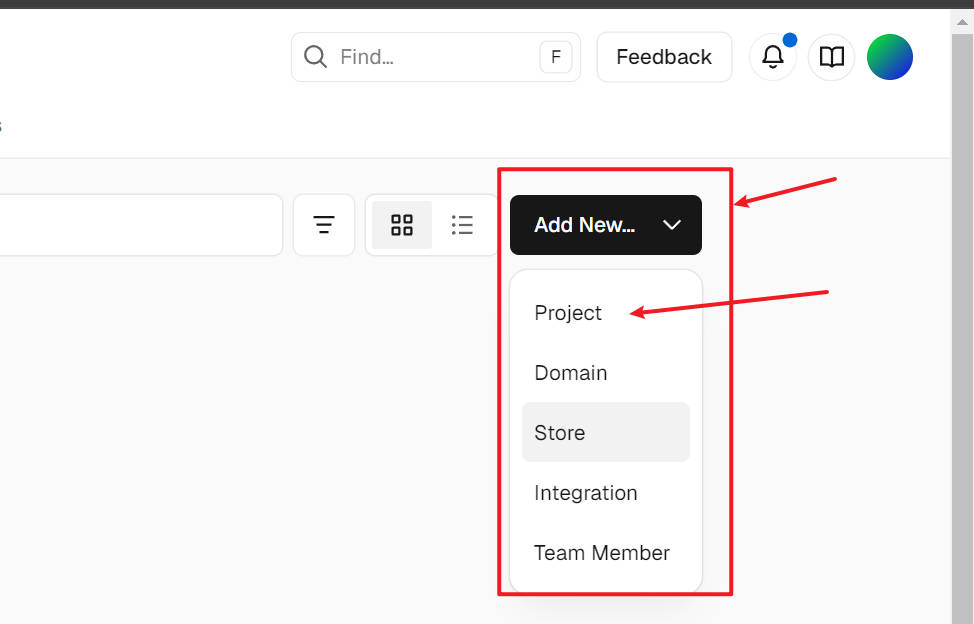
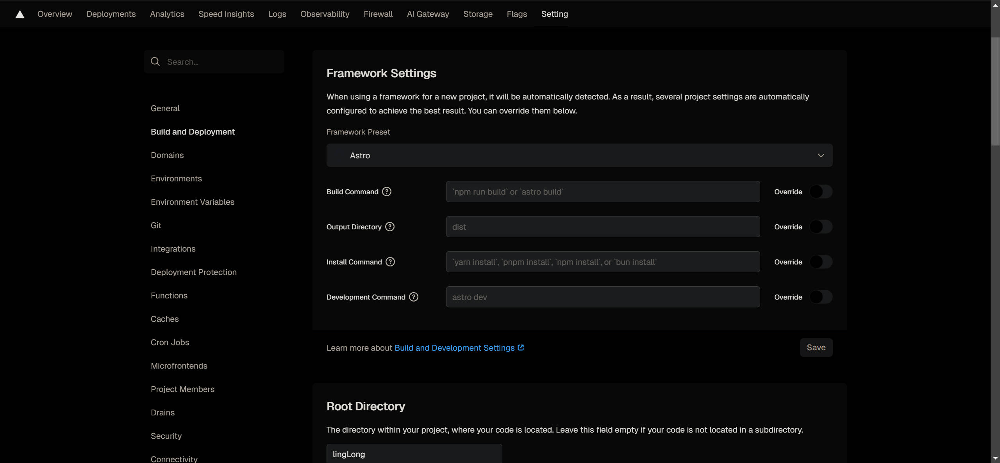
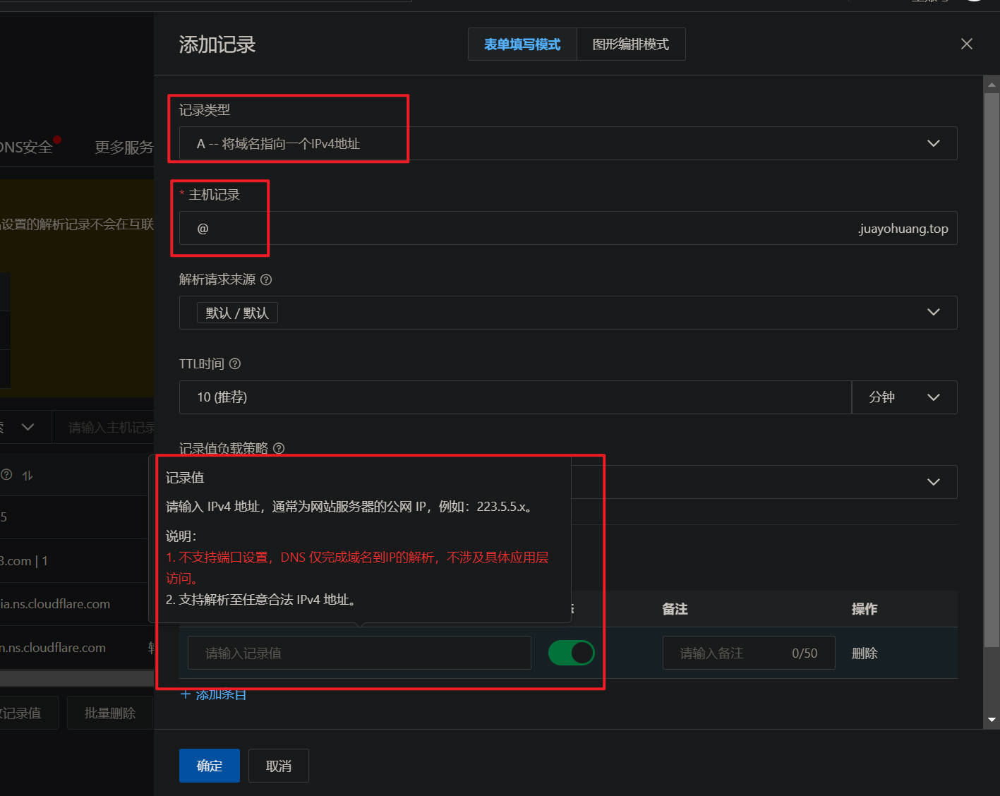
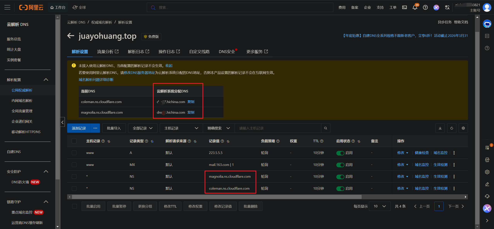
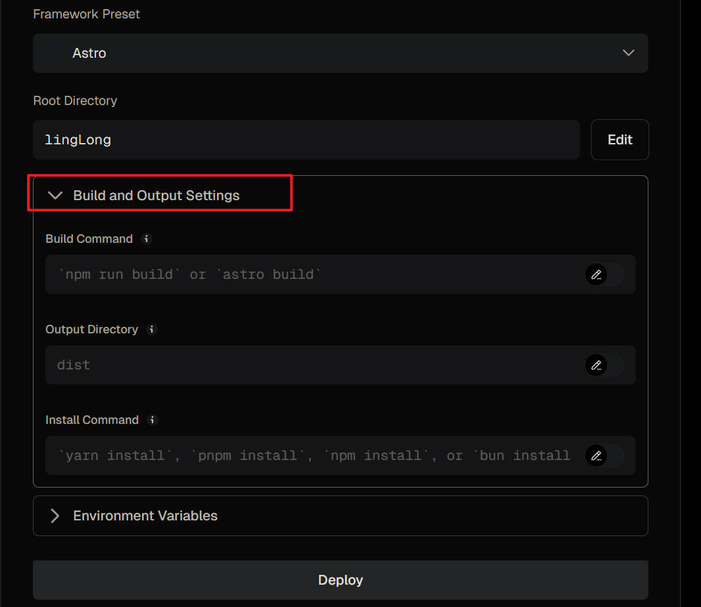
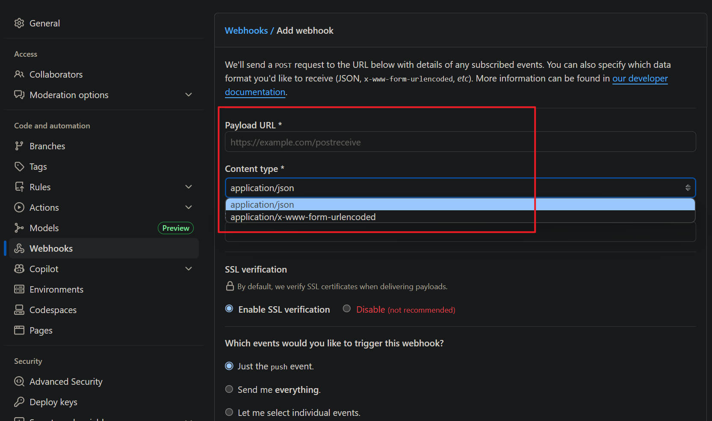
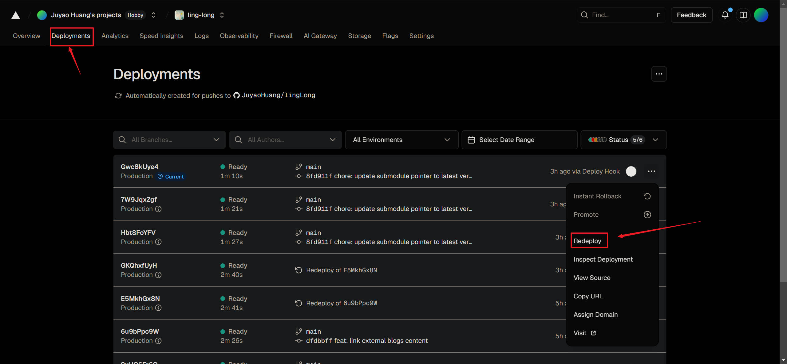

## Vercel介绍(懂的略过)

[Vercel](https://vercel.com/)是一个全球知名的、十分好用的**网站托管平台**。它不仅可以托管像 Astro、Hexo这样的静态框架，也支持像 Next.js、React、Vue这样的动态网站的构建。它把曾经复杂的服务器运维工作（配置 Nginx、安装 Docker、配置 SSL、负载均衡、CDN 分发）全部自动化了，让开发者只关注写代码或者文章。

对于个人开发者，它的每月配额为：100GB的带宽、6000分钟的构建时长，每天10万次的边缘请求调用。这对个人来说基本和免费没有区别（你也不可能一个人用完100GB的流量吧）。

对于一般的开发者，它主要有两个核心功能：

1. GitOps 工作流

   对于以前使用云服务器开发时（例如华为云、阿里云的ECS），你需要先进行 ssh 连接，然后在本地写代码 $\Rightarrow$ 本地构建应用 $\Rightarrow$ 通过 scp 指令将代码上传到服务器 $\Rightarrow$ 在 ssh 窗口重启服务。

   使用 Vercel 以后只需要将代码 `git push`到远程仓库，例如 Github上，Vercel 就会自动进行构建。

2. 预览部署

   这是团队开发的神器。假如你新创建了一个分支 `new-feat`，修改了网站的 UI 样式：

   1. 将分支推送到 Github后，Vervel不会直接覆盖主网站，而是**单独生成一个临时域名**，用来构建、托管修改后的网站样式。例如临时域名为 `feature-ui.vercel.app`
   2. 然后就可以将此域名分享到团队内部，查看新 UI 是否合适。
   3. 确认没问题后并合并到 main分支后，主网站才会更新。

说白了个人、小型团队直接无脑使用 Vercel就行了，例如构建个人博客网、产品介绍网站啥的。

> **注意**：接下来的步骤以构建个人静态博客，Astro语言为例。

## 🚀快速步骤

**前提**：假设你的 Astro博客代码已经上传到了 Github或其他代码托管平台。

### 1. 注册 Vercel

1. 打开 [Vercel官网](https://vercel.com/)
2. 选择 **"Continue with GitHub"** 登录

### 2. 导入项目

1. 登录后，点击控制台右上角的 **"Add New..."** -> **"Project"**
2. 在列表中找到你的 Astro 博客仓库，点击 **"Import"**




### 3. 自动部署

如果你的项目结构清晰，那么 Vercel 会自动识别出对应的语言。如果你的项目**不是一个纯正的Astro项目**，那么需要自定义根路径。




如果你的仓库结构和这个一样，Astro框架只是其一个子目录：


那么就更改 **Root** 路径


识别出来为 Astro后，查看 **Build Command** 是否是 npm run build (或 astro build)、**Output Directory** 是否是 dist。

如果没问题，点击 **"Deploy"** 即可。


## 🥰完整步骤速览

"快速步骤"部分只是将项目托管到 Vercel 平台，如果你需要进行：

1. DNS解析
2. 配置个人域名到该网站，而不是使用 Vercel 自带的域名

那么你应该查看接下来的完整步骤：

> 笔者个人的域名是在阿里云注册和备案的，但由于一些事情，我取消使用阿里云自带的DNS解析，转向使用 cloudflare 的DNS代理。

1. 购买一个域名

   国内使用大型公司的云平台的域名注册即可：阿里云、华为云、腾讯云等等。国外有 cloudflare、亚马逊云等。建议货比三家，自行购买。

   接下来的步骤以笔者在阿里云注册的域名：juayohuang.top 进行介绍。

2. 配置 DNS 域名解析

   在大型公司进行域名注册后，一般会要求你进行域名的实名注册和备案。审核过后会自带域名解析。例如使用阿里云平台时，点击域名服务跳转到 "云解析 DNS/[权威域名解析](https://dnsnext.console.aliyun.com/authoritative)/解析设置"处，会有阿里云给你分配的 DNS。

   如果希望使用 cloudflare 进行域名解析，可以查看[域名解析部分](#配置DNS域名解析)

3. 将代码上传到 GitHub

4. 登录 Vercel

5. 创建项目并且进行项目配置

   1. 导入项目
   2. 构建设置
   3. 域名配置
   4. Git配置（可选）

6. 项目部署

以下是每一步的具体内容。

## 项目介绍

笔者的配置如下：

1. 使用代码与内容分离 "Headless CMS" 风格架构的仓库：
   1. lingLong 仓库存储 Astro 语言构建的博客项目
   2. blogs 仓库存储所有文章。文章存放处在 `lingLong/src/contents/posts` 目录下
2. 阿里云注册的域名 `juayohuang.top`
3. Cloudflare 进行 DNS 解析

## 1. 域名注册

以阿里云为例，访问 https://www.aliyun.com/，搜索域名注册服务，选择一个你喜欢的域名后缀，例如`.com`。

点击后输入一个你满意的域名名字，并且进行注册。


**1.1.  进行实名注册**

点击控制台的 "域名与网站"，找到自己注册的域名。


进入后如果你没有进行实名认证，那么他就会提示你进行实名认证。


一般认证过程需要3到7天，等待即可。**等待过程可以进行后面3到5步，因为这只是为了让你的网站更好被人记住而已，并不影响网站的配置**。

## 2. 配置DNS域名解析

当域名成功备案后，阿里云会默认给你分配两个 DNS 云解析。你可以直接使用阿里云自带的，也可以使用 Clouflare。

### 2.1. 使用阿里云的DNS

前往阿里云控制台 -> 域名 -> 解析设置，如果阿里云的 DNS 解析已经默认使用：即记录类型为 NS 的两栏的记录值是阿里云给你分配的 DNS。

添加 **CNAME** 记录，主机记录 www，记录值 cname.vercel-dns.com（Vercel的 DNS）


添加 **A** 记录，主机记录 @，记录值为 Vercel的 IP地址，例如 `76.76.21.21`。



### 2.2. 使用Cloudfalre的DNS

登录 Cloudflare：https://dash.cloudflare.com/

1. 在账户主页的 "域" 中添加现有域，即你注册的域名。

   

   

2. 点击"继续"后选择 Free 计划

3. 按照指示，回到阿里云的 DNS控制台处，修改 NS 记录的记录值为 Clouflare 提供的名称服务器

   

   

   

4. 回到 Cloudflare 的域名服务里，打开 DNS 记录一栏：

   配置两条 DNS 记录：

   | 类型  |   名称   |            内容            | 代理状态 |
   | :---: | :------: | :------------------------: | :------: |
   |   A   | 你的域名 | Vercel的IPv4:`76.76.21.21` |  仅DNS   |
   | CNAME |   www    |    cname.vercel-dns.com    |  仅DNS   |

   


## 3. 将代码上传到Github

**3.1. 文章仓库**

Github上的文章仓库为：https://github.com/JuyaoHuang/blogs

**3.2. 代码仓库**

Github上的代码仓库为：https://github.com/JuyaoHuang/lingLong


可以看到 Astro项目的配置文件，例如 package.json，并不在仓库的根目录下。

**为了让代码仓库和文章仓库建立连接**，在个人本地 PC 上进入到代码仓库的 Astro项目：`cd lingLong`。

文章最终是被存放于 `lingLong\src\contents\posts`下，因此在终端里执行指令：

```bash
git submodule add https://github.com/你的用户名/blogs.git lingLong/src/contents/posts
```

将文章仓库作为代码仓库的子模块。

> 运行指令前确保 `lingLong\src\contents\posts`不存在，否则会报错

提交更改：

```bash
git add .
git commit -m "feat: link external blogs content"
git push
```

当你以后 Push 后，Vercel 会检测到 .gitmodules 文件，它会自动拉取你的 blogs 仓库内容填充进去，然后构建网站。

## 4. Vercel配置

### 4.1. 新建项目

登录 Vercel 后，点击 `Add New... -> Project`，然后选择要导入的仓库。笔者此处就选择代码仓库 `lingLong`。

导入仓库后，由于仓库根目录不是一个 Astro项目，因此需要更改仓库根目录：


选择 "Root Directory" 后，点击 `lingLong` 作为项目根路径：


下拉 **"Build and Output Settings"**，查看指令是否为以下内容：



如果正确，点击 **Deploy**。

### 4.2. 域名配置

点击项目后，进入上边栏的 **Setting** 页面。然后点击 **"Domains"** 进入域名配置页面。

**前文 [#2.2.](#2.2. 使用Cloudfalre的DNS) 已经介绍了怎么配置 Vercel 进行 DNS域名解析**，此处接着 Cloudflare 配置好后，Vercel 这边怎么添加域名和颁发 SSL证书。

进入 "Domains" 页面之后，点击 **"Add Domain"**，在搜索框输入你的注册域名，选择 "Connect to an environment"，"Production"，然后 "Save"。


之后等待 SSL证书自动颁发完成。


**如果出现 No Deployment**，说明你原始域名解析，例如阿里云或者 Cloudflare 没有配置好。注意检查 Cloudflare 里的代理状态（那朵云）是否已经**关闭（变成灰色）**。

### 4.3. Git自动化拉取文章配置

在 [3. 将代码上传到Github](#3. 将代码上传到Github)，我们已经完成了本地PC的仓库链接配置。但现在 Vercel 不会自动更新它的指针：他永远指向刚进行过

```bash
git submodule add https://github.com/你的用户名/blogs.git lingLong/src/contents/posts
git add .
git commit -m "feat: link external blogs content"
git push
```

后提交记录 commit 时， blogs 仓库的状态。即使你写下更多新的文章，将文章传到 blogs 的远程仓库，Vercel也不会知道仓库内容已经更新，仍然指向代码仓库 commit 时的提交状态。

**自动化方法**：

1. 打开 Vercel 项目的 `Setting -> Git -> Deploy hooks`部分，在 `Name` 一栏随便输个名字，然后选择要 hook 的分支（默认 main），点击 `Create Hook`，得到一个 URL。例如：`https://api.vercel.com/`
2. 在文章的远程仓库 [blogs](https://github.com/JuyaoHuang/blogs) 的 `Settings -> Webhooks -> Add Webhooks`，将上面获得的 URL 填入 `Payload URL`一栏， `Content type`一栏选择 `application/json`。等待添加的 hook 变为 `Last delivery was successful.`即可。




## 5. 部署项目

回到 Vercel 的项目面板，点击上边栏的 "Deployments"，点击最新一栏的三个点，进行 "Redeploy".



等待部署完成后，查看域名、应用是否能够正常访问：


